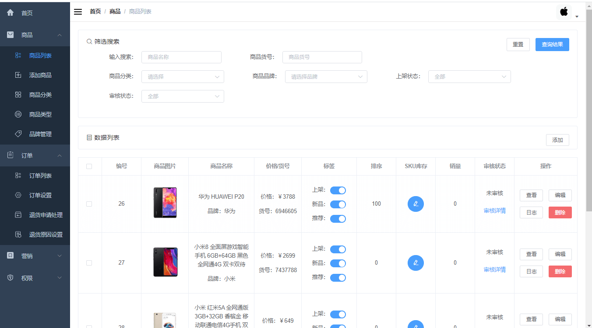
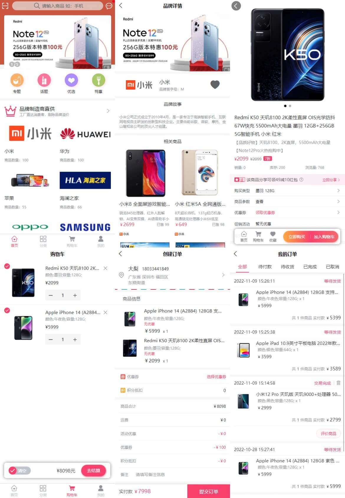
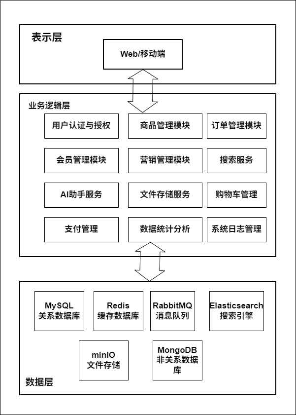

# mall-X

<p>
  <a href="LICENSE"></a>
  <a href="https://github.com/macrozheng/mall"></a>
  <a href="https://spring.io/projects/spring-boot"></a>
  <a href="https://www.oracle.com/java/"></a>
  <a href="https://vuejs.org/"></a>
  <a href="https://maven.apache.org/"></a>
  <a href="https://github.com/macrozheng/mall/stargazers"></a>
</p>

<div align="center">

**🌐 Languages: [🇺🇸 English](README.en.md) | [🇨🇳 简体中文](README.md)**

</div>

> ⚠️ **本项目 Fork 自 [macrozheng/mall](https://github.com/macrozheng/mall)**，基于 Apache 2.0 协议。
> 上游 Copyright 2018-2024 macrozheng。Mall-X 在其之上完成了 Spring Boot 2.7 → 3.5、Java 8 → 17 升级，
> 新增 `mall-common-cors` / `mall-common-pic` / `mall-ai` 模块，重构了 CORS 与图片代理。
> 完整差异与 commit 列表见 [CHANGELOG.md](./CHANGELOG.md) 与 [NOTICE](./NOTICE)。

---

## 友情提示

> 1. **在线 Demo**：[macrozheng 官方在线演示](https://www.macrozheng.com/admin/index.html)（默认账号 `admin` / `macro123`）
> 2. **完整教程**：[《mall学习教程》](https://www.macrozheng.com)（本项目在架构与业务上与上游保持一致）
> 3. **微服务版**：基于 Spring Cloud Alibaba 的 [mall-swarm](https://github.com/macrozheng/mall-swarm)
> 4. **Mall-X 特有增强**：Spring Boot 3.5 升级路径 · AI 助手 · 统一 CORS · 图片代理 — 见 [CHANGELOG.md](./CHANGELOG.md)
> 5. **开发规范 / Gotchas**：[AGENTS.md](./AGENTS.md) 必读

## 项目介绍

`mall-X` 是基于 **Spring Boot 3.5 + Vue 3** 的电商系统，前后台分离架构，集成
Elasticsearch、RabbitMQ、Redis、MongoDB、MinIO 等主流中间件。

## 🎯 项目特色

**🛠 修复与升级**（vs 上游 [macrozheng/mall](https://github.com/macrozheng/mall)）：

- ⬆️ **后端升级**：Spring Boot 2.7.5 → 3.5.14 · Java 8 → 17 · Jakarta EE 9 命名空间
- ⬆️ **前端升级**：Vue 2 → Vue 3 + Vite + TypeScript + Element Plus + Pinia
- 🔧 **CORS 重构**：提取 `mall-common-cors` 独立模块，4 服务共享统一配置
- 🔧 **图片代理**：新增 `mall-common-pic` + `ImageUrlRewriter`，解决 `` 跨域 403
- 🔐 **JWT 合规**：JJWT 0.12 · HS512 · 强制 64 字符密钥
- 🛡️ **Spring Security 6**：显式 CORS Filter Chain，修复 SS 5→6 升级隐患

**🆕 全新模块**：

- 🤖 `mall-ai` —— AI 购物助手（商品问答 + 退货引导，DeepSeek 接入）
- 🖼️ `mall-common-pic` —— OSS 图片代理
- ⚙️ `mall-common-cors` —— 4 服务共享 CORS

**✂️ 精简**（已剥离上游未实现模块，**保留功能的前端 + 后端 API 全部完整可用**）：

- ❌ 后台：运营管理 · 统计报表 · 财务管理
- ❌ 前台：客户服务 · 帮助中心
- ✅ 保留：商品（PMS）· 订单（OMS）· 营销（SMS）· 权限（UMS）· 内容（CMS）· 文件（OSS）

### 项目演示

#### 后台管理系统

前端项目 [mall-admin-web](https://github.com/macrozheng/mall-admin-web)（Mall-X 已升级至 Vue 3 + Vite）。



#### 前台商城系统

前端项目 [mall-app-web](https://github.com/macrozheng/mall-app-web)（UniApp，浏览器切换为手机模式效果更佳）。



## 组织结构

```
mall-X
├── mall-common          # 工具类、统一响应、Redis 服务
├── mall-common-cors     # 统一 CORS 配置（4 服务共享，★ Mall-X 新增）
├── mall-common-pic      # OSS 图片代理（★ Mall-X 新增）
├── mall-mbg             # MyBatis Generator 生成的数据库操作代码
├── mall-security        # Spring Security + JWT 封装
├── mall-admin           # 后台商城管理系统接口（:8080）
├── mall-portal          # 前台商城系统接口（:8085，兼 /pic/proxy）
├── mall-search          # 基于 Elasticsearch 的商品搜索系统（:8081）
└── mall-ai              # AI 购物助手（:8086，★ Mall-X 新增）
```

## 技术选型

### 后端技术

| 技术 | 版本 | 说明 |
| --- | --- | --- |
| Spring Boot | 3.5.14 | Web 应用开发框架 |
| Spring Security | 6.x | 认证和授权框架 |
| MyBatis | 3.5.10 | ORM 框架 |
| MyBatis Generator | 1.4.x | 数据层代码生成器 |
| Elasticsearch Java Client | 8.18.8 | 分布式搜索引擎 |
| RabbitMQ | 3.8+ | 消息队列（vhost `/mall`） |
| Redis | 5.0+ | 分布式缓存 |
| MongoDB | 4.0+ | NoSQL 数据库（用户行为） |
| MinIO / 阿里云 OSS | 8.x / Latest | 对象存储 |
| JWT (jjwt) | 0.12 | 登录 Token（HS512） |
| Druid | 1.2.14 | 数据库连接池 |
| Lombok | 1.18+ | Java 语言增强库 |
| Hutool | 5.8.9 | Java 工具类库 |
| PageHelper | 1.4.5 | MyBatis 物理分页插件 |
| SpringDoc | 2.x | API 文档生成 |
| DeepSeek API | deepseek-chat | AI 模型（mall-ai 接入） |

### 前端技术

| 技术 | 版本 | 说明 |
| --- | --- | --- |
| Vue | 3.3.x | 渐进式 JavaScript 框架 |
| TypeScript | 5.x | 类型系统 |
| Vite | 5.x | 下一代构建工具 |
| Element Plus | 2.4.x | Vue 3 UI 组件库 |
| Pinia | 2.x | 状态管理 |
| Vue Router | 4.x | 路由框架 |
| uni-app | Latest | 移动端跨平台框架 |

### 基础设施

| 中间件 | 版本 | 用途 |
| --- | --- | --- |
| MySQL | 5.7+ / 8.0 | 关系数据库（核心业务） |
| Redis | 5.0+ | 缓存 / Session / 验证码 |
| Elasticsearch | 8.x | 商品搜索（IK 中文分词） |
| RabbitMQ | 3.8+ | 异步消息 / 延迟队列 |
| MongoDB | 4.0+ | 会员行为记录 |
| MinIO | Latest | 文件存储 |

### 开发工具

| 工具 | 说明 |
| --- | --- |
| IntelliJ IDEA | 开发 IDE |
| Maven 3.8+ | 多模块构建 |
| Node.js 20.19+ / ≥22.12 | mall-admin-web 需要 |
| Navicat | MySQL 客户端 |
| AnotherRedisDesktopManager | Redis 客户端 |
| Postman | API 接口调试 |
| HBuilderX | uni-app 开发（mall-app-web） |

## 系统架构



> 详细的模块依赖图、订单时序图见 [document/architecture_diagram.md](./document/architecture_diagram.md)。

## 模块一览

### 🏪 后台 `mall-admin` (`:8080`)

| 子系统 | 功能 |
| --- | --- |
| **PMS** 商品管理 | 品牌 · SPU/SKU · 分类 · 属性 |
| **OMS** 订单管理 | 订单 · 订单设置 · 退货申请 · 退货原因 |
| **SMS** 营销管理 | 优惠券 · 限时购 · 首页轮播/品牌/新品/推荐 |
| **UMS** 权限管理 | 管理员 · 角色 · 菜单 · 资源 · 会员等级 |
| **CMS** 内容管理 | 优选专区 · 专题 |
| **OSS** 文件管理 | MinIO / 阿里云 OSS 上传 |

### 🛍️ 前台 `mall-portal` (`:8085`)

| 模块 | 功能 |
| --- | --- |
| 首页门户 | 轮播 · 推荐 · 优选 · 专题聚合 |
| 商品 | 分类树 · 品牌 · 搜索 · 详情 · 评论 |
| 购物车 | 加入 · 修改 · 删除 · 数量选择 |
| 订单 | 下单 · 支付（支付宝）· 取消 · 退款 |
| 会员 | 注册/登录 · 个人信息 · 收货地址 |
| 会员行为 | 关注品牌 · 收藏商品 · 浏览历史 |
| 优惠券 | 领取 · 列表 · 状态管理 |

### 🔍 搜索 `mall-search` (`:8081`)

- 全文检索（IK 中文分词）
- Function Score 加权（商品名 10 / 关键词 5 / 副标题 3）
- 品牌/分类/属性 聚合筛选
- 相似商品推荐
- 监听 RabbitMQ 异步同步 ES 索引

### 🤖 AI 助手 `mall-ai` (`:8086`) ★ Mall-X 新增

独立的 Spring Boot 3.5 / Java 17 微服务，基于 **Spring AI 1.0** + **Spring Cloud OpenFeign**。零数据库依赖（`ReturnReasonService` 通过 Feign 远程调 mall-portal 拉取退货原因列表）。

**API 总览**

| 端点 | 功能 | 协议 | 鉴权 |
| --- | --- | --- | --- |
| `POST /ai/product/qa` | 基于商品上下文的智能问答（多轮对话可选） | JSON 同步 | 公开（mall-portal 内部调用） |
| `POST /ai/product/qa/stream` | 商品问答（**SSE 流式**，逐 token 推送，"打字机"效果） | `text/event-stream` | 公开 |
| `POST /ai/return/suggest` | 3 轮引导式退货建议，自动生成标准化退货原因 + 描述 | JSON 同步 | 公开 |
| `GET  /swagger-ui/index.html` | SpringDoc OpenAPI 3 文档 | — | — |

#### ① 商品智能问答

前端在商品详情页发起请求，传商品信息 + 用户问题，AI 基于**结构化商品上下文**（名称 / 品牌 / 价格 / 副标题）回答。

**请求示例**

```http
POST /ai/product/qa
Content-Type: application/json

{
  "productId": 1,
  "question": "这款手机拍照效果怎么样？",
  "productName": "Redmi Note 13",
  "productBrand": "小米",
  "productPrice": "1999",
  "productSubTitle": "性能小钢炮 5G 手机",
  "conversationHistory": ""  // 可选，多轮对话历史
}
```

**响应示例**

```json
{
  "code": 200,
  "data": { "reply": "该手机配备高像素主摄，支持夜景模式..." }
}
```

**SSE 流式版本**（`/ai/product/qa/stream`）返回 `text/event-stream`，每行 `data: <chunk>`，前端用 `fetch + ReadableStream` 消费即可。底层走 servlet 原生 `SseEmitter` + 内部订阅 Spring AI `chatClient.stream().content()` 返回的 `Flux`，**不引入 webflux 容器**。

**安全约束**（写死在 System Prompt）：仅基于提供的商品信息回答 · 不承诺优惠/赠品 · 不使用"绝对/保证"等绝对化词语 · 100 字以内。

#### ② 退货建议 —— 3 轮引导式对话

**核心流程**

```
┌─────────┐   step=1   ┌──────────┐   step=2   ┌──────────┐   step=3   ┌──────────────┐
│ 用户提交 │ ─────────▶ │ 询问故障 │ ─────────▶ │ 追问细节 │ ─────────▶ │ 给出建议     │
│ 退货申请 │            │ 现象     │            │ 细节     │            │ reason+desc  │
└─────────┘            └──────────┘            └──────────┘            └──────────────┘
```

每轮返回 `guideQuestion` 引导用户回答，第 3 轮返回 `finished: true` + 完整 JSON。

**第 3 轮响应示例**

```json
{
  "code": 200,
  "data": {
    "suggestedReason": "商品损坏",
    "suggestedDescription": "收到的手机屏幕有一条裂缝，属于物流中造成的损坏",
    "category": "硬件故障",
    "confidence": "high",
    "guideQuestion": "明白了，这确实影响了您的正常使用...",
    "finished": true,
    "analysisNote": "根据描述'收到的手机屏幕...', 判断为硬件故障, 匹配'商品损坏'原因"
  }
}
```

**智能点**：
- 退货原因通过 **OpenFeign** 远程调 mall-portal 的 `/returnReason/list`，mall-portal 不可用时**降级**到 yml 配置的默认列表（质量问题 / 商品损坏 / 尺码不符 / 7天无理由退货 / 其他）
- **Spring AI `BeanOutputConverter`** 自动把 JSON schema 注入 Prompt 并把 AI 响应反序列化为 `ReturnSuggestionResult` record，**不再手写 JSON 解析**
- AI 输出非 JSON / Markdown 包裹时由 `BeanOutputConverter` 自动剥离
- AI 调用失败时**按当前步骤兜底**（第 1/2 轮给引导问题，第 3 轮给完整建议）
- 强制 step=3 时 `finished=true` 且 reason/description 非空

#### 架构与安全

```
mall-portal (前端触发)
    │
    ▼
┌──────────────────────────────────────────────┐
│  mall-ai (:8086)                             │
│  ┌────────────────┐  ┌────────────────────┐  │
│  │Controller      │─▶│ChatClient          │  │
│  │/ai/product/qa  │  │(Spring AI)         │  │
│  │/ai/.../stream  │  │  + InputSanitization│  │
│  │/ai/return/...  │  │    Advisor          │  │
│  └────────────────┘  └─────┬──────────────┘  │
│  ┌────────────────┐        │                 │
│  │ReturnReason    │◀───────┘  (Feign)        │
│  │Client          │──HTTP──▶ mall-portal:8085│
│  └────────────────┘                          │
│       │ HTTPS                                │
└───────┼──────────────────────────────────────┘
        ▼
   OpenAI 兼容 API
   (DeepSeek / OpenAI / SiliconFlow)
```

**🛡️ 输入清理**（`InputSanitizationAdvisor`，实现 Spring AI `CallAdvisor` 接口，order=HIGHEST_PRECEDENCE）：

1. **控制字符过滤** —— 移除 `\x00-\x1F`（保留换行/Tab）
2. **Prompt Injection 检测** —— 10+ 攻击模式正则（忽略指令 / 角色伪装 / 系统提示等），命中仅 warn 不阻断
3. **长度截断** —— 用户问题 ≤ 5000 字符（`ai.security.sanitization.max-length` 可配）
4. **业务无感** —— 所有 `ChatClient` 调用（`chat()` / `chatEntity()` / `stream()`）自动经过 Advisor 链

**🔌 切换 LLM 厂商**：改 `application.yml` 的 `spring.ai.openai.*` 即可，**所有 OpenAI Chat Completions 兼容的 API 都直接接入**。

| base-url | model | 厂商 |
| --- | --- | --- |
| `https://api.deepseek.com` | `deepseek-chat` | DeepSeek（默认） |
| `https://api.openai.com/v1` | `gpt-4o-mini` | OpenAI |
| `https://api.siliconflow.cn/v1` | `Qwen/Qwen2.5-7B-Instruct` | SiliconFlow |
| 任意 OpenAI 兼容 URL | 自定义 | 自部署 / 私有化 |

**⚙️ 典型配置**（`application.yml` + `application-local.yml`）

```yaml
# application.yml（基线，被 git 追踪）
spring:
  ai:
    openai:
      api-key: ${DEEPSEEK_API_KEY:your-api-key-here}   # 占位符：env var → 默认值
      base-url: https://api.deepseek.com
      chat:
        options:
          model: deepseek-chat
          temperature: 0.7
          max-tokens: 1024
```

```yaml
# application-local.yml（已被 .gitignore 排除，**不进 git**）
spring:
  ai:
    openai:
      api-key: sk-你的-deepseek-key
```

> **Spring AI 只认 `spring.ai.openai.api-key` 一个 key**。Stage 3 之前的 `ai.client.*` 旧前缀已废弃，写在 yml 也不会被读。

详细架构、源码结构、41/41 单元测试覆盖见 `mall-ai/README.md`。

### 🖼️ 图片代理 `mall-common-pic` ★ Mall-X 新增

`GET /pic/proxy?url=<oss-url>` —— 后端 fetch 透传字节流，解决浏览器 `` 跨域加载 OSS 的 403。
配合 `ImageUrlRewriter` 在 Service 层透明改写数据库里的 OSS URL，前端零改动（解决现有demo图片无法直接访问问题）。

## 🚀 快速开始

**前置**：JDK 17 · Maven 3.8+ · Node.js 20+ · MySQL 5.7+ · Redis 5.0+ · RabbitMQ 3.8+

```bash
# 1. 初始化数据库
mysql -u root -p < document/sql/mall.sql

# 2. 启动 4 个后端服务（分别在不同终端）
cd mall-admin  && mvn spring-boot:run   # :8080
cd mall-portal && mvn spring-boot:run   # :8085
cd mall-search && mvn spring-boot:run   # :8081
cd mall-ai     && mvn spring-boot:run   # :8086

# 3. 启动管理后台前端
cd mall-admin-web && npm install && npm run dev   # http://localhost:5173
```

**完整 build 指令、端口约定、关键 Gotchas**（如 ES 8.x 关闭 SSL、IK 分词器安装、`mall-common-cors` 引入方式、模块级联依赖重载步骤）见 **[AGENTS.md](./AGENTS.md)**。

**Docker 部署**：[`document/docker/`](./document/docker/) + [`document/reference/docker.md`](./document/reference/docker.md)

## 文档与目录

| 文档 | 用途 |
| --- | --- |
| [AGENTS.md](./AGENTS.md) | 开发规范、build/run 命令、Gotchas（开发者 / AI 代理必读） |
| [CHANGELOG.md](./CHANGELOG.md) | Mall-X 与上游 macrozheng/mall 的所有差异 |
| [NOTICE](./NOTICE) | Apache 2.0 fork 归属声明 |
| [document/architecture_diagram.md](./document/architecture_diagram.md) | 详细 Mermaid 架构图 |
| [document/postman/](./document/postman/) | Postman 接口测试集合 |
| [document/sql/mall.sql](./document/sql/mall.sql) | 数据库脚本 |
| [document/reference/](./document/reference/) | Windows 部署、快捷键、参考手册 |
| [mall-common-pic/README.md](./mall-common-pic/README.md) | 图片代理模块原理与暗坑 |

## 许可证

[Apache License 2.0](LICENSE)

Copyright 2018-2024 macrozheng (上游原项目) · Copyright 2026 mowangmowang (Mall-X 派生作品)

## 致谢

本项目基于 [macrozheng/mall](https://github.com/macrozheng/mall) 的优秀架构与代码完成，
感谢原作者 [macrozheng](https://github.com/macrozheng) 与社区贡献者。
