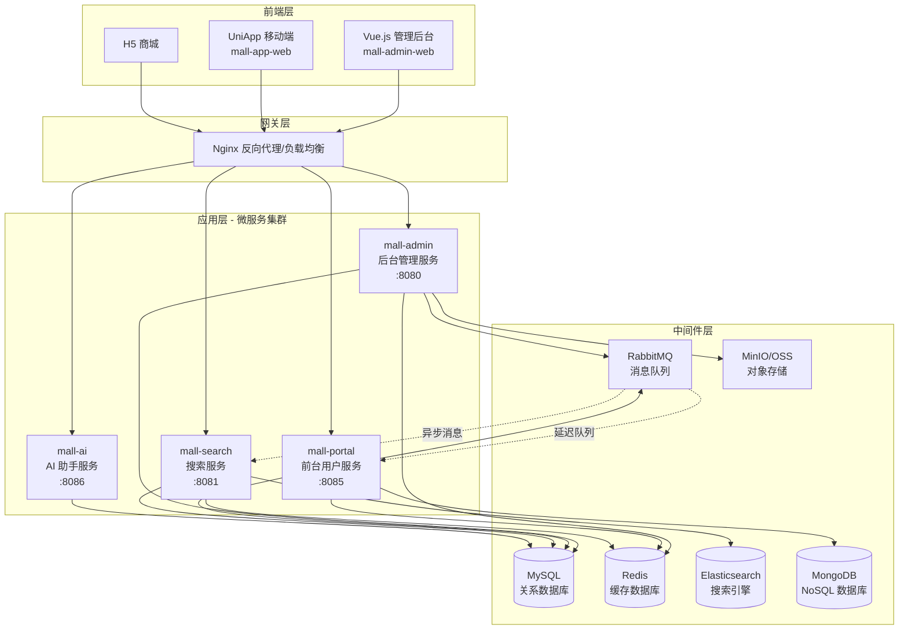
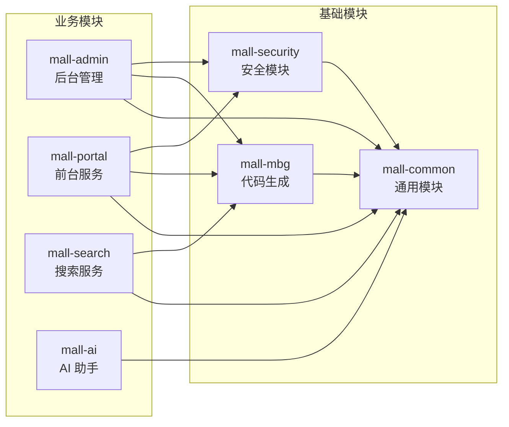
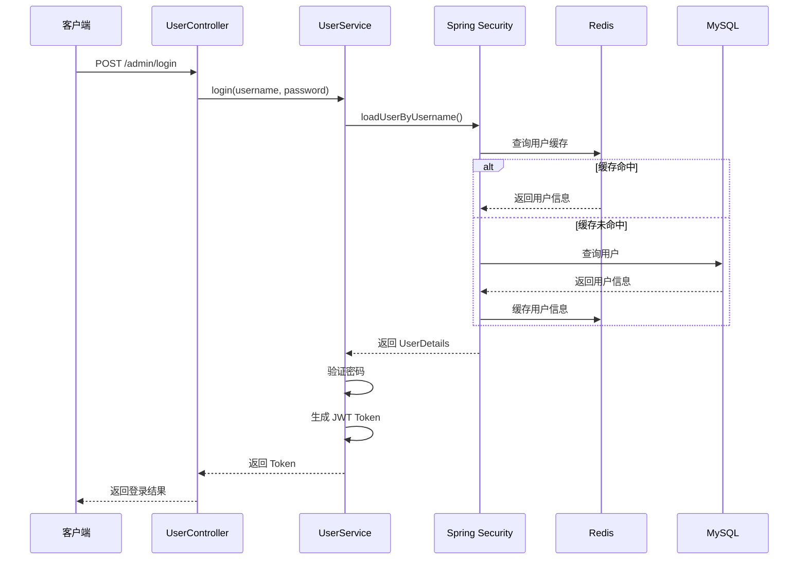
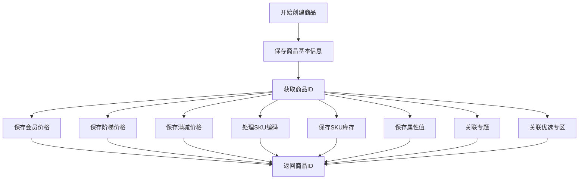
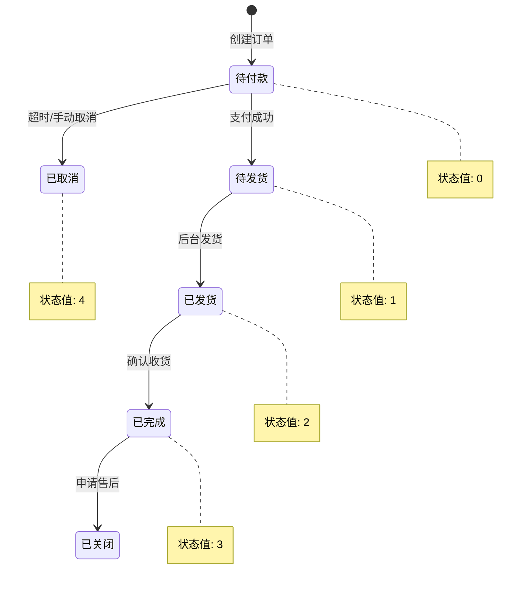
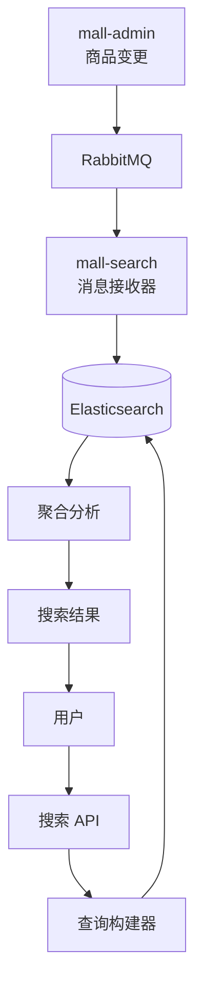

# Mall 电商系统 - 完整微服务架构解决方案

<div align="center">

**🌐 Languages: [🇺🇸 English](README.en.md) | [🇨🇳 简体中文](README.md)**

</div>

> **⚠️ 本项目 Fork 自 [macrozheng/mall](https://github.com/macrozheng/mall)**，基于 Apache 2.0 协议。
> 完整差异列表见 [NOTICE](./NOTICE) 与 [CHANGELOG.md](./CHANGELOG.md)。
> 主要变更：Spring Boot 2.7.5 → 3.5.14、Java 8 → 17、`mall-common-cors` 独立模块、`mall-common-pic` 图片代理、AI 助手等。

---

## 📋 项目简介

**Mall** 是一套基于 Spring Boot + Vue.js 的现代化电商系统，采用前后端分离架构，集成了 Elasticsearch、RabbitMQ、Redis、MongoDB、MinIO 等主流中间件，提供完整的电商业务功能，包括商品管理、订单处理、会员系统、营销推广、智能搜索等核心模块。

### 核心特性

- 🔐 **安全认证**：基于 Spring Security + JWT 的身份认证与动态权限控制 (RBAC)
- 📦 **商品管理**：完整的商品 CRUD、SKU 管理、属性配置及审核流程
- 🛒 **购物车与订单**：购物车管理、订单生成、支付集成、超时自动取消
- 👥 **会员系统**：用户注册登录、个人信息管理、优惠券系统
- 🔍 **智能搜索**：Elasticsearch 全文检索、IK 中文分词、聚合分析、商品推荐
- 💬 **AI 助手**：集成大语言模型，提供智能购物问答和售后建议
- ⚡ **高性能缓存**：Redis 多级缓存策略，提升系统响应速度
- 📨 **消息队列**：RabbitMQ 异步解耦，实现订单超时取消、商品索引同步
- ☁️ **对象存储**：支持 MinIO 和阿里云 OSS 文件存储服务
- 📊 **数据监控**：集成 Actuator、Logstash、ELK 日志分析系统
- 🌐 **多端支持**：Web 管理后台、移动 App（UniApp）

---

## 🏗️ 系统架构

### 整体架构图



### 模块依赖关系



---

## 🛠️ 技术栈

### 后端技术

| 技术 | 版本 | 说明 |
|------|------|------|
| **Spring Boot** | 2.7.5 | 核心框架，提供依赖注入、自动配置 |
| **Spring Security** | 2.7.5 | 安全框架，身份认证与授权 |
| **MyBatis** | 3.5.10 | ORM 框架，数据持久化 |
| **PageHelper** | 1.4.5 | MyBatis 分页插件 |
| **Druid** | 1.2.14 | 阿里巴巴数据库连接池 |
| **JWT (jjwt)** | 0.9.1 | Token 认证机制 |
| **RabbitMQ** | 3.x | 消息队列，异步解耦 |
| **Redis** | 5.x+ | 缓存数据库，会话管理 |
| **Elasticsearch** | 7.x | 分布式搜索引擎 |
| **MongoDB** | 4.x+ | NoSQL 数据库，存储用户行为 |
| **MinIO** | 8.x | 对象存储服务 |
| **Swagger** | 3.0.0 | API 文档自动生成 |
| **Hutool** | 5.8.9 | Java 工具类库 |
| **Lombok** | - | 简化 Java 代码 |

### 前端技术

#### 管理后台 (mall-admin-web)

| 技术 | 版本 | 说明 |
|------|------|------|
| **Vue.js** | 3.3.x | 渐进式 JavaScript 框架 |
| **TypeScript** | 5.x | 类型系统 |
| **Element Plus** | 2.4.x | UI 组件库 |
| **Vite** | 5.x | 下一代构建工具 |
| **Pinia** | 2.x | 状态管理 |

#### 移动端 (mall-app-web)

| 技术 | 版本 | 说明 |
|------|------|------|
| **UniApp** | - | 跨平台开发框架 |
| **Vue.js** | 2.x/3.x | 前端框架 |

### 开发工具

- **JDK**: 1.8+
- **Maven**: 3.6+
- **Node.js**: 16+
- **MySQL**: 5.7+ / 8.0+
- **Redis**: 5.0+
- **RabbitMQ**: 3.8+
- **Elasticsearch**: 7.x
- **MongoDB**: 4.0+
- **MinIO**: Latest

---

## 📂 项目结构

```
mall/
├── mall-common/                    # 通用模块
│   ├── api/                        # 统一响应封装
│   ├── config/                     # 基础配置
│   ├── exception/                  # 异常处理
│   ├── service/                    # Redis 服务
│   └── util/                       # 工具类
│
├── mall-mbg/                       # MyBatis 代码生成器
│   ├── generatorConfig.xml         # 生成器配置
│   └── *.java                      # 生成的 Mapper/Model
│
├── mall-security/                  # 安全认证模块
│   ├── component/                  # JWT 过滤器
│   ├── config/                     # 安全配置
│   └── util/                       # JWT 工具类
│
├── mall-admin/                     # 后台管理服务 (:8080)
│   ├── controller/                 # REST API 控制器
│   ├── service/                    # 业务逻辑层
│   ├── dao/                        # 数据访问层
│   └── dto/                        # 数据传输对象
│
├── mall-portal/                    # 前台用户服务 (:8085)
│   ├── controller/                 # 用户端 API
│   ├── service/                    # 业务逻辑
│   ├── component/                  # 订单超时取消组件
│   └── repository/                 # MongoDB 仓库
│
├── mall-search/                    # 搜索服务 (:8081)
│   ├── controller/                 # 搜索 API
│   ├── service/                    # ES 操作服务
│   ├── repository/                 # ES Repository
│   └── component/                  # 消息接收器
│
├── mall-ai/                        # AI 助手服务 (:8086)
│   ├── client/                     # AI 客户端抽象
│   ├── controller/                 # AI API
│   └── service/                    # AI 业务逻辑
│
├── mall-admin-web/                 # Vue.js 管理后台
│   ├── src/
│   │   ├── apis/                   # API 接口
│   │   ├── views/                  # 页面组件
│   │   ├── stores/                 # Pinia 状态管理
│   │   └── router/                 # 路由配置
│   └── package.json
│
├── mall-app-web/                   # UniApp 移动端
│   ├── pages/                      # 页面
│   ├── components/                 # 组件
│   ├── api/                        # API 接口
│   └── store/                      # Vuex 状态管理
│
├── document/                       # 项目文档
│   ├── sql/                        # 数据库脚本
│   ├── docker/                     # Docker 配置
│   ├── postman/                    # Postman 集合
│   └── reference/                  # 参考资料
│
└── pom.xml                         # Maven 父 POM
```

---

## 🚀 快速开始

### 前置要求

确保已安装以下软件：

- JDK 1.8+
- Maven 3.6+
- Node.js 16+
- MySQL 5.7+
- Redis 5.0+
- RabbitMQ 3.8+
- Elasticsearch 7.x（可选）
- MongoDB 4.0+（可选）
- MinIO（可选）

### 1. 克隆项目

```bash
git clone https://github.com/mowangmowang/mall-X.git
cd mall-X
```

### 2. 数据库初始化

```bash
# 导入数据库脚本
mysql -u root -p < document/sql/mall.sql
```

### 3. 配置修改

编辑各模块的 `src/main/resources/application-dev.yml` 文件：

#### mall-admin 配置示例

```yaml
spring:
  datasource:
    url: jdbc:mysql://localhost:3306/mall?useUnicode=true&characterEncoding=utf-8&serverTimezone=Asia/Shanghai
    username: root
    password: your_password
  
  redis:
    host: localhost
    port: 6379
    database: 0
  
  rabbitmq:
    host: localhost
    port: 5672
    username: mall
    password: mall

# MinIO 配置
minio:
  endpoint: http://localhost:9000
  bucketName: mall
  accessKey: minioadmin
  secretKey: minioadmin

# JWT 配置
jwt:
  tokenHeader: Authorization
  secret: mall-admin-secret
  expiration: 604800
  tokenHead: 'Bearer '
```

#### mall-portal 配置示例

```yaml
spring:
  datasource:
    url: jdbc:mysql://localhost:3306/mall?useUnicode=true&characterEncoding=utf-8&serverTimezone=Asia/Shanghai
    username: root
    password: your_password
  
  data:
    mongodb:
      host: localhost
      port: 27017
      database: mall-port
  
  redis:
    host: localhost
    port: 6379
    database: 0
  
  rabbitmq:
    host: localhost
    port: 5672
    username: mall
    password: mall

# JWT 配置
jwt:
  tokenHeader: Authorization
  secret: mall-portal-secret
  expiration: 604800
  tokenHead: 'Bearer '

# 支付宝配置
alipay:
  gatewayUrl: https://openapi-sandbox.dl.alipaydev.com/gateway.do
  appId: your_app_id
  alipayPublicKey: your_alipay_public_key
  appPrivateKey: your_app_private_key
  returnUrl: http://localhost:7898/#/pages/money/paySuccess
```

#### mall-search 配置示例

```yaml
spring:
  datasource:
    url: jdbc:mysql://localhost:3306/mall?useUnicode=true&characterEncoding=utf-8&serverTimezone=Asia/Shanghai
    username: root
    password: your_password
  
  rabbitmq:
    host: localhost
    port: 5672
    username: mall
    password: mall
    virtual-host: /mall
  
  elasticsearch:
    uris: localhost:9200
```

#### mall-ai 配置示例

```yaml
ai:
  client:
    # 方式1：直接配置（不推荐）
    api-key: sk-your-api-key-here
    
    # 方式2：使用环境变量（推荐）
    # api-key: ${AI_API_KEY:your-api-key-here}
    
    base-url: https://api.deepseek.com/v1
    model: deepseek-chat
    temperature: 0.7
    max-tokens: 1024
```

> 💡 **提示**：推荐使用环境变量 `AI_API_KEY` 来管理 API Key，避免硬编码在配置文件中。

### 4. 编译运行

#### 方式一：Maven 命令行

```bash
# 编译整个项目
mvn clean install -DskipTests

# 分别启动各模块
cd mall-admin
mvn spring-boot:run

# 新开终端
cd mall-portal
mvn spring-boot:run

# 新开终端
cd mall-search
mvn spring-boot:run

# 新开终端
cd mall-ai
mvn spring-boot:run
```

#### 方式二：IDE 启动

使用 IntelliJ IDEA 或 Eclipse 直接运行各模块的 `*Application.java` 启动类。

### 5. 前端启动

#### 管理后台

```bash
cd mall-admin-web
npm install
npm run dev
```

访问：http://localhost:5173（Vite 默认端口）

#### 移动端 H5

使用 HBuilderX 打开 `mall-app-web` 目录，运行到浏览器，访问：http://localhost:7898

### 6. 访问系统

| 服务 | 地址 | 说明 |
|------|------|------|
| **管理后台** | http://localhost:5173 | Vue.js 前端（Vite 默认端口） |
| **移动端 H5** | http://localhost:7898 | UniApp H5 商城 |
| **后台 API** | http://localhost:8080 | mall-admin |
| **前台 API** | http://localhost:8085 | mall-portal |
| **搜索 API** | http://localhost:8081 | mall-search |
| **AI API** | http://localhost:8086 | mall-ai |
| **Swagger 文档** | http://localhost:8080/swagger-ui/ | 后台 API 文档 |
| **RabbitMQ 管理** | http://localhost:15672 | guest/guest 或 mall/mall |

---

## 🔑 核心功能详解

### 1. 用户认证与授权

#### 认证流程



#### 权限控制

系统采用 **RBAC（Role-Based Access Control）** 模型：

- **管理员 (Admin)** → **角色 (Role)** → **菜单 (Menu)** / **资源 (Resource)** → **API 接口**

动态权限加载：从数据库实时读取 URL-权限映射，支持运行时更新。

### 2. 商品管理

#### 商品创建流程



#### SKU 编码生成规则

格式：`日期(8位) + 商品ID(4位) + 索引(3位)`  
示例：`202605050001001`

### 3. 订单管理

#### 订单状态流转



#### 订单超时取消机制

基于 **RabbitMQ 延迟队列** 实现：

1. 订单创建时发送延迟消息到 TTL 队列
2. 消息过期后自动转发到死信交换机
3. 消费者接收消息并执行取消逻辑
4. 释放库存、返还优惠券和积分

**双重保障**：
- **主机制**：RabbitMQ 延迟队列（精确定时）
- **兜底机制**：定时任务每 10 分钟扫描超时订单

### 4. 智能搜索

#### 搜索架构



#### Function Score Query 加权搜索

- **商品名称**：权重 10（最高）
- **关键词**：权重 5
- **副标题**：权重 3

#### 聚合分析

动态获取品牌、分类、属性分布，用于前端筛选器生成。

### 5. AI 助手

#### 功能特性

- **智能购物问答**：基于商品信息回答用户问题
- **售后建议**：推荐退货原因并生成详细描述

#### 技术架构

- 独立的 Spring Boot 微服务
- 支持多种 AI 模型提供商（DeepSeek、OpenAI、SiliconFlow）
- OpenAI 兼容 API 接口抽象，切换模型无需改代码

### 6. 缓存策略

#### Redis 缓存设计

| 缓存类型 | Key 格式 | 过期时间 | 说明 |
|---------|---------|---------|------|
| 管理员信息 | `mall:admin:{username}` | 24 小时 | 用户基本信息 |
| 资源权限 | `mall:resource:{adminId}` | 24 小时 | 权限列表 |
| 验证码 | `authCode:{telephone}` | 5 分钟 | 短信验证码 |
| 商品信息 | `product:{id}` | 30 分钟 | 商品详情 |
| 购物车 | `cart:{userId}:{productId}` | 7 天 | 购物车项 |

#### 缓存失效策略

- **查询时**：先查缓存，未命中再查数据库
- **更新时**：删除相关缓存
- **批量删除**：根据角色/权限批量清除缓存

---

## 📝 API 接口概览

### 后台管理接口 (mall-admin)

#### 用户管理

| 接口路径 | 方法 | 说明 |
|---------|------|------|
| `/admin/register` | POST | 用户注册 |
| `/admin/login` | POST | 用户登录 |
| `/admin/info` | GET | 获取当前用户信息 |
| `/admin/logout` | POST | 登出 |
| `/admin/list` | GET | 分页查询用户列表 |

#### 商品管理

| 接口路径 | 方法 | 说明 |
|---------|------|------|
| `/product/create` | POST | 创建商品 |
| `/product/update/{id}` | POST | 修改商品 |
| `/product/list` | GET | 分页查询商品 |
| `/product/update/publishStatus` | POST | 批量上下架 |

#### 订单管理

| 接口路径 | 方法 | 说明 |
|---------|------|------|
| `/order/list` | GET | 分页查询订单 |
| `/order/{id}` | GET | 订单详情 |
| `/order/update/delivery` | POST | 批量发货 |
| `/orderSetting/{id}` | GET | 获取订单设置 |

### 前台用户接口 (mall-portal)

#### 会员管理

| 接口路径 | 方法 | 说明 |
|---------|------|------|
| `/sso/register` | POST | 会员注册 |
| `/sso/login` | POST | 会员登录 |
| `/sso/info` | GET | 获取会员信息 |
| `/sso/getAuthCode` | GET | 获取验证码 |

#### 订单管理

| 接口路径 | 方法 | 说明 |
|---------|------|------|
| `/order/generateConfirmOrder` | POST | 生成确认单 |
| `/order/generateOrder` | POST | 生成订单 |
| `/order/list` | GET | 查询订单列表 |
| `/order/detail/{orderId}` | GET | 查询订单详情 |

#### 购物车管理

| 接口路径 | 方法 | 说明 |
|---------|------|------|
| `/cart/add` | POST | 添加到购物车 |
| `/cart/list` | GET | 查询购物车列表 |
| `/cart/update/quantity` | GET | 修改数量 |
| `/cart/delete` | POST | 删除购物车项 |

### 搜索接口 (mall-search)

| 接口路径 | 方法 | 说明 |
|---------|------|------|
| `/esProduct/importAll` | POST | 批量导入商品到 ES |
| `/esProduct/search/simple` | GET | 简单搜索 |
| `/esProduct/search` | GET | 综合搜索（支持筛选） |
| `/esProduct/recommend/{id}` | GET | 推荐相似商品 |
| `/esProduct/search/relate` | GET | 获取聚合信息 |

### AI 接口 (mall-ai)

| 接口路径 | 方法 | 说明 |
|---------|------|------|
| `/ai/product/qa` | POST | AI 商品问答 |
| `/ai/return/suggest` | POST | AI 退货建议 |

---

## 🔧 配置说明

### 主要配置文件

#### application.yml（主配置）

```yaml
server:
  port: 8080

spring:
  profiles:
    active: dev
  application:
    name: mall-admin

jwt:
  tokenHeader: Authorization
  secret: mall-admin-secret
  expiration: 604800
  tokenHead: 'Bearer '

redis:
  database: mall
  key:
    admin: ums:admin
    resourceList: ums:resourceList
  expire:
    common: 86400

swagger:
  enable: true
```

### 多环境配置

- `application-dev.yml` - 开发环境
- `application-prod.yml` - 生产环境

切换环境：

```bash
# 方式1：修改配置文件
spring:
  profiles:
    active: prod

# 方式2：启动时指定
java -jar mall-admin.jar --spring.profiles.active=prod
```

---

## 🐳 Docker 部署

### 构建镜像

```bash
# 在项目根目录执行
mvn clean package docker:build
```

### Docker Compose 部署

```yaml
version: '3'
services:
  mall-admin:
    image: mall/mall-admin:1.0-SNAPSHOT
    ports:
      - "8080:8080"
    environment:
      - SPRING_PROFILES_ACTIVE=prod
    depends_on:
      - mysql
      - redis
      - rabbitmq
  
  mall-portal:
    image: mall/mall-portal:1.0-SNAPSHOT
    ports:
      - "8085:8085"
    environment:
      - SPRING_PROFILES_ACTIVE=prod
  
  mall-search:
    image: mall/mall-search:1.0-SNAPSHOT
    ports:
      - "8081:8081"
  
  mysql:
    image: mysql:5.7
    command: mysqld --character-set-server=utf8mb4 --collation-server=utf8mb4_unicode_ci
    environment:
      MYSQL_ROOT_PASSWORD: root
      MYSQL_DATABASE: mall
    ports:
      - "3306:3306"
    volumes:
      - ./data/mysql:/var/lib/mysql
  
  redis:
    image: redis:7
    command: redis-server --appendonly yes
    ports:
      - "6379:6379"
    volumes:
      - ./data/redis:/data
  
  nginx:
    image: nginx:1.22
    ports:
      - "80:80"
    volumes:
      - ./nginx/conf:/etc/nginx
      - ./nginx/html:/usr/share/nginx/html
      - ./nginx/logs:/var/log/nginx
  
  rabbitmq:
    image: rabbitmq:3.9.11-management
    ports:
      - "5672:5672"
      - "15672:15672"
    environment:
      RABBITMQ_DEFAULT_USER: mall
      RABBITMQ_DEFAULT_PASS: mall
      RABBITMQ_DEFAULT_VHOST: /mall
  
  elasticsearch:
    image: elasticsearch:7.17.3
    environment:
      - discovery.type=single-node
      - "ES_JAVA_OPTS=-Xms512m -Xmx512m"
    volumes:
      - ./data/elasticsearch:/usr/share/elasticsearch/data
  
  mongodb:
    image: mongo:4.4
    ports:
      - "27017:27017"
    volumes:
      - ./data/mongodb:/data/db
  
  minio:
    image: minio/minio
    command: server /data --console-address ":9001"
    ports:
      - "9000:9000"
      - "9001:9001"
    environment:
      MINIO_ROOT_USER: minioadmin
      MINIO_ROOT_PASSWORD: minioadmin
    volumes:
      - ./data/minio:/data
  
  mall-ai:
    image: mall/mall-ai:1.0-SNAPSHOT
    ports:
      - "8086:8086"
    environment:
      - SPRING_PROFILES_ACTIVE=prod
      - AI_API_KEY=${AI_API_KEY}  # 从环境变量传入 API Key
```

```bash
docker-compose up -d
```

---

## 🧪 测试

### 单元测试

```bash
# 运行所有测试
mvn test

# 运行指定模块测试
mvn test -pl mall-admin
```

### 接口测试

项目提供了 Postman 集合文件：

- `document/postman/mall-admin.postman_collection.json`
- `document/postman/mall-portal.postman_collection.json`

导入到 Postman 即可进行接口测试。

---

## 📊 监控与管理

### 日志管理

日志配置文件位于 `src/main/resources/logback-spring.xml`，支持：

- 控制台输出
- 文件滚动存储（按天分割，单文件 10MB）
- Logstash 集成（端口 4560-4563）
- ELK 日志分析系统

### 健康检查

```bash
curl http://localhost:8080/actuator/health
```

### 性能监控

集成 Spring Boot Actuator，提供：

- JVM 内存使用情况
- 线程池状态
- HTTP 请求统计
- 数据库连接池监控

---

## 🎯 性能优化

### 1. 数据库优化

- **索引优化**：为常用查询字段建立索引
- **分页查询**：使用 PageHelper 物理分页
- **读写分离**：主库写，从库读（可扩展）
- **连接池调优**：Druid 最大连接数 20

### 2. 缓存优化

- **多级缓存**：本地缓存 + Redis
- **缓存预热**：热点数据预加载
- **缓存穿透防护**：空值缓存
- **缓存雪崩防护**：随机过期时间

### 3. 异步处理

- **订单取消**：RabbitMQ 延迟队列
- **商品索引同步**：异步消息
- **日志记录**：异步写入

### 4. Elasticsearch 调优

- **批量导入**：每批 500 条，避免内存溢出
- **刷新间隔**：批量导入时增大 `refresh_interval`
- **分片策略**：生产环境设置 replicas > 0

---

## 🐛 常见问题

### 1. Redis 连接失败

**排查步骤**：

```bash
# 检查 Redis 状态
redis-cli ping

# 检查配置文件中的 host 和 port
```

### 2. RabbitMQ 消息消费失败

**排查步骤**：

```bash
# 检查 RabbitMQ 状态
rabbitmqctl status

# 检查队列是否创建
rabbitmqctl list_queues

# 查看应用日志
tail -f logs/error.log
```

### 3. Elasticsearch 搜索结果为空

**排查步骤**：

```bash
# 检查 ES 是否正常运行
curl http://localhost:9200

# 确认索引是否存在
curl http://localhost:9200/_cat/indices?v

# 验证是否有数据
curl http://localhost:9200/pms/_count

# 如无数据，执行批量导入
curl -X POST http://localhost:8081/esProduct/importAll
```

### 4. JWT Token 验证失败

**解决方案**：

- 检查 `jwt.expiration` 配置
- 确保所有服务使用相同的 `jwt.secret`
- 检查请求头是否正确携带 Token：`Authorization: Bearer {token}`

### 5. MinIO 上传失败

**常见错误**：

- ❌ 错误配置：`endpoint: http://localhost:9001`（Console 端口）
- ✅ 正确配置：`endpoint: http://localhost:9000`（API 端口）

---

## 📚 开发规范

### 1. 代码风格

- 遵循阿里巴巴 Java 开发手册
- 使用 Lombok 简化代码
- 统一异常处理

### 2. 注释规范

采用 **"中文为主，英文为辅"** 的双语注释策略：

```java
/**
 * 根据用户ID查询用户详细信息
 * 
 * @param userId 用户唯一标识符 (User ID)
 * @return 用户对象 (User Object)，若不存在则返回 null
 * @throws DataAccessException 当数据库访问失败时抛出
 */
public User findUserById(Long userId) { ... }
```

### 3. Git 提交规范

```
feat: 新功能
fix: 修复 Bug
docs: 文档更新
style: 代码格式调整
refactor: 重构代码
test: 测试相关
chore: 构建过程或辅助工具变动
```

---

## 🔄 版本历史

| 版本 | 日期 | 主要更新 |
|------|------|---------|
| 1.0-SNAPSHOT | 2026-05 | 初始版本，完整电商功能 |

---

**最后更新时间**：2026-05-05
