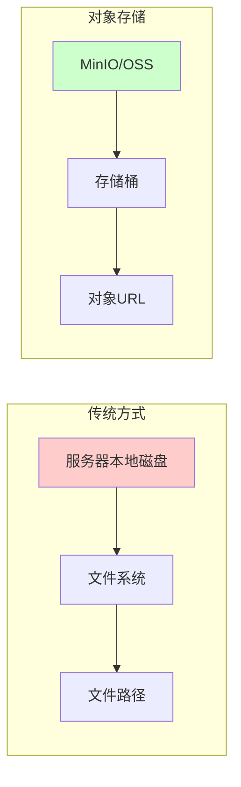
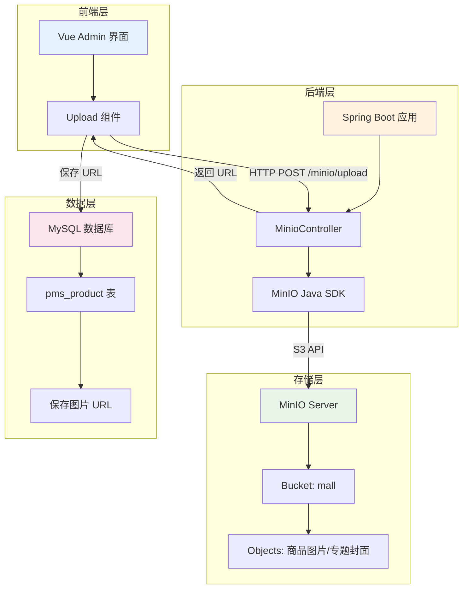
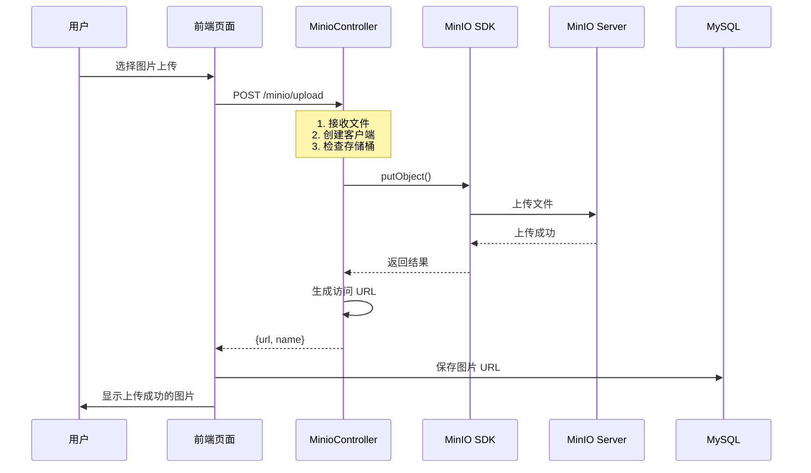
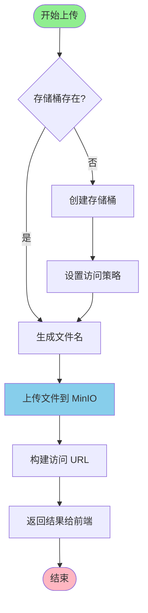
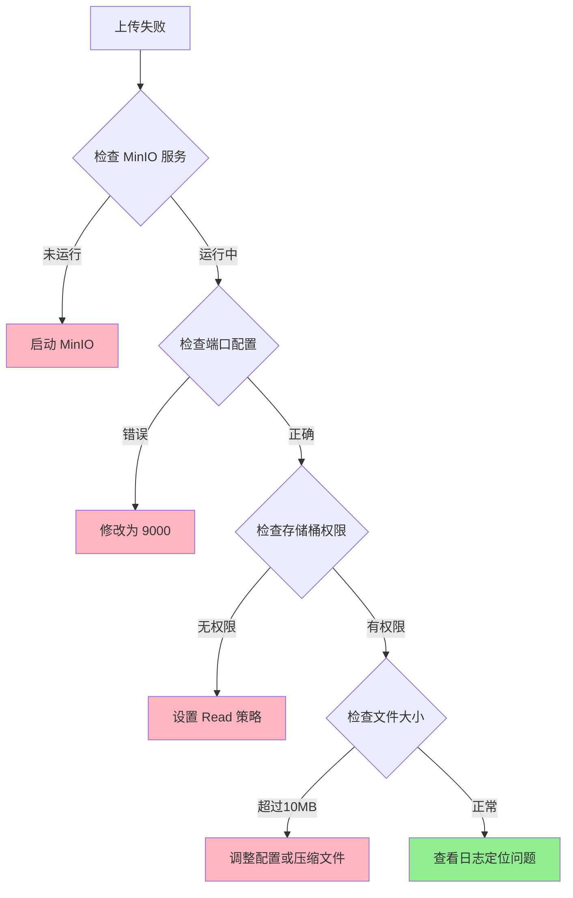
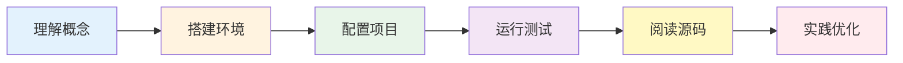

# Mall-Admin 项目 MinIO 集成详解 (新手指南)

## 📖 目录
1. [什么是 MinIO？](#什么是-minio)
2. [为什么要使用对象存储？](#为什么要使用对象存储)
3. [系统架构设计](#系统架构设计)
4. [核心实现原理](#核心实现原理)
5. [详细配置说明](#详细配置说明)
6. [代码实现解析](#代码实现解析)
7. [常见问题与调试](#常见问题与调试)

---

## 1. 什么是 MinIO？

MinIO 是一个高性能的**分布式对象存储系统**，兼容 Amazon S3 API。简单来说，它就像一个"云端硬盘"，专门用来存储图片、视频、文档等非结构化文件。

### 🎯 核心概念

| 概念 | 说明 | 类比 |
|------|------|------|
| **Bucket (存储桶)** | 文件的容器，类似文件夹 | Windows 中的磁盘分区 |
| **Object (对象)** | 存储的文件本身 | 具体的文件（如 photo.jpg） |
| **Endpoint (端点)** | MinIO 服务的访问地址 | 网站的 URL |
| **Access Key** | 访问用户名 | 账号 |
| **Secret Key** | 访问密码 | 密码 |

---

## 2. 为什么要使用对象存储？

### 传统文件存储 vs 对象存储



### 优势对比

| 特性 | 本地存储 | MinIO 对象存储 |
|------|---------|---------------|
| **扩展性** | 受限于单台服务器磁盘 | 可无限扩展 |
| **可靠性** | 单点故障风险 | 多副本冗余 |
| **访问速度** | 内网快，外网慢 | CDN 加速支持 |
| **维护成本** | 需自行备份管理 | 自动化管理 |
| **适用场景** | 小项目、临时文件 | 电商图片、视频等 |

---

## 3. 系统架构设计

### 整体架构图



### 请求流程图



---

## 4. 核心实现原理

### 4.1 文件上传流程



### 4.2 文件名生成策略

为了避免文件名冲突，系统采用**日期分类**的方式：

```
原始文件名: product.jpg
生成路径:   20240504/product.jpg
完整URL:    http://localhost:9000/mall/20240504/product.jpg
```

**优点：**
- ✅ 避免同名文件覆盖
- ✅ 便于按日期管理文件
- ✅ 提高检索效率

---

## 5. 详细配置说明

### 5.1 后端配置 (application-dev.yml)

```yaml
spring:
  servlet:
    multipart:
      enabled: true           # 开启文件上传
      max-file-size: 10MB     # 单个文件最大 10MB

minio:
  endpoint: http://localhost:9000  # MinIO API 地址
  bucketName: mall                 # 存储桶名称
  accessKey: minioadmin            # 访问密钥
  secretKey: minioadmin            # 访问秘钥
```

### 5.2 前端配置 (.env)

```env
# 是否使用阿里云 OSS（false = 使用 MinIO）
VITE_USE_OSS = false

# MinIO 上传接口路径
VITE_MINIO_UPLOAD_URL = /minio/upload

# 后端 API 基础路径
VITE_BASE_SERVER_URL = http://localhost:8080
```

### 5.3 Maven 依赖 (pom.xml)

```xml
<dependency>
    <groupId>io.minio</groupId>
    <artifactId>minio</artifactId>
    <version>${minio.version}</version>
</dependency>
```

---

## 6. 代码实现解析

### 6.1 后端控制器 - MinioController

#### 核心方法：文件上传

```java
@Controller
@RequestMapping("/minio")
public class MinioController {
    
    @Value("${minio.endpoint}")
    private String ENDPOINT;
    
    @Value("${minio.bucketName}")
    private String BUCKET_NAME;
    
    @Value("${minio.accessKey}")
    private String ACCESS_KEY;
    
    @Value("${minio.secretKey}")
    private String SECRET_KEY;
    
    @PostMapping("/upload")
    @ResponseBody
    public CommonResult upload(@RequestPart("file") MultipartFile file) {
        try {
            // 第1步：创建 MinIO 客户端
            MinioClient minioClient = MinioClient.builder()
                    .endpoint(ENDPOINT)
                    .credentials(ACCESS_KEY, SECRET_KEY)
                    .build();
            
            // 第2步：检查并创建存储桶
            boolean isExist = minioClient.bucketExists(
                BucketExistsArgs.builder().bucket(BUCKET_NAME).build()
            );
            
            if (!isExist) {
                // 创建存储桶
                minioClient.makeBucket(
                    MakeBucketArgs.builder().bucket(BUCKET_NAME).build()
                );
                
                // 设置公开读取策略
                BucketPolicyConfigDto policy = createBucketPolicyConfigDto(BUCKET_NAME);
                minioClient.setBucketPolicy(
                    SetBucketPolicyArgs.builder()
                        .bucket(BUCKET_NAME)
                        .config(JSONUtil.toJsonStr(policy))
                        .build()
                );
            }
            
            // 第3步：生成唯一文件名
            String filename = file.getOriginalFilename();
            String datePath = new SimpleDateFormat("yyyyMMdd").format(new Date());
            String objectName = datePath + "/" + filename;
            
            // 第4步：上传文件
            minioClient.putObject(
                PutObjectArgs.builder()
                    .bucket(BUCKET_NAME)
                    .object(objectName)
                    .contentType(file.getContentType())
                    .stream(file.getInputStream(), file.getSize(), 
                           ObjectWriteArgs.MIN_MULTIPART_SIZE)
                    .build()
            );
            
            // 第5步：返回访问 URL
            MinioUploadDto result = new MinioUploadDto();
            result.setName(filename);
            result.setUrl(ENDPOINT + "/" + BUCKET_NAME + "/" + objectName);
            
            return CommonResult.success(result);
            
        } catch (Exception e) {
            log.error("上传失败", e);
            return CommonResult.failed();
        }
    }
}
```

#### 关键类说明

**MinioUploadDto** - 上传结果封装
```java
@Data
public class MinioUploadDto {
    private String url;   // 文件访问 URL
    private String name;  // 原始文件名
}
```

**BucketPolicyConfigDto** - 存储桶策略
```java
@Data
@Builder
public class BucketPolicyConfigDto {
    private String Version = "2012-10-17";
    private List<Statement> Statement;
    
    @Data
    @Builder
    public static class Statement {
        private String Effect = "Allow";     // 允许访问
        private String Principal = "*";      // 所有用户
        private String Action = "s3:GetObject"; // 只读权限
        private String Resource;             // 资源路径
    }
}
```

### 6.2 前端组件 - singleUpload.vue

```vue
<template>
  <el-upload
    :action="minioUploadUrl"
    list-type="picture"
    :before-upload="beforeUpload"
    :on-success="handleUploadSuccess"
    :on-remove="handleRemove">
    <el-button type="primary">点击上传</el-button>
  </el-upload>
</template>

<script setup>
import { ref, watch } from 'vue'

// 从环境变量获取上传地址
const minioUploadUrl = import.meta.env.VITE_BASE_SERVER_URL + 
                       import.meta.env.VITE_MINIO_UPLOAD_URL

// 处理上传成功
const handleUploadSuccess = (res, file) => {
  // 检查响应
  if (res.code !== 200 || !res.data?.url) {
    ElMessage.error('文件上传失败！')
    return
  }
  
  // 获取文件 URL
  const url = res.data.url
  
  // 通知父组件
  emit('update:modelValue', url)
}
</script>
```

---

## 7. 常见问题与调试

### 7.1 端口混淆问题

⚠️ **常见错误**：混淆 MinIO API 端口和 Console 端口

| 端口 | 用途 | 访问方式 |
|------|------|---------|
| **9000** | API 接口 | 代码调用、SDK 连接 |
| **9001** | 管理控制台 | 浏览器访问 |

**正确配置：**
```yaml
minio:
  endpoint: http://localhost:9000  # ✅ API 端口
```

**错误配置：**
```yaml
minio:
  endpoint: http://localhost:9001  # ❌ Console 端口
```

### 7.2 排查步骤



### 7.3 常用调试命令

```bash
# 1. 检查 MinIO 是否运行
netstat -ano | findstr :9000

# 2. 测试 MinIO 健康状态
curl http://localhost:9000/minio/health/live

# 3. 查看 Spring Boot 日志
tail -f logs/mall-admin.log

# 4. 访问 MinIO 控制台
# 浏览器打开: http://localhost:9001
# 账号: minioadmin
# 密码: minioadmin
```

### 7.4 数据库修复

如果数据库中存储了错误的 URL（端口不对），可以执行修复脚本：

```sql
-- 更新商品图片 URL
UPDATE pms_product 
SET pic = REPLACE(pic, 'localhost:9000', 'localhost:9001')
WHERE pic LIKE '%localhost:9000%';

-- 验证结果
SELECT pic FROM pms_product LIMIT 5;
```

---

## 🎓 学习路线建议

### 初学者学习路径



### 推荐实践

1. **第一步**：在本地启动 MinIO 服务
2. **第二步**：通过 Console 手动上传文件，熟悉界面
3. **第三步**：配置项目并运行，测试上传功能
4. **第四步**：阅读 `MinioController` 源码，理解每行代码
5. **第五步**：尝试修改配置，观察不同效果
6. **第六步**：实现自己的文件删除功能

---

## 📚 扩展阅读

- [MinIO 官方文档](https://docs.min.io/)
- [MinIO Java SDK 示例](https://github.com/minio/minio-java)
- [Amazon S3 API 规范](https://docs.aws.amazon.com/AmazonS3/latest/API/)
- [Spring Boot 文件上传](https://spring.io/guides/gs/uploading-files/)

---

## 💡 小贴士

> **记住这三个关键点：**
> 1. MinIO 是一个**对象存储**，不是传统文件系统
> 2. 上传后得到的是**URL**，直接访问即可
> 3. 配置时注意区分 **API 端口 (9000)** 和 **Console 端口 (9001)**

---

*文档版本：v1.0*  
*最后更新：2024-05-04*  
*适用项目：mall-admin*
