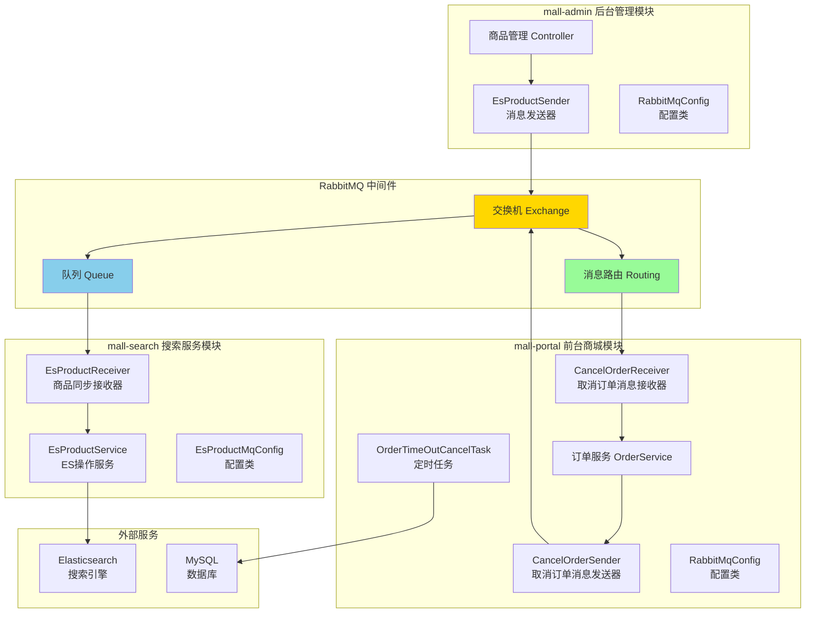
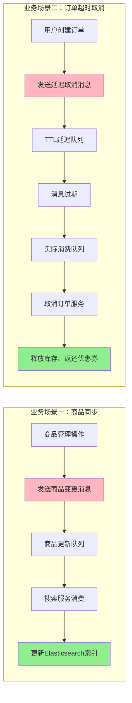
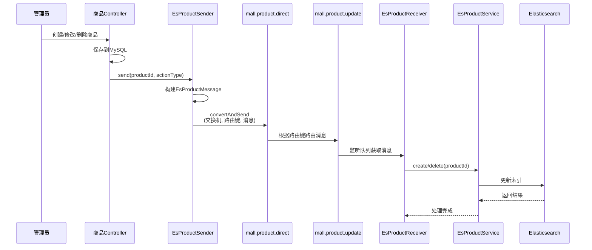
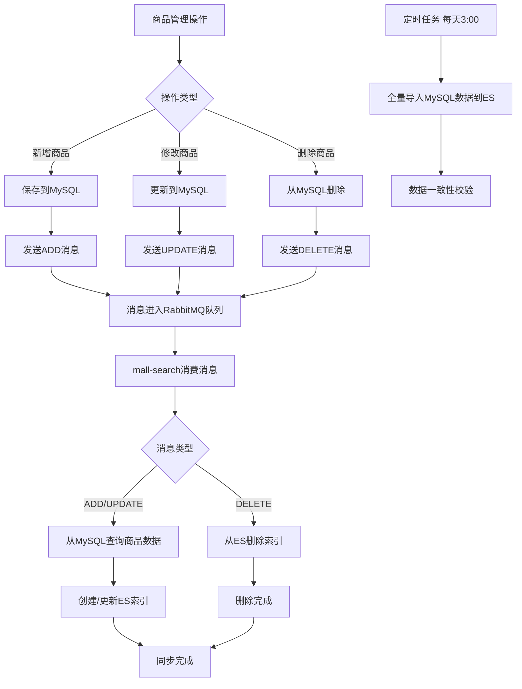
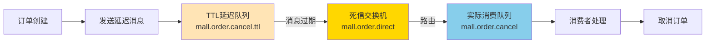
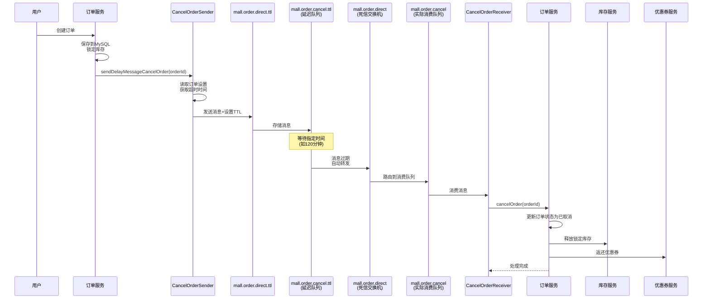
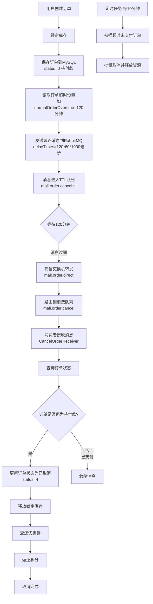
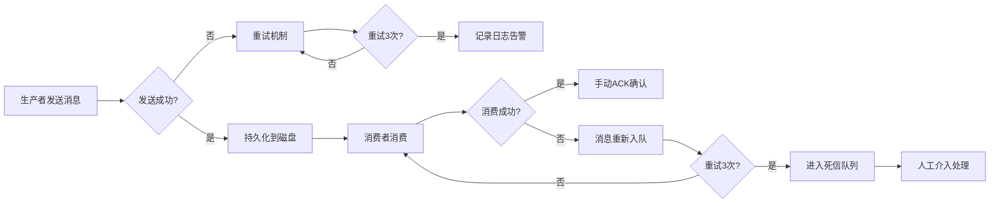

# Mall 项目 RabbitMQ 使用详解

## 📋 文档概述

本文档详细说明 Mall 电商项目中 RabbitMQ 消息队列的使用方式、架构设计及各模块之间的消息流转机制。项目采用了**异步解耦**的设计理念，通过 RabbitMQ 实现了订单超时自动取消和商品搜索数据同步两大核心功能。

### 核心特性

- 🔄 **异步处理**：通过消息队列实现业务解耦，提升系统响应速度
- ⏰ **延迟消息**：利用死信队列实现订单超时自动取消
- 🔍 **数据同步**：异步同步商品数据到 Elasticsearch 搜索引擎
- ️ **双重保障**：RabbitMQ + 定时任务确保消息不丢失

---

## 🏗️ 整体架构

### 系统架构图



### 消息流全景图



---

## 📦 消息队列配置总览

### 1. 交换机 (Exchange) 配置

| 交换机名称 | 类型 | 所属模块 | 用途 | 持久化 |
|-----------|------|---------|------|--------|
| `mall.product.direct` | Direct | mall-admin / mall-search | 商品数据同步 | ✅ 是 |
| `mall.order.direct` | Direct | mall-portal | 订单实际取消队列 | ✅ 是 |
| `mall.order.direct.ttl` | Direct | mall-portal | 订单延迟队列 | ✅ 是 |

### 2. 队列 (Queue) 配置

| 队列名称 | 所属模块 | 绑定交换机 | 路由键 | 特殊配置 | 用途 |
|---------|---------|-----------|--------|---------|------|
| `mall.product.update` | mall-search | mall.product.direct | mall.product.update | 无 | 商品同步队列 |
| `mall.order.cancel` | mall-portal | mall.order.direct | mall.order.cancel | 无 | 订单实际取消队列 |
| `mall.order.cancel.ttl` | mall-portal | mall.order.direct.ttl | mall.order.cancel.ttl | 死信队列配置 | 订单延迟队列 |

### 3. 路由键 (Routing Key) 配置

| 路由键 | 消息类型 | 生产者 | 消费者 | 说明 |
|-------|---------|--------|--------|------|
| `mall.product.update` | EsProductMessage | EsProductSender | EsProductReceiver | 商品索引同步 |
| `mall.order.cancel.ttl` | Long (orderId) | CancelOrderSender | - | 订单延迟消息 |
| `mall.order.cancel` | Long (orderId) | - (死信转发) | CancelOrderReceiver | 订单实际取消 |

---

## 🔧 环境配置

### application.yml 配置

所有使用 RabbitMQ 的模块都需要在 `application.yml` 中配置连接信息：

```yaml
spring:
  rabbitmq:
    host: localhost              # RabbitMQ 服务器地址
    port: 5672                   # AMQP 端口
    virtual-host: /mall          # 虚拟主机
    username: mall               # 用户名
    password: mall               # 密码
    publisher-confirms: true     # 消息发送到交换器确认
    publisher-returns: true      # 消息发送到队列确认
    listener:
      simple:
        acknowledge-mode: auto   # 自动确认模式
        concurrency: 5           # 最小消费者数量
        max-concurrency: 10      # 最大消费者数量
```

### Maven 依赖

所有使用 RabbitMQ 的模块都需要引入 Spring AMQP 依赖：

```xml
<!-- pom.xml -->
<dependency>
    <groupId>org.springframework.boot</groupId>
    <artifactId>spring-boot-starter-amqp</artifactId>
</dependency>
```

---

## 📝 业务场景一：商品同步到 Elasticsearch

### 场景描述

当后台管理员在 `mall-admin` 模块中对商品进行**新增、修改、删除**操作时，需要异步同步到 `mall-search` 模块的 Elasticsearch 索引中，以保证搜索数据的实时性。

### 架构设计



### 核心代码实现

#### 1. 消息定义 (EsProductMessage)

```java
// mall-common/src/main/java/com/macro/mall/common/domain/EsProductMessage.java
public class EsProductMessage {
    private Long productId;      // 商品ID
    private String actionType;   // 操作类型：ADD、UPDATE、DELETE
    private Long timestamp;      // 消息时间戳
    
    // getter and setter...
}
```

#### 2. 生产者配置 (mall-admin)

```java
// mall-admin/src/main/java/com/macro/mall/config/RabbitMqConfig.java
@Configuration
public class RabbitMqConfig {
    
    /**
     * 创建商品同步专用的直连交换机
     */
    @Bean
    public DirectExchange productDirect() {
        return new DirectExchange("mall.product.direct", true, false);
    }
    
    /**
     * 配置 JSON 消息转换器
     */
    @Bean
    public MessageConverter messageConverter() {
        return new Jackson2JsonMessageConverter();
    }
}
```

#### 3. 消息发送器 (EsProductSender)

```java
// mall-admin/src/main/java/com/macro/mall/component/EsProductSender.java
@Component
public class EsProductSender {
    private static final Logger LOGGER = LoggerFactory.getLogger(EsProductSender.class);
    
    @Autowired
    private AmqpTemplate amqpTemplate;
    
    /**
     * 发送商品同步消息到 RabbitMQ
     * @param productId 商品ID
     * @param actionType 操作类型：ADD-新增，UPDATE-更新，DELETE-删除
     */
    public void send(Long productId, String actionType) {
        EsProductMessage message = new EsProductMessage();
        message.setProductId(productId);
        message.setActionType(actionType);
        message.setTimestamp(System.currentTimeMillis());
        
        // 发送到交换机和路由键
        amqpTemplate.convertAndSend("mall.product.direct", "mall.product.update", message);
        LOGGER.info("发送商品同步消息：productId={}, actionType={}", productId, actionType);
    }
}
```

#### 4. 消费者配置 (mall-search)

```java
// mall-search/src/main/java/com/macro/mall/search/config/EsProductMqConfig.java
@Configuration
public class EsProductMqConfig {
    
    @Bean
    DirectExchange productDirect() {
        return ExchangeBuilder
                .directExchange("mall.product.direct")
                .durable(true)
                .build();
    }
    
    @Bean
    public Queue productQueue() {
        return new Queue("mall.product.update");
    }
    
    @Bean
    Binding productBinding(DirectExchange productDirect, Queue productQueue) {
        return BindingBuilder
                .bind(productQueue)
                .to(productDirect)
                .with("mall.product.update");
    }
    
    @Bean
    public MessageConverter messageConverter() {
        return new Jackson2JsonMessageConverter();
    }
}
```

#### 5. 消息接收器 (EsProductReceiver)

```java
// mall-search/src/main/java/com/macro/mall/search/component/EsProductReceiver.java
@Component
@RabbitListener(queues = "mall.product.update")
public class EsProductReceiver {
    private static final Logger LOGGER = LoggerFactory.getLogger(EsProductReceiver.class);
    
    @Autowired
    private EsProductService esProductService;
    
    @RabbitHandler
    public void handle(EsProductMessage message) {
        LOGGER.info("接收到商品同步消息：productId={}, actionType={}",
            message.getProductId(), message.getActionType());
        
        if ("ADD".equals(message.getActionType()) || "UPDATE".equals(message.getActionType())) {
            // 新增或更新：从MySQL查询并创建/更新ES索引
            esProductService.create(message.getProductId());
            LOGGER.info("商品索引更新成功：productId={}", message.getProductId());
        } else if ("DELETE".equals(message.getActionType())) {
            // 删除：移除ES索引
            esProductService.delete(message.getProductId());
            LOGGER.info("商品索引删除成功：productId={}", message.getProductId());
        }
    }
    
    /**
     * 定期全量校对任务 - 每天凌晨3:00执行
     * 确保MySQL与ES数据的最终一致性
     */
    @Scheduled(cron = "0 0 3 * * ?")
    public void syncAllProducts() {
        LOGGER.info("开始执行Elasticsearch全量校对任务...");
        try {
            int count = esProductService.importAll();
            LOGGER.info("全量校对任务完成，共同步 {} 个商品", count);
        } catch (Exception e) {
            LOGGER.error("全量校对任务执行失败: {}", e.getMessage(), e);
        }
    }
}
```

#### 6. 实际调用示例

```java
// mall-admin/src/main/java/com/macro/mall/service/impl/PmsProductServiceImpl.java
@Service
public class PmsProductServiceImpl implements PmsProductService {
    
    @Autowired
    private EsProductSender esProductSender;
    
    @Override
    public int create(PmsProductParam productParam) {
        // 1. 保存商品到MySQL
        int count = productMapper.insert(product);
        
        // 2. 发送消息到RabbitMQ，异步同步到ES
        if (count > 0) {
            esProductSender.send(product.getId(), "ADD");
        }
        
        return count;
    }
    
    @Override
    public int update(Long id, PmsProductParam productParam) {
        // 1. 更新商品到MySQL
        int count = productMapper.updateByPrimaryKeySelective(product);
        
        // 2. 发送消息到RabbitMQ
        if (count > 0) {
            esProductSender.send(id, "UPDATE");
        }
        
        return count;
    }
    
    @Override
    public int delete(List<Long> ids) {
        // 1. 删除商品
        int count = productMapper.deleteByPrimaryKey(id);
        
        // 2. 发送删除消息
        if (count > 0) {
            for (Long id : ids) {
                esProductSender.send(id, "DELETE");
            }
        }
        
        return count;
    }
}
```

### 数据流程图



---

## 📝 业务场景二：订单超时自动取消

### 场景描述

用户在 `mall-portal` 模块创建订单后，如果在指定时间内未完成支付，系统需要自动取消订单并释放库存、返还优惠券和积分。该功能通过 **RabbitMQ 延迟队列（死信队列）** 实现。

### 延迟队列原理



### 架构设计



### 核心代码实现




```mermaid
graph TB
    subgraph "mall-portal 模块"
        A[OrderService<br/>订单服务] -->|1. 创建订单后调用| B[CancelOrderSender<br/>消息发送者]
        
        B -->|2. sendMessage<br/>orderId + delayTimes| C{Exchange 1<br/>mall.order.direct.ttl<br/>延迟队列交换机}
        
        C -->|3. 路由键:<br/>mall.order.cancel.ttl| D[Queue 1<br/>mall.order.cancel.ttl<br/>TTL延迟队列<br/>设置过期时间30分钟]
        
        D -->|4. 消息过期30分钟后<br/>成为死信| E{Exchange 2<br/>mall.order.direct<br/>死信交换机}
        
        E -->|5. 死信路由键:<br/>mall.order.cancel| F[Queue 2<br/>mall.order.cancel<br/>实际消费队列]
        
        F -->|6. 监听队列<br/>接收消息| G[CancelOrderReceiver<br/>消息接收者]
        
        G -->|7. handle<br/>orderId| H[OmsPortalOrderService<br/>订单服务接口]
        
        H -->|8. cancelOrder| I[执行取消逻辑<br/>• 更新订单状态<br/>• 释放库存<br/>• 返还优惠券<br/>• 返还积分]
    end
    
    style C fill:#FFE4B5,stroke:#333,stroke-width:2px
    style D fill:#FFE4B5,stroke:#333,stroke-width:2px
    style E fill:#FFD700,stroke:#333,stroke-width:2px
    style F fill:#87CEEB,stroke:#333,stroke-width:2px
    style B fill:#98FB98,stroke:#333,stroke-width
```

#### 1. 队列枚举定义 (QueueEnum)

```java
// mall-portal/src/main/java/com/macro/mall/portal/domain/QueueEnum.java
@Getter
public enum QueueEnum {
    /**
     * 订单实际取消队列
     * 接收从延迟队列转发过来的超时订单消息
     */
    QUEUE_ORDER_CANCEL(
        "mall.order.direct",        // 交换机
        "mall.order.cancel",        // 队列
        "mall.order.cancel"         // 路由键
    ),
    
    /**
     * 订单延迟队列（TTL队列）
     * 新订单消息先发送到此队列，设置过期时间后自动转发到实际取消队列
     */
    QUEUE_TTL_ORDER_CANCEL(
        "mall.order.direct.ttl",    // 交换机
        "mall.order.cancel.ttl",    // 队列
        "mall.order.cancel.ttl"     // 路由键
    );
    
    private final String exchange;
    private final String name;
    private final String routeKey;
    
    QueueEnum(String exchange, String name, String routeKey) {
        this.exchange = exchange;
        this.name = name;
        this.routeKey = routeKey;
    }
}
```

#### 2. RabbitMQ 配置 (RabbitMqConfig)

```java
// mall-portal/src/main/java/com/macro/mall/portal/config/RabbitMqConfig.java
@Configuration
public class RabbitMqConfig {
    
    /**
     * 创建订单实际消费队列的直连交换机
     */
    @Bean
    DirectExchange orderDirect() {
        return ExchangeBuilder
                .directExchange(QueueEnum.QUEUE_ORDER_CANCEL.getExchange())
                .durable(true)
                .build();
    }
    
    /**
     * 创建订单延迟队列的直连交换机
     */
    @Bean
    DirectExchange orderTtlDirect() {
        return ExchangeBuilder
                .directExchange(QueueEnum.QUEUE_TTL_ORDER_CANCEL.getExchange())
                .durable(true)
                .build();
    }
    
    /**
     * 创建订单实际消费队列
     */
    @Bean
    public Queue orderQueue() {
        return new Queue(QueueEnum.QUEUE_ORDER_CANCEL.getName());
    }
    
    /**
     * 创建订单延迟队列（死信队列）
     * 关键配置：x-dead-letter-exchange 和 x-dead-letter-routing-key
     */
    @Bean
    public Queue orderTtlQueue() {
        return QueueBuilder
                .durable(QueueEnum.QUEUE_TTL_ORDER_CANCEL.getName())
                .withArgument("x-dead-letter-exchange", 
                    QueueEnum.QUEUE_ORDER_CANCEL.getExchange())  // 死信交换机
                .withArgument("x-dead-letter-routing-key", 
                    QueueEnum.QUEUE_ORDER_CANCEL.getRouteKey())  // 死信路由键
                .build();
    }
    
    /**
     * 将订单实际消费队列绑定到交换机
     */
    @Bean
    Binding orderBinding(DirectExchange orderDirect, Queue orderQueue) {
        return BindingBuilder
                .bind(orderQueue)
                .to(orderDirect)
                .with(QueueEnum.QUEUE_ORDER_CANCEL.getRouteKey());
    }
    
    /**
     * 将订单延迟队列绑定到交换机
     */
    @Bean
    Binding orderTtlBinding(DirectExchange orderTtlDirect, Queue orderTtlQueue) {
        return BindingBuilder
                .bind(orderTtlQueue)
                .to(orderTtlDirect)
                .with(QueueEnum.QUEUE_TTL_ORDER_CANCEL.getRouteKey());
    }
    
    @Bean
    public MessageConverter messageConverter() {
        return new Jackson2JsonMessageConverter();
    }
}
```

#### 3. 消息发送器 (CancelOrderSender)

```java
// mall-portal/src/main/java/com/macro/mall/portal/component/CancelOrderSender.java
@Component
public class CancelOrderSender {
    private static final Logger LOGGER = LoggerFactory.getLogger(CancelOrderSender.class);
    
    @Autowired
    private AmqpTemplate amqpTemplate;
    
    /**
     * 发送订单取消延迟消息
     * @param orderId 订单ID
     * @param delayTimes 延迟时间（毫秒）
     */
    public void sendMessage(Long orderId, final long delayTimes) {
        amqpTemplate.convertAndSend(
            QueueEnum.QUEUE_TTL_ORDER_CANCEL.getExchange(), 
            QueueEnum.QUEUE_TTL_ORDER_CANCEL.getRouteKey(), 
            orderId, 
            new MessagePostProcessor() {
                @Override
                public Message postProcessMessage(Message message) throws AmqpException {
                    // 设置消息的过期时间（毫秒）
                    message.getMessageProperties().setExpiration(String.valueOf(delayTimes));
                    return message;
                }
            }
        );
        LOGGER.info("send orderId:{}", orderId);
    }
}
```

#### 4. 消息接收器 (CancelOrderReceiver)

```java
// mall-portal/src/main/java/com/macro/mall/portal/component/CancelOrderReceiver.java
@Component
@RabbitListener(queues = "mall.order.cancel")  // 监听实际消费队列
public class CancelOrderReceiver {
    private static final Logger LOGGER = LoggerFactory.getLogger(CancelOrderReceiver.class);
    
    @Autowired
    private OmsPortalOrderService portalOrderService;
    
    @RabbitHandler
    public void handle(Long orderId) {
        // 调用服务层取消订单，释放锁定库存
        portalOrderService.cancelOrder(orderId);
        LOGGER.info("process orderId:{}", orderId);
    }
}
```

#### 5. 订单服务实现

```java
// mall-portal/src/main/java/com/macro/mall/portal/service/impl/OmsPortalOrderServiceImpl.java
@Service
public class OmsPortalOrderServiceImpl implements OmsPortalOrderService {
    
    @Autowired
    private OmsOrderSettingMapper orderSettingMapper;
    
    @Autowired
    private CancelOrderSender cancelOrderSender;
    
    /**
     * 生成订单时发送延迟取消消息
     */
    @Override
    public void sendDelayMessageCancelOrder(Long orderId) {
        // 1. 从数据库读取订单超时设置（如120分钟）
        OmsOrderSetting orderSetting = orderSettingMapper.selectByPrimaryKey(1L);
        
        // 2. 将分钟转换为毫秒
        long delayTimes = orderSetting.getNormalOrderOvertime() * 60 * 1000;
        
        // 3. 发送延迟消息到RabbitMQ
        cancelOrderSender.sendMessage(orderId, delayTimes);
    }
    
    /**
     * 取消单个订单（RabbitMQ消费者调用）
     */
    @Override
    public void cancelOrder(Long orderId) {
        // 1. 查询未付款的订单
        OmsOrderExample example = new OmsOrderExample();
        example.createCriteria()
            .andIdEqualTo(orderId)
            .andStatusEqualTo(0)      // 待付款
            .andDeleteStatusEqualTo(0);
        List<OmsOrder> cancelOrderList = orderMapper.selectByExample(example);
        
        if (CollectionUtils.isEmpty(cancelOrderList)) {
            return;  // 订单已支付或不存在，不需要取消
        }
        
        OmsOrder cancelOrder = cancelOrderList.get(0);
        if (cancelOrder != null) {
            // 2. 修改订单状态为取消
            cancelOrder.setStatus(4);
            orderMapper.updateByPrimaryKeySelective(cancelOrder);
            
            // 3. 释放锁定库存
            OmsOrderItemExample orderItemExample = new OmsOrderItemExample();
            orderItemExample.createCriteria().andOrderIdEqualTo(orderId);
            List<OmsOrderItem> orderItemList = orderItemMapper.selectByExample(orderItemExample);
            
            if (!CollectionUtils.isEmpty(orderItemList)) {
                for (OmsOrderItem orderItem : orderItemList) {
                    portalOrderDao.releaseStockBySkuId(
                        orderItem.getProductSkuId(),
                        orderItem.getProductQuantity()
                    );
                }
            }
            
            // 4. 修改优惠券使用状态（返还）
            updateCouponStatus(cancelOrder.getCouponId(), cancelOrder.getMemberId(), 0);
            
            // 5. 返还使用的积分
            if (cancelOrder.getUseIntegration() != null) {
                UmsMember member = memberService.getById(cancelOrder.getMemberId());
                memberService.updateIntegration(
                    cancelOrder.getMemberId(), 
                    member.getIntegration() + cancelOrder.getUseIntegration()
                );
            }
        }
    }
}
```

#### 6. 双重保障：定时任务

```java
// mall-portal/src/main/java/com/macro/mall/portal/component/OrderTimeOutCancelTask.java
@Component
public class OrderTimeOutCancelTask {
    private final Logger LOGGER = LoggerFactory.getLogger(OrderTimeOutCancelTask.class);
    
    @Autowired
    private OmsPortalOrderService portalOrderService;
    
    /**
     * 定时任务：每10分钟执行一次
     * 兜底处理可能遗漏的超时订单
     */
    @Scheduled(cron = "0 0/10 * ? * ?")
    private void cancelTimeOutOrder() {
        Integer count = portalOrderService.cancelTimeOutOrder();
        LOGGER.info("取消订单，并根据sku编号释放锁定库存，取消订单数量：{}", count);
    }
}
```

### 订单超时取消流程图



---

## 🔍 消息监控与管理

### 1. RabbitMQ 管理界面

访问地址：`http://localhost:15672`

默认账号：`guest / guest` 或项目配置的 `mall / mall`

### 2. 关键监控指标

| 指标 | 说明 | 告警阈值 |
|------|------|---------|
| 队列消息数 | 队列中待处理的消息数量 | > 1000 |
| 消费者数量 | 当前活跃的消费者数量 | < 1 |
| 消息确认时间 | 消息从发送到确认的平均时间 | > 10秒 |
| 死信队列积压 | 无法处理的消息数量 | > 0 |

### 3. 常见问题排查

#### 问题1：消息发送成功但消费者未收到

**排查步骤：**
1. 检查交换机和队列是否正确绑定
2. 检查路由键是否匹配
3. 查看 RabbitMQ 管理界面的队列消息数
4. 检查消费者是否正常启动

```bash
# 查看队列状态
rabbitmqctl list_queues name messages consumers

# 查看交换机绑定
rabbitmqctl list_exchanges
```

#### 问题2：消息重复消费

**原因：**
- 消费者处理超时，消息被重新投递
- 消费者手动确认模式下未发送 ACK

**解决方案：**
```java
// 配置自动确认模式
spring.rabbitmq.listener.simple.acknowledge-mode=auto

// 或在消费者中手动确认
@RabbitListener(queues = "mall.order.cancel")
public void handle(Message message, Channel channel) throws IOException {
    try {
        // 处理业务逻辑
        processOrder(message);
        // 手动确认
        channel.basicAck(message.getMessageProperties().getDeliveryTag(), false);
    } catch (Exception e) {
        // 拒绝消息并重新入队
        channel.basicNack(message.getMessageProperties().getDeliveryTag(), false, true);
    }
}
```

#### 问题3：延迟消息不生效

**原因：**
- 未正确配置死信交换机和死信路由键
- 消息过期时间设置错误

**检查清单：**
```java
// 确保延迟队列配置了死信参数
@Bean
public Queue orderTtlQueue() {
    return QueueBuilder
            .durable("mall.order.cancel.ttl")
            .withArgument("x-dead-letter-exchange", "mall.order.direct")
            .withArgument("x-dead-letter-routing-key", "mall.order.cancel")
            .build();
}
```

---

## 📊 性能优化建议

### 1. 消息生产者优化

```java
// 1. 批量发送消息
public void sendBatch(List<EsProductMessage> messages) {
    for (EsProductMessage message : messages) {
        amqpTemplate.convertAndSend("mall.product.direct", "mall.product.update", message);
    }
}

// 2. 异步发送（不阻塞主业务流程）
@Async
public void sendAsync(Long productId, String actionType) {
    send(productId, actionType);
}

// 3. 消息持久化
MessageProperties properties = new MessageProperties();
properties.setDeliveryMode(MessageDeliveryMode.PERSISTENT); // 持久化
Message message = new Message(messageBody.getBytes(), properties);
amqpTemplate.send(exchange, routingKey, message);
```

### 2. 消息消费者优化

```java
// 1. 配置并发消费者
spring.rabbitmq.listener.simple.concurrency=5      // 最小消费者数
spring.rabbitmq.listener.simple.max-concurrency=10 // 最大消费者数

// 2. 批量消费
@RabbitListener(queues = "mall.product.update")
public void handleBatch(List<EsProductMessage> messages) {
    // 批量处理
    for (EsProductMessage message : messages) {
        processMessage(message);
    }
}

// 3. 限流处理
@RabbitListener(queues = "mall.product.update")
public void handle(EsProductMessage message) {
    // 使用 RateLimiter 限流
    if (rateLimiter.tryAcquire()) {
        processMessage(message);
    } else {
        // 消息重新入队或拒绝
    }
}
```

### 3. 队列优化

```java
// 1. 配置队列参数
@Bean
public Queue productQueue() {
    Map<String, Object> arguments = new HashMap<>();
    arguments.put("x-message-ttl", 60000);           // 消息存活时间 60秒
    arguments.put("x-max-length", 10000);            // 最大消息数
    arguments.put("x-overflow", "reject-publish");   // 超出时拒绝发布
    
    return new Queue("mall.product.update", true, false, false, arguments);
}

// 2. 使用懒队列（减少内存占用）
@Bean
public Queue lazyQueue() {
    return QueueBuilder.durable("mall.lazy.queue")
            .lazy()  // 懒加载模式
            .build();
}
```

---

## 🛡️ 高可用设计

### 1. 消息可靠性保证



### 2. RabbitMQ 集群配置

```yaml
# 集群环境配置
spring:
  rabbitmq:
    addresses: 192.168.1.101:5672,192.168.1.102:5672,192.168.1.103:5672
    username: mall
    password: mall
    virtual-host: /mall
```

### 3. 故障转移

```java
// 配置连接工厂重试
@Bean
public ConnectionFactory connectionFactory() {
    CachingConnectionFactory factory = new CachingConnectionFactory();
    factory.setAddresses("192.168.1.101:5672,192.168.1.102:5672");
    factory.setUsername("mall");
    factory.setPassword("mall");
    factory.setVirtualHost("/mall");
    factory.setPublisherConfirms(true);
    factory.setPublisherReturns(true);
    
    // 重试配置
    factory.setConnectionTimeout(5000);  // 连接超时 5秒
    factory.setCacheMode(CachingConnectionFactory.CacheMode.CHANNEL);
    factory.setChannelCacheSize(25);     // 缓存25个channel
    
    return factory;
}
```

---

## 📈 监控与日志

### 1. 日志配置

```xml
<!-- logback-spring.xml -->
<logger name="org.springframework.amqp" level="INFO"/>
<logger name="com.macro.mall.component" level="DEBUG"/>
<logger name="com.macro.mall.search.component" level="DEBUG"/>
```

### 2. 消息追踪

```java
// 在消息中添加追踪ID
public void send(Long productId, String actionType) {
    EsProductMessage message = new EsProductMessage();
    message.setProductId(productId);
    message.setActionType(actionType);
    message.setTraceId(UUID.randomUUID().toString()); // 追踪ID
    message.setTimestamp(System.currentTimeMillis());
    
    amqpTemplate.convertAndSend("mall.product.direct", "mall.product.update", message);
    LOGGER.info("发送商品同步消息：traceId={}, productId={}, actionType={}", 
        message.getTraceId(), productId, actionType);
}
```

### 3. 监控指标暴露

```java
// 暴露 RabbitMQ 监控指标（Spring Boot Actuator）
// application.yml
management:
  endpoints:
    web:
      exposure:
        include: health,metrics,rabbitmq
```

---

## 📚 最佳实践总结

### 1. 消息设计原则

✅ **DO:**
- 消息体尽量小，只包含必要信息
- 使用 JSON 格式提高可读性
- 添加消息ID和时间戳便于追踪
- 明确消息类型和操作类型

❌ **DON'T:**
- 消息体过大（超过 1MB）
- 在消息中传递敏感信息
- 消息缺少唯一标识
- 消息格式不统一

### 2. 队列设计原则

✅ **DO:**
- 一个队列只处理一种业务
- 合理设置消息TTL和队列最大长度
- 使用死信队列处理异常消息
- 配置适当的并发消费者数量

❌ **DON'T:**
- 一个队列处理多种不同类型的消息
- 队列无限堆积不处理
- 忽略死信消息
- 消费者数量配置不当

### 3. 业务处理原则

✅ **DO:**
- 消费者幂等性处理
- 异常消息记录日志并重试
- 关键业务双重保障（MQ + 定时任务）
- 定期全量校对数据一致性

❌ **DON'T:**
- 消费者处理失败直接丢弃
- 忽略异常消息
- 完全依赖MQ，无兜底机制
- 不定期校对数据

---

## 🔗 相关文档

- [RabbitMQ 官方文档](https://www.rabbitmq.com/documentation.html)
- [Spring AMQP 文档](https://docs.spring.io/spring-amqp/docs/current/reference/html/)
- [mall-admin README](../mall-admin/README.md)
- [mall-portal README](../mall-portal/README.md)
- [mall-search README](../mall-search/README.md)

---

## 📝 版本历史

| 版本 | 日期 | 修改内容 | 作者 |
|------|------|---------|------|
| v1.0 | 2026-05-03 | 初始版本，完整RabbitMQ使用文档 | - |

---

**文档维护**: 本文档随项目迭代持续更新，如有问题请联系开发团队。
