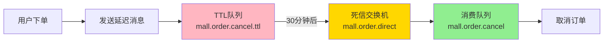

# RabbitMQ 死信队列详解（初学者版）

## 📚 一、核心原理

### 什么是死信队列？

**死信队列（Dead Letter Queue, DLQ）**：专门接收"死亡消息"的队列

**消息死亡的三种情况**：
1. **消息过期**（TTL 到期）← Mall 项目使用
2. **消费者拒绝**（basicNack 且 requeue=false）
3. **队列已满**（达到最大长度）

### 工作流程

```
生产者 → TTL延迟队列（等待N分钟）→ 消息过期 → 死信交换机 → 实际消费队列 → 消费者处理
```

---

## 🏗️ 二、架构设计

### Mall 项目架构图



### 关键配置

| 组件 | 名称 | 作用 |
|------|------|------|
| **TTL交换机** | `mall.order.direct.ttl` | 接收延迟消息 |
| **TTL队列** | `mall.order.cancel.ttl` | 存储待过期的消息 |
| **死信交换机** | `mall.order.direct` | 转发过期消息 |
| **消费队列** | `mall.order.cancel` | 存储待处理的消息 |

### 死信队列配置代码

```java
@Bean
public Queue orderTtlQueue() {
    return QueueBuilder
            .durable("mall.order.cancel.ttl")
            .withArgument("x-dead-letter-exchange", "mall.order.direct")      // 死信交换机
            .withArgument("x-dead-letter-routing-key", "mall.order.cancel")   // 死信路由键
            .build();
}
```

---

## 💻 三、实现步骤

### 步骤 1：用户下单，发送延迟消息

```java
// OmsPortalOrderServiceImpl.java

public Map<String, Object> generateOrder(OrderParam orderParam) {
    // 1. 保存订单到数据库（status=0 待付款）
    orderMapper.insert(order);
    
    // 2. 锁定库存
    lockStock(cartPromotionItemList);
    
    // 3. ⭐ 发送延迟消息
    sendDelayMessageCancelOrder(order.getId());
    
    return result;
}

public void sendDelayMessageCancelOrder(Long orderId) {
    // 读取超时配置：30分钟
    OmsOrderSetting setting = orderSettingMapper.selectByPrimaryKey(1L);
    long delayTimes = setting.getNormalOrderOvertime() * 60 * 1000;
    
    // 发送延迟消息
    cancelOrderSender.sendMessage(orderId, delayTimes);
}
```

### 步骤 2：设置消息 TTL

```java
// CancelOrderSender.java

public void sendMessage(Long orderId, final long delayTimes) {
    amqpTemplate.convertAndSend(
        "mall.order.direct.ttl",     // TTL交换机
        "mall.order.cancel.ttl",     // TTL路由键
        orderId,                     // 消息内容：订单ID
        new MessagePostProcessor() {
            @Override
            public Message postProcessMessage(Message message) {
                // ⭐ 设置消息过期时间（30分钟）
                message.getMessageProperties().setExpiration(String.valueOf(delayTimes));
                return message;
            }
        }
    );
}
```

### 步骤 3：消息过期，触发死信

```
时间轴：
14:00 → 消息进入 TTL 队列
14:30 → 消息过期，变成"死信"
       ↓
       自动转发到死信交换机
       ↓
       路由到实际消费队列
```

### 步骤 4：消费者处理订单取消

```java
// CancelOrderReceiver.java

@Component
@RabbitListener(queues = "mall.order.cancel")  // 监听消费队列
public class CancelOrderReceiver {
    
    @RabbitHandler
    public void handle(Long orderId) {
        // 调用服务层取消订单
        portalOrderService.cancelOrder(orderId);
    }
}

// OmsPortalOrderServiceImpl.java

public void cancelOrder(Long orderId) {
    // 1. 查询订单（只处理待付款订单）
    OmsOrder order = orderMapper.selectByPrimaryKey(orderId);
    if (order.getStatus() != 0) {
        return;  // 已支付，不取消
    }
    
    // 2. 修改订单状态为"已取消"
    order.setStatus(4);
    orderMapper.updateByPrimaryKeySelective(order);
    
    // 3. 释放锁定库存
    releaseStock(orderId);
    
    // 4. 返还优惠券
    updateCouponStatus(order.getCouponId(), 0);
    
    // 5. 返还积分
    returnIntegration(order.getMemberId(), order.getUseIntegration());
}
```

---

## 🎬 四、完整案例

### 场景：用户下单未支付，30分钟后自动取消

#### 时间线

| 时间 | 事件 | 订单状态 | 库存状态 |
|------|------|---------|---------|
| 14:00 | 用户提交订单 | 0-待付款 | 锁定+1 |
| 14:00 | 发送延迟消息（TTL=30min） | 0-待付款 | 锁定+1 |
| 14:00-14:30 | 用户未支付 | 0-待付款 | 锁定+1 |
| 14:30 | 消息过期，触发死信 | 0-待付款 | 锁定+1 |
| 14:30 | 消费者处理取消 | 4-已取消 | 锁定-1 |

#### 数据变化

**订单表（oms_order）**：
```sql
-- 14:00 创建订单
INSERT INTO oms_order VALUES (
    73, '202605030100000005', 3599.00, 
    0,  -- status: 0=待付款 ⭐
    ...
);

-- 14:30 自动取消
UPDATE oms_order SET status = 4 WHERE id = 73;
-- status: 4=已取消 ⭐
```

**库存表（pms_sku_stock）**：
```sql
-- 14:00 锁定库存
UPDATE pms_sku_stock SET lock_stock = lock_stock + 1 WHERE id = 101;

-- 14:30 释放库存
UPDATE pms_sku_stock SET lock_stock = lock_stock - 1 WHERE id = 101;
```

**消息队列状态**：
```
14:00 → TTL队列: 1条消息, 消费队列: 0条
14:30 → TTL队列: 0条, 消费队列: 1条（瞬间）
14:30 → TTL队列: 0条, 消费队列: 0条（已消费）
```

---

## 🛡️ 五、双重保障机制

### 保障 1：RabbitMQ 延迟队列（主）

- ✅ 实时性强
- ✅ 精确控制时间
- ❌ 依赖 RabbitMQ 服务

### 保障 2：定时任务扫描（备）

```java
@Scheduled(cron = "0 */5 * * * ?")  // 每5分钟执行
public void cancelTimeOutOrders() {
    // 查询超时未支付的订单
    List<OmsOrder> timeOutOrders = portalOrderDao.getTimeOutOrders(30);
    
    // 批量取消
    for (OmsOrder order : timeOutOrders) {
        cancelOrder(order.getId());
    }
}
```

- ✅ 兜底方案
- ✅ 不依赖 MQ
- ❌ 实时性差（最多延迟5分钟）

---

## 🔑 六、关键技术点

### 1. 幂等性保证

**问题**：消息可能被重复消费

**解决**：
```java
public void cancelOrder(Long orderId) {
    // 只处理待付款订单
    if (order.getStatus() != 0) {
        return;  // 已支付或已取消，直接返回
    }
    // ... 执行取消逻辑
}
```

### 2. 消息持久化

```java
@Bean
public Queue orderTtlQueue() {
    return QueueBuilder
            .durable("mall.order.cancel.ttl")  // ← 持久化
            .withArgument(...)
            .build();
}
```

### 3. 消费者确认

```yaml
spring:
  rabbitmq:
    listener:
      simple:
        acknowledge-mode: auto  # 自动确认
        retry:
          enabled: true         # 失败重试
          max-attempts: 3
```

---

## 🐛 七、常见问题

### 问题 1：订单没有自动取消

**排查步骤**：
```bash
# 1. 检查 RabbitMQ 队列
http://localhost:15672

# 2. 查看消费者日志
tail -f mall-portal/logs/app.log | grep "process orderId"

# 3. 检查订单配置
SELECT normal_order_overtime FROM oms_order_setting WHERE id=1;
```

### 问题 2：消息堆积

**原因**：消费者处理速度慢

**解决**：
```yaml
spring:
  rabbitmq:
    listener:
      simple:
        concurrency: 5      # 增加并发数
        max-concurrency: 10
```

### 问题 3：重复消费

**原因**：网络抖动导致 ACK 丢失

**解决**：实现幂等性（见第六部分）

---

## 💡 八、类比理解

### 死信队列就像"快递逾期处理"

```
正常流程：
寄快递 → 快递员派送 → 收件人签收 ✅

逾期流程：
寄快递 → 快递员派送 → 3天没人取 → 转到"逾期区" → 人工处理
        ↑              ↑
     TTL队列      死信队列
```

### 订单取消就像"餐厅预约"

```
正常流程：
预约座位 → 按时到店 → 用餐 ✅

超时流程：
预约座位 → 30分钟没来 → 自动取消 → 释放座位
        ↑            ↑
     TTL队列    死信处理
```

---

## 📊 九、总结对比

### 三种交换机类型

| 类型 | 匹配方式 | 使用场景 | Mall使用 |
|------|---------|---------|---------|
| **Direct** | 精确匹配 | 点对点通信 | ✅ 商品同步、订单取消 |
| **Fanout** | 广播 | 一对多通知 | ❌ 未使用 |
| **Topic** | 通配符 | 灵活路由 | ❌ 未使用 |

### 两种订单取消方案

| 方案 | 优点 | 缺点 | Mall采用 |
|------|------|------|---------|
| **死信队列** | 实时、精确 | 依赖MQ | ✅ 主方案 |
| **定时任务** | 简单、可靠 | 延迟大 | ✅ 兜底方案 |

---

## 🎯 十、学习路径

### 初级阶段
- [ ] 理解死信队列概念
- [ ] 跑通 Mall 项目订单取消功能
- [ ] 查看 RabbitMQ 管理界面

### 中级阶段
- [ ] 尝试其他触发场景（消费者拒绝、队列满）
- [ ] 配置消息持久化和确认机制
- [ ] 实现幂等性处理

### 高级阶段
- [ ] 设计复杂的延迟消息系统
- [ ] 对比其他方案（Redis ZSet、RocketMQ）
- [ ] RabbitMQ 集群部署和性能调优

---

## 📝 核心要点速记

```
1. 死信队列 = 接收"死亡消息"的专用队列
2. 消息死亡 = 过期 / 被拒绝 / 队列满
3. Mall应用 = 订单超时自动取消
4. 配置关键 = x-dead-letter-exchange + x-dead-letter-routing-key
5. 保障机制 = RabbitMQ延迟队列（主）+ 定时任务（备）
6. 幂等性 = 多次执行结果一致
```

---

**通过这个设计，Mall 项目实现了高效、可靠、自动化的订单超时取消功能！**
