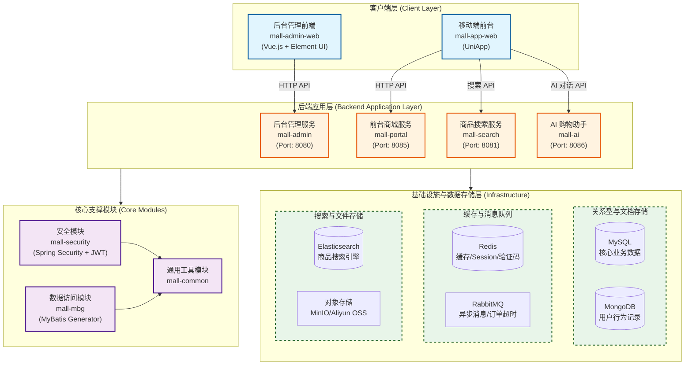
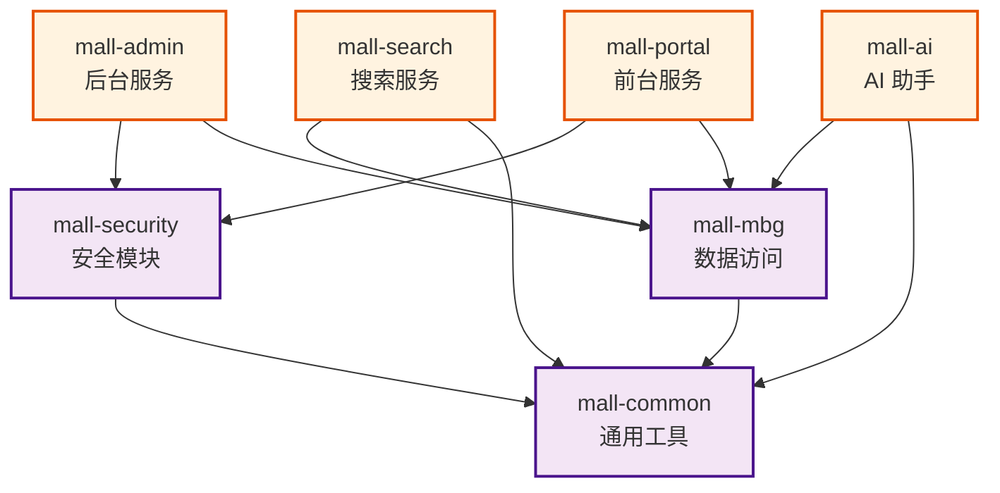
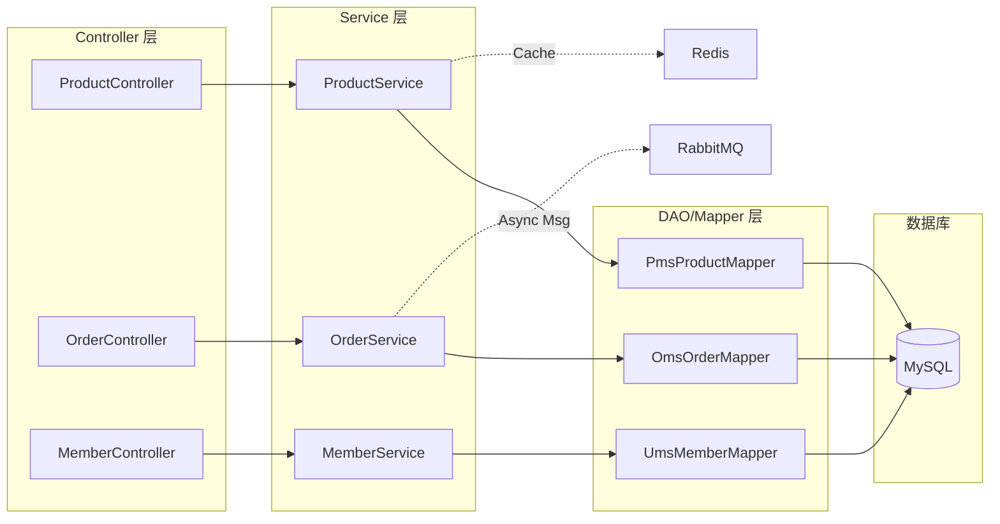
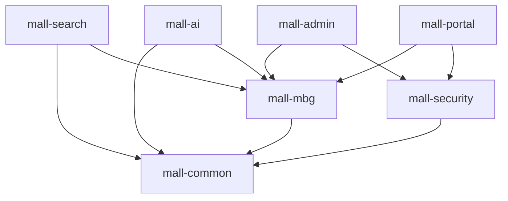
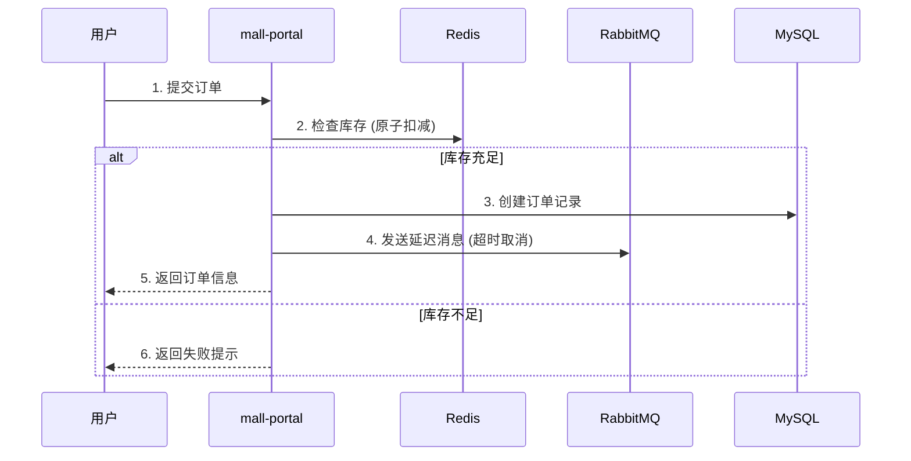

# Mall 项目架构图

## 1. 系统总体架构 (System Architecture)

> **说明**：为避免连线交叉，本图采用**分层聚合**方式展示。后端服务统一访问底层基础设施，具体依赖关系见下方的《模块依赖图》。

## 2. Maven 模块依赖关系 (Module Dependencies)

> **说明**：展示各 Java 模块之间的引用关系，`mall-common` 为最底层基础包。

## 2. 后端服务详细架构 (Backend Service Architecture)

## 3. 技术栈概览 (Technology Stack)

| 层级 | 技术选型 |
| :--- | :--- |
| **前端** | Vue.js, Element UI, UniApp, TypeScript |
| **后端框架** | Spring Boot 2.7.5, Spring Security, MyBatis |
| **数据库** | MySQL 8.0, Redis, MongoDB, Elasticsearch |
| **中间件** | RabbitMQ |
| **存储** | MinIO, Aliyun OSS |
| **运维** | Docker, Jenkins, Logstash |
| **开发工具** | Maven, Lombok, Hutool, Swagger |

## 4. 模块依赖关系 (Module Dependencies)

## 5. 业务流程示例：订单创建 (Order Creation Flow)

