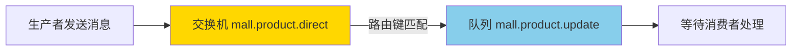
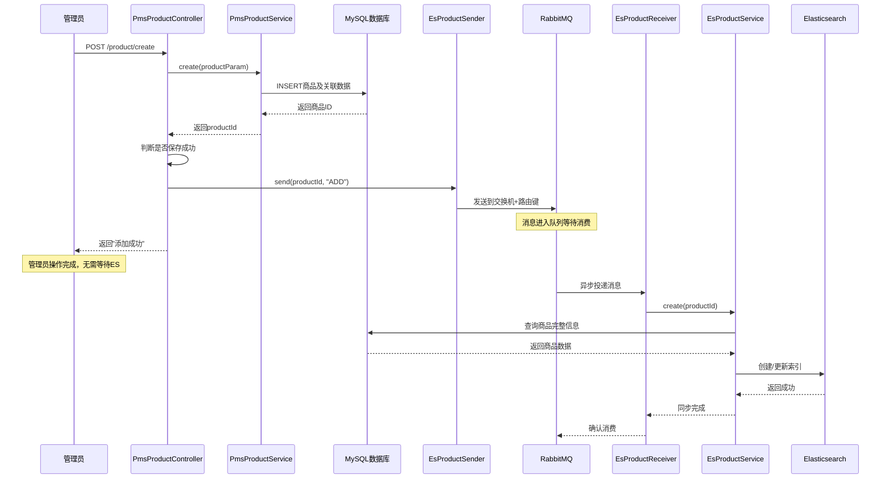

# 商品同步到 Elasticsearch 详解

## 📋 文档概述

本文档详细说明 Mall 项目中商品数据如何通过 RabbitMQ 异步同步到 Elasticsearch 的实现原理和技术细节。文档基于实际项目代码编写，适合初学者理解和学习。

---

## 🎯 业务需求分析

### 问题背景

假设你有一个电商网站：
- **后台管理端**（mall-admin）：管理员可以添加、修改、删除商品
- **前台搜索端**（mall-search）：用户可以搜索商品

### 技术方案选择

| 方案 | 说明 | 缺点 |
|------|------|------|
| **直接查MySQL** | 用户搜索时直接查询商品表 | MySQL 不适合全文搜索，速度慢 |
| **使用Elasticsearch** | 将商品数据同步到ES，搜索走ES | 需要保持MySQL和ES数据一致 |

**Mall项目选择了第二种方案**，因为：
- Elasticsearch 是专业的搜索引擎
- 支持全文搜索、模糊匹配、高亮显示
- 搜索速度比 MySQL 快 10-100 倍

---

## 🔧 技术架构概览

### 整体流程图


### 为什么需要RabbitMQ？

#### ❌ 同步方式（不使用MQ）
```
用户添加商品
  ↓
保存到MySQL（1秒）
  ↓
同步到ES（2秒）
  ↓
返回"添加成功"
总耗时：3秒
```

#### ✅ 异步方式（使用MQ）
```
用户添加商品
  ↓
保存到MySQL（1秒）
  ↓
发送消息到RabbitMQ（0.01秒）
  ↓
立即返回"添加成功"
总耗时：1.01秒（用户体验）

同时：
RabbitMQ → 异步同步到ES（2秒，用户无需等待）
```

**核心优势**：
- ⚡ 响应速度快 3 倍
- 🔗 系统解耦（商品管理和搜索功能分离）
- 🛡️ 容错性好（ES 挂了不影响商品添加）

---

## 📚 核心概念解释

### 1. 什么是Elasticsearch（ES）？

**简单理解**：ES 就是一个**超级快的搜索数据库**

| 对比项 | MySQL | Elasticsearch |
|--------|-------|--------------|
| 擅长 | 事务处理、精确查询 | 全文搜索、模糊匹配 |
| 搜索速度 | 慢（全表扫描） | 快（倒排索引） |
| 使用场景 | 存储订单、用户信息 | 商品搜索、日志分析 |

**举例**：
- 用户搜索"红色手机"
- MySQL 需要逐行比对（慢）
- ES 通过索引瞬间定位（快）

### 2. 什么是RabbitMQ？

**简单理解**：RabbitMQ 就是一个**消息中转站**

```
生产者（发件人） → 交换机（分拣中心） → 队列（快递柜） → 消费者（收件人）
```

**类比快递系统**：
- **生产者**：mall-admin 模块（发送包裹）
- **交换机**：分拣中心（根据地址分发）
- **队列**：快递柜（临时存放）
- **消费者**：mall-search 模块（取走包裹处理）

### 3. 什么是消息队列？

**简单理解**：一个**先进先出的消息缓冲区**

```
消息1 → [队列] → 消息1被消费
消息2 → [队列] → 消息2被消费
消息3 → [队列] → 消息3被消费
```

---

## 🔍 详细实现流程（基于实际项目代码）

### 第一步：管理员操作商品（Controller 层接收）

```java
// 位置：mall-admin/src/main/java/com/macro/mall/controller/PmsProductController.java
// 第 50-62 行

@RequestMapping(value = "/create", method = RequestMethod.POST)
public CommonResult create(@RequestBody PmsProductParam productParam) {
    // 1. 调用Service层保存商品到MySQL
    Long productId = productService.create(productParam);
    
    // 2. 如果保存成功，在Controller层发送MQ消息
    if (productId != null) {
        esProductSender.send(productId, "ADD");  // ← 关键：在这里发消息！
        return CommonResult.success(1);
    } else {
        return CommonResult.failed();
    }
}
```

**关键点**：
- 消息发送在 **Controller 层**，不在 Service 层
- 先保存到 MySQL，成功后再发消息
- 操作类型："ADD"（新增）、"UPDATE"（修改）、"DELETE"（删除）

### 第二步：Service 层保存到 MySQL

```java
// 位置：mall-admin/src/main/java/com/macro/mall/service/impl/PmsProductServiceImpl.java
// 第 150-181 行

@Override
public Long create(PmsProductParam productParam) {
    // 1. 创建商品基本信息
    PmsProduct product = productParam;
    product.setId(null);
    productMapper.insertSelective(product);
    Long productId = product.getId();
    
    // 2. 保存会员价格
    relateAndInsertList(memberPriceDao, productParam.getMemberPriceList(), productId);
    
    // 3. 保存阶梯价格
    relateAndInsertList(productLadderDao, productParam.getProductLadderList(), productId);
    
    // 4. 保存满减价格
    relateAndInsertList(productFullReductionDao, productParam.getProductFullReductionList(), productId);
    
    // 5. 保存SKU库存信息
    handleSkuStockCode(productParam.getSkuStockList(), productId);
    relateAndInsertList(skuStockDao, productParam.getSkuStockList(), productId);
    
    // 6. 保存商品属性
    relateAndInsertList(productAttributeValueDao, productParam.getProductAttributeValueList(), productId);
    
    // 7. 关联专题和优选专区
    relateAndInsertList(subjectProductRelationDao, productParam.getSubjectProductRelationList(), productId);
    relateAndInsertList(prefrenceAreaProductRelationDao, productParam.getPrefrenceAreaProductRelationList(), productId);
    
    return productId;
}
```

**Service 层职责**：
- ✅ 只负责保存到 MySQL
- ❌ 不关心 MQ 消息发送
- ✅ 职责单一，便于复用和测试

### 第三步：构建消息对象

```java
// 位置：mall-common/src/main/java/com/macro/mall/common/domain/EsProductMessage.java

public class EsProductMessage {
    private Long productId;      // 商品ID：告诉ES要同步哪个商品
    private String actionType;   // 操作类型：ADD/UPDATE/DELETE
    private Long timestamp;      // 时间戳：记录消息发送时间
    
    // getter and setter...
}
```

**消息内容示例**：
```json
{
    "productId": 123,
    "actionType": "ADD",
    "timestamp": 1714723200000
}
```

### 第四步：发送消息到RabbitMQ

```java
// 位置：mall-admin/src/main/java/com/macro/mall/component/EsProductSender.java

@Component
public class EsProductSender {
    
    @Autowired
    private AmqpTemplate amqpTemplate;  // Spring提供的RabbitMQ工具
    
    public void send(Long productId, String actionType) {
        // 1. 构建消息对象
        EsProductMessage message = new EsProductMessage();
        message.setProductId(productId);
        message.setActionType(actionType);
        message.setTimestamp(System.currentTimeMillis());
        
        // 2. 发送消息到RabbitMQ
        // 参数1：交换机名称 "mall.product.direct"
        // 参数2：路由键 "mall.product.update"
        // 参数3：消息内容
        amqpTemplate.convertAndSend("mall.product.direct", "mall.product.update", message);
        
        // 3. 记录日志
        LOGGER.info("发送商品同步消息：productId={}, actionType={}", productId, actionType);
    }
}
```

**关键理解**：
- `convertAndSend`：自动将 Java 对象转换为 JSON 并发送
- 交换机 + 路由键：决定了消息去往哪个队列

### 第五步：RabbitMQ 路由消息



**路由机制**：
- 交换机收到消息后，查看路由键 `"mall.product.update"`
- 根据绑定关系，将消息转发到对应的队列
- 队列暂时存储消息，等待消费者来取

### 第六步：mall-search 消费消息

```java
// 位置：mall-search/src/main/java/com/macro/mall/search/component/EsProductReceiver.java

@Component
@RabbitListener(queues = "mall.product.update")  // 监听指定队列
public class EsProductReceiver {
    
    @Autowired
    private EsProductService esProductService;  // ES操作服务
    
    @RabbitHandler  // 处理消息的方法
    public void handle(EsProductMessage message) {
        LOGGER.info("接收到商品同步消息：productId={}, actionType={}",
            message.getProductId(), message.getActionType());
        
        // 根据操作类型执行不同逻辑
        if ("ADD".equals(message.getActionType()) || "UPDATE".equals(message.getActionType())) {
            // 新增或更新：从MySQL查询商品数据，同步到ES
            esProductService.create(message.getProductId());
            LOGGER.info("商品索引更新成功：productId={}", message.getProductId());
            
        } else if ("DELETE".equals(message.getActionType())) {
            // 删除：从ES中删除对应的索引
            esProductService.delete(message.getProductId());
            LOGGER.info("商品索引删除成功：productId={}", message.getProductId());
        }
    }
}
```

**关键点**：
- `@RabbitListener`：标注这是一个消息监听器
- `queues = "mall.product.update"`：监听这个队列
- 自动反序列化：RabbitMQ 将 JSON 自动转为 `EsProductMessage` 对象

### 第七步：同步数据到Elasticsearch

```java
// mall-search 模块从 MySQL 查询商品完整信息，然后写入 ES
public void create(Long productId) {
    // 1. 从MySQL查询商品完整信息
    PmsProduct product = productMapper.selectByPrimaryKey(productId);
    
    // 2. 查询商品的SKU、属性、分类等关联数据
    EsProduct esProduct = getEsProduct(product);
    
    // 3. 将商品数据写入Elasticsearch
    esProductRepository.save(esProduct);
}
```

**同步的数据内容**：
- 商品基本信息（名称、价格、图片等）
- SKU 信息（库存、价格等）
- 商品属性（品牌、分类等）
- 便于搜索的字段组合

---

## 🎨 配置详解

### 1. 交换机配置

```java
// 位置：mall-admin/src/main/java/com/macro/mall/config/RabbitMqConfig.java

@Bean
DirectExchange productDirect() {
    return ExchangeBuilder
            .directExchange("mall.product.direct")  // 交换机名称
            .durable(true)  // 持久化：RabbitMQ重启后交换机不丢失
            .build();
}
```

**为什么两个模块都配置？**
- mall-admin：需要知道交换机存在才能发送消息
- mall-search：需要知道交换机存在才能接收消息
- 实际 RabbitMQ 中只有一个交换机，两边的配置是一样的

### 2. 队列配置

```java
// 位置：mall-search/src/main/java/com/macro/mall/search/config/EsProductMqConfig.java

@Bean
public Queue productQueue() {
    return new Queue("mall.product.update");  // 队列名称
}
```

### 3. 绑定关系配置

```java
@Bean
Binding productBinding(DirectExchange productDirect, Queue productQueue) {
    return BindingBuilder
            .bind(productQueue)              // 绑定队列
            .to(productDirect)               // 到交换机
            .with("mall.product.update");    // 使用这个路由键
}
```

**绑定的含义**：
- 告诉交换机："路由键为 `mall.product.update` 的消息，请转发到 `mall.product.update` 队列"

### 4. JSON消息转换器

```java
@Bean
public MessageConverter messageConverter() {
    return new Jackson2JsonMessageConverter();
}
```

**作用**：
- 发送时：Java 对象 → JSON 字符串
- 接收时：JSON 字符串 → Java 对象
- 好处：跨语言兼容、可读性强、体积小

---

## 🔄 完整时序图（基于实际代码）



**时间线说明**：
1. 管理员发起添加商品请求
2. Service 保存到 MySQL（必须成功）
3. Controller 发送消息到 RabbitMQ（异步，不阻塞）
4. 立即返回"添加成功"给管理员
5. mall-search 异步消费消息
6. 从 MySQL 查询商品完整信息
7. 同步到 Elasticsearch
8. 确认消息消费完成

---

## 🎯 关键技术点解析

### 1. 为什么先存MySQL再发消息？

```
正确流程：
MySQL保存成功 → 发送消息 → 返回成功

错误流程（不要这样做）：
发送消息 → MySQL保存 → 返回成功
```

**原因**：
- 如果先发消息，但 MySQL 保存失败，ES 中会有脏数据
- 保证 MySQL 是**唯一的数据源**（Source of Truth）
- ES 只是 MySQL 的**搜索索引副本**

### 2. 为什么在Controller层发消息？

**职责分离原则**：

```
Controller 层：
  - 接收请求
  - 调用Service
  - 发送MQ消息（跨模块集成）
  - 返回响应

Service 层：
  - 业务逻辑处理
  - 数据库操作
  - 事务管理
  - ❌ 不关心MQ
```

**优点**：
- Service 可以被其他地方调用而不影响 MQ
- 测试容易（Service 和 MQ 可以分别测试）
- 灵活控制（可以在 Controller 层决定是否发消息）

### 3. 消息丢失怎么办？

#### 三层保障机制

```java
// 第一层：实时消息同步（正常情况）
esProductSender.send(productId, "ADD");

// 第二层：消息重试机制（异常情况）
// RabbitMQ配置了消息确认机制
spring.rabbitmq.publisher-confirms=true  // 发送确认
spring.rabbitmq.publisher-returns=true   // 返回确认

// 第三层：定时全量校对（兜底方案）
// 位置：mall-search/src/main/java/com/macro/mall/search/component/EsProductReceiver.java
@Scheduled(cron = "0 0 3 * * ?")  // 每天凌晨3点
public void syncAllProducts() {
    // 从MySQL导入所有上架商品到ES
    int count = esProductService.importAll();
    LOGGER.info("全量校对完成，共同步 {} 个商品", count);
}
```

### 4. 哪些操作会触发消息发送？

基于实际代码，以下操作会发送 MQ 消息：

| 操作 | 接口路径 | 消息类型 | 代码位置 |
|------|---------|---------|---------|
| **创建商品** | `/product/create` | "ADD" | Controller 第 57 行 |
| **修改商品** | `/product/update/{id}` | "UPDATE" | Controller 第 92 行 |
| **批量上下架** | `/product/update/publishStatus` | "UPDATE" | Controller 第 167 行 |
| **批量推荐** | `/product/update/recommendStatus` | "UPDATE" | Controller 第 190 行 |
| **批量设为新品** | `/product/update/newStatus` | "UPDATE" | Controller 第 213 行 |
| **批量删除** | `/product/update/deleteStatus` | "DELETE" | Controller 第 238 行 |

**注意**：修改审核状态不发消息，因为审核状态不影响前端搜索展示。

---

## 🐛 常见问题排查

### 问题1：消息发送了，但ES没更新

**排查步骤**：

```bash
# 1. 查看RabbitMQ管理界面
http://localhost:15672

# 2. 检查队列是否有积压消息
- 查看 "mall.product.update" 队列的消息数
- 如果消息数持续增长，说明消费者有问题

# 3. 查看消费者日志
tail -f mall-search/logs/app.log | grep "接收到商品同步消息"

# 4. 检查ES是否连接正常
curl -X GET "http://localhost:9200/_cluster/health"
```

**可能原因**：
- mall-search 服务未启动
- RabbitMQ 连接配置错误
- 消费者代码有 Bug 抛出异常
- Elasticsearch 服务未启动

### 问题2：ES中的数据比MySQL旧

**原因**：
- 消息堆积未消费
- 消费速度慢于生产速度

**解决方案**：
```java
// 增加消费者并发数
spring.rabbitmq.listener.simple.concurrency=5      // 最小5个消费者
spring.rabbitmq.listener.simple.max-concurrency=10 // 最大10个消费者
```

### 问题3：重复同步同一条消息

**原因**：
- 网络抖动导致消费者未确认，消息重新投递

**解决方案**：
```java
// 保证幂等性：多次执行结果一样
public void create(Long productId) {
    // 先查询ES中是否已存在
    Optional<EsProduct> existing = esProductRepository.findById(productId);
    if (existing.isPresent()) {
        // 已存在则更新，不重复创建
        esProductRepository.save(esProduct);
    } else {
        // 不存在则创建
        esProductRepository.save(esProduct);
    }
}
```

---

## 📊 性能优化建议

### 1. 批量同步

```java
// 低效：逐个同步
for (Long productId : productIds) {
    esProductService.create(productId);  // 每次一次网络请求
}

// 高效：批量同步
List<EsProduct> products = productIds.stream()
    .map(this::getEsProduct)
    .collect(Collectors.toList());
esProductRepository.saveAll(products);  // 一次网络请求
```

### 2. 消息过滤

```java
// 只同步上架的商品
if (product.getPublishStatus().equals(1)) {
    esProductSender.send(productId, "ADD");
}
```

---

## 🎓 学习路径建议

### 初级阶段
1. 理解什么是消息队列
2. 理解生产者 - 消费者模型
3. 跑通 Mall 项目的商品同步功能

### 中级阶段
1. 学习 RabbitMQ 的交换机类型（Direct、Fanout、Topic）
2. 理解消息确认机制（ACK）
3. 学习如何处理消息丢失和重复消费

### 高级阶段
1. RabbitMQ 集群部署
2. 消息队列性能调优
3. 对比其他消息队列（Kafka、RocketMQ）

---

## 💡 总结

### 核心思想
**异步解耦**：商品管理和搜索功能分离，互不影响

### 技术链路（基于实际代码）
```
管理员操作 → Controller接收 → Service保存MySQL → Controller发送MQ → 异步消费 → 同步ES索引
```

### 关键优势
- ✅ 响应速度快（不等待 ES 同步）
- ✅ 系统解耦（商品和搜索独立）
- ✅ 容错性好（ES 挂了不影响主流程）
- ✅ 数据一致性（三重保障机制）
- ✅ 职责清晰（Service 专注业务，Controller 处理集成）

### 类比理解
就像**寄快递**：
- 你寄出包裹（保存 MySQL）
- 快递员揽收（发送消息）
- 包裹在运输中（消息队列）
- 收件人收到并处理（消费消息，同步 ES）
- 你不需要等收件人收到才放心（异步处理）

通过这个设计，Mall 项目实现了**高性能、高可用、易扩展**的商品搜索功能！

---

## 📚 相关文档

- [RabbitMQ 使用详解](./RabbitMQ使用详解.md)
- [mall-admin README](../mall-admin/README.md)
- [mall-search README](../mall-search/README.md)

---

## 📝 版本历史

| 版本 | 日期 | 修改内容 | 作者 |
|------|------|---------|------|
| v1.0 | 2026-05-03 | 初始版本，基于实际项目代码编写 | - |

---

**文档说明**: 本文档基于 Mall 项目实际代码编写，所有代码示例均来自项目源码，确保准确性和可执行性。
