# Spring Security 动态权限控制完整指南

## 📋 目录

- [一、核心概念](#一核心概念)
- [二、传统权限控制 vs 动态权限控制](#二传统权限控制-vs-动态权限控制)
- [三、动态权限控制架构设计](#三动态权限控制架构设计)
- [四、核心组件详解](#四核心组件详解)
- [五、执行流程分析](#五执行流程分析)
- [六、集成步骤](#六集成步骤)
- [七、数据库设计与缓存原理](#七数据库设计与缓存原理)
- [八、关键问题与解决方案](#八关键问题与解决方案)
- [九、总结与最佳实践](#九总结与最佳实践)

---

## 一、核心概念

### 1.1 什么是动态权限控制？

**动态权限控制 (Dynamic Permission Control)** 是指基于数据库配置的资源路径规则，在运行时动态判断用户是否有权限访问某个接口，而非通过硬编码的注解方式固定权限。

### 1.2 为什么需要动态权限？

| 对比维度 | 传统注解方式 (`@PreAuthorize`) | 动态权限控制 |
|---------|-------------------------------|-------------|
| **权限定义** | 每个接口需手动添加注解 | 数据库中统一配置资源规则 |
| **灵活性** | 修改权限需重新编译代码 | 修改数据库即可实时生效 |
| **批量控制** | 只能逐个接口控制 | 支持通配符批量匹配路径 |
| **维护成本** | 高（代码分散） | 低（集中管理） |

---

## 二、传统权限控制 vs 动态权限控制

### 2.1 传统方式：基于注解的权限控制

```java
// 在每个接口上硬编码权限标识
@PreAuthorize("hasAuthority('pms:product:create')")
@PostMapping("/create")
public CommonResult create(@RequestBody PmsProduct product) {
    // ...
}
```

**工作流程：**
1. 开发者在每个接口上添加 `@PreAuthorize` 注解
2. 将权限值存入数据库权限表
3. 用户登录时查询其拥有的权限列表
4. Spring Security 比对注解中的权限值与用户拥有的权限

**存在的问题：**
- ❌ 需要在每个接口上定义权限值，工作量大
- ❌ 只能逐个控制接口，无法批量管理
- ❌ 权限变更需要修改代码并重新部署

### 2.2 改进方案：基于路径的动态权限控制

**核心思想：** 每个接口都可以由其访问路径唯一确定，因此可以建立 **URL 路径 → 所需权限** 的映射关系，实现动态鉴权。

**优势：**
- ✅ 权限规则存储在数据库中，无需修改代码
- ✅ 支持 Ant 风格通配符（如 `/admin/**`），可批量控制
- ✅ 权限变更只需更新数据库，配合缓存清空即可实时生效

---

## 三、动态权限控制架构设计

### 3.1 Spring Security 过滤器链原理

在深入动态权限之前，先理解 Spring Security 的核心机制：**过滤器链 (Filter Chain)**。

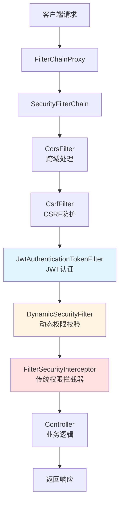

**关键原理：**
- Spring Security 通过一系列过滤器依次处理请求
- 每个过滤器都有特定职责（认证、授权、日志等）
- 我们的 `DynamicSecurityFilter` 插入在 JWT 认证之后、传统权限拦截器之前
- 如果某个过滤器拒绝访问，后续过滤器和 Controller 都不会执行

### 3.2 动态权限控制核心原理

动态权限控制的本质是 **替换 Spring Security 默认的静态权限决策机制**，实现基于数据库配置的运行时鉴权。

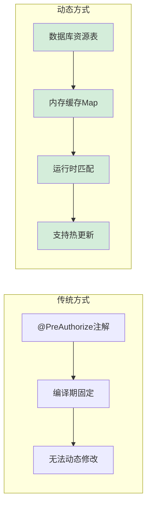

**实现思路：**
1. **数据源抽象：** Spring Security 通过 `SecurityMetadataSource` 接口获取某路径所需权限
2. **决策抽象：** 通过 `AccessDecisionManager` 接口判断用户是否有权限
3. **自定义实现：** 我们提供这两个接口的实现类，从数据库加载规则并动态比对

### 3.3 整体架构图

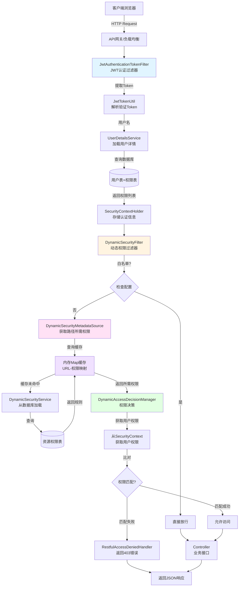

### 3.4 核心组件职责与协作关系

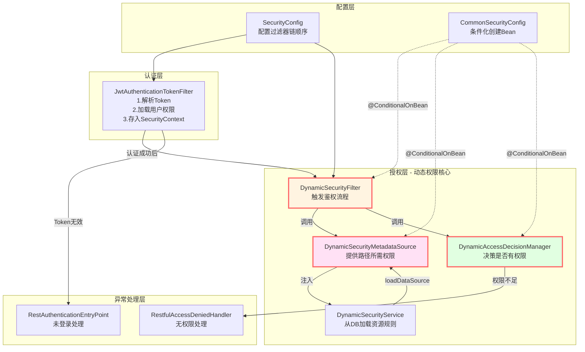

**组件协作流程：**
1. **配置阶段：** `CommonSecurityConfig` 根据是否存在 `DynamicSecurityService` Bean，决定是否创建动态权限相关组件
2. **认证阶段：** `JwtAuthenticationTokenFilter` 验证 Token 并加载用户权限到 `SecurityContext`
3. **授权阶段：** `DynamicSecurityFilter` 拦截请求，委托给 `MetadataSource` 和 `DecisionManager` 进行鉴权
4. **异常处理：** 鉴权失败时由对应的 Handler 返回友好的 JSON 响应

---

## 四、核心组件详解

### 4.1 JwtAuthenticationTokenFilter - JWT 认证过滤器

**文件位置：** `mall-security/src/main/java/com/macro/mall/security/component/JwtAuthenticationTokenFilter.java`

**核心职责：**
- 从 HTTP 请求头中提取 JWT Token
- 验证 Token 的有效性（是否过期、签名是否正确）
- 根据 Token 中的用户名加载用户详情（包含权限列表）
- 将认证信息存入 `SecurityContextHolder`

**关键代码逻辑：**

```java
@Override
protected void doFilterInternal(HttpServletRequest request,
                                HttpServletResponse response,
                                FilterChain chain) throws ServletException, IOException {
    // 1. 从请求头获取 Token（格式："Bearer xxx"）
    String authHeader = request.getHeader(this.tokenHeader);
    if (authHeader != null && authHeader.startsWith(this.tokenHead)) {
        String authToken = authHeader.substring(this.tokenHead.length());
        
        // 2. 从 Token 中解析用户名
        String username = jwtTokenUtil.getUserNameFromToken(authToken);
        
        // 3. 如果用户未认证，则加载用户详情
        if (username != null && SecurityContextHolder.getContext().getAuthentication() == null) {
            UserDetails userDetails = this.userDetailsService.loadUserByUsername(username);
            
            // 4. 验证 Token 有效性
            if (jwtTokenUtil.validateToken(authToken, userDetails)) {
                // 5. 创建认证对象并存入 SecurityContext
                UsernamePasswordAuthenticationToken authentication = 
                    new UsernamePasswordAuthenticationToken(
                        userDetails, 
                        null, 
                        userDetails.getAuthorities()  // 用户拥有的权限列表
                    );
                authentication.setDetails(
                    new WebAuthenticationDetailsSource().buildDetails(request)
                );
                SecurityContextHolder.getContext().setAuthentication(authentication);
            }
        }
    }
    
    // 6. 继续过滤器链
    chain.doFilter(request, response);
}
```

**关键点：**
- 继承 `OncePerRequestFilter`，确保每个请求只执行一次
- 认证成功后，用户的权限列表会存储在 `Authentication` 对象中，供后续鉴权使用

---

### 4.2 DynamicSecurityFilter - 动态权限过滤器

**文件位置：** `mall-security/src/main/java/com/macro/mall/security/component/DynamicSecurityFilter.java`

**核心职责：**
- 拦截所有需要鉴权的请求
- 对白名单路径和 OPTIONS 请求直接放行（解决跨域问题）
- 调用 Spring Security 的鉴权机制进行权限校验

**关键代码逻辑：**

```java
@Override
public void doFilter(ServletRequest servletRequest, 
                     ServletResponse servletResponse, 
                     FilterChain filterChain) throws IOException, ServletException {
    HttpServletRequest request = (HttpServletRequest) servletRequest;
    FilterInvocation fi = new FilterInvocation(servletRequest, servletResponse, filterChain);
    
    // 1. OPTIONS 请求直接放行（解决前端跨域预检问题）
    if (request.getMethod().equals(HttpMethod.OPTIONS.toString())) {
        fi.getChain().doFilter(fi.getRequest(), fi.getResponse());
        return;
    }
    
    // 2. 白名单路径直接放行
    PathMatcher pathMatcher = new AntPathMatcher();
    for (String path : ignoreUrlsConfig.getUrls()) {
        if (pathMatcher.match(path, request.getRequestURI())) {
            fi.getChain().doFilter(fi.getRequest(), fi.getResponse());
            return;
        }
    }
    
    // 3. 调用父类的 beforeInvocation 方法进行鉴权
    //    这一步会依次调用：
    //    - SecurityMetadataSource.getAttributes() 获取所需权限
    //    - AccessDecisionManager.decide() 进行权限决策
    InterceptorStatusToken token = super.beforeInvocation(fi);
    try {
        fi.getChain().doFilter(fi.getRequest(), fi.getResponse());
    } finally {
        super.afterInvocation(token, null);
    }
}
```

**为什么需要特殊处理 OPTIONS 请求？**

前端跨域访问时会先发送 OPTIONS 预检请求，如果该请求被权限拦截，会导致真正的请求无法发送。因此必须在权限校验前直接放行。

---

### 4.3 DynamicSecurityMetadataSource - 动态权限数据源

**文件位置：** `mall-security/src/main/java/com/macro/mall/security/component/DynamicSecurityMetadataSource.java`

**核心职责：**
- 维护一个 **URL 路径 → 所需权限** 的映射表（缓存在内存中）
- 根据当前访问的 URL，返回该路径所需的权限集合

**数据结构：**

```java
// 存储格式：{ "/admin/product/create": "1:pms:product:create", ... }
private static Map<String, ConfigAttribute> configAttributeMap = null;
```

**关键方法：**

#### （1）加载数据源

```java
@PostConstruct
public void loadDataSource() {
    // 调用业务接口从数据库加载所有资源规则
    configAttributeMap = dynamicSecurityService.loadDataSource();
}
```

#### （2）获取当前路径所需权限

```java
@Override
public Collection<ConfigAttribute> getAttributes(Object o) throws IllegalArgumentException {
    // 1. 如果缓存为空，重新加载
    if (configAttributeMap == null) {
        this.loadDataSource();
    }
    
    List<ConfigAttribute> configAttributes = new ArrayList<>();
    
    // 2. 获取当前访问的 URL 路径
    String url = ((FilterInvocation) o).getRequestUrl();
    String path = URLUtil.getPath(url);
    
    // 3. 使用 Ant 风格路径匹配器遍历所有规则
    PathMatcher pathMatcher = new AntPathMatcher();
    Iterator<String> iterator = configAttributeMap.keySet().iterator();
    
    while (iterator.hasNext()) {
        String pattern = iterator.next();
        // 如果当前路径匹配某个规则，则将该规则对应的权限加入结果集
        if (pathMatcher.match(pattern, path)) {
            configAttributes.add(configAttributeMap.get(pattern));
        }
    }
    
    // 4. 返回匹配的权限集合（可能为空，表示该路径无需特殊权限）
    return configAttributes;
}
```

#### （3）清空缓存（用于资源规则变更时）

```java
public void clearDataSource() {
    configAttributeMap.clear();
    configAttributeMap = null;
}
```

**使用场景：** 当管理员在后台修改了资源权限配置后，需要调用此方法清空缓存，下次请求时会重新从数据库加载最新规则。

---

### 4.4 DynamicAccessDecisionManager - 动态权限决策管理器

**文件位置：** `mall-security/src/main/java/com/macro/mall/security/component/DynamicAccessDecisionManager.java`

**核心职责：**
- 接收当前用户的权限列表和访问某路径所需的权限
- 判断用户是否拥有足够的权限访问该路径

**关键代码逻辑：**

```java
@Override
public void decide(Authentication authentication, 
                   Object object,
                   Collection<ConfigAttribute> configAttributes) 
        throws AccessDeniedException, InsufficientAuthenticationException {
    
    // 1. 如果该路径未配置任何权限要求，直接放行
    if (CollUtil.isEmpty(configAttributes)) {
        return;
    }
    
    // 2. 遍历该路径所需的所有权限
    Iterator<ConfigAttribute> iterator = configAttributes.iterator();
    while (iterator.hasNext()) {
        ConfigAttribute configAttribute = iterator.next();
        String needAuthority = configAttribute.getAttribute();  // 例如："1:pms:product:create"
        
        // 3. 遍历用户拥有的所有权限
        for (GrantedAuthority grantedAuthority : authentication.getAuthorities()) {
            // 4. 如果用户拥有任一所需权限，则允许访问
            if (needAuthority.trim().equals(grantedAuthority.getAuthority())) {
                return;  // 权限匹配，直接返回
            }
        }
    }
    
    // 5. 如果所有权限都不匹配，抛出异常
    throw new AccessDeniedException("抱歉，您没有访问权限");
}
```

**决策逻辑：**
- 采用 **"任一匹配"** 策略：只要用户拥有路径所需权限中的**任意一个**，即允许访问
- 如果路径未配置权限（`configAttributes` 为空），默认允许访问（适用于公开接口）

---

### 4.5 DynamicSecurityService - 动态权限业务接口

**文件位置：** `mall-security/src/main/java/com/macro/mall/security/component/DynamicSecurityService.java`

**接口定义：**

```java
public interface DynamicSecurityService {
    /**
     * 加载资源 ANT 通配符和资源对应 MAP
     * @return Map<URL路径, 所需权限>
     */
    Map<String, ConfigAttribute> loadDataSource();
}
```

**这是一个业务接口，需要在具体模块（如 mall-admin）中实现。**

**实现示例（mall-admin 模块）：**

```java
@Bean
public DynamicSecurityService dynamicSecurityService() {
    return new DynamicSecurityService() {
        @Override
        public Map<String, ConfigAttribute> loadDataSource() {
            Map<String, ConfigAttribute> map = new ConcurrentHashMap<>();
            
            // 从数据库查询所有资源规则
            List<UmsResource> resourceList = resourceService.listAll();
            
            // 构建映射关系：URL → 权限标识
            for (UmsResource resource : resourceList) {
                // 格式："资源ID:资源名称" 作为权限标识
                map.put(resource.getUrl(), 
                    new SecurityConfig(resource.getId() + ":" + resource.getName()));
            }
            
            return map;
        }
    };
}
```

**数据库表结构参考：**

| 字段名 | 说明 | 示例值 |
|-------|------|--------|
| id | 资源 ID | 1 |
| name | 资源名称 | 商品管理 |
| url | 资源路径（支持 Ant 通配符） | /admin/product/** |
| description | 描述 | 商品相关操作权限 |

---

## 五、执行流程分析

### 5.1 完整请求处理时序图

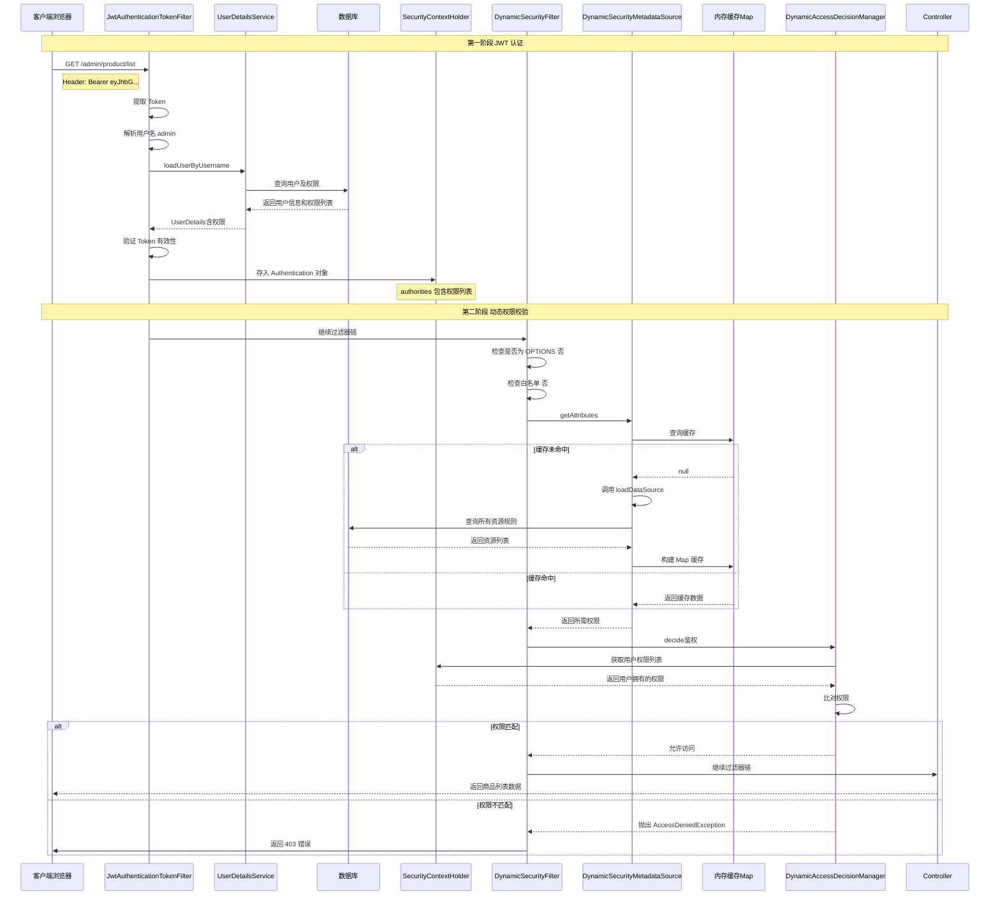

### 5.2 详细步骤解析

#### 步骤 1：JWT 认证（JwtAuthenticationTokenFilter）

**输入：** HTTP 请求头中的 Token
**输出：** `SecurityContext` 中存储的认证信息

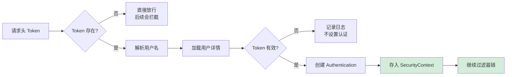

**关键代码：**
```java
// 从 SecurityContext 中获取当前用户权限
Authentication authentication = SecurityContextHolder.getContext().getAuthentication();
Collection<? extends GrantedAuthority> authorities = authentication.getAuthorities();
// 例如：["1:pms:product:read", "2:pms:product:create", ...]
```

---

#### 步骤 2：路径匹配（DynamicSecurityMetadataSource）

**输入：** 当前请求的 URL 路径
**输出：** 该路径所需的权限集合

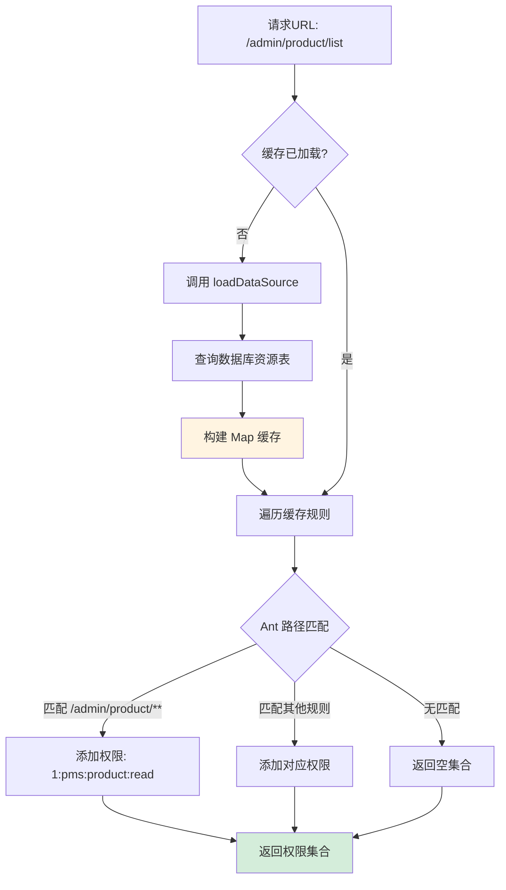

**Ant 路径匹配规则：**
- `?` 匹配单个字符：`/admin/product/?` 匹配 `/admin/product/1`
- `*` 匹配零个或多个字符：`/admin/product/*` 匹配 `/admin/product/list`
- `**` 匹配零个或多个目录：`/admin/**` 匹配 `/admin/product/list`

**示例：**
```java
// 数据库中的规则
{
    "/admin/product/**": "1:pms:product:read",
    "/admin/order/**": "2:pms:order:read",
    "/admin/**": "3:admin:access"
}

// 请求: /admin/product/list
// 匹配结果: ["1:pms:product:read"]  （最精确匹配）
```

---

#### 步骤 3：权限决策（DynamicAccessDecisionManager）

**输入：** 
- 用户拥有的权限列表（来自 SecurityContext）
- 路径所需的权限集合（来自 MetadataSource）

**输出：** 允许访问或抛出异常

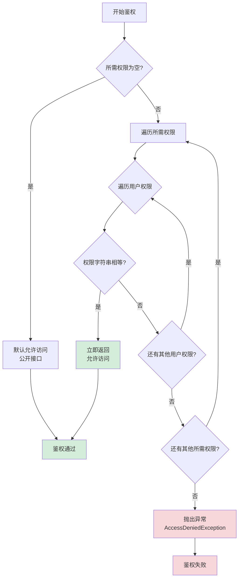

**决策策略说明：**

| 策略类型 | 说明 | 适用场景 |
|---------|------|----------|
| **任一匹配（OR）** | 用户拥有任一所需权限即可 | ✅ mall 项目采用此策略 |
| **全部匹配（AND）** | 用户必须拥有所有所需权限 | 高安全等级场景 |
| **加权决策** | 根据权限权重综合判断 | 复杂业务场景 |

**mall 项目采用的是“任一匹配”策略，代码体现：**
```java
// 只要找到一个匹配的权限就立即返回
for (GrantedAuthority grantedAuthority : authentication.getAuthorities()) {
    if (needAuthority.trim().equals(grantedAuthority.getAuthority())) {
        return;  // 找到匹配，允许访问
    }
}
```

---

### 5.3 关键源码调用链深度解析

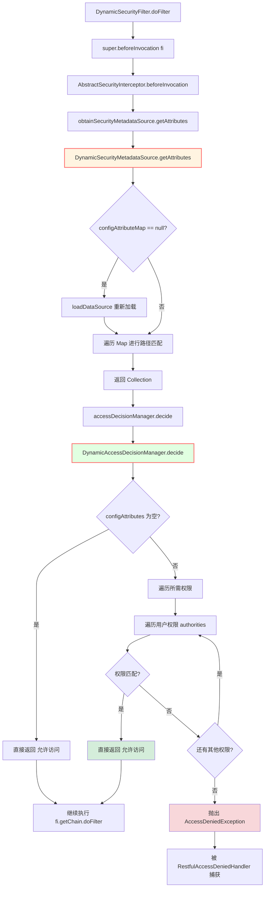

**调用链关键点：**

1. **beforeInvocation() 方法：** Spring Security 提供的模板方法，封装了鉴权流程
   - 先调用 `SecurityMetadataSource` 获取所需权限
   - 再调用 `AccessDecisionManager` 进行决策
   - 如果决策失败，抛出异常并中断请求

2. **异常处理机制：**
   ```java
   try {
       InterceptorStatusToken token = super.beforeInvocation(fi);
       try {
           fi.getChain().doFilter(fi.getRequest(), fi.getResponse());
       } finally {
           super.afterInvocation(token, null);
       }
   } catch (AccessDeniedException e) {
       // 被 RestfulAccessDeniedHandler 捕获
       // 返回 403 Forbidden 响应
   }
   ```

3. **afterInvocation() 方法：** 在目标方法执行后调用，可用于后置权限检查（mall 项目中传入 null，未使用）

---

## 六、集成步骤

### 6.1 四步快速集成 Spring Security

以 `mall-portal` 模块为例：

#### 第一步：添加依赖

在模块的 `pom.xml` 中添加 `mall-security` 依赖：

```xml
<dependency>
    <groupId>com.macro.mall</groupId>
    <artifactId>mall-security</artifactId>
    <version>${project.version}</version>
</dependency>
```

#### 第二步：配置 UserDetailsService

创建安全配置类，提供 `UserDetailsService` Bean：

```java
@Configuration
public class MallSecurityConfig {
    
    @Autowired
    private UmsMemberService memberService;
    
    @Bean
    public UserDetailsService userDetailsService() {
        // 根据用户名加载用户详情（包含权限列表）
        return username -> memberService.loadUserByUsername(username);
    }
}
```

**UserDetailsService 实现示例：**

```java
@Override
public UserDetails loadUserByUsername(String username) {
    // 1. 从数据库查询用户
    UmsMember member = getMemberByUsername(username);
    if (member == null) {
        throw new UsernameNotFoundException("用户不存在");
    }
    
    // 2. 查询用户拥有的权限列表
    List<UmsPermission> permissionList = getPermissionList(member.getId());
    
    // 3. 转换为 Spring Security 的 GrantedAuthority 格式
    List<GrantedAuthority> authorities = permissionList.stream()
        .map(permission -> new SimpleGrantedAuthority(
            permission.getId() + ":" + permission.getName()
        ))
        .collect(Collectors.toList());
    
    // 4. 返回 UserDetails 对象
    return new User(
        member.getUsername(),
        member.getPassword(),
        authorities
    );
}
```

#### 第三步：配置白名单路径

在 `application.yml` 中配置不需要安全保护的资源：

```yaml
secure:
  ignored:
    urls:
      - /api/member/login      # 登录接口
      - /api/member/register   # 注册接口
      - /api/product/list      # 商品列表（公开）
      - /actuator/**           # 监控端点
```

#### 第四步：实现登录接口

在 Controller 中实现登录和刷新 Token 的接口：

```java
@RestController
@RequestMapping("/api/member")
public class UmsMemberController {
    
    @Autowired
    private UmsMemberService memberService;
    
    @PostMapping("/login")
    public CommonResult login(@RequestBody MemberLoginParam param) {
        String token = memberService.login(param.getUsername(), param.getPassword());
        if (token == null) {
            return CommonResult.validateFailed("用户名或密码错误");
        }
        return CommonResult.success(Map.of("token", token, "tokenHead", "Bearer "));
    }
    
    @PostMapping("/refreshToken")
    public CommonResult refreshToken(@RequestParam String oldToken) {
        String newToken = memberService.refreshToken(oldToken);
        if (newToken == null) {
            return CommonResult.failed("Token 已过期");
        }
        return CommonResult.success(Map.of("token", newToken));
    }
}
```

---

### 6.2 启用动态权限控制（可选）

如果需要动态权限功能，还需额外配置 `DynamicSecurityService`：

```java
@Configuration
public class MallSecurityConfig {
    
    @Autowired
    private UmsAdminService adminService;
    
    @Autowired
    private UmsResourceService resourceService;
    
    @Bean
    public UserDetailsService userDetailsService() {
        return username -> adminService.loadUserByUsername(username);
    }
    
    @Bean
    public DynamicSecurityService dynamicSecurityService() {
        return new DynamicSecurityService() {
            @Override
            public Map<String, ConfigAttribute> loadDataSource() {
                Map<String, ConfigAttribute> map = new ConcurrentHashMap<>();
                List<UmsResource> resourceList = resourceService.listAll();
                
                for (UmsResource resource : resourceList) {
                    map.put(resource.getUrl(), 
                        new SecurityConfig(resource.getId() + ":" + resource.getName()));
                }
                
                return map;
            }
        };
    }
}
```

**关键说明：**
- `@ConditionalOnBean(name = "dynamicSecurityService")` 注解确保只有在定义了 `DynamicSecurityService` Bean 时，才会创建动态权限相关的过滤器和数据源
- 这使得模块可以选择性地启用或禁用动态权限功能

---

### 6.3 资源变更时清空缓存

在资源管理 Controller 中注入 `DynamicSecurityMetadataSource`，修改资源后清空缓存：

```java
@RestController
@RequestMapping("/admin/resource")
public class UmsResourceController {
    
    @Autowired
    private UmsResourceService resourceService;
    
    @Autowired
    private DynamicSecurityMetadataSource dynamicSecurityMetadataSource;
    
    @PostMapping("/create")
    public CommonResult create(@RequestBody UmsResource resource) {
        int count = resourceService.create(resource);
        if (count > 0) {
            // 清空权限缓存，下次请求时重新加载
            dynamicSecurityMetadataSource.clearDataSource();
            return CommonResult.success();
        }
        return CommonResult.failed();
    }
    
    @PostMapping("/update/{id}")
    public CommonResult update(@PathVariable Long id, @RequestBody UmsResource resource) {
        int count = resourceService.update(id, resource);
        if (count > 0) {
            dynamicSecurityMetadataSource.clearDataSource();
            return CommonResult.success();
        }
        return CommonResult.failed();
    }
}
```

---

## 七、数据库设计与缓存原理

### 7.1 权限相关数据表设计

mall 项目采用经典的 **RBAC（Role-Based Access Control）基于角色的访问控制** 模型。

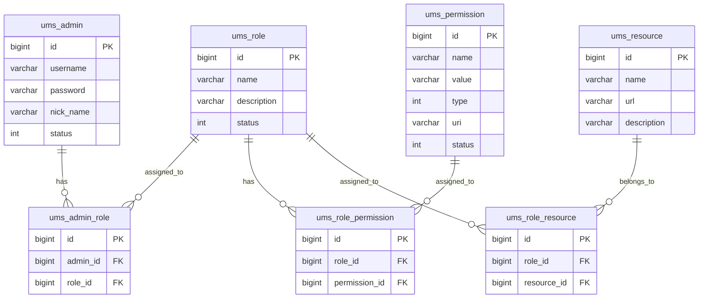

**表关系说明：**

| 关系 | 说明 |
|------|------|
| 用户 - 角色 | 多对多：一个用户可以有多个角色，一个角色可以分配给多个用户 |
| 角色 - 权限 | 多对多：一个角色可以有多个权限，一个权限可以属于多个角色 |
| 角色 - 资源 | 多对多：一个角色可以访问多个资源，一个资源可以被多个角色访问 |

---

### 7.2 权限加载流程详解

#### （1）用户登录时加载权限

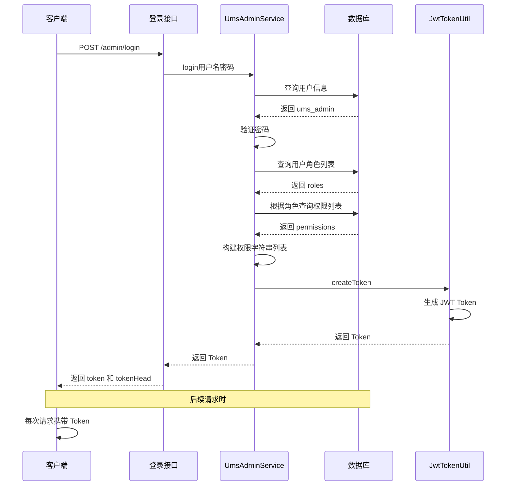

**关键点：**
- 登录时生成的 JWT Token **不包含权限信息**（只包含用户名和过期时间）
- 每次请求时，`JwtAuthenticationTokenFilter` 都会调用 `UserDetailsService` 重新从数据库加载用户权限
- 这样可以确保权限变更后立即生效（无需等待 Token 过期）

---

#### （2）资源规则加载到内存缓存

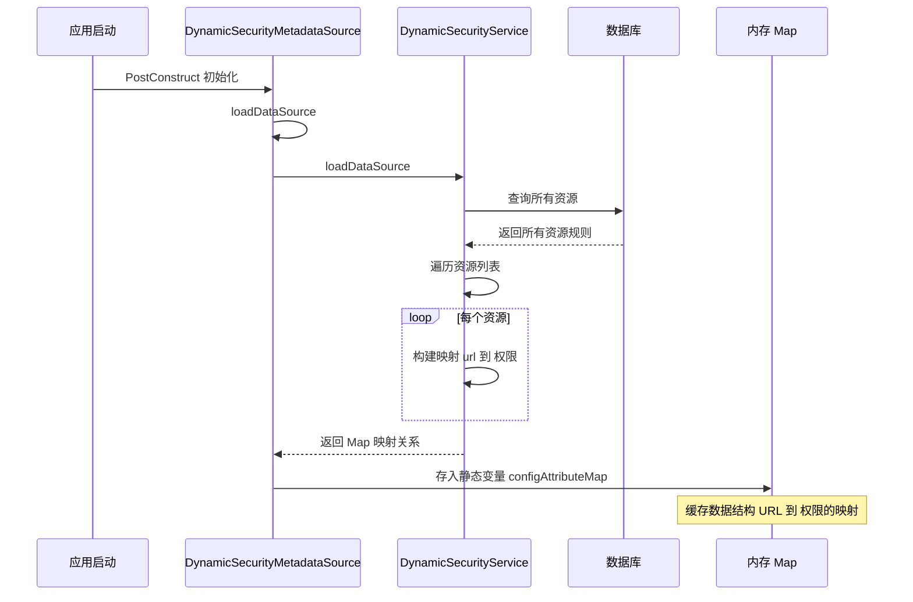

**缓存更新机制：**

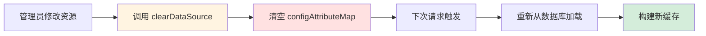

---

### 7.3 缓存一致性策略

#### 单机部署方案

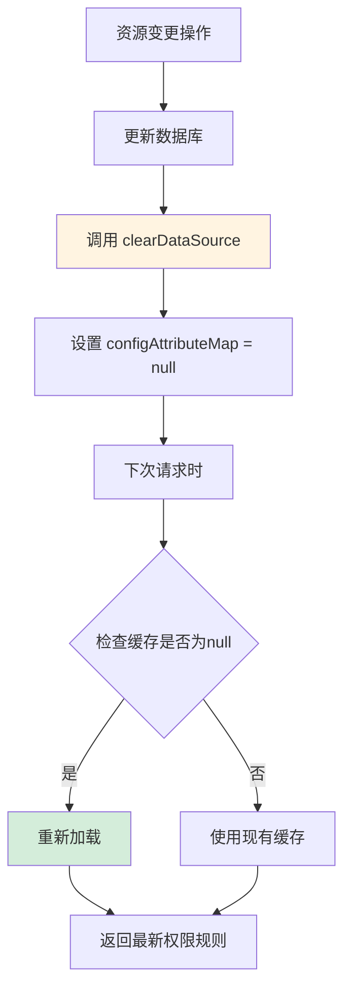

**优点：** 实现简单，适合单体应用  
**缺点：** 多实例部署时会出现数据不一致

#### 集群部署方案（建议）

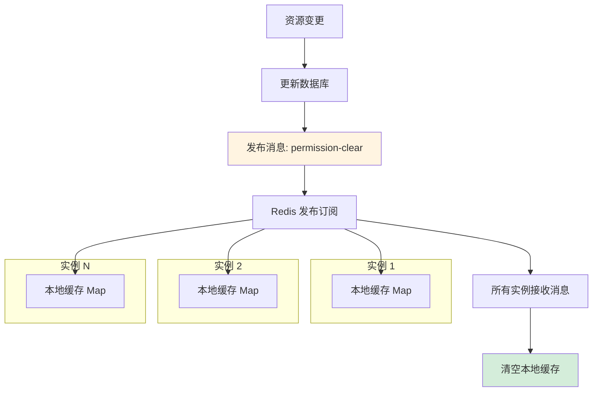

**实现思路：**
```java
@Autowired
private RedisTemplate redisTemplate;

public void clearDataSource() {
    // 1. 清空本地缓存
    configAttributeMap.clear();
    configAttributeMap = null;
    
    // 2. 发布消息通知其他实例
    redisTemplate.convertAndSend("permission:clear", "all");
}

// 监听消息
@RedisListener(channels = "permission:clear")
public void handleClearMessage(String message) {
    clearDataSource();
}
```

---

## 八、关键问题与解决方案

### 7.1 跨域问题

**问题描述：** 当前端跨域访问没有权限的接口时，浏览器会报跨域错误。

**原因：** `RestfulAccessDeniedHandler` 返回的响应中缺少跨域相关的响应头。

**解决方案：** 在自定义的无权限访问处理类中添加允许跨域的响应头：

```java
@Component
public class RestfulAccessDeniedHandler implements AccessDeniedHandler {
    
    @Override
    public void handle(HttpServletRequest request,
                       HttpServletResponse response,
                       AccessDeniedException e) throws IOException, ServletException {
        response.setCharacterEncoding("UTF-8");
        response.setContentType("application/json");
        
        // 添加跨域响应头
        response.setHeader("Access-Control-Allow-Origin", "*");
        response.setHeader("Access-Control-Allow-Methods", "*");
        response.setHeader("Access-Control-Allow-Headers", "*");
        
        response.getWriter().println(
            JsonUtil.objectToJson(CommonResult.forbidden(e.getMessage()))
        );
        response.getWriter().flush();
    }
}
```

---

### 7.2 缓存一致性问题

**问题：** 权限规则缓存在内存中，多实例部署时可能出现数据不一致。

**解决方案：**

1. **单机部署：** 使用当前的内存缓存方案即可，修改资源后调用 `clearDataSource()` 清空缓存

2. **集群部署：** 建议使用 Redis 缓存权限规则，并使用发布订阅机制通知所有实例清空本地缓存

```java
// 伪代码示例
@Autowired
private RedisTemplate redisTemplate;

public void clearDataSource() {
    // 1. 清空本地缓存
    configAttributeMap.clear();
    configAttributeMap = null;
    
    // 2. 发布消息通知其他实例清空缓存
    redisTemplate.convertAndSend("permission:clear", "all");
}
```

---

### 7.3 性能优化建议

1. **缓存预热：** 应用启动时立即加载权限规则，避免首次请求时的延迟

2. **数据库索引：** 为资源表的 `url` 字段添加索引，加速查询

3. **减少数据库查询：** 仅在资源变更时重新加载，平时直接使用内存缓存

4. **合理设置白名单：** 将高频访问的公开接口加入白名单，避免不必要的权限校验

---

## 八、关键问题与解决方案

### 8.1 跨域问题

**问题描述：** 当前端跨域访问没有权限的接口时，浏览器会报跨域错误。

**原因：** `RestfulAccessDeniedHandler` 返回的响应中缺少跨域相关的响应头。

**解决方案：** 在自定义的无权限访问处理类中添加允许跨域的响应头：

```java
@Component
public class RestfulAccessDeniedHandler implements AccessDeniedHandler {
    
    @Override
    public void handle(HttpServletRequest request,
                       HttpServletResponse response,
                       AccessDeniedException e) throws IOException, ServletException {
        response.setCharacterEncoding("UTF-8");
        response.setContentType("application/json");
        
        // 添加跨域响应头
        response.setHeader("Access-Control-Allow-Origin", "*");
        response.setHeader("Access-Control-Allow-Methods", "*");
        response.setHeader("Access-Control-Allow-Headers", "*");
        
        response.getWriter().println(
            JsonUtil.objectToJson(CommonResult.forbidden(e.getMessage()))
        );
        response.getWriter().flush();
    }
}
```

---

### 8.2 缓存一致性问题

**问题：** 权限规则缓存在内存中，多实例部署时可能出现数据不一致。

**解决方案：**

1. **单机部署：** 使用当前的内存缓存方案即可，修改资源后调用 `clearDataSource()` 清空缓存

2. **集群部署：** 建议使用 Redis 缓存权限规则，并使用发布订阅机制通知所有实例清空本地缓存

```java
// 伪代码示例
@Autowired
private RedisTemplate redisTemplate;

public void clearDataSource() {
    // 1. 清空本地缓存
    configAttributeMap.clear();
    configAttributeMap = null;
    
    // 2. 发布消息通知其他实例清空缓存
    redisTemplate.convertAndSend("permission:clear", "all");
}
```

---

### 8.3 性能优化建议

1. **缓存预热：** 应用启动时立即加载权限规则，避免首次请求时的延迟

2. **数据库索引：** 为资源表的 `url` 字段添加索引，加速查询

3. **减少数据库查询：** 仅在资源变更时重新加载，平时直接使用内存缓存

4. **合理设置白名单：** 将高频访问的公开接口加入白名单，避免不必要的权限校验

---

## 九、总结与最佳实践

### 9.1 核心要点回顾

#### （1）动态权限的本质

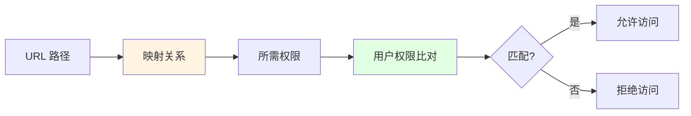

**核心理念：** 建立 URL 路径到权限规则的映射关系，运行时动态比对

#### （2）三大核心组件

| 组件 | 职责 | 设计模式 |
|------|------|----------|
| `DynamicSecurityMetadataSource` | 提供路径所需权限 | 数据源模式 |
| `DynamicAccessDecisionManager` | 决策是否有访问权限 | 策略模式 |
| `DynamicSecurityFilter` | 触发鉴权流程 | 过滤器模式 |

#### （3）关键设计模式

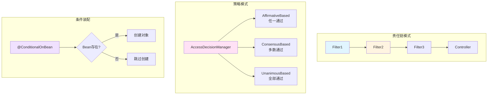

1. **责任链模式：** 过滤器链依次处理请求
2. **策略模式：** 不同的 AccessDecisionManager 实现不同的决策策略
3. **条件装配：** `@ConditionalOnBean` 实现功能的可选启用

---

### 9.2 注意事项清单

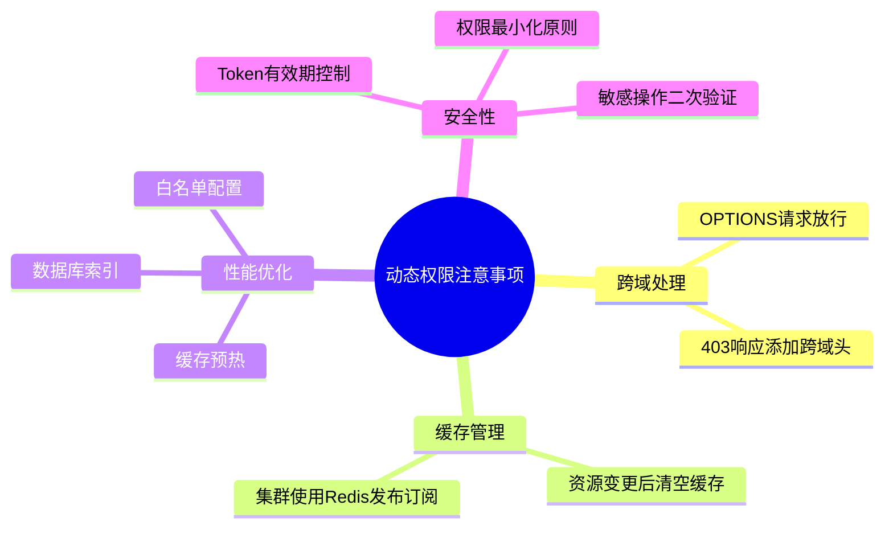

**检查清单：**
- [ ] OPTIONS 请求必须放行（解决跨域）
- [ ] 资源变更后需清空缓存
- [ ] 无权限响应需添加跨域响应头
- [ ] 生产环境启用 HTTPS
- [ ] 定期审计权限配置
- [ ] 监控鉴权失败日志

---

### 9.3 适用场景分析

#### ✅ 适合使用动态权限的场景

| 场景 | 说明 | 优势 |
|------|------|------|
| **后台管理系统** | 权限频繁调整 | 无需重新部署 |
| **多租户 SaaS 平台** | 不同租户权限不同 | 灵活配置 |
| **微服务架构** | 集中式权限管理 | 统一控制 |
| **大型电商平台** | 角色复杂多变 | 易于维护 |

#### ❌ 不适合的场景

| 场景 | 原因 | 替代方案 |
|------|------|----------|
| **简单的 CRUD 应用** | 过度设计 | 直接用 `@PreAuthorize` 注解 |
| **对性能要求极高** | 每次请求都需要权限比对 | 使用静态权限 + 缓存 |
| **权限几乎不变** | 动态性优势无法体现 | 硬编码权限 |

---

### 9.4 最佳实践建议

#### （1）数据库设计优化

```sql
-- 为资源表的 url 字段添加索引
CREATE INDEX idx_resource_url ON ums_resource(url);

-- 为角色资源关联表添加联合索引
CREATE INDEX idx_role_resource ON ums_role_resource(role_id, resource_id);
```

#### （2）缓存策略优化

```java
// 应用启动时预热缓存
@PostConstruct
public void warmUpCache() {
    log.info("开始预热权限缓存...");
    loadDataSource();
    log.info("权限缓存预热完成，共加载 {} 条规则", configAttributeMap.size());
}
```

#### （3）监控与告警

```java
// 记录鉴权失败的日志
@Slf4j
@Component
public class AuthFailureListener implements ApplicationListener<AuthorizationFailureEvent> {
    @Override
    public void onApplicationEvent(AuthorizationFailureEvent event) {
        log.warn("鉴权失败 - 用户: {}, 路径: {}, 所需权限: {}",
            event.getAuthentication().getName(),
            event.getRequestUrl(),
            event.getConfigAttributes()
        );
    }
}
```

#### （4）单元测试示例

```java
@SpringBootTest
@AutoConfigureMockMvc
class DynamicPermissionTest {
    
    @Autowired
    private MockMvc mockMvc;
    
    @Test
    void testAccessWithValidPermission() throws Exception {
        String token = getAdminToken(); // 获取有权限的 Token
        
        mockMvc.perform(get("/admin/product/list")
                .header("Authorization", "Bearer " + token))
                .andExpect(status().isOk());
    }
    
    @Test
    void testAccessWithoutPermission() throws Exception {
        String token = getUserToken(); // 获取无权限的 Token
        
        mockMvc.perform(get("/admin/product/list")
                .header("Authorization", "Bearer " + token))
                .andExpect(status().isForbidden());
    }
}
```

---

## 附录：mall-security 模块代码结构

```
mall-security/
├── annotation/
│   └── CacheException.java              # 自定义缓存异常注解
├── aspect/
│   └── RedisCacheAspect.java            # Redis 缓存切面
├── component/
│   ├── DynamicAccessDecisionManager.java    # 动态权限决策管理器 ⭐
│   ├── DynamicSecurityFilter.java           # 动态权限过滤器 ⭐
│   ├── DynamicSecurityMetadataSource.java   # 动态权限数据源 ⭐
│   ├── DynamicSecurityService.java          # 动态权限业务接口 ⭐
│   ├── JwtAuthenticationTokenFilter.java    # JWT 认证过滤器
│   ├── RestAuthenticationEntryPoint.java    # 未登录/Token 失效处理
│   └── RestfulAccessDeniedHandler.java      # 无权限访问处理
├── config/
│   ├── CommonSecurityConfig.java            # 通用配置（Bean 定义）
│   ├── IgnoreUrlsConfig.java                # 白名单配置
│   ├── RedisConfig.java                     # Redis 配置
│   └── SecurityConfig.java                  # Security 核心配置 ⭐
└── util/
    ├── JwtTokenUtil.java                    # JWT 工具类
    └── SpringUtil.java                      # Spring 工具类
```

**标注 ⭐ 的为动态权限控制的核心组件。**

---

## 参考文献

1. Spring Security 官方文档: https://spring.io/projects/spring-security
2. RBAC 权限模型详解: https://en.wikipedia.org/wiki/Role-based_access_control
3. Spring Security 过滤器链机制: https://docs.spring.io/spring-security/reference/servlet/architecture.html
4. JWT 认证最佳实践: https://jwt.io/introduction

---

**文档版本：** v2.0  
**最后更新：** 2026-04-19  
**适用项目：** mall 电商系统  
**作者：** Lingma AI Assistant  
**许可证：** MIT
