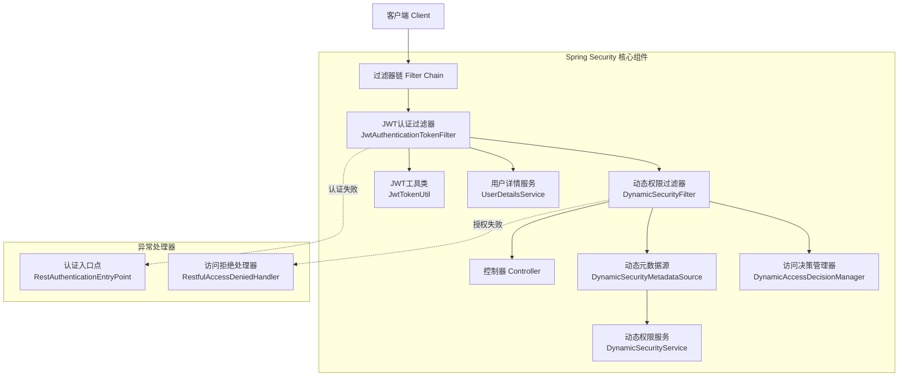
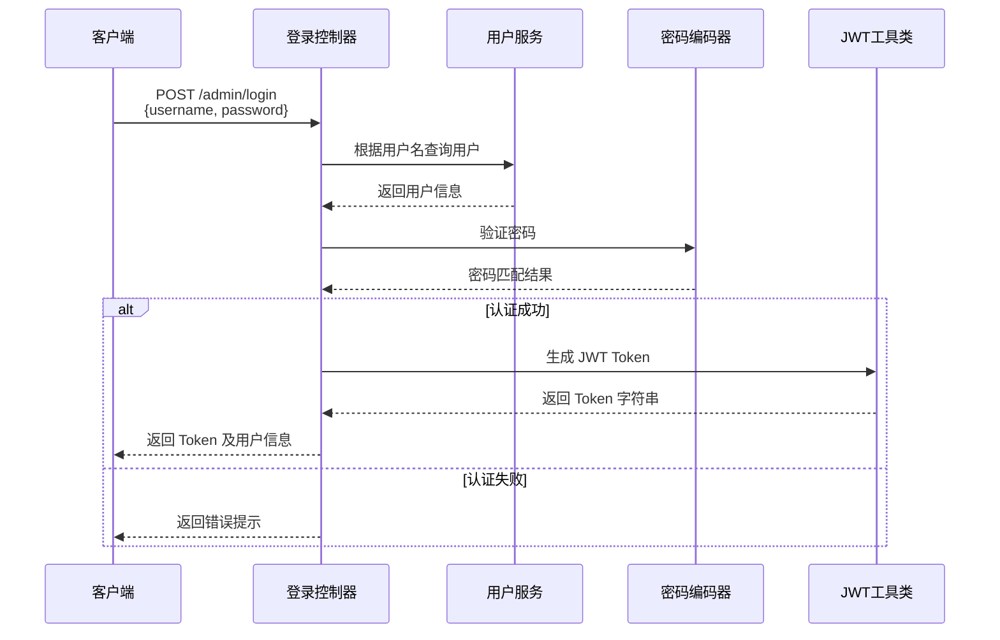
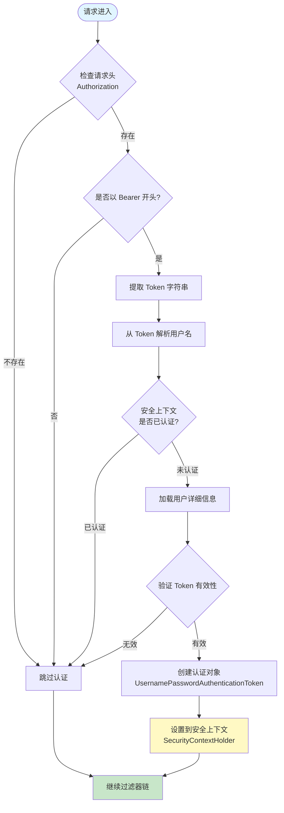
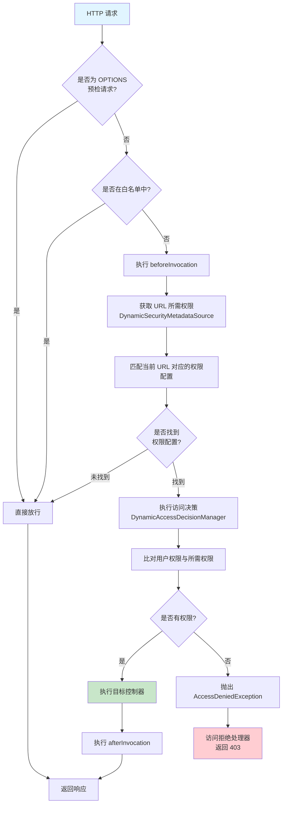
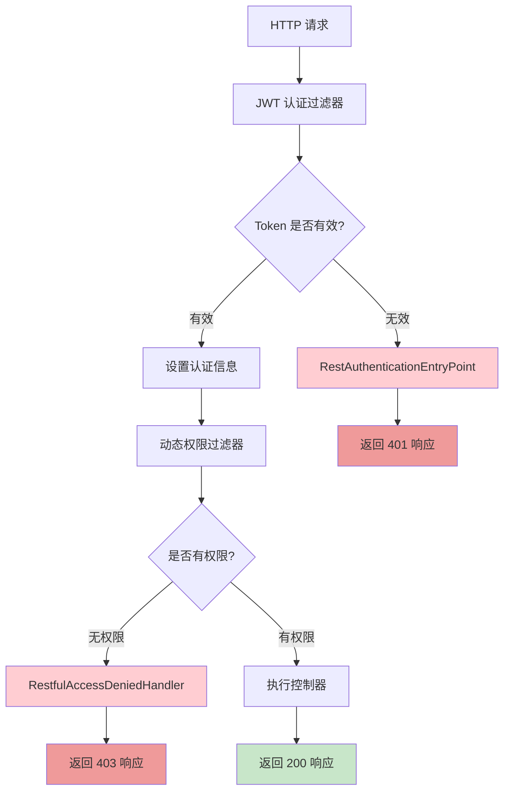
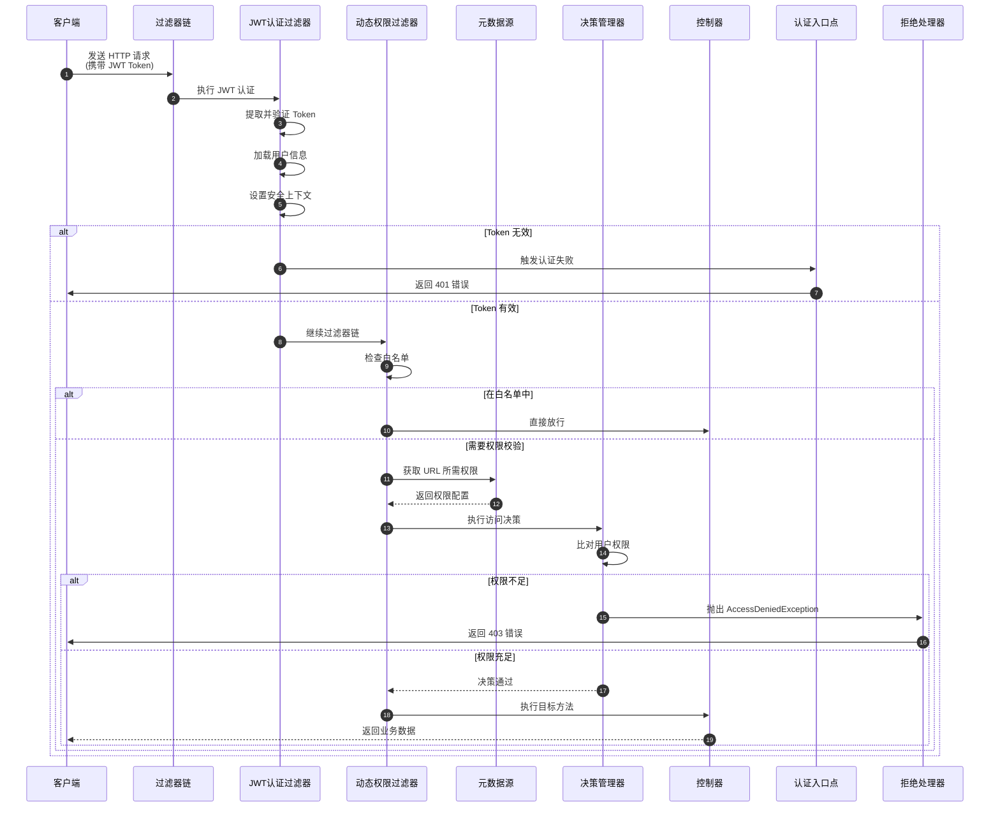
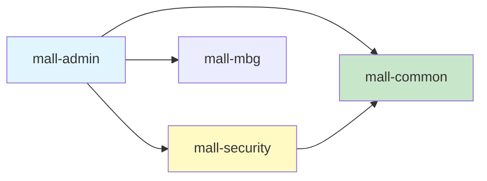
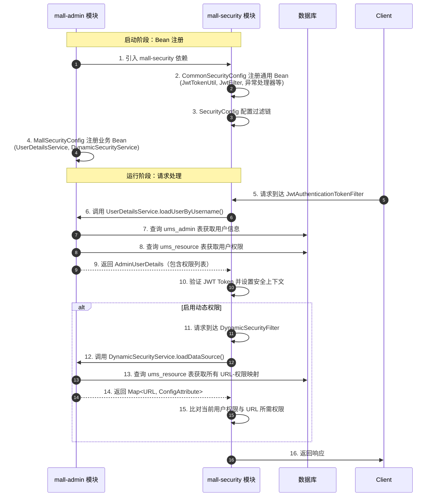

# Mall 项目 Spring Security 认证与授权流程详解

## 📋 目录

- [1. 概述](#1-概述)
- [2. 核心组件架构](#2-核心组件架构)
- [3. 认证流程 (Authentication)](#3-认证流程-authentication)
- [4. 授权流程 (Authorization)](#4-授权流程-authorization)
- [5. 动态权限控制](#5-动态权限控制)
- [6. 异常处理机制](#6-异常处理机制)
- [7. 完整请求流程图](#7-完整请求流程图)
- [8. 配置说明](#8-配置说明)

---

## 1. 概述

本项目采用 **JWT (JSON Web Token)** + **Spring Security** 实现无状态的身份认证与基于角色的访问控制 **(RBAC, Role-Based Access Control)**。系统支持静态权限配置和动态权限配置两种模式。

### 1.1 技术特点

- **无状态认证 (Stateless Authentication)**: 使用 JWT 令牌，服务端不保存会话状态
- **双重过滤机制**: JWT 认证过滤器 + 动态权限过滤器
- **灵活的权限控制**: 支持白名单配置、静态角色校验、动态 URL 权限映射
- **统一的异常处理**: 自定义认证失败和授权失败的响应格式

---

## 2. 核心组件架构

### 2.1 组件关系图



### 2.2 核心组件清单

| 组件名称 | 类型 | 职责说明 |
|---------|------|---------|
| **SecurityConfig** | 配置类 | 配置安全过滤链、注册过滤器、定义白名单 |
| **JwtAuthenticationTokenFilter** | 过滤器 | 解析 JWT 令牌，验证用户身份，设置安全上下文 |
| **JwtTokenUtil** | 工具类 | JWT 令牌的生成、解析、验证 |
| **DynamicSecurityFilter** | 过滤器 | 动态权限校验，拦截未授权的资源访问 |
| **DynamicSecurityMetadataSource** | 元数据源 | 加载 URL 与权限的映射关系 |
| **DynamicAccessDecisionManager** | 决策管理器 | 判断用户是否拥有访问资源的权限 |
| **RestAuthenticationEntryPoint** | 异常处理器 | 处理认证失败（401 未授权） |
| **RestfulAccessDeniedHandler** | 异常处理器 | 处理授权失败（403 禁止访问） |
| **IgnoreUrlsConfig** | 配置类 | 管理不需要认证的白名单 URL |

---

## 3. 认证流程 (Authentication)

### 3.1 用户登录获取 Token



### 3.2 JWT 认证过滤器工作流程



### 3.3 代码执行流程详解

#### 步骤 1: 提取 JWT 令牌

```java
// 从请求头中获取 Authorization 字段
String authHeader = request.getHeader("Authorization");

// 检查是否存在且格式正确（Bearer xxxxx.yyyyy.zzzzz）
if (authHeader != null && authHeader.startsWith("Bearer ")) {
    // 去除 "Bearer " 前缀，获取纯 Token 字符串
    String authToken = authHeader.substring(7);
}
```

#### 步骤 2: 解析用户名

```java
// 使用 JwtTokenUtil 从 Token 中提取用户名（subject 字段）
String username = jwtTokenUtil.getUserNameFromToken(authToken);
```

#### 步骤 3: 加载用户信息

```java
// 调用 UserDetailsService 根据用户名查询数据库
// 返回包含用户名、密码、权限列表的 UserDetails 对象
UserDetails userDetails = userDetailsService.loadUserByUsername(username);
```

#### 步骤 4: 验证 Token 有效性

```java
// 验证内容包括：
// 1. Token 签名是否正确
// 2. Token 是否过期
// 3. Token 中的用户名是否与数据库一致
if (jwtTokenUtil.validateToken(authToken, userDetails)) {
    // 验证通过
}
```

#### 步骤 5: 设置安全上下文

```java
// 创建认证令牌对象
UsernamePasswordAuthenticationToken authentication = 
    new UsernamePasswordAuthenticationToken(
        userDetails,           // 主体（用户信息）
        null,                  // 凭证（无需密码）
        userDetails.getAuthorities()  // 权限列表
    );

// 设置请求详情（IP地址、会话ID等）
authentication.setDetails(
    new WebAuthenticationDetailsSource().buildDetails(request)
);

// 存入 Spring Security 上下文，后续可通过以下代码获取：
// SecurityContextHolder.getContext().getAuthentication()
SecurityContextHolder.getContext().setAuthentication(authentication);
```

---

## 4. 授权流程 (Authorization)

### 4.1 静态权限校验

在未启用动态权限时，Spring Security 使用默认的基于表达式的权限校验：

```java
// SecurityConfig 中的配置
registry.antMatchers("/admin/**").hasRole("ADMIN")
      .antMatchers("/user/**").hasAnyRole("USER", "ADMIN")
      .anyRequest().authenticated();
```

### 4.2 动态权限校验流程



### 4.3 动态权限三大核心组件

#### 4.3.1 DynamicSecurityMetadataSource - 元数据源

**职责**: 提供 URL 与所需权限的映射关系

```java
@Override
public Collection<ConfigAttribute> getAttributes(Object o) {
    // 1. 获取当前请求的 URL
    String url = ((FilterInvocation) o).getRequestUrl();
    
    // 2. 从缓存的 Map 中查找匹配的 URL 模式
    for (Map.Entry<String, ConfigAttribute> entry : configAttributeMap.entrySet()) {
        if (pathMatcher.match(entry.getKey(), url)) {
            // 3. 返回该 URL 所需的权限配置（如：ROLE_ADMIN）
            return Collections.singletonList(entry.getValue());
        }
    }
    
    // 未找到配置，返回空集合表示无需特殊权限
    return null;
}
```

**数据来源**:

```java
@PostConstruct
public void loadDataSource() {
    // 从数据库或配置文件加载权限规则
    // 示例数据结构：
    // {
    //   "/admin/brand/**": new SecurityConfig("ROLE_ADMIN"),
    //   "/admin/product/**": new SecurityConfig("ROLE_PRODUCT_MANAGER")
    // }
    configAttributeMap = dynamicSecurityService.loadDataSource();
}
```

#### 4.3.2 DynamicAccessDecisionManager - 访问决策管理器

**职责**: 判断用户是否拥有访问资源所需的权限

```java
@Override
public void decide(Authentication authentication, Object object,
                   Collection<ConfigAttribute> configAttributes) {
    // 1. 如果接口未配置权限要求，直接放行
    if (CollUtil.isEmpty(configAttributes)) {
        return;
    }
    
    // 2. 遍历所需权限
    for (ConfigAttribute configAttribute : configAttributes) {
        String needAuthority = configAttribute.getAttribute(); // 如："ROLE_ADMIN"
        
        // 3. 检查用户拥有的权限列表中是否包含所需权限
        for (GrantedAuthority grantedAuthority : authentication.getAuthorities()) {
            if (needAuthority.equals(grantedAuthority.getAuthority())) {
                return; // 权限匹配，允许访问
            }
        }
    }
    
    // 4. 所有权限都不匹配，抛出异常
    throw new AccessDeniedException("抱歉，您没有访问权限");
}
```

#### 4.3.3 DynamicSecurityFilter - 动态权限过滤器

**职责**: 拦截请求并触发权限校验

```java
@Override
public void doFilter(ServletRequest request, ServletResponse response, 
                     FilterChain filterChain) {
    HttpServletRequest httpRequest = (HttpServletRequest) request;
    FilterInvocation fi = new FilterInvocation(request, response, filterChain);
    
    // 1. 放行 OPTIONS 请求（CORS 预检）
    if (httpRequest.getMethod().equals(HttpMethod.OPTIONS.toString())) {
        fi.getChain().doFilter(fi.getRequest(), fi.getResponse());
        return;
    }
    
    // 2. 放行白名单请求
    for (String path : ignoreUrlsConfig.getUrls()) {
        if (pathMatcher.match(path, httpRequest.getRequestURI())) {
            fi.getChain().doFilter(fi.getRequest(), fi.getResponse());
            return;
        }
    }
    
    // 3. 执行权限校验
    InterceptorStatusToken token = super.beforeInvocation(fi);
    try {
        // 4. 权限校验通过，继续执行
        fi.getChain().doFilter(fi.getRequest(), fi.getResponse());
    } finally {
        // 5. 清理工作
        super.afterInvocation(token, null);
    }
}
```

---

## 5. 动态权限控制

### 5.1 动态权限 vs 静态权限

| 特性 | 静态权限 | 动态权限 |
|-----|---------|---------|
| **配置方式** | 代码中硬编码 `antMatchers` | 数据库存储 URL-权限映射 |
| **修改灵活性** | 需重新编译部署 | 运行时动态加载，无需重启 |
| **适用场景** | 权限规则固定不变 | 权限规则频繁调整 |
| **性能** | 略高（无需查询数据库） | 略低（首次加载需查询） |
| **复杂度** | 简单 | 较复杂 |

### 5.2 动态权限启用条件

```java
// SecurityConfig.java
@Autowired(required = false)
private DynamicSecurityService dynamicSecurityService;

@Autowired(required = false)
private DynamicSecurityFilter dynamicSecurityFilter;

// 只有当 DynamicSecurityService Bean 存在时才添加动态权限过滤器
if (dynamicSecurityService != null) {
    registry.and().addFilterBefore(dynamicSecurityFilter, 
                                   FilterSecurityInterceptor.class);
}
```

**启用步骤**:

1. 实现 `DynamicSecurityService` 接口
2. 在 Spring 容器中注册为 Bean
3. 从数据库加载权限配置并返回 Map 结构

### 5.3 数据库表设计示例

```sql
-- 资源表（URL 与权限标识的映射）
CREATE TABLE ums_resource (
    id BIGINT PRIMARY KEY AUTO_INCREMENT,
    name VARCHAR(200) COMMENT '资源名称',
    url VARCHAR(500) COMMENT '资源路径',
    description VARCHAR(500) COMMENT '描述'
);

-- 角色表
CREATE TABLE ums_role (
    id BIGINT PRIMARY KEY AUTO_INCREMENT,
    name VARCHAR(100) COMMENT '角色名称',
    description VARCHAR(500) COMMENT '描述'
);

-- 角色资源关联表
CREATE TABLE ums_role_resource_relation (
    id BIGINT PRIMARY KEY AUTO_INCREMENT,
    role_id BIGINT COMMENT '角色ID',
    resource_id BIGINT COMMENT '资源ID'
);

-- 用户角色关联表
CREATE TABLE ums_admin_role_relation (
    id BIGINT PRIMARY KEY AUTO_INCREMENT,
    admin_id BIGINT COMMENT '管理员ID',
    role_id BIGINT COMMENT '角色ID'
);
```

### 5.4 权限数据加载示例

```java
@Service
public class UmsAdminServiceImpl implements DynamicSecurityService {
    
    @Autowired
    private UmsResourceMapper resourceMapper;
    
    @Override
    public Map<String, ConfigAttribute> loadDataSource() {
        Map<String, ConfigAttribute> map = new HashMap<>();
        
        // 查询所有资源及其对应的角色
        List<UmsResource> resources = resourceMapper.selectAllWithRoles();
        
        for (UmsResource resource : resources) {
            // 构建权限标识，如：ROLE_ADMIN, ROLE_PRODUCT_MANAGER
            String authority = "ROLE_" + resource.getRoleCode();
            ConfigAttribute configAttribute = new SecurityConfig(authority);
            
            // 存入 Map，key 为 URL 模式，value 为所需权限
            map.put(resource.getUrl(), configAttribute);
        }
        
        return map;
    }
}
```

---

## 6. 异常处理机制

### 6.1 认证失败处理 (401 Unauthorized)

**触发场景**:
- 请求头中缺少 `Authorization` 字段
- JWT 令牌已过期
- JWT 令牌签名无效或被篡改
- 令牌格式不正确

**处理组件**: `RestAuthenticationEntryPoint`

```java
@Override
public void commence(HttpServletRequest request, HttpServletResponse response, 
                     AuthenticationException authException) {
    // 设置响应头
    response.setHeader("Access-Control-Allow-Origin", "*");
    response.setHeader("Cache-Control", "no-cache");
    response.setCharacterEncoding("UTF-8");
    response.setContentType("application/json");
    
    // 返回统一的 JSON 格式错误响应
    response.getWriter().println(
        JSONUtil.parse(CommonResult.unauthorized(authException.getMessage()))
    );
    response.getWriter().flush();
}
```

**响应示例**:

```json
{
  "code": 401,
  "message": "Full authentication is required to access this resource",
  "data": null
}
```

### 6.2 授权失败处理 (403 Forbidden)

**触发场景**:
- 用户已通过认证，但角色权限不足
- 尝试访问未分配给当前角色的资源
- 普通用户尝试访问管理员接口

**处理组件**: `RestfulAccessDeniedHandler`

```java
@Override
public void handle(HttpServletRequest request, HttpServletResponse response, 
                   AccessDeniedException accessDeniedException) {
    response.setHeader("Access-Control-Allow-Origin", "*");
    response.setHeader("Cache-Control", "no-cache");
    response.setCharacterEncoding("UTF-8");
    response.setContentType("application/json");
    
    response.getWriter().println(
        JSONUtil.parse(CommonResult.forbidden(accessDeniedException.getMessage()))
    );
    response.getWriter().flush();
}
```

**响应示例**:

```json
{
  "code": 403,
  "message": "抱歉，您没有访问权限",
  "data": null
}
```

### 6.3 异常处理流程图



---

## 7. 完整请求流程图

### 7.1 请求处理全链路



### 7.2 过滤器执行顺序

```
请求进入
  ↓
┌─────────────────────────────────┐
│ 1. CorsFilter (跨域过滤器)       │ ← Spring 内置
└─────────────────────────────────┘
  ↓
┌─────────────────────────────────┐
│ 2. JwtAuthenticationTokenFilter │ ← 自定义：JWT 认证
└─────────────────────────────────┘
  ↓
┌─────────────────────────────────┐
│ 3. DynamicSecurityFilter        │ ← 自定义：动态权限校验
└─────────────────────────────────┘
  ↓
┌─────────────────────────────────┐
│ 4. FilterSecurityInterceptor    │ ← Spring Security 内置
└─────────────────────────────────┘
  ↓
┌─────────────────────────────────┐
│ 5. Controller (业务控制器)       │ ← 你的业务代码
└─────────────────────────────────┘
  ↓
返回响应
```

---

## 8. 模块协作关系

### 8.1 项目模块结构

```
mall (父工程)
├── mall-common          # 通用模块（公共类、异常处理、统一响应）
├── mall-security        # 安全模块（Spring Security 核心配置和组件）
├── mall-mbg             # MyBatis Generator 生成的代码
├── mall-admin           # 后台管理模块（具体业务实现）
├── mall-portal          # 前台门户模块
└── mall-search          # 搜索模块
```

### 8.2 模块依赖关系



**关键依赖说明**:

1. **mall-admin 依赖 mall-security**: 在 `pom.xml` 中声明
   ```xml
   <dependency>
       <groupId>com.macro.mall</groupId>
       <artifactId>mall-security</artifactId>
   </dependency>
   ```

2. **mall-security 提供通用能力**: 
   - JWT 认证过滤器
   - 动态权限过滤器
   - 异常处理器
   - 工具类（JwtTokenUtil）

3. **mall-admin 提供具体实现**:
   - UserDetailsService 实现（如何加载用户）
   - DynamicSecurityService 实现（如何加载权限规则）
   - 业务逻辑（登录、用户管理等）

### 8.3 三大配置类的职责分工

#### 8.3.1 CommonSecurityConfig（mall-security 模块）

**位置**: `mall-security/src/main/java/com/macro/mall/security/config/CommonSecurityConfig.java`

**职责**: 注册 Spring Security 所需的通用 Bean

```java
@Configuration
public class CommonSecurityConfig {
    
    @Bean
    public PasswordEncoder passwordEncoder() {
        return new BCryptPasswordEncoder();  // 密码加密器
    }
    
    @Bean
    public JwtTokenUtil jwtTokenUtil() {
        return new JwtTokenUtil();  // JWT 工具类
    }
    
    @Bean
    public JwtAuthenticationTokenFilter jwtAuthenticationTokenFilter(){
        return new JwtAuthenticationTokenFilter();  // JWT 认证过滤器
    }
    
    @Bean
    public RestfulAccessDeniedHandler restfulAccessDeniedHandler() {
        return new RestfulAccessDeniedHandler();  // 403 处理器
    }
    
    @Bean
    public RestAuthenticationEntryPoint restAuthenticationEntryPoint() {
        return new RestAuthenticationEntryPoint();  // 401 处理器
    }
    
    // ... 其他 Bean
}
```

**特点**:
- ✅ 定义通用的、与业务无关的组件
- ✅ 所有依赖 mall-security 的模块都可以使用这些 Bean
- ❌ 不涉及具体业务逻辑（如：从哪里查询用户）

#### 8.3.2 SecurityConfig（mall-security 模块）

**位置**: `mall-security/src/main/java/com/macro/mall/security/config/SecurityConfig.java`

**职责**: 配置 Spring Security 过滤链和安全策略

```java
@Configuration
@EnableWebSecurity
public class SecurityConfig {
    
    @Autowired
    private JwtAuthenticationTokenFilter jwtAuthenticationTokenFilter;
    
    @Autowired(required = false)
    private DynamicSecurityFilter dynamicSecurityFilter;
    
    @Bean
    SecurityFilterChain filterChain(HttpSecurity httpSecurity) throws Exception {
        // 1. 配置白名单
        for (String url : ignoreUrlsConfig.getUrls()) {
            registry.antMatchers(url).permitAll();
        }
        
        // 2. 添加 JWT 认证过滤器
        .addFilterBefore(jwtAuthenticationTokenFilter, 
                       UsernamePasswordAuthenticationFilter.class);
        
        // 3. 可选：添加动态权限过滤器
        if (dynamicSecurityService != null) {
            .addFilterBefore(dynamicSecurityFilter, 
                           FilterSecurityInterceptor.class);
        }
        
        return httpSecurity.build();
    }
}
```

**特点**:
- ✅ 定义安全过滤链的执行顺序
- ✅ 配置全局安全策略（无状态、CSRF 禁用等）
- ✅ 通过 `@Autowired(required = false)` 支持可选的动态权限功能
- ❌ 不关心具体的用户数据来源

#### 8.3.3 MallSecurityConfig（mall-admin 模块）

**位置**: `mall-admin/src/main/java/com/macro/mall/config/MallSecurityConfig.java`

**职责**: 提供业务相关的具体实现

```java
@Configuration
public class MallSecurityConfig {
    
    @Autowired
    private UmsAdminService adminService;  // 后台用户服务
    
    @Autowired
    private UmsResourceService resourceService;  // 资源服务
    
    /**
     * 提供 UserDetailsService 实现
     * 告诉 Spring Security 如何从数据库加载用户信息
     */
    @Bean
    public UserDetailsService userDetailsService() {
        return username -> adminService.loadUserByUsername(username);
    }
    
    /**
     * 提供 DynamicSecurityService 实现
     * 告诉动态权限过滤器如何从数据库加载 URL-权限映射
     */
    @Bean
    public DynamicSecurityService dynamicSecurityService() {
        return new DynamicSecurityService() {
            @Override
            public Map<String, ConfigAttribute> loadDataSource() {
                Map<String, ConfigAttribute> map = new ConcurrentHashMap<>();
                List<UmsResource> resourceList = resourceService.listAll();
                
                for (UmsResource resource : resourceList) {
                    // key: URL 路径, value: 权限标识
                    map.put(resource.getUrl(), 
                        new SecurityConfig(resource.getId() + ":" + resource.getName()));
                }
                return map;
            }
        };
    }
}
```

**特点**:
- ✅ 实现业务相关的接口（UserDetailsService、DynamicSecurityService）
- ✅ 连接 Spring Security 框架与具体业务数据
- ✅ 每个业务模块可以有自己的实现（如 mall-portal 可能有不同的实现）

### 8.4 模块协作流程图



### 8.5 为什么这样设计？

#### 优势分析

| 设计点 | 说明 | 好处 |
|-------|------|------|
| **模块分离** | mall-security 独立于业务模块 | 可被 mall-admin、mall-portal 等多个模块复用 |
| **依赖倒置** | SecurityConfig 通过接口引用 DynamicSecurityService | mall-security 不依赖具体业务实现 |
| **可选功能** | `@Autowired(required = false)` | 不需要动态权限的模块可以不实现该接口 |
| **单一职责** | CommonSecurityConfig 只注册 Bean，SecurityConfig 只配置过滤链 | 职责清晰，易于维护 |
| **业务隔离** | MallSecurityConfig 在 mall-admin 中 | 不同模块可以有完全不同的用户加载逻辑 |

#### 对比：如果不拆分模块会怎样？

❌ **糟糕的设计**（所有代码都在 mall-admin 中）:
```java
// mall-admin 中的 SecurityConfig（不推荐）
@Configuration
public class SecurityConfig {
    @Bean
    public JwtTokenUtil jwtTokenUtil() { ... }  // 重复代码
    
    @Bean
    public JwtAuthenticationTokenFilter jwtFilter() { ... }  // 重复代码
    
    @Bean
    SecurityFilterChain filterChain(...) { ... }  // 每个模块都要写一遍
}
```

**问题**:
1. 代码重复：mall-portal 也要复制一份相同的配置
2. 难以维护：修改 JWT 逻辑需要改多个地方
3. 耦合严重：安全代码与业务代码混在一起

✅ **当前的优秀设计**:
```java
// mall-security 提供通用能力
@Configuration
public class CommonSecurityConfig {
    @Bean
    public JwtTokenUtil jwtTokenUtil() { ... }  // 所有模块共享
}

// mall-admin 只提供差异化实现
@Configuration
public class MallSecurityConfig {
    @Bean
    public UserDetailsService userDetailsService() {
        // mall-admin 特有的用户加载逻辑
        return username -> adminService.loadUserByUsername(username);
    }
}
```

**优势**:
1. 代码复用：mall-portal 只需引入 mall-security 依赖
2. 易于维护：修改 JWT 逻辑只需改 mall-security
3. 低耦合：mall-security 不知道具体业务细节

### 8.6 实际工作流程示例

假设用户访问 `/admin/brand/list` 接口：

#### 阶段 1: 应用启动时

```java
// 1. Spring 扫描到 CommonSecurityConfig（mall-security 模块）
@Bean
public JwtAuthenticationTokenFilter jwtAuthenticationTokenFilter(){
    return new JwtAuthenticationTokenFilter();  // 创建 JWT 过滤器实例
}

// 2. Spring 扫描到 SecurityConfig（mall-security 模块）
@Bean
SecurityFilterChain filterChain(HttpSecurity http) {
    // 将 JWT 过滤器加入过滤链
    http.addFilterBefore(jwtAuthenticationTokenFilter, ...);
    
    // 检测到 DynamicSecurityService Bean 存在，添加动态权限过滤器
    if (dynamicSecurityService != null) {
        http.addFilterBefore(dynamicSecurityFilter, ...);
    }
}

// 3. Spring 扫描到 MallSecurityConfig（mall-admin 模块）
@Bean
public DynamicSecurityService dynamicSecurityService() {
    return new DynamicSecurityService() {
        public Map<String, ConfigAttribute> loadDataSource() {
            // 从数据库加载权限规则
            // 例如：{"/admin/brand/**": "ROLE_ADMIN"}
        }
    };
}
```

#### 阶段 2: 用户登录时

```java
// 1. 用户 POST /admin/login {username, password}
@PostMapping("/login")
public CommonResult login(@RequestBody LoginParam param) {
    // 2. 调用 mall-admin 中的 UmsAdminServiceImpl.login()
    String token = adminService.login(param.getUsername(), param.getPassword());
    return CommonResult.success(token);
}

// 3. login() 方法内部
public String login(String username, String password) {
    // 4. 调用 loadUserByUsername()（MallSecurityConfig 中定义的 Bean）
    UserDetails userDetails = loadUserByUsername(username);
    
    // 5. 验证密码
    if (!passwordEncoder.matches(password, userDetails.getPassword())) {
        throw new BadCredentialsException("密码错误");
    }
    
    // 6. 生成 JWT Token（使用 mall-security 提供的 JwtTokenUtil）
    return jwtTokenUtil.generateToken(userDetails);
}
```

#### 阶段 3: 用户访问受保护资源时

```java
// 1. 用户 GET /admin/brand/list，请求头携带 Authorization: Bearer xxxxx

// 2. 请求进入 JwtAuthenticationTokenFilter（mall-security 模块）
protected void doFilterInternal(HttpServletRequest request, ...) {
    String token = extractToken(request);  // 提取 Token
    String username = jwtTokenUtil.getUserNameFromToken(token);  // 解析用户名
    
    // 3. 调用 UserDetailsService（MallSecurityConfig 中定义的 Bean）
    UserDetails userDetails = userDetailsService.loadUserByUsername(username);
    
    // 4. 设置安全上下文
    SecurityContextHolder.getContext().setAuthentication(authentication);
}

// 5. 请求进入 DynamicSecurityFilter（mall-security 模块）
public void doFilter(ServletRequest request, ...) {
    // 6. 调用 DynamicSecurityService（MallSecurityConfig 中定义的 Bean）
    Map<String, ConfigAttribute> urlPermissionMap = 
        dynamicSecurityService.loadDataSource();
    // 例如：{"/admin/brand/**": "ROLE_ADMIN"}
    
    // 7. 获取当前用户权限
    Authentication auth = SecurityContextHolder.getContext().getAuthentication();
    // 例如：["ROLE_ADMIN", "ROLE_PRODUCT_MANAGER"]
    
    // 8. 判断是否有权限
    if (userHasPermission(auth, requiredPermission)) {
        chain.doFilter(request, response);  // 放行
    } else {
        throw new AccessDeniedException("没有权限");  // 拒绝
    }
}

// 9. 请求到达 Controller（mall-admin 模块）
@GetMapping("/brand/list")
public CommonResult listBrands() {
    return CommonResult.success(brandService.list());
}
```

### 8.7 总结：三个配置类的关系

| 配置类 | 所在模块 | 职责 | 是否必需 |
|-------|---------|------|----------|
| **CommonSecurityConfig** | mall-security | 注册通用 Bean（JWT 工具、过滤器、异常处理器） | ✅ 必需 |
| **SecurityConfig** | mall-security | 配置安全过滤链和全局策略 | ✅ 必需 |
| **MallSecurityConfig** | mall-admin | 提供业务相关的具体实现（用户加载、权限加载） | ✅ 必需 |

**类比理解**:

- **CommonSecurityConfig** = 工具箱（提供锤子、螺丝刀等通用工具）
- **SecurityConfig** = 施工蓝图（规定如何使用工具搭建房子）
- **MallSecurityConfig** = 具体材料（提供砖块、水泥等业务相关材料）

三者缺一不可，共同构建完整的安全体系！

### 8.8 关键问题解答

#### Q1: 为什么 CommonSecurityConfig 和 SecurityConfig 都在 mall-security 模块？

**答**: 因为它们都是**与业务无关的通用功能**：

- `CommonSecurityConfig` 注册的 Bean（JwtTokenUtil、JwtFilter 等）在任何需要 Spring Security 的模块中都是一样的
- `SecurityConfig` 配置的过滤链规则也是通用的（白名单、无状态、CSRF 禁用等）

**好处**: mall-portal、mall-search 等其他模块只需引入 mall-security 依赖，就能获得完整的安全能力，无需重复配置。

#### Q2: 为什么 MallSecurityConfig 要在 mall-admin 模块中？

**答**: 因为它包含**业务相关的实现细节**：

```java
// 这里用到了 mall-admin 特有的 Service
@Autowired
private UmsAdminService adminService;  // mall-admin 中的服务

@Bean
public UserDetailsService userDetailsService() {
    // 告诉 Spring Security 从 ums_admin 表加载用户
    return username -> adminService.loadUserByUsername(username);
}
```

如果放在 mall-security 模块，就会出现：
- ❌ mall-security 依赖 mall-admin（循环依赖）
- ❌ mall-security 无法被其他模块复用（因为耦合了 mall-admin 的业务逻辑）

#### Q3: mall-security 如何调用 mall-admin 的代码？

**答**: 通过**依赖注入 (Dependency Injection)** 和 **接口抽象**：

1. **mall-security 定义接口**:
   ```java
   // mall-security 中的接口
   public interface DynamicSecurityService {
       Map<String, ConfigAttribute> loadDataSource();
   }
   ```

2. **mall-admin 实现接口**:
   ```java
   // mall-admin 中的实现
   @Configuration
   public class MallSecurityConfig {
       @Bean
       public DynamicSecurityService dynamicSecurityService() {
           return new DynamicSecurityService() {
               public Map<String, ConfigAttribute> loadDataSource() {
                   // 使用 mall-admin 的 resourceService
                   List<UmsResource> resources = resourceService.listAll();
                   // ...
               }
           };
       }
   }
   ```

3. **mall-security 通过接口引用**:
   ```java
   // mall-security 中的 SecurityConfig
   @Autowired(required = false)
   private DynamicSecurityService dynamicSecurityService;  // 接口类型
   
   if (dynamicSecurityService != null) {
       // Spring 会自动注入 mall-admin 中定义的 Bean
       http.addFilterBefore(dynamicSecurityFilter, ...);
   }
   ```

**关键点**: mall-security 只知道接口，不知道具体实现；具体实现由 mall-admin 提供。这就是**依赖倒置原则 (Dependency Inversion Principle)**。

#### Q4: 如果我有多个模块（mall-admin、mall-portal），它们会冲突吗？

**答**: 不会冲突，因为：

1. **每个模块是独立的应用**: mall-admin 和 mall-portal 是两个独立的 Spring Boot 应用，分别启动在不同的端口上
2. **Bean 作用域隔离**: mall-admin 启动时只扫描自己的 `@Configuration` 类，mall-portal 同理
3. **不同的实现**: 
   - mall-admin 的 `UserDetailsService` 从 `ums_admin` 表加载后台管理员
   - mall-portal 的 `UserDetailsService` 可能从 `ums_member` 表加载前台会员

**示例**:
```java
// mall-admin 中的配置
@Configuration
public class MallAdminSecurityConfig {
    @Bean
    public UserDetailsService userDetailsService() {
        return username -> adminService.loadAdminByUsername(username);  // 查 ums_admin 表
    }
}

// mall-portal 中的配置（完全不同的实现）
@Configuration
public class MallPortalSecurityConfig {
    @Bean
    public UserDetailsService userDetailsService() {
        return username -> memberService.loadMemberByUsername(username);  // 查 ums_member 表
    }
}
```

#### Q5: 为什么 SecurityConfig 中要用 `@Autowired(required = false)`？

**答**: 为了支持**可选的动态权限功能**：

```java
@Autowired(required = false)  // 这个 Bean 可以不存在
private DynamicSecurityService dynamicSecurityService;

@Autowired(required = false)  // 这个 Bean 可以不存在
private DynamicSecurityFilter dynamicSecurityFilter;
```

**场景分析**:

| 场景 | DynamicSecurityService 是否存在 | 结果 |
|-----|-------------------------------|------|
| mall-admin 实现了该接口 | ✅ 存在 | 添加动态权限过滤器 |
| mall-portal 不需要动态权限 | ❌ 不存在 | 不添加动态权限过滤器，只使用 JWT 认证 |

如果不加 `required = false`，当 Bean 不存在时会抛出异常导致启动失败。

#### Q6: 我能直接在 mall-admin 中修改 SecurityConfig 吗？

**答**: **不建议**，原因如下：

❌ **错误做法**（在 mall-admin 中创建新的 SecurityConfig）:
```java
// mall-admin/src/main/java/com/macro/mall/config/SecurityConfig.java
@Configuration
public class SecurityConfig {  // ❌ 与 mall-security 中的类名冲突
    @Bean
    SecurityFilterChain filterChain(...) {
        // 重新配置一遍...
    }
}
```

**问题**:
1. 类名冲突：两个 `SecurityConfig` 会导致 Bean 定义冲突
2. 代码重复：需要复制 mall-security 中的配置逻辑
3. 维护困难：修改安全策略需要改多个地方

✅ **正确做法**（通过 MallSecurityConfig 扩展）:
```java
// mall-admin/src/main/java/com/macro/mall/config/MallSecurityConfig.java
@Configuration
public class MallSecurityConfig {
    // 只提供差异化实现，不重复配置过滤链
    @Bean
    public UserDetailsService userDetailsService() {
        return username -> adminService.loadUserByUsername(username);
    }
}
```

**优势**:
- 利用 mall-security 已有的配置
- 只需关注业务相关的部分
- 保持代码简洁和可维护性

---

## 9. 配置说明

### 8.1 application.yml 配置示例

```yaml
# JWT 配置
jwt:
  tokenHeader: Authorization          # JWT 存储的请求头
  secret: mall-admin-secret           # JWT 加解密使用的密钥
  expiration: 604800                  # JWT 的超期限时间（60*60*24*7 = 7天）
  tokenHead: "Bearer "                # JWT 负载中拿到开头

# 安全白名单配置
secure:
  ignored:
    urls:
      - /swagger-ui.html            # Swagger 接口文档
      - /swagger-resources/**       # Swagger 资源
      - /webjars/**                 # Swagger UI 依赖
      - /v2/api-docs                # Swagger API 文档
      - /doc.html                   # Knife4j 文档
      - /admin/login                # 登录接口
      - /admin/register             # 注册接口
      - /**/*.html                  # 静态 HTML 文件
      - /**/*.css                   # CSS 样式文件
      - /**/*.js                    # JavaScript 文件
      - /favicon.ico                # 网站图标
```

### 8.2 SecurityConfig 核心配置

```java
@Configuration
@EnableWebSecurity
public class SecurityConfig {
    
    @Bean
    SecurityFilterChain filterChain(HttpSecurity httpSecurity) throws Exception {
        ExpressionUrlAuthorizationConfigurer<HttpSecurity>
            .ExpressionInterceptUrlRegistry registry = httpSecurity.authorizeRequests();
        
        // 1. 配置白名单（无需认证即可访问）
        for (String url : ignoreUrlsConfig.getUrls()) {
            registry.antMatchers(url).permitAll();
        }
        
        // 2. 允许跨域预检请求
        registry.antMatchers(HttpMethod.OPTIONS).permitAll();
        
        // 3. 其他所有请求都需要认证
        registry.and()
            .authorizeRequests()
            .anyRequest()
            .authenticated()
            
            // 4. 关闭 CSRF（JWT 无状态认证不需要）
            .and()
            .csrf()
            .disable()
            
            // 5. 无状态会话管理
            .sessionManagement()
            .sessionCreationPolicy(SessionCreationPolicy.STATELESS)
            
            // 6. 配置异常处理器
            .and()
            .exceptionHandling()
            .accessDeniedHandler(restfulAccessDeniedHandler)
            .authenticationEntryPoint(restAuthenticationEntryPoint)
            
            // 7. 添加 JWT 认证过滤器
            .and()
            .addFilterBefore(jwtAuthenticationTokenFilter, 
                           UsernamePasswordAuthenticationFilter.class);
        
        // 8. 可选：添加动态权限过滤器
        if (dynamicSecurityService != null) {
            registry.and().addFilterBefore(dynamicSecurityFilter, 
                                         FilterSecurityInterceptor.class);
        }
        
        return httpSecurity.build();
    }
}
```

### 8.3 CommonSecurityConfig 通用配置

```java
@Configuration
public class CommonSecurityConfig {
    
    // 密码编码器（BCrypt 加密）
    @Bean
    public PasswordEncoder passwordEncoder() {
        return new BCryptPasswordEncoder();
    }
    
    // 白名单配置
    @Bean
    public IgnoreUrlsConfig ignoreUrlsConfig() {
        return new IgnoreUrlsConfig();
    }
    
    // JWT 工具类
    @Bean
    public JwtTokenUtil jwtTokenUtil() {
        return new JwtTokenUtil();
    }
    
    // 认证失败处理器
    @Bean
    public RestfulAccessDeniedHandler restfulAccessDeniedHandler() {
        return new RestfulAccessDeniedHandler();
    }
    
    // 未登录处理器
    @Bean
    public RestAuthenticationEntryPoint restAuthenticationEntryPoint() {
        return new RestAuthenticationEntryPoint();
    }
    
    // JWT 认证过滤器
    @Bean
    public JwtAuthenticationTokenFilter jwtAuthenticationTokenFilter() {
        return new JwtAuthenticationTokenFilter();
    }
    
    // 动态权限相关 Bean（可选）
    @Bean
    public DynamicSecurityMetadataSource dynamicSecurityMetadataSource() {
        return new DynamicSecurityMetadataSource();
    }
    
    @Bean
    public DynamicAccessDecisionManager dynamicAccessDecisionManager() {
        return new DynamicAccessDecisionManager();
    }
    
    @Bean
    public DynamicSecurityFilter dynamicSecurityFilter() {
        return new DynamicSecurityFilter();
    }
}
```

---

## 10. 常见问题与调试技巧

### 9.1 如何查看当前用户的权限？

```java
// 在 Controller 或 Service 中获取当前用户信息
Authentication authentication = SecurityContextHolder.getContext().getAuthentication();

if (authentication != null && authentication.isAuthenticated()) {
    // 获取用户名
    String username = authentication.getName();
    
    // 获取用户权限列表
    Collection<? extends GrantedAuthority> authorities = authentication.getAuthorities();
    
    // 打印权限
    authorities.forEach(auth -> 
        System.out.println("权限: " + auth.getAuthority())
    );
}
```

### 9.2 如何手动生成 JWT Token？

```java
@Autowired
private JwtTokenUtil jwtTokenUtil;

public String generateToken(UserDetails userDetails) {
    Map<String, Object> claims = new HashMap<>();
    claims.put("sub", userDetails.getUsername());
    claims.put("created", new Date());
    
    return jwtTokenUtil.generateToken(claims);
}
```

### 9.3 调试建议

1. **开启日志**: 在 `application.yml` 中配置
   ```yaml
   logging:
     level:
       com.macro.mall.security: DEBUG
       org.springframework.security: DEBUG
   ```

2. **断点位置**:
   - `JwtAuthenticationTokenFilter.doFilterInternal()` - 检查 Token 解析
   - `DynamicAccessDecisionManager.decide()` - 检查权限比对逻辑
   - `RestAuthenticationEntryPoint.commence()` - 检查认证失败原因

3. **测试工具**: 使用 Postman 或 curl 测试
   ```bash
   curl -X GET http://localhost:8080/admin/brand/list \
     -H "Authorization: Bearer your_jwt_token_here"
   ```

### 9.4 常见错误排查

| 错误现象 | 可能原因 | 解决方案 |
|---------|---------|---------|
| 401 Unauthorized | Token 缺失或格式错误 | 检查请求头是否包含 `Authorization: Bearer xxx` |
| 401 Unauthorized | Token 已过期 | 重新登录获取新 Token |
| 401 Unauthorized | 密钥不一致 | 确认服务端 `jwt.secret` 配置正确 |
| 403 Forbidden | 用户角色权限不足 | 检查数据库中用户角色与资源权限的关联 |
| 403 Forbidden | 动态权限未加载 | 检查 `DynamicSecurityService` 是否正确实现 |
| NullPointerException | 安全上下文为空 | 确认 JWT 过滤器在权限过滤器之前执行 |

---

## 11. 总结

### 10.1 核心要点回顾

1. **认证 (Authentication)**: 通过 `JwtAuthenticationTokenFilter` 验证 JWT 令牌，建立用户身份
2. **授权 (Authorization)**: 通过 `DynamicSecurityFilter` 校验用户是否有权访问特定资源
3. **无状态设计**: 使用 JWT 替代 Session，适合分布式系统和微服务架构
4. **动态权限**: 支持从数据库加载权限规则，实现运行时动态调整
5. **统一异常处理**: 自定义 401 和 403 响应格式，提升前端体验

### 10.2 架构优势

✅ **安全性**: JWT 签名防篡改，HTTPS 传输防窃听  
✅ **可扩展性**: 无状态设计便于水平扩展  
✅ **灵活性**: 动态权限支持业务规则快速调整  
✅ **标准化**: 遵循 Spring Security 最佳实践  

### 10.3 学习路线建议

1. **基础阶段**: 理解 Spring Security 过滤器链机制
2. **进阶阶段**: 掌握 JWT 原理和无状态认证
3. **高级阶段**: 深入动态权限控制和自定义决策逻辑
4. **实战阶段**: 结合具体业务场景优化权限模型

---

## 附录：关键类文件路径

```
mall-security/
├── src/main/java/com/macro/mall/security/
│   ├── config/
│   │   ├── SecurityConfig.java              # 主配置类
│   │   ├── CommonSecurityConfig.java        # 通用 Bean 配置
│   │   └── IgnoreUrlsConfig.java            # 白名单配置
│   ├── component/
│   │   ├── JwtAuthenticationTokenFilter.java    # JWT 认证过滤器
│   │   ├── DynamicSecurityFilter.java           # 动态权限过滤器
│   │   ├── DynamicSecurityMetadataSource.java   # 动态元数据源
│   │   ├── DynamicAccessDecisionManager.java    # 访问决策管理器
│   │   ├── RestAuthenticationEntryPoint.java    # 认证失败处理器
│   │   └── RestfulAccessDeniedHandler.java      # 授权失败处理器
│   └── util/
│       ├── JwtTokenUtil.java                # JWT 工具类
│       └── SpringUtil.java                  # Spring 工具类
```

---

**文档版本**: v1.0  
**最后更新**: 2026-04-21  
**适用项目**: Mall 电商后台管理系统
