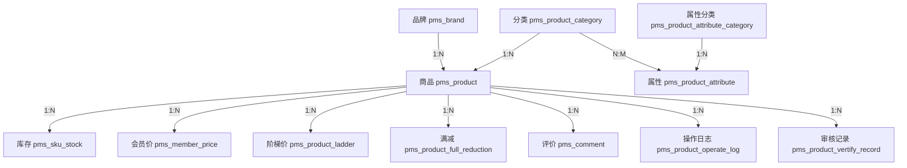
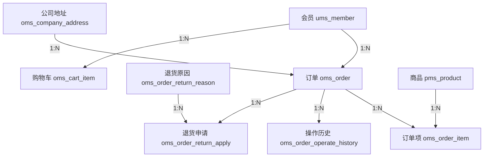
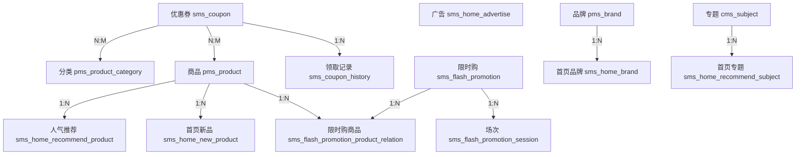
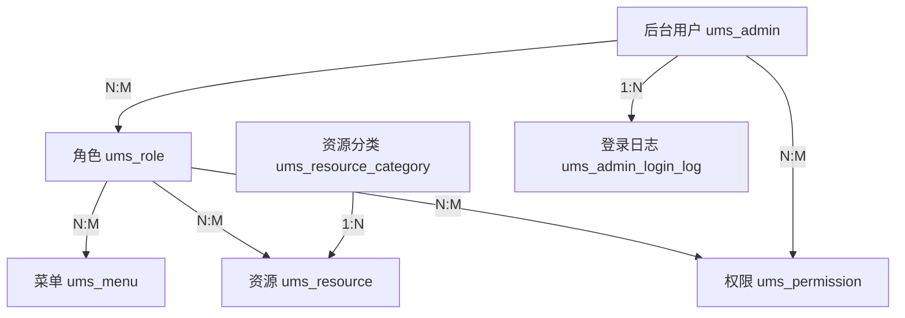
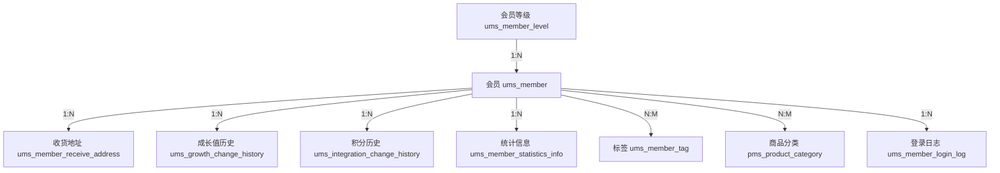

# Mall-Admin 项目功能与数据库表对应关系及数据库设计文档

## 📋 目录

1. [项目概述](#项目概述)
2. [系统模块划分](#系统模块划分)
3. [功能模块与数据库表映射](#功能模块与数据库表映射)
4. [数据库详细设计](#数据库详细设计)
5. [数据库设计规范](#数据库设计规范)
6. [实体关系图](#实体关系图)

---

## 项目概述

Mall-Admin 是一个电商后台管理系统，采用 Spring Boot + MyBatis 技术栈实现。系统涵盖了商品管理、订单管理、营销管理、内容管理、权限管理等核心业务模块。

### 技术架构
- **后端框架**: Spring Boot
- **持久层**: MyBatis
- **数据库**: MySQL 5.7+
- **安全框架**: Spring Security + JWT

---

## 系统模块划分

根据控制器（Controller）和数据库表前缀，系统将功能划分为以下五大模块：

| 模块前缀 | 模块名称 | 说明 |
|---------|---------|------|
| **PMS** | Product Management System | 商品管理系统 |
| **OMS** | Order Management System | 订单管理系统 |
| **SMS** | Sales Management System | 营销管理系统 |
| **CMS** | Content Management System | 内容管理系统 |
| **UMS** | User Management System | 用户权限管理系统 |

---

## 功能模块与数据库表映射

### 1. 商品管理系统 (PMS - Product Management System)

#### 1.1 核心功能
- 商品信息管理（增删改查、上下架、审核）
- 商品分类管理
- 品牌管理
- 商品属性/参数管理
- SKU库存管理
- 商品评价管理

#### 1.2 对应的数据库表

| 表名 | 中文名 | 主要功能 | 关键字段 |
|------|--------|----------|----------|
| `pms_product` | 商品信息表 | 存储商品基本信息 | id, name, price, stock, brand_id, product_category_id |
| `pms_brand` | 品牌表 | 商品品牌信息 | id, name, first_letter, logo, show_status |
| `pms_product_category` | 商品分类表 | 商品分类层级结构 | id, name, parent_id, level, sort |
| `pms_product_attribute` | 商品属性表 | 商品规格和参数定义 | id, name, type(规格/参数), select_type |
| `pms_product_attribute_category` | 商品属性分类表 | 属性分组 | id, name, attribute_count |
| `pms_sku_stock` | SKU库存表 | 商品SKU及库存信息 | id, product_id, sku_code, price, stock, sp_data |
| `pms_member_price` | 会员价格表 | 不同会员等级的商品价格 | id, product_id, member_level_id, member_price |
| `pms_product_ladder` | 阶梯价格表 | 批量购买折扣 | id, product_id, count, discount |
| `pms_product_full_reduction` | 满减价格表 | 满减优惠配置 | id, product_id, full_price, reduce_price |
| `pms_comment` | 商品评价表 | 用户对商品的评价 | id, product_id, star, content, pics |
| `pms_comment_replay` | 评价回复表 | 对评价的回复 | id, comment_id, content, type |
| `pms_album` | 画册表 | 商品画册 | id, name, pic |
| `pms_album_pic` | 画册图片表 | 画册中的图片 | id, album_id, pic |
| `pms_feight_template` | 运费模板表 | 运费计算规则 | id, name, charge_type, first_weight |
| `pms_product_operate_log` | 商品操作日志表 | 记录商品变更历史 | id, product_id, price_old, price_new |
| `pms_product_vertify_record` | 商品审核记录表 | 商品审核流程记录 | id, product_id, vertify_man, status |
| `pms_product_category_attribute_relation` | 分类属性关联表 | 分类与属性的关联 | id, product_category_id, product_attribute_id |

#### 1.3 关键业务逻辑

**商品创建流程：**
1. 在 `pms_product` 中创建商品基本信息
2. 在 `pms_sku_stock` 中创建多个SKU（颜色、尺寸等组合）
3. 在 `pms_member_price` 中设置会员价格
4. 在 `pms_product_ladder` 中设置阶梯价格
5. 在 `pms_product_full_reduction` 中设置满减规则

**商品属性体系：**
- **规格属性** (type=0): 如颜色、尺寸，影响SKU生成
- **参数属性** (type=1): 如上市年份、材质，仅用于展示

---

### 2. 订单管理系统 (OMS - Order Management System)

#### 2.1 核心功能
- 订单管理（查询、发货、收货、关闭）
- 订单退货申请处理
- 退货原因管理
- 订单设置
- 公司地址管理

#### 2.2 对应的数据库表

| 表名 | 中文名 | 主要功能 | 关键字段 |
|------|--------|----------|----------|
| `oms_order` | 订单表 | 订单主表 | id, order_sn, member_id, total_amount, pay_amount, status |
| `oms_order_item` | 订单商品明细表 | 订单中的商品列表 | id, order_id, product_id, product_name, quantity, price |
| `oms_order_operate_history` | 订单操作历史记录表 | 订单状态变更记录 | id, order_id, operate_man, order_status, note |
| `oms_order_return_apply` | 退货申请表 | 用户提交的退货申请 | id, order_id, product_id, reason, status |
| `oms_order_return_reason` | 退货原因表 | 退货原因配置 | id, name, sort, status |
| `oms_order_setting` | 订单设置表 | 订单相关配置 | id, flash_order_overtime, normal_order_overtime |
| `oms_company_address` | 公司地址表 | 发货/退货地址 | id, address_name, default_status, province, city |
| `oms_cart_item` | 购物车项表 | 用户购物车数据 | id, member_id, product_id, quantity, price |

#### 2.3 订单状态流转

```
待付款(0) → 待发货(1) → 已发货(2) → 已完成(3)
    ↓           ↓
已取消(4)    已关闭(5)
```

**订单超时处理：**
- 普通订单超时：由 `oms_order_setting.normal_order_overtime` 控制
- 秒杀订单超时：由 `oms_order_setting.flash_order_overtime` 控制

---

### 3. 营销管理系统 (SMS - Sales Management System)

#### 3.1 核心功能
- 优惠券管理
- 限时购/秒杀活动
- 首页广告管理
- 首页推荐（品牌、新品、人气、专题）

#### 3.2 对应的数据库表

| 表名 | 中文名 | 主要功能 | 关键字段 |
|------|--------|----------|----------|
| `sms_coupon` | 优惠券表 | 优惠券基本信息 | id, name, type, amount, min_point, start_time, end_time |
| `sms_coupon_history` | 优惠券使用记录表 | 领取和使用历史 | id, coupon_id, member_id, use_status, order_id |
| `sms_coupon_product_relation` | 优惠券商品关联表 | 指定商品可用券 | id, coupon_id, product_id |
| `sms_coupon_product_category_relation` | 优惠券分类关联表 | 指定分类可用券 | id, coupon_id, product_category_id |
| `sms_flash_promotion` | 限时购活动表 | 秒杀活动场次 | id, title, start_date, end_date, status |
| `sms_flash_promotion_session` | 限时购场次表 | 每日时间段配置 | id, name, start_time, end_time |
| `sms_flash_promotion_product_relation` | 限时购商品关联表 | 参与秒杀的商品 | id, flash_promotion_id, product_id, flash_promotion_price |
| `sms_flash_promotion_log` | 限时购通知记录表 | 秒杀提醒记录 | id, member_id, product_id, subscribe_time |
| `sms_home_advertise` | 首页轮播广告表 | 首页Banner广告 | id, name, pic, url, start_time, end_time |
| `sms_home_brand` | 首页推荐品牌表 | 首页品牌推荐 | id, brand_id, recommend_status, sort |
| `sms_home_new_product` | 首页新品推荐表 | 首页新品展示 | id, product_id, recommend_status, sort |
| `sms_home_recommend_product` | 首页人气推荐表 | 热门商品推荐 | id, product_id, recommend_status, sort |
| `sms_home_recommend_subject` | 首页专题推荐表 | 专题内容推荐 | id, subject_id, recommend_status, sort |

#### 3.3 优惠券类型

| 类型值 | 说明 | 使用范围 |
|-------|------|----------|
| 0 | 全场赠券 | 所有商品可用 |
| 1 | 会员赠券 | 特定会员等级 |
| 2 | 购物赠券 | 购物后赠送 |
| 3 | 注册赠券 | 新用户注册赠送 |

**使用类型：**
- use_type=0: 全场通用
- use_type=1: 指定分类（通过 `sms_coupon_product_category_relation` 关联）
- use_type=2: 指定商品（通过 `sms_coupon_product_relation` 关联）

---

### 4. 内容管理系统 (CMS - Content Management System)

#### 4.1 核心功能
- 专题管理
- 优选专区
- 帮助文档
- 话题管理

#### 4.2 对应的数据库表

| 表名 | 中文名 | 主要功能 | 关键字段 |
|------|--------|----------|----------|
| `cms_subject` | 专题表 | 专题内容 | id, title, category_id, pic, content |
| `cms_subject_category` | 专题分类表 | 专题分类 | id, name, icon, subject_count |
| `cms_subject_comment` | 专题评论表 | 专题评论 | id, subject_id, content, show_status |
| `cms_subject_product_relation` | 专题商品关联表 | 专题关联的商品 | id, subject_id, product_id |
| `cms_prefrence_area` | 优选专区表 | 精选商品区域 | id, name, sub_title, pic |
| `cms_prefrence_area_product_relation` | 优选专区商品关联表 | 专区关联商品 | id, prefrence_area_id, product_id |
| `cms_help` | 帮助表 | 帮助中心文章 | id, category_id, title, content |
| `cms_help_category` | 帮助分类表 | 帮助分类 | id, name, help_count |
| `cms_topic` | 话题表 | 社区话题 | id, name, icon, subject_count |
| `cms_topic_category` | 话题分类表 | 话题分类 | id, name, icon |
| `cms_topic_comment` | 话题评论表 | 话题评论 | id, topic_id, content |
| `cms_member_report` | 用户举报表 | 用户举报记录 | id, report_type, report_object, status |

---

### 5. 用户权限管理系统 (UMS - User Management System)

#### 5.1 核心功能
- 后台用户管理
- 角色管理
- 菜单管理
- 资源（权限）管理
- 会员管理
- 登录日志

#### 5.2 对应的数据库表

##### 5.2.1 后台用户权限

| 表名 | 中文名 | 主要功能 | 关键字段 |
|------|--------|----------|----------|
| `ums_admin` | 后台用户表 | 管理员账号 | id, username, password, role_ids, status |
| `ums_role` | 后台角色表 | 角色定义 | id, name, description, admin_count |
| `ums_menu` | 后台菜单表 | 菜单结构 | id, parent_id, title, level, name, icon |
| `ums_resource` | 后台资源表 | API接口权限 | id, name, url, category_id |
| `ums_resource_category` | 资源分类表 | 资源分组 | id, name, sort |
| `ums_permission` | 后台权限表 | 细粒度权限 | id, name, value, type, uri |
| `ums_admin_role_relation` | 用户角色关联表 | 用户-角色多对多 | id, admin_id, role_id |
| `ums_role_menu_relation` | 角色菜单关联表 | 角色-菜单关联 | id, role_id, menu_id |
| `ums_role_resource_relation` | 角色资源关联表 | 角色-资源关联 | id, role_id, resource_id |
| `ums_role_permission_relation` | 角色权限关联表 | 角色-权限关联 | id, role_id, permission_id |
| `ums_admin_permission_relation` | 用户权限关联表 | 额外权限配置 | id, admin_id, permission_id |
| `ums_admin_login_log` | 后台登录日志表 | 登录记录 | id, admin_id, ip, create_time |

##### 5.2.2 前台会员管理

| 表名 | 中文名 | 主要功能 | 关键字段 |
|------|--------|----------|----------|
| `ums_member` | 会员表 | 前台用户账号 | id, username, phone, nickname, integration, growth |
| `ums_member_level` | 会员等级表 | 会员等级配置 | id, name, growth_point, free_freight_point |
| `ums_member_receive_address` | 会员收货地址表 | 收货地址 | id, member_id, name, phone, detail_address |
| `ums_member_login_log` | 会员登录日志表 | 登录记录 | id, member_id, ip, login_type |
| `ums_growth_change_history` | 成长值变化历史表 | 成长值变动 | id, member_id, change_count, source_type |
| `ums_integration_change_history` | 积分变化历史表 | 积分变动 | id, member_id, change_count, source_type |
| `ums_integration_consume_setting` | 积分消费设置表 | 积分抵扣规则 | id, deduction_per_amount, max_percent_per_order |
| `ums_member_statistics_info` | 会员统计表 | 会员数据统计 | id, member_id, consume_amount, order_count |
| `ums_member_tag` | 会员标签表 | 用户标签 | id, name, finish_order_count |
| `ums_member_member_tag_relation` | 会员标签关联表 | 会员-标签关联 | id, member_id, tag_id |
| `ums_member_task` | 会员任务表 | 成长任务 | id, name, growth, intergration, type |
| `ums_member_rule_setting` | 积分规则表 | 积分获取规则 | id, consume_per_point, type |
| `ums_member_product_category_relation` | 会员分类偏好表 | 喜欢的分类 | id, member_id, product_category_id |

#### 5.3 RBAC权限模型

系统采用 **RBAC (Role-Based Access Control)** 权限模型：

```
用户 (ums_admin) 
  ↓ N:M
角色 (ums_role)
  ↓ N:M  
菜单 (ums_menu) / 资源 (ums_resource) / 权限 (ums_permission)
```

**权限类型：**
- type=0: 目录（一级菜单）
- type=1: 菜单（二级菜单）
- type=2: 按钮/接口（具体操作权限）

---

## 数据库详细设计

### 数据库表统计

| 模块 | 表数量 | 说明 |
|------|--------|------|
| PMS (商品) | 17张表 | 商品、品牌、分类、属性、SKU、评价等 |
| OMS (订单) | 8张表 | 订单、订单项、退货、购物车等 |
| SMS (营销) | 13张表 | 优惠券、秒杀、广告、推荐等 |
| CMS (内容) | 12张表 | 专题、帮助、话题、优选等 |
| UMS (用户) | 25张表 | 后台用户、角色、权限、会员等 |
| **总计** | **75张表** | - |

### 命名规范

#### 1. 表命名规范
- 采用 **小写字母 + 下划线** 命名
- 格式：`{模块前缀}_{业务含义}`
- 示例：`pms_product`, `oms_order`, `ums_admin`

#### 2. 字段命名规范
- 主键统一命名为 `id`，类型为 `bigint(20)`，自增
- 外键命名：`{关联表名单数}_id`，如 `product_id`, `member_id`
- 时间字段：`create_time`, `update_time`, `start_time`, `end_time`
- 状态字段：`status`, `show_status`, `delete_status`
- 布尔值：使用 `int(1)`，0表示否/禁用，1表示是/启用

#### 3. 索引规范
- 主键自动创建聚簇索引
- 外键字段建议添加普通索引
- 频繁查询字段添加索引，如 `idx_username`, `idx_phone`
- 联合索引遵循最左前缀原则

---

## 数据库设计规范

### 1. 数据类型选择

| 数据类型 | 使用场景 | 示例 |
|---------|---------|------|
| `bigint(20)` | 主键、外键、ID类字段 | id, product_id, member_id |
| `varchar(n)` | 字符串，长度可变 | name, username, phone |
| `decimal(10,2)` | 金额、价格 | price, amount, promotion_price |
| `int(1)` | 状态、布尔值 | status, show_status, delete_status |
| `int(11)` | 整数计数 | stock, sort, count |
| `datetime` | 日期时间 | create_time, start_time |
| `text` | 长文本 | content, description, detail_html |
| `varbinary` | 二进制数据 | pic (图片路径) |

### 2. 默认值设计

- 状态字段默认值通常为 `0` 或 `1`
- 数值字段可为 NULL 时使用 `NULL DEFAULT NULL`
- 重要字段设置默认值，如 `stock int(11) NULL DEFAULT 0`

### 3. 字符集与排序规则

- 统一使用 `utf8mb4` 字符集（支持emoji等特殊字符）
- 排序规则：`utf8mb4_general_ci`（不区分大小写）

### 4. 引擎选择

- 全部使用 **InnoDB** 引擎
- 支持事务、行级锁、外键约束

### 5. 冗余字段设计

为提高查询性能，适当冗余字段：

**示例：**
- `pms_product` 表中冗余 `brand_name`, `product_category_name`
- `oms_order_item` 表中冗余 `product_name`, `product_sn`, `product_pic`
- `sms_coupon_product_relation` 表中冗余 `product_name`, `product_sn`

**优点：** 减少JOIN查询，提升读取性能  
**缺点：** 需要维护数据一致性

### 6. 软删除设计

多数业务表采用软删除机制：
- 字段：`delete_status int(1)`
- 0: 未删除
- 1: 已删除

**优势：** 保留历史数据，支持数据恢复

---

## 实体关系图

### 1. 商品模块核心关系



### 2. 订单模块核心关系



### 3. 营销模块核心关系



### 4. 权限模块核心关系（RBAC）



### 5. 会员模块核心关系



---

## 关键业务流程的数据库操作

### 1. 商品发布流程

```sql
-- 1. 插入商品基本信息
INSERT INTO pms_product (...) VALUES (...);

-- 2. 插入SKU库存信息（多个）
INSERT INTO pms_sku_stock (product_id, sku_code, price, stock, sp_data) VALUES (...);

-- 3. 插入会员价格（多个等级）
INSERT INTO pms_member_price (product_id, member_level_id, member_price) VALUES (...);

-- 4. 插入阶梯价格（可选）
INSERT INTO pms_product_ladder (product_id, count, discount) VALUES (...);

-- 5. 插入满减规则（可选）
INSERT INTO pms_product_full_reduction (product_id, full_price, reduce_price) VALUES (...);
```

### 2. 订单创建流程

```sql
-- 1. 创建订单主记录
INSERT INTO oms_order (order_sn, member_id, total_amount, pay_amount, ...) VALUES (...);

-- 2. 创建订单商品明细（多个）
INSERT INTO oms_order_item (order_id, product_id, product_name, quantity, price) VALUES (...);

-- 3. 扣减库存
UPDATE pms_sku_stock SET stock = stock - ?, lock_stock = lock_stock + ? WHERE id = ?;

-- 4. 记录操作历史
INSERT INTO oms_order_operate_history (order_id, order_status, operate_man, note) VALUES (...);
```

### 3. 优惠券领取流程

```sql
-- 1. 检查优惠券库存
SELECT count FROM sms_coupon WHERE id = ? AND count > 0;

-- 2. 检查用户领取数量限制
SELECT COUNT(*) FROM sms_coupon_history 
WHERE coupon_id = ? AND member_id = ?;

-- 3. 创建领取记录
INSERT INTO sms_coupon_history (coupon_id, member_id, coupon_code, get_type, create_time) 
VALUES (...);

-- 4. 扣减优惠券库存
UPDATE sms_coupon SET count = count - 1, receive_count = receive_count + 1 WHERE id = ?;
```

### 4. 权限验证流程

```sql
-- 1. 根据用户名查询用户
SELECT * FROM ums_admin WHERE username = ?;

-- 2. 查询用户的角色
SELECT r.* FROM ums_role r
INNER JOIN ums_admin_role_relation ar ON r.id = ar.role_id
WHERE ar.admin_id = ?;

-- 3. 查询角色的资源权限
SELECT res.* FROM ums_resource res
INNER JOIN ums_role_resource_relation rr ON res.id = rr.resource_id
WHERE rr.role_id IN (?);

-- 4. 验证URL是否在权限列表中
-- 应用层判断当前请求URL是否匹配资源权限
```

---

## 数据库优化建议

### 1. 索引优化

**必须添加索引的场景：**
- 外键字段：`product_id`, `member_id`, `order_id`
- 频繁查询字段：`username`, `phone`, `order_sn`
- 状态筛选字段：`status`, `delete_status`, `show_status`
- 时间范围查询：`create_time`, `start_time`

**示例：**
```sql
-- 会员表索引
CREATE INDEX idx_username ON ums_member(username);
CREATE INDEX idx_phone ON ums_member(phone);

-- 订单表索引
CREATE INDEX idx_order_sn ON oms_order(order_sn);
CREATE INDEX idx_member_id ON oms_order(member_id);
CREATE INDEX idx_create_time ON oms_order(create_time);

-- 优惠券历史表索引
CREATE INDEX idx_member_id ON sms_coupon_history(member_id);
CREATE INDEX idx_coupon_id ON sms_coupon_history(coupon_id);
```

### 2. 查询优化

**避免 SELECT ***
```sql
-- ❌ 不推荐
SELECT * FROM pms_product WHERE id = 1;

-- ✅ 推荐
SELECT id, name, price, stock FROM pms_product WHERE id = 1;
```

**使用分页查询**
```sql
-- 大数据量时必须分页
SELECT * FROM oms_order 
WHERE member_id = ? 
ORDER BY create_time DESC 
LIMIT 20 OFFSET 0;
```

### 3. 读写分离建议

对于高并发场景：
- **主库**：处理写操作（INSERT, UPDATE, DELETE）
- **从库**：处理读操作（SELECT）

### 4. 分库分表策略

当单表数据量超过 **500万** 时考虑分表：

**水平分表示例：**
- `oms_order_0`, `oms_order_1`, ..., `oms_order_9`
- 按 `member_id % 10` 进行路由

---

## 数据安全设计

### 1. 密码加密

- 使用 **BCrypt** 加密算法
- 示例：`$2a$10$NZ5o7r2E.ayT2ZoxgjlI.eJ6OEYqjH7INR/F.mXDbjZJi9HF0YCVG`

### 2. 敏感数据保护

- 手机号、邮箱等敏感信息建议加密存储
- 生产环境禁止明文存储密码

### 3. SQL注入防护

- 使用 MyBatis 参数化查询（`#{}` 而非 `${}`）
- 禁止拼接SQL语句

---

## 总结

### 数据库设计亮点

1. ✅ **模块化设计**：清晰的模块划分（PMS/OMS/SMS/CMS/UMS）
2. ✅ **RBAC权限模型**：灵活的用户-角色-权限管理
3. ✅ **冗余优化**：适当冗余提升查询性能
4. ✅ **软删除机制**：保留历史数据，支持数据恢复
5. ✅ **完整的审计日志**：操作日志、登录日志齐全
6. ✅ **灵活的营销体系**：优惠券、秒杀、满减等多种促销方式

### 改进建议

1. 🔧 添加更多复合索引优化复杂查询
2. 🔧 考虑引入缓存（Redis）减轻数据库压力
3. 🔧 大表（订单、日志）考虑分库分表
4. 🔧 添加数据库监控和慢查询分析
5. 🔧 定期归档历史数据

---

**文档版本**: v1.0  
**生成日期**: 2026-04-17  
**数据库版本**: MySQL 5.7+  
**表总数**: 75张
