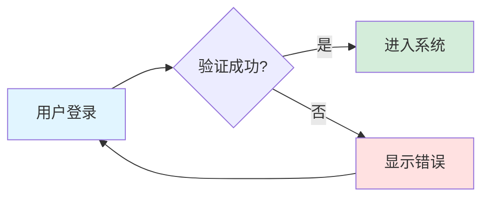
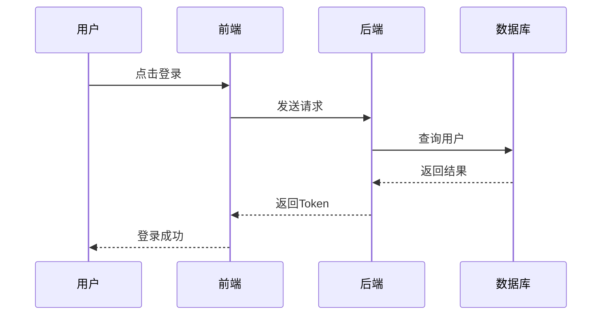
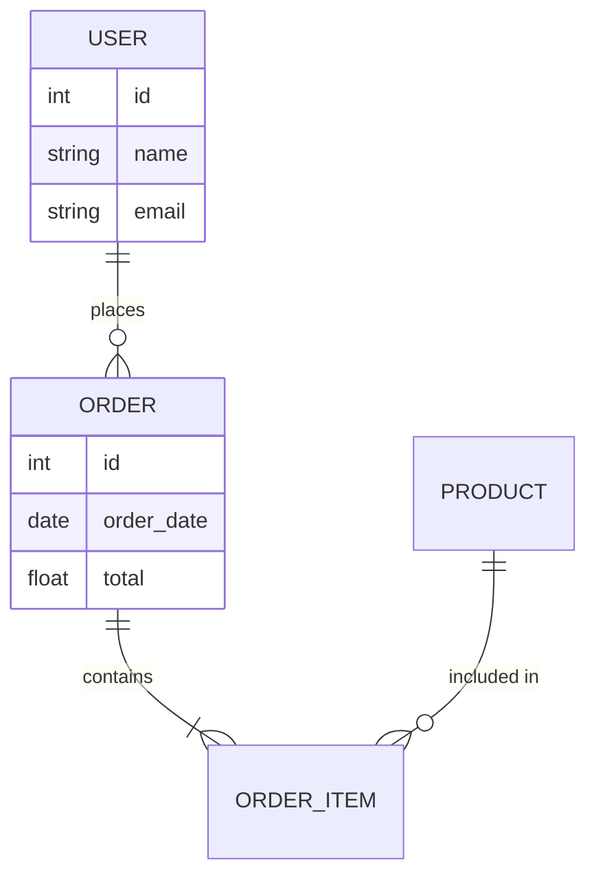

# Markdown All in One 使用教程

## 1. 文本格式化

这是**加粗文字**，这是*斜体文字*，这是***加粗斜体***。

这是~~删除线~~。

## 2. 列表

### 无序列表
- 第一项
- 第二项
  - 子项1
  - 子项2
- 第三项

### 有序列表
1. 第一步
2. 第二步
3. 第三步

## 3. 链接和图片

[访问 GitHub](https://github.com)


## 4. 代码块

### 行内代码
使用 `console.log()` 输出信息。

### 代码块
```java
public class HelloWorld {
    public static void main(String[] args) {
        System.out.println("Hello, World!");
    }
}
```

## 5. 表格

| 姓名 | 年龄 | 城市 |
|------|------|------|
| 张三 | 25 | 北京 |
| 李四 | 30 | 上海 |
| 王五 | 28 | 广州 |

## 6. Mermaid 流程图



## 7. Mermaid 时序图



## 8. Mermaid ER图



## 9. 任务列表

- [x] 已完成的任务
- [ ] 待完成的任务1
- [ ] 待完成的任务2
- [ ] 待完成的任务3

## 10. 引用

> 这是一段引用文本。
> 
> 引用可以跨越多行。

---

## 常用快捷键速查

| 操作 | Windows/Linux | Mac |
|------|---------------|-----|
| 加粗 | `Ctrl + B` | `Cmd + B` |
| 斜体 | `Ctrl + I` | `Cmd + I` |
| 打开预览 | `Ctrl + K V` | `Cmd + K V` |
| 格式化 | `Alt + Shift + F` | `Option + Shift + F` |
| 查找 | `Ctrl + F` | `Cmd + F` |

---

## 提示

1. **实时预览**：按 `Ctrl + K V` 可以随时查看渲染效果
2. **自动补全**：输入 `[` 会自动提示链接，输入 `` ` `` 会提示代码
3. **目录生成**：在文件顶部添加 `[TOC]` 可自动生成目录
4. **数学公式**：支持 LaTeX 公式，如 `$E = mc^2$`

试试按下 `Ctrl + K V` 查看这个文件的预览效果吧！
