# Mall 项目商品管理模块详解

## 📋 目录

1. [模块概览](#模块概览)
2. [数据库设计](#数据库设计)
3. [核心业务流程](#核心业务流程)
4. [API接口速查](#api接口速查)
5. [关键代码解析](#关键代码解析)
6. [最佳实践](#最佳实践)

---

## 模块概览

### 什么是商品管理？

商品管理是电商系统的**核心模块**，负责商品的完整生命周期管理：


### 模块组成

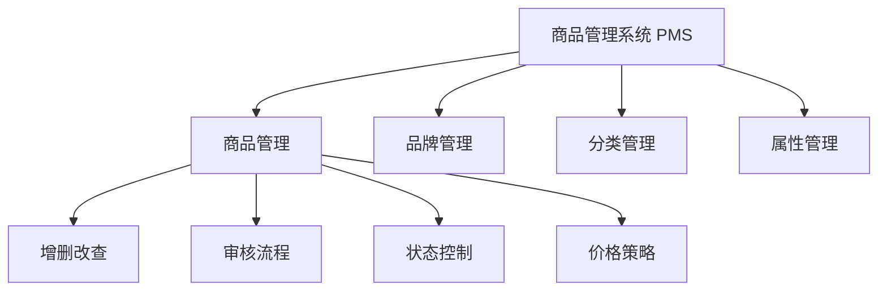

### 技术栈

| 技术 | 用途 |
|------|------|
| Spring Boot | 后端框架 |
| MyBatis | ORM持久层 |
| MySQL | 数据库 |
| Swagger | API文档 |


## 数据库设计

### 1. ER图（实体关系概览）

> 💡 **说明**：ER图用于快速了解系统中有哪些实体，以及它们之间的关系类型（一对多、多对多）。

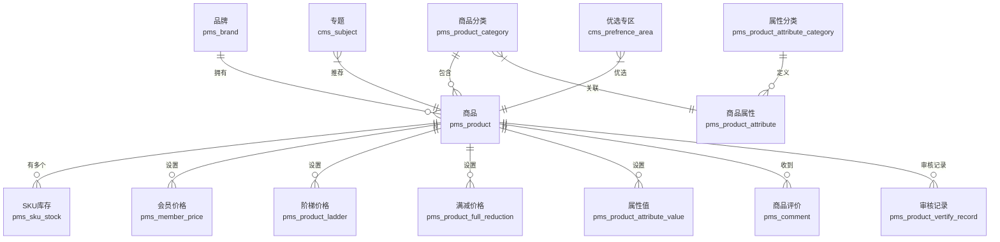

**关系说明**：
- `||--o{` 表示 **一对多** (1:N)：如一个品牌可以有多个商品
- `}|--||` 表示 **多对多** (N:M)：如一个分类可以有多个属性，一个属性也可以属于多个分类

---

### 2. 核心表结构图（含关键字段）

> 💡 **说明**：此图展示每张表的核心字段，帮助理解数据存储结构。

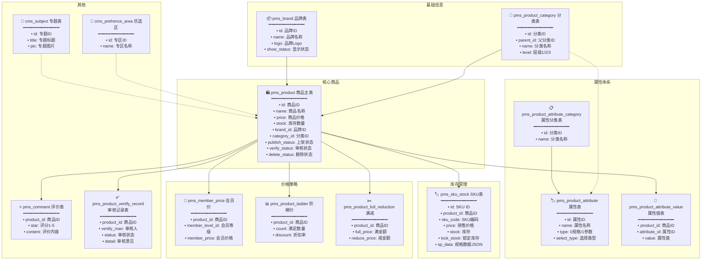

---

### 3. 简化版关系图

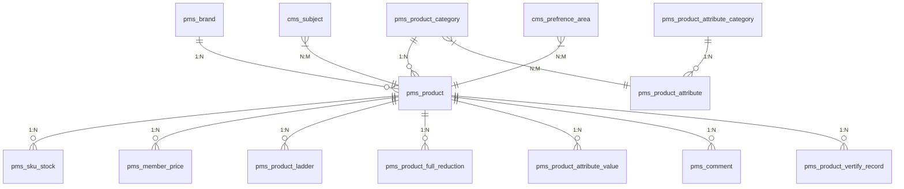

### 4. 商品主表 (pms_product)

**核心字段分组**：

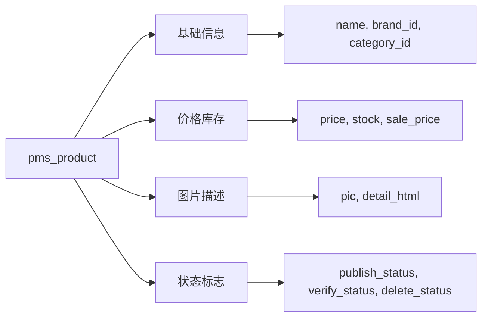

**关键字段说明**：

| 字段组 | 字段名 | 说明 |
|--------|--------|------|
| 基础信息 | name, brand_id, product_category_id | 商品名称、品牌、分类 |
| 价格信息 | price, sale_price, cost_price | 原价、售价、成本价 |
| 库存信息 | stock, low_stock | 库存数量、预警阈值 |
| 图片信息 | pic, album_pics | 主图、画册图片 |
| 详细描述 | description, detail_html | 简短描述、HTML详情 |
| **状态标志** | publish_status | **上架状态: 0-下架, 1-上架** |
| | verify_status | **审核状态: 0-未审核, 1-通过** |
| | new_status | **新品标记: 0-否, 1-是** |
| | recommand_status | **推荐状态: 0-否, 1-是** |
| | delete_status | **删除状态: 0-正常, 1-已删除(软删除)** |

---

### 3. SKU库存表 (pms_sku_stock)

**什么是SKU？**
- SKU = Stock Keeping Unit（库存量单位）
- 每个SKU代表一个具体的商品变体
- 例如：iPhone 15 Pro Max - 256GB - 钛金属色 = 一个SKU

**表结构**：

| 字段 | 类型 | 说明 |
|------|------|------|
| id | bigint | SKU ID（主键） |
| product_id | bigint | 商品ID（外键） |
| sku_code | varchar(64) | SKU编码（唯一） |
| price | decimal(10,2) | 销售价格 |
| stock | int | 库存数量 |
| lock_stock | int | 锁定库存（下单未支付） |
| sp_data | varchar(512) | 规格数据 JSON格式 |

**sp_data 示例**：
``json
[
  {"key":"颜色", "value":"红色"},
  {"key":"尺寸", "value":"M"}
]


**SKU生成示例**：

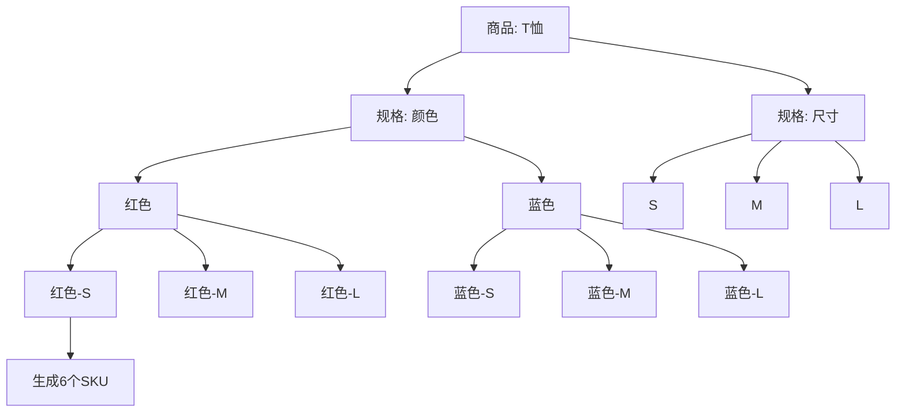

---

### 4. 价格策略表

#### 4.1 会员价格表 (pms_member_price)

**业务场景**：不同会员等级享受不同价格

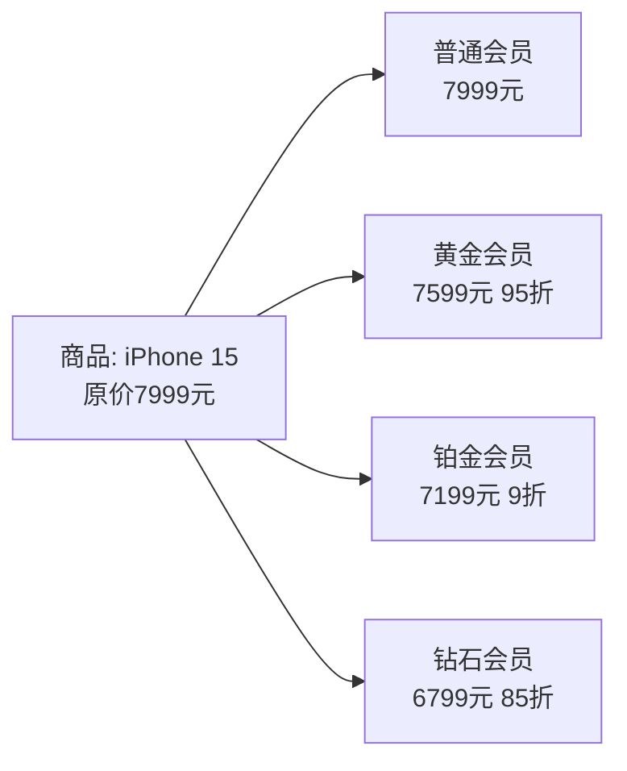

**表结构**：
```sql
id               bigint      -- 主键
product_id       bigint      -- 商品ID
member_level_id  bigint      -- 会员等级ID
member_price     decimal     -- 会员价格
```

---

#### 4.2 阶梯价格表 (pms_product_ladder)

**业务场景**：买得越多，折扣越大

| 满足数量 | 折扣率 | 示例 |
|---------|--------|------|
| count=2 | 0.95 | 买2件打95折 |
| count=5 | 0.85 | 买5件打85折 |
| count=10 | 0.75 | 买10件打75折 |

---

#### 4.3 满减价格表 (pms_product_full_reduction)

**业务场景**：满X元减Y元

| 满金额 | 减金额 | 示例 |
|--------|--------|------|
| full_price=299 | reduce_price=30 | 满299减30 |
| full_price=499 | reduce_price=60 | 满499减60 |

---

### 5. 属性相关表

#### 5.1 属性体系结构

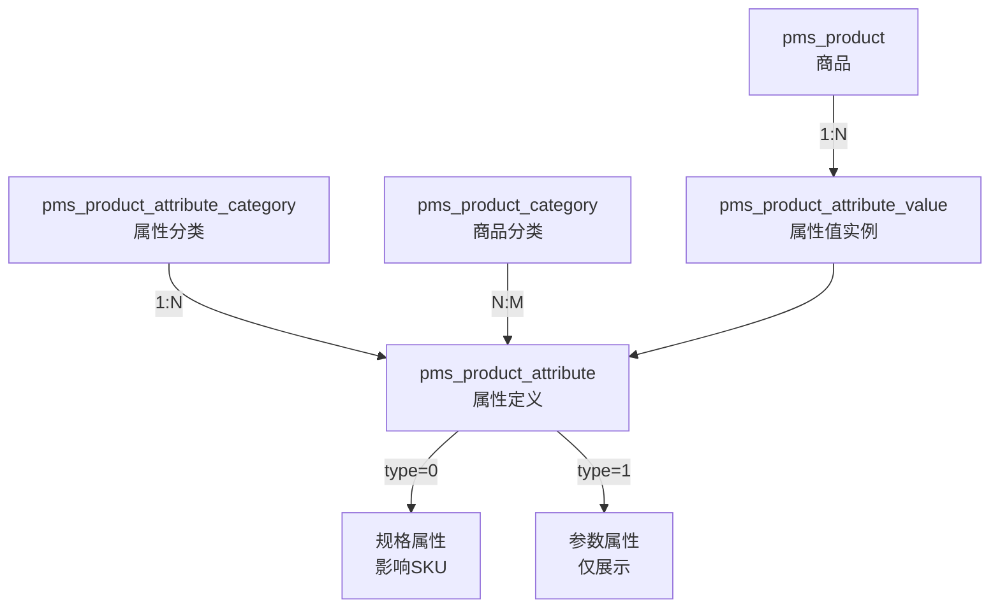

**属性类型对比**：

| 类型 | type值 | 说明 | 示例 | 是否影响SKU |
|------|--------|------|------|------------|
| 规格属性 | 0 | 决定SKU的属性 | 颜色、尺寸 | ✅ 是 |
| 参数属性 | 1 | 仅用于展示 | 材质、产地 | ❌ 否 |

**输入类型**：

| select_type | 说明 | 示例 |
|-------------|------|------|
| 0 - 唯一 | 只能选一个值 | 上市年份: 2024 |
| 1 - 单选 | 从列表中选择 | 颜色: 红/蓝/黑 |
| 2 - 多选 | 可选多个值 | 适用场景: 运动/休闲 |
| 3 - 手动输入 | 自由输入 | 自定义标签 |

---

### 6. 审核与日志表

#### 6.1 商品审核记录表 (pms_product_vertify_record)

```sql
id              bigint      -- 主键
product_id      bigint      -- 商品ID
vertify_man     varchar     -- 审核人
create_time     datetime    -- 审核时间
status          int         -- 0-未通过, 1-通过
detail          varchar     -- 审核意见
```

#### 6.2 商品操作日志表 (pms_product_operate_log)

```sql
id              bigint      -- 主键
product_id      bigint      -- 商品ID
price_old       decimal     -- 修改前价格
price_new       decimal     -- 修改后价格
operate_man     varchar     -- 操作人
create_time     datetime    -- 操作时间
note            varchar     -- 备注
```

---

## 核心业务流程

### 0. 商品创建表单字段说明

> 💡 **提示**：商品创建采用**4步表单**，以下是第一步"填写商品信息"中各个字段的说明。

#### 第一步：填写商品信息（基础信息）

| 字段名称 | 是否必填 | 说明 | 示例 |
|---------|---------|------|------|
| **商品分类** | ✅ 是 | 商品所属的分类（支持多级） | 服装 / 牛仔裤 |
| **商品名称** | ✅ 是 | 商品的正式名称 | 牛牛仔裤 |
| **副标题** | ✅ 是 | 简短卖点或促销语 | 1刀 |
| **商品品牌** | ✅ 是 | 选择商品品牌 | 七匹狼 |
| **商品介绍** | ❌ 否 | 商品的简短描述 | test |
| **商品货号** | ❌ 否 | 商品的唯一编号（SKU前缀） | 12138 |
| **商品售价** | ❌ 否 | 实际销售价格 | 6.8 |
| **市场价** | ❌ 否 | 划线价/原价（用于对比） | 0 |
| **商品库存** | ❌ 否 | 总库存数量（SKU库存之和） | 0 |
| **计量单位** | ❌ 否 | 商品的计数单位 | 件/个/盒 |
| **商品重量** | ❌ 否 | 用于运费计算，单位：克 | 0 |
| **排序** | ❌ 否 | 列表展示顺序（数字越小越靠前） | 0 |
| **主图** | ❌ 否 | 商品主图（最多5张） | image.jpg |
| **轮播图** | ❌ 否 | 商品详情轮播图 | image1.jpg, image2.jpg |
| **商品详情** | ❌ 否 | 富文本编辑器内容 | HTML内容 |
| **上架状态** | ❌ 否 | 立即上架/暂不上架 | 上架 |
| **推荐状态** | ❌ 否 | 是否推荐到首页 | 不推荐 |
| **审核状态** | ❌ 否 | 系统自动设为"待审核" | 待审核 |
| **服务保证** | ❌ 否 | 售后服务标签 | 无忧退货/快速退款/免费包邮 |
| **详细页标题** | ❌ 否 | SEO优化用标题 | 2024新款修身牛仔裤 |
| **关键词** | ❌ 否 | SEO关键词，逗号分隔 | 牛仔裤,修身,休闲 |

---

#### 第二步：设置商品促销（价格策略）

| 字段名称 | 说明 | 作用 | 示例 |
|---------|------|------|------|
| **会员价格** | 不同会员等级的专属价格 | 提升会员价值感 | 普通会员:7999元, 钻石会员:6799元 |
| **阶梯价格** | 购买数量越多折扣越大 | 鼓励批量购买 | 买2件打95折, 买5件打85折 |
| **满减活动** | 满X元减Y元 | 提高客单价 | 满299减30, 满499减60 |

**使用建议**：
- 💡 三种促销策略可以**同时生效**，系统会自动叠加计算优惠
- 💡 优先级：**会员价 → 阶梯价 → 满减**（按顺序应用）
- 💡 适合场景：新品推广、清仓促销、节日活动

---

### 1. 商品创建流程

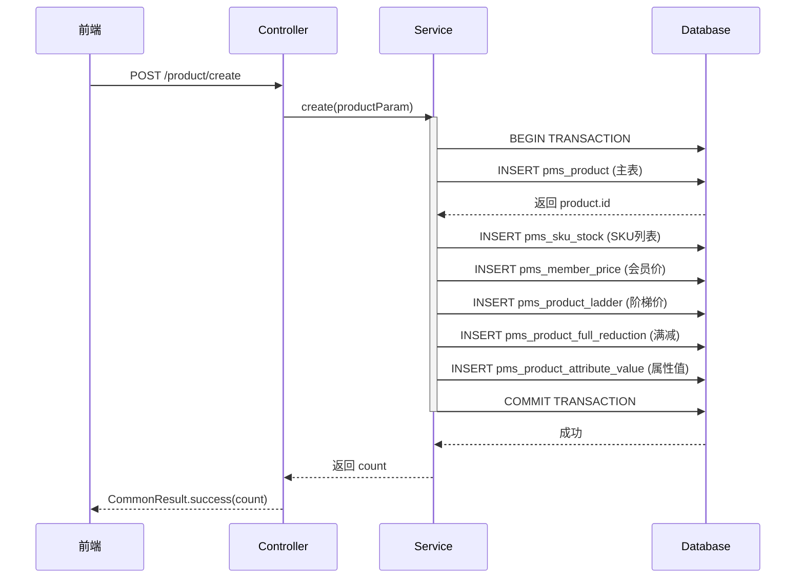

**关键代码**：
``` java
@Transactional
public int create(PmsProductParam productParam) {
    // 1. 插入商品主表
    PmsProduct product = productParam;
    productMapper.insertSelective(product);
    
    // 2. 处理SKU编码（自动生成）
    handleSkuStockCode(productParam.getSkuStockList(), product.getId());
    
    // 3. 插入关联表
    insertOrUpdateSkuStock(product.getId(), productParam.getSkuStockList());
    insertOrUpdateMemberPrice(product.getId(), productParam.getMemberPriceList());
    insertOrUpdateProductLadder(product.getId(), productParam.getProductLadderList());
    insertOrUpdateFullReduction(product.getId(), productParam.getProductFullReductionList());
    insertOrUpdateAttributeValue(product.getId(), productParam.getProductAttributeValueList());
    
    return 1;
}

```

**注意事项**：
- ✅ 使用 `@Transactional` 保证原子性
- ✅ 先插入主表获取 `product.id`
- ✅ 再插入所有关联表（使用 `product.id` 作为外键）
- ✅ SKU编码自动生成：`日期(8位) + 商品ID(4位) + 序号(3位)`

---

#### 第三步：设置商品属性（规格参数）

> 💡 **核心概念**：属性分为**规格属性**（影响SKU）和**参数属性**（仅展示）

##### A. 规格属性（决定SKU组合）

| 字段名称 | 说明 | 示例 |
|---------|------|------|
| **属性名** | 规格维度名称 | 颜色、尺寸、容量 |
| **属性值** | 该维度的可选值 | 颜色:红/蓝/黑；尺寸:S/M/L/XL |
| **输入方式** | 单选/多选/手动输入 | 单选：从预设列表中选择 |
| **关联图片** | 规格对应的商品图片 | 红色→红色商品图 |
| **SKU编码** | 自动生成（可修改） | 202401150001001 |
| **销售价格** | 该SKU的独立定价 | 红色+XL: 69.9元 |
| **促销价** | 促销期间的价格 | 69.9 → 59.9元 |
| **库存** | 该SKU的库存数量 | 100件 |
| **预警库存** | 低于此值时提醒补货 | 10件 |
| **锁定库存** | 订单未支付时临时锁定 | 5件 |

**SKU生成规则**：
```
规格组合 = 笛卡尔积（所有规格值的组合）
例如：颜色(3种) × 尺寸(4种) = 12个SKU
```

**示例表格**：

| SKU编码 | 规格数据 | 价格 | 库存 | 预警库存 |
|--------|---------|------|------|----------|
| 202401150001001 | 颜色:红, 尺寸:S | 69.9 | 50 | 10 |
| 202401150001002 | 颜色:红, 尺寸:M | 69.9 | 80 | 10 |
| 202401150001003 | 颜色:蓝, 尺寸:L | 74.9 | 120 | 10 |

---

##### B. 参数属性（商品详细信息）

| 字段名称 | 说明 | 示例 |
|---------|------|------|
| **参数名** | 参数的名称 | 材质、产地、适用季节 |
| **参数值** | 参数的具体值 | 材质:100%纯棉；产地:广东 |
| **显示类型** | 唯一/单选/多选/手动输入 | 单选：从下拉列表选择 |
| **是否必填** | 发布时是否必须填写 | 是/否 |
| **排序** | 参数展示顺序 | 1, 2, 3... |
| **关联分类** | 该参数属于哪个商品分类 | 服装类、数码类 |

**常见参数模板**：

**服装类**：
- 材质成分、尺码、颜色、适用季节、风格、厚薄、版型、袖长、领型、工艺、上市时间、产地...

**数码类**：
- 品牌、型号、颜色、存储容量、屏幕尺寸、处理器、内存、电池容量、操作系统、保修期...

**食品类**：
- 配料表、保质期、储存方法、净含量、生产日期、产地、生产许可证号、执行标准...

---

#### 第四步：商品关联（营销推广）

| 字段名称 | 说明 | 作用 | 示例 |
|---------|------|------|------|
| **关联专题** | 将商品加入营销专题 | 活动页面展示 | "双11狂欢节"专题 |
| **关联优选** | 将商品加入优选专区 | 提升曝光度 | "品质好货"专区 |
| **关联内容** | 关联种草文章/视频 | 内容营销 | "冬季穿搭指南"文章 |
| **搭配商品** | 推荐搭配购买的商品 | 提高客单价 | 牛仔裤 + 皮带 + 鞋子 |
| **相关商品** | 相似商品推荐 | 增加浏览深度 | 同品牌其他款式 |

**使用场景**：
- 📌 **专题关联**：适合大型促销活动（如618、双11）
- 📌 **优选专区**：适合精品推荐、新品首发、热销榜单
- 📌 **搭配推荐**：基于用户购买习惯智能推荐（需要算法支持）
- 📌 **相关商品**："看了又看"、"猜你喜欢"等个性化推荐

---

### 2. 商品更新流程

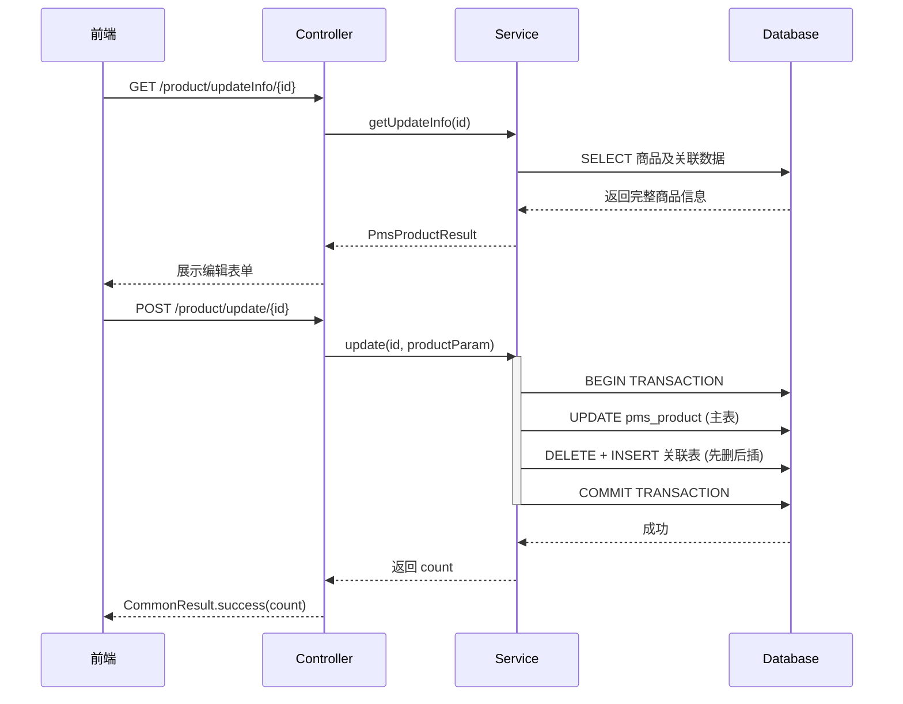

**更新策略：先删后插**
```java
@Transactional
public int update(Long id, PmsProductParam productParam) {
    // 1. 更新主表
    PmsProduct product = productParam;
    product.setId(id);
    productMapper.updateByPrimaryKeySelective(product);
    
    // 2. 删除原有数据，重新插入
    PmsMemberPriceExample example = new PmsMemberPriceExample();
    example.createCriteria().andProductIdEqualTo(id);
    memberPriceMapper.deleteByExample(example);  // 删除旧数据
    insertOrUpdateMemberPrice(id, productParam.getMemberPriceList());  // 插入新数据
    
    // 3. 同样处理其他关联表...
    
    return 1;
}
```

**为什么采用先删后插？**
- ✅ 简化更新逻辑（无需判断哪些记录需要更新/删除/新增）
- ✅ 保证数据一致性
- ⚠️ 必须在事务中执行

---

### 3. 商品审核流程

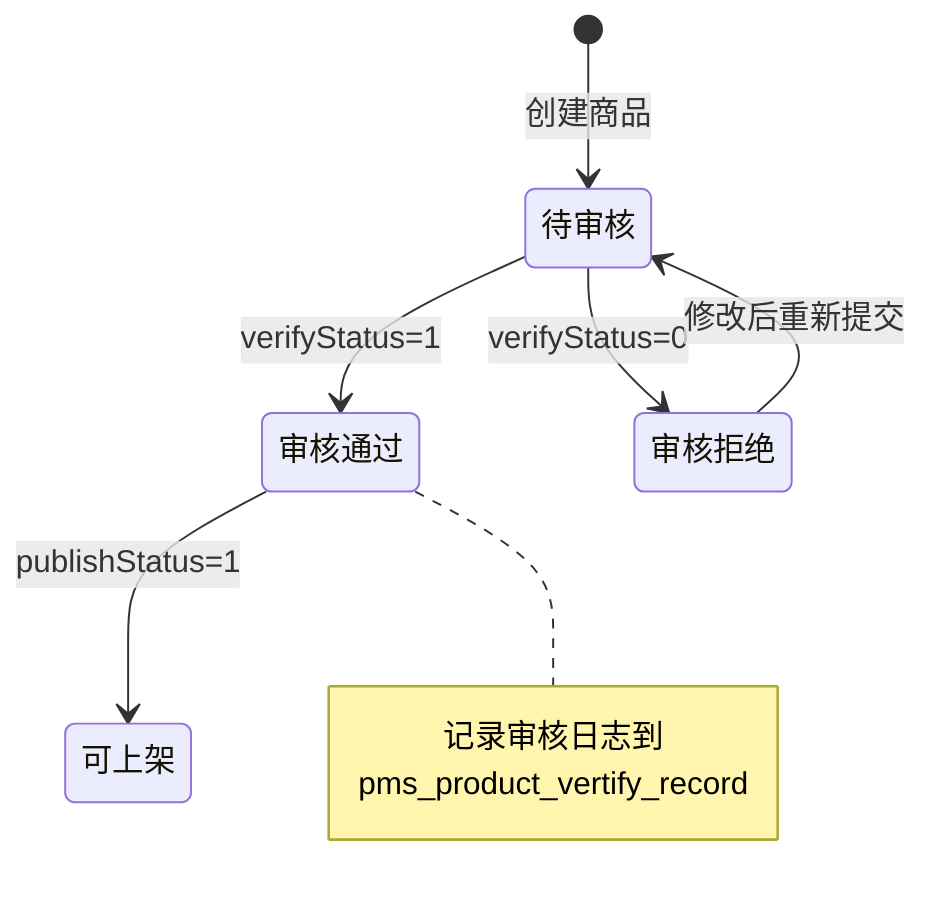

**批量审核接口**：
```java
POST /product/update/verifyStatus

Request:
{
  "ids": [1, 2, 3],
  "verifyStatus": 1,
  "detail": "商品信息完整，符合上架标准"
}
```

**实现逻辑**：
```java
@Transactional
public int updateVerifyStatus(List<Long> ids, Integer verifyStatus, String detail) {
    // 1. 更新商品审核状态
    PmsProduct record = new PmsProduct();
    record.setVerifyStatus(verifyStatus);
    PmsProductExample example = new PmsProductExample();
    example.createCriteria().andIdIn(ids);
    productMapper.updateByExampleSelective(record, example);
    
    // 2. 记录审核日志
    for (Long id : ids) {
        PmsProductVertifyRecord log = new PmsProductVertifyRecord();
        log.setProductId(id);
        log.setCreateTime(new Date());
        log.setDetail(detail);
        log.setStatus(verifyStatus);
        log.setVertifyMan("admin");
        vertifyRecordDao.insert(log);
    }
    
    return ids.size();
}
```

---

### 4. 商品上下架流程

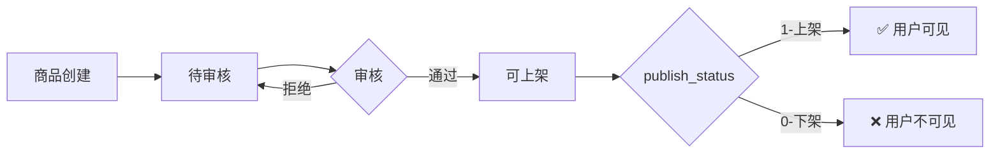

**状态说明**：

| publish_status | 说明 | 前端展示 |
|----------------|------|----------|
| 0 | 下架 | ❌ 用户不可见 |
| 1 | 上架 | ✅ 用户可见 |

**批量上下架接口**：
```java
POST /product/update/publishStatus

Request:
{
  "ids": [1, 2, 3],
  "publishStatus": 1  // 1-上架, 0-下架
}
```

**实现**：
```java
public int updatePublishStatus(List<Long> ids, Integer publishStatus) {
    PmsProduct record = new PmsProduct();
    record.setPublishStatus(publishStatus);
    PmsProductExample example = new PmsProductExample();
    example.createCriteria().andIdIn(ids);
    return productMapper.updateByExampleSelective(record, example);
}
```

---

### 5. SKU库存管理

#### 5.1 SKU生成规则

**场景**：商品有多个规格组合

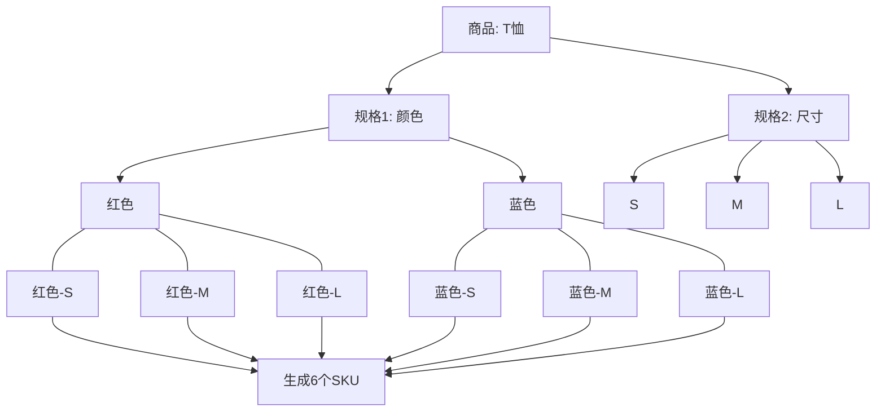

**计算公式**：SKU数量 = 颜色数 × 尺寸数 = 2 × 3 = **6个SKU**

---

#### 5.2 库存扣减流程

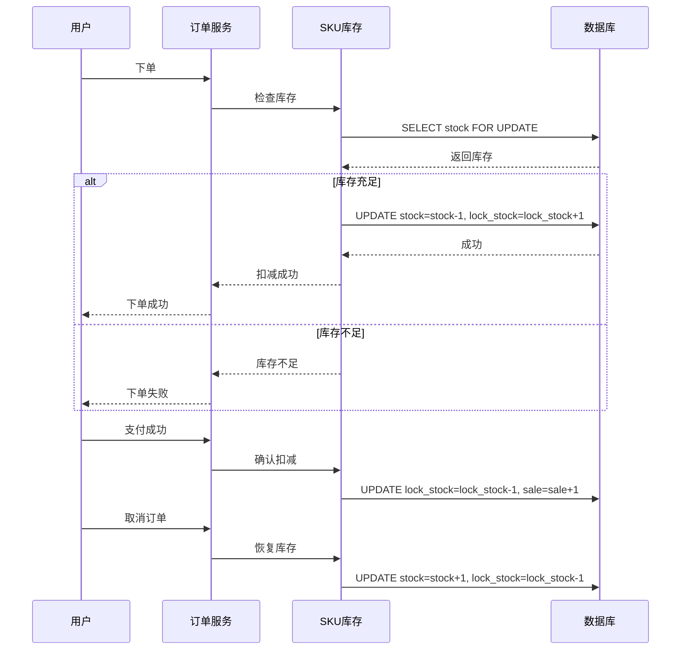

---

## API接口速查

### 1. 商品管理接口

| 接口 | 方法 | 说明 |
|------|------|------|
| `/product/create` | POST | 创建商品 |
| `/product/update/{id}` | POST | 更新商品 |
| `/product/list` | GET | 分页查询商品列表 |
| `/product/simpleList` | GET | 模糊搜索（名称/货号） |
| `/product/updateInfo/{id}` | GET | 获取商品编辑信息 |
| `/product/update/verifyStatus` | POST | 批量审核 |
| `/product/update/publishStatus` | POST | 批量上下架 |
| `/product/update/recommendStatus` | POST | 批量推荐 |
| `/product/update/newStatus` | POST | 批量新品标记 |
| `/product/update/deleteStatus` | POST | 批量删除 |
| `/product/vertifyRecord/{productId}` | GET | 查询审核记录 |

### 2. 品牌管理接口

| 接口 | 方法 | 说明 |
|------|------|------|
| `/brand/create` | POST | 创建品牌 |
| `/brand/update/{id}` | POST | 更新品牌 |
| `/brand/delete/{id}` | GET | 删除品牌 |
| `/brand/delete/batch` | POST | 批量删除 |
| `/brand/list` | GET | 分页查询品牌 |
| `/brand/listAll` | GET | 查询所有品牌 |
| `/brand/{id}` | GET | 查询品牌详情 |
| `/brand/update/showStatus` | POST | 批量更新显示状态 |

### 3. 分类管理接口

| 接口 | 方法 | 说明 |
|------|------|------|
| `/productCategory/list/withChildren` | GET | 获取分类树 |
| `/productCategory/create` | POST | 创建分类 |
| `/productCategory/update/{id}` | POST | 更新分类 |
| `/productCategory/delete/{id}` | POST | 删除分类 |
| `/productCategory/list` | GET | 分页查询分类 |

### 4. 属性管理接口

| 接口 | 方法 | 说明 |
|------|------|------|
| `/productAttribute/list/{cid}` | GET | 查询属性列表 (type: 0-规格, 1-参数) |
| `/productAttribute/create` | POST | 创建属性 |
| `/productAttribute/update/{id}` | POST | 更新属性 |
| `/productAttribute/{id}` | GET | 查询属性详情 |
| `/productAttribute/delete` | POST | 批量删除属性 |
| `/productAttribute/attrInfo/{productCategoryId}` | GET | 获取分类下的属性信息 |

---

## 关键代码解析

### 1. 分层架构

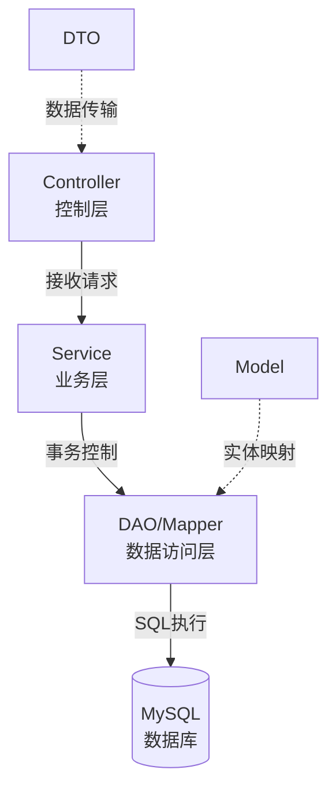

**各层职责**：
- **Controller**: 接收HTTP请求，参数校验，返回统一响应
- **Service**: 业务逻辑编排，事务管理，多表协同操作
- **DAO/Mapper**: SQL执行，数据库CRUD操作
- **DTO**: 前后端数据交互对象
- **Model**: 数据库表映射实体

---

### 2. DTO设计

**PmsProductParam**（创建/更新商品请求）：
```java
@Data
@EqualsAndHashCode(callSuper = true)
public class PmsProductParam extends PmsProduct {
    private List<PmsSkuStock> skuStockList;              // SKU列表
    private List<PmsMemberPrice> memberPriceList;        // 会员价列表
    private List<PmsProductLadder> productLadderList;    // 阶梯价列表
    private List<PmsProductFullReduction> productFullReductionList;  // 满减列表
    private List<PmsProductAttributeValue> productAttributeValueList; // 属性值列表
}
```

**PmsProductResult**（查询商品响应）：
```java
public class PmsProductResult extends PmsProductParam {
    private Long cateParentId;  // 所属分类的父ID
}
```

---

### 3. MyBatis一对多映射


```xml

<resultMap id="updateInfoMap" type="PmsProductResult">
    <!-- 主表字段 -->
    <id column="id" property="id"/>
    <result column="name" property="name"/>
<!-- 一对多：SKU列表 -->
<collection property="skuStockList" 
            ofType="PmsSkuStock"
            columnPrefix="sku_">
    <id column="id" property="id"/>
    <result column="sku_code" property="skuCode"/>
    <result column="price" property="price"/>
</collection>

<!-- 一对多：会员价列表 -->
<collection property="memberPriceList" 
            ofType="PmsMemberPrice"
            columnPrefix="member_">
    <id column="id" property="id"/>
    <result column="member_level_id" property="memberLevelId"/>
</collection>
</resultMap>
```
### 4. 事务管理

```java

@Transactional(
    isolation = Isolation.DEFAULT,    // 隔离级别：使用数据库默认
    propagation = Propagation.REQUIRED // 传播行为：必须运行在事务中
)
public int create(PmsProductParam productParam) {
    // 所有数据库操作要么全部成功，要么全部回滚
}
```

**事务失效场景**：

- ❌ 方法不是 `public`
- ❌ 同类内部调用（绕过代理）
- ❌ 异常被 `try-catch` 吞掉

**正确做法**：

```java
@Transactional
public int create(PmsProductParam productParam) {
    try {
        // 业务逻辑
    } catch (Exception e) {
        TransactionAspectSupport.currentTransactionStatus().setRollbackOnly();
        throw e; // 必须抛出异常
    }
}
```


好的！我用一个真实的商品创建例子，带你完整走一遍整个流程。

让我先查看一下数据库表结构，然后给你一个完整的实例：


**已查看文件** *商品管理模块详解.md 1-150*


好的！我用一个**真实的商品创建例子**带你完整走一遍流程：

---

# 📦 实战演练：创建一个"牛仔裤"商品

## 场景设定

假设你要在商城上架一款**七匹狼品牌的牛仔裤**。

---

## 📝 第一步：填写商品信息（基础数据）

### 用户在前端表单填写的内容：

```
✅ 商品分类: 服装 > 男装 > 牛仔裤
✅ 商品名称: 七匹狼修身牛仔裤
✅ 副标题: 2024新款弹力舒适
✅ 商品品牌: 七匹狼 (brand_id = 1)
✅ 商品介绍: 高品质牛仔布料，修身版型
❌ 商品货号: JP001
❌ 商品售价: 299.00元
❌ 市场价: 599.00元
❌ 商品库存: 500件
❌ 计量单位: 件
❌ 商品重量: 600克
❌ 排序: 10
✅ 主图: /images/jeans_main.jpg
✅ 轮播图: /images/jeans_1.jpg, /images/jeans_2.jpg, /images/jeans_3.jpg
✅ 商品详情: <div>这里是富文本详情...</div>
✅ 上架状态: 立即上架 (publish_status = 1)
❌ 推荐状态: 不推荐 (recommend_status = 0)
✅ 服务保证: 无忧退货、快速退款、免费包邮
✅ SEO标题: 七匹狼牛仔裤男2024新款修身弹力休闲裤
✅ SEO关键词: 牛仔裤,修身,七匹狼,男装
```


### 数据库操作 - 插入 pms_product 表：

```sql
INSERT INTO pms_product (
    name, sub_title, brand_id, product_category_id, 
    product_sn, price, market_price, stock, unit, weight, sort,
    pic, album_pics, detail_html,
    publish_status, recommend_status, verify_status, delete_status,
    service_ids, detail_title, keywords,
    create_time, update_time
) VALUES (
    '七匹狼修身牛仔裤',           -- 商品名称
    '2024新款弹力舒适',            -- 副标题
    1,                             -- 品牌ID（七匹狼）
    8,                             -- 分类ID（男装>牛仔裤）
    'JP001',                       -- 商品货号
    299.00,                        -- 售价
    599.00,                        -- 市场价
    500,                           -- 库存
    '件',                          -- 计量单位
    600,                           -- 重量(克)
    10,                            -- 排序
    '/images/jeans_main.jpg',      -- 主图
    '/images/jeans_1.jpg,/images/jeans_2.jpg,/images/jeans_3.jpg', -- 轮播图
    '<div>这里是富文本详情...</div>', -- 商品详情
    1,                             -- 上架状态（上架）
    0,                             -- 推荐状态（不推荐）
    0,                             -- 审核状态（待审核）
    0,                             -- 删除状态（未删除）
    '1,2,3',                       -- 服务保证ID
    '七匹狼牛仔裤男2024新款修身弹力休闲裤', -- SEO标题
    '牛仔裤,修身,七匹狼,男装',     -- SEO关键词
    NOW(), NOW()                   -- 创建时间、更新时间
);
```


**返回结果**：`product.id = 1001` （新生成的商品ID）

---

## 💰 第二步：设置商品促销（价格策略）

### 用户选择：

```
✅ 会员价格:
   - 普通会员 (level=1): 299.00元（原价）
   - 黄金会员 (level=2): 284.05元（95折）
   - 铂金会员 (level=3): 269.10元（9折）
   - 钻石会员 (level=4): 254.15元（85折）

✅ 阶梯价格:
   - 买2件: 打95折 (284.05元/件)
   - 买5件: 打85折 (254.15元/件)
   - 买10件: 打75折 (224.25元/件)

✅ 满减活动:
   - 满299减30
   - 满499减60
```


### 数据库操作：

#### 1️⃣ 插入会员价格表 (pms_member_price)

```sql
-- 插入4条会员价格记录
INSERT INTO pms_member_price (product_id, member_level_id, member_price) VALUES
(1001, 1, 299.00),   -- 普通会员
(1001, 2, 284.05),   -- 黄金会员
(1001, 3, 269.10),   -- 铂金会员
(1001, 4, 254.15);   -- 钻石会员
```


#### 2️⃣ 插入阶梯价格表 (pms_product_ladder)

```sql
-- 插入3条阶梯价格记录
INSERT INTO pms_product_ladder (product_id, count, discount) VALUES
(1001, 2, 0.95),     -- 买2件打95折
(1001, 5, 0.85),     -- 买5件打85折
(1001, 10, 0.75);    -- 买10件打75折
```


#### 3️⃣ 插入满减价格表 (pms_product_full_reduction)

```sql
-- 插入2条满减记录
INSERT INTO pms_product_full_reduction (product_id, full_price, reduce_price) VALUES
(1001, 299, 30),     -- 满299减30
(1001, 499, 60);     -- 满499减60
```


---

## 🏷️ 第三步：设置商品属性（规格参数）

### A. 规格属性（决定SKU组合）

#### 用户选择：

```
✅ 规格1 - 颜色: 蓝色、黑色、灰色
✅ 规格2 - 尺码: S、M、L、XL

系统自动生成 SKU 组合（笛卡尔积）:
3种颜色 × 4种尺码 = 12个SKU
```


#### 生成的SKU列表：

| SKU编号 | 颜色 | 尺码 | SKU编码         | 价格   | 库存 | 预警库存 |
| ------- | ---- | ---- | --------------- | ------ | ---- | -------- |
| 1       | 蓝色 | S    | 202404241001001 | 299.00 | 50   | 10       |
| 2       | 蓝色 | M    | 202404241001002 | 299.00 | 80   | 10       |
| 3       | 蓝色 | L    | 202404241001003 | 299.00 | 100  | 10       |
| 4       | 蓝色 | XL   | 202404241001004 | 299.00 | 70   | 10       |
| 5       | 黑色 | S    | 202404241001005 | 299.00 | 40   | 10       |
| 6       | 黑色 | M    | 202404241001006 | 299.00 | 60   | 10       |
| 7       | 黑色 | L    | 202404241001007 | 299.00 | 80   | 10       |
| 8       | 黑色 | XL   | 202404241001008 | 299.00 | 50   | 10       |
| 9       | 灰色 | S    | 202404241001009 | 299.00 | 30   | 10       |
| 10      | 灰色 | M    | 202404241001010 | 299.00 | 50   | 10       |
| 11      | 灰色 | L    | 202404241001011 | 299.00 | 60   | 10       |
| 12      | 灰色 | XL   | 202404241001012 | 299.00 | 30   | 10       |

**总库存**: 50+80+100+70+40+60+80+50+30+50+60+30 = **700件**

> ⚠️ 注意：这里的700件会自动更新到 `pms_product.stock` 字段（覆盖之前填的500件）

#### 数据库操作 - 插入 pms_sku_stock 表：

```sql
-- 插入12条SKU记录
INSERT INTO pms_sku_stock (
    product_id, sku_code, price, stock, lock_stock, 
    sp_data, create_time
) VALUES
(1001, '202404241001001', 299.00, 50, 0, 
 '[{"key":"颜色","value":"蓝色"},{"key":"尺码","value":"S"}]', NOW()),
(1001, '202404241001002', 299.00, 80, 0, 
 '[{"key":"颜色","value":"蓝色"},{"key":"尺码","value":"M"}]', NOW()),
(1001, '202404241001003', 299.00, 100, 0, 
 '[{"key":"颜色","value":"蓝色"},{"key":"尺码","value":"L"}]', NOW()),
(1001, '202404241001004', 299.00, 70, 0, 
 '[{"key":"颜色","value":"蓝色"},{"key":"尺码","value":"XL"}]', NOW()),
(1001, '202404241001005', 299.00, 40, 0, 
 '[{"key":"颜色","value":"黑色"},{"key":"尺码","value":"S"}]', NOW()),
(1001, '202404241001006', 299.00, 60, 0, 
 '[{"key":"颜色","value":"黑色"},{"key":"尺码","value":"M"}]', NOW()),
(1001, '202404241001007', 299.00, 80, 0, 
 '[{"key":"颜色","value":"黑色"},{"key":"尺码","value":"L"}]', NOW()),
(1001, '202404241001008', 299.00, 50, 0, 
 '[{"key":"颜色","value":"黑色"},{"key":"尺码","value":"XL"}]', NOW()),
(1001, '202404241001009', 299.00, 30, 0, 
 '[{"key":"颜色","value":"灰色"},{"key":"尺码","value":"S"}]', NOW()),
(1001, '202404241001010', 299.00, 50, 0, 
 '[{"key":"颜色","value":"灰色"},{"key":"尺码","value":"M"}]', NOW()),
(1001, '202404241001011', 299.00, 60, 0, 
 '[{"key":"颜色","value":"灰色"},{"key":"尺码","value":"L"}]', NOW()),
(1001, '202404241001012', 299.00, 30, 0, 
 '[{"key":"颜色","value":"灰色"},{"key":"尺码","value":"XL"}]', NOW());
```


**sp_data 字段说明**：
- 这是一个JSON字符串，存储该SKU的规格组合
- 例如：`[{"key":"颜色","value":"蓝色"},{"key":"尺码","value":"S"}]`
- 前端展示时解析这个JSON，显示"蓝色 S码"

---

### B. 参数属性（商品详细信息）

#### 用户填写：

```
✅ 材质成分: 98%棉 + 2%氨纶
✅ 适用季节: 春季、夏季、秋季、冬季
✅ 风格: 休闲商务
✅ 厚薄: 适中
✅ 版型: 修身
✅ 裤长: 长裤
✅ 腰型: 中腰
✅ 上市时间: 2024年春季
✅ 产地: 广东广州
✅ 洗涤说明: 30度水温机洗，不可漂白
```


#### 数据库操作 - 插入 pms_product_attribute_value 表：

```sql
-- 插入10条属性值记录
INSERT INTO pms_product_attribute_value (
    product_id, attribute_id, value, create_time
) VALUES
(1001, 101, '98%棉 + 2%氨纶', NOW()),        -- 材质成分
(1001, 102, '春季,夏季,秋季,冬季', NOW()),    -- 适用季节
(1001, 103, '休闲商务', NOW()),               -- 风格
(1001, 104, '适中', NOW()),                   -- 厚薄
(1001, 105, '修身', NOW()),                   -- 版型
(1001, 106, '长裤', NOW()),                   -- 裤长
(1001, 107, '中腰', NOW()),                   -- 腰型
(1001, 108, '2024年春季', NOW()),             -- 上市时间
(1001, 109, '广东广州', NOW()),               -- 产地
(1001, 110, '30度水温机洗，不可漂白', NOW()); -- 洗涤说明
```


**attribute_id 从哪来？**
- 这些属性ID来自 `pms_product_attribute` 表
- 当用户选择"服装类"模板时，系统自动加载该分类下的所有属性定义

---

## 🔗 第四步：商品关联（营销推广）

### 用户选择：

```
✅ 关联专题: "双11狂欢节"专题 (subject_id = 5)
✅ 关联优选: "品质好货"专区 (prefrence_area_id = 3)
✅ 搭配商品: 
   - 皮带 (product_id = 888)
   - 运动鞋 (product_id = 999)
```


### 数据库操作：

#### 1️⃣ 关联专题表 (cms_subject_product_relation)

```sql
INSERT INTO cms_subject_product_relation (subject_id, product_id) VALUES
(5, 1001);  -- 将牛仔裤加入"双11狂欢节"专题
```


#### 2️⃣ 关联优选表 (cms_prefrence_area_product_relation)

```sql
INSERT INTO cms_prefrence_area_product_relation (prefrence_area_id, product_id) VALUES
(3, 1001);  -- 将牛仔裤加入"品质好货"专区
```


#### 3️⃣ 搭配商品表 (如果有的话)

```sql
INSERT INTO pms_product_vertify_record (product_id, related_product_id, type) VALUES
(1001, 888, '搭配'),   -- 搭配皮带
(1001, 999, '搭配');   -- 搭配运动鞋
```


---

## 🔄 完整的事务流程

### Java代码执行顺序：

```java
@Transactional
public int create(PmsProductParam productParam) {
    
    // ===== 第1步：插入商品主表 =====
    PmsProduct product = productParam;
    productMapper.insertSelective(product);
    Long productId = product.getId();  // 获得 ID = 1001
    
    // ===== 第2步：处理SKU编码 =====
    // 自动生成: 20240424 + 1001 + 001 = 202404241001001
    handleSkuStockCode(productParam.getSkuStockList(), productId);
    
    // ===== 第3步：插入SKU库存表（12条记录）=====
    insertOrUpdateSkuStock(productId, productParam.getSkuStockList());
    
    // ===== 第4步：插入会员价格表（4条记录）=====
    insertOrUpdateMemberPrice(productId, productParam.getMemberPriceList());
    
    // ===== 第5步：插入阶梯价格表（3条记录）=====
    insertOrUpdateProductLadder(productId, productParam.getProductLadderList());
    
    // ===== 第6步：插入满减价格表（2条记录）=====
    insertOrUpdateFullReduction(productId, productParam.getProductFullReductionList());
    
    // ===== 第7步：插入属性值表（10条记录）=====
    insertOrUpdateAttributeValue(productId, productParam.getProductAttributeValueList());
    
    // ===== 第8步：计算总库存并更新主表 =====
    int totalStock = productParam.getSkuStockList().stream()
        .mapToInt(sku -> sku.getStock())
        .sum();  // 700件
    product.setStock(totalStock);
    productMapper.updateByPrimaryKeySelective(product);
    
    return 1;
}
```


### 事务提交：

```
BEGIN TRANSACTION;
  ✅ INSERT pms_product (1条)
  ✅ INSERT pms_sku_stock (12条)
  ✅ INSERT pms_member_price (4条)
  ✅ INSERT pms_product_ladder (3条)
  ✅ INSERT pms_product_full_reduction (2条)
  ✅ INSERT pms_product_attribute_value (10条)
  ✅ UPDATE pms_product.stock (1条)
COMMIT TRANSACTION;
```


**总计**：插入 **32条记录** + 更新 **1条记录**

---

## 🎯 最终效果

### 用户在前端看到的商品：

```
┌─────────────────────────────────────┐
│  七匹狼修身牛仔裤                     │
│  2024新款弹力舒适                     │
│                                     │
│  [主图]                              │
│  [轮播图1] [轮播图2] [轮播图3]       │
│                                     │
│  价格: ¥299.00  (市场价: ¥599.00)   │
│  库存: 700件                         │
│                                     │
│  选择颜色: [蓝色] [黑色] [灰色]      │
│  选择尺码: [S] [M] [L] [XL]         │
│                                     │
│  会员价:                             │
│  💎 钻石会员: ¥254.15 (85折)        │
│                                     │
│  优惠:                               │
│  📊 买2件打95折                      │
│  ✂️ 满299减30                        │
│                                     │
│  参数:                               │
│  • 材质: 98%棉 + 2%氨纶              │
│  • 风格: 休闲商务                    │
│  • 版型: 修身                        │
│  • 产地: 广东广州                    │
│                                     │
│  服务: ✓无忧退货 ✓快速退款 ✓免费包邮 │
│                                     │
│  [加入购物车] [立即购买]             │
└─────────────────────────────────────┘
```


---

## 💡 关键要点总结

1. **一个商品 = 1条主表记录 + N条关联表记录**
2. **SKU是笛卡尔积**：3颜色 × 4尺码 = 12个SKU
3. **促销策略可叠加**：会员价 → 阶梯价 → 满减
4. **事务保证原子性**：要么全部成功，要么全部回滚
5. **库存自动计算**：所有SKU库存之和 = 商品总库存

这样是不是清楚多了？😊


## 最佳实践

### 1. 性能优化

#### 1.1 索引优化

**必须添加索引的字段**：

```sql

-- 商品表
CREATE INDEX idx_brand_id ON pms_product(brand_id);
CREATE INDEX idx_category_id ON pms_product(product_category_id);
CREATE INDEX idx_publish_status ON pms_product(publish_status);
CREATE INDEX idx_create_time ON pms_product(create_time);

-- SKU表
CREATE INDEX idx_product_id ON pms_sku_stock(product_id);
CREATE UNIQUE INDEX uk_sku_code ON pms_sku_stock(sku_code);
```

---

#### 1.2 避免N+1查询问题

❌ **错误示例**：
```java
List<PmsProduct> products = productMapper.selectList();
for (PmsProduct product : products) {
    // 每次循环都查询一次数据库
    List<PmsSkuStock> skus = skuStockMapper.selectByProductId(product.getId());
}
// 如果有100个商品，会执行101次SQL
```

✅ **正确做法**：使用JOIN或批量查询
```java
// 方案1: 使用MyBatis的collection自动关联
List<PmsProduct> products = productMapper.selectWithSkus();

// 方案2: 批量查询
List<Long> productIds = products.stream().map(PmsProduct::getId).collect(toList());
Map<Long, List<PmsSkuStock>> skuMap = skuStockMapper.selectByProductIds(productIds)
    .stream().collect(groupingBy(PmsSkuStock::getProductId));
```

---

### 2. 数据一致性

#### 2.1 冗余字段同步

**问题**：`pms_product` 中的 `brand_name` 是冗余字段，当品牌名称修改时需要同步更新。

**解决方案**：
```java
@Transactional
public int updateBrandName(Long brandId, String newName) {
    // 1. 更新品牌表
    PmsBrand brand = new PmsBrand();
    brand.setId(brandId);
    brand.setName(newName);
    brandMapper.updateByPrimaryKeySelective(brand);
    
    // 2. 同步更新商品表中的冗余字段
    PmsProduct product = new PmsProduct();
    product.setBrandName(newName);
    PmsProductExample example = new PmsProductExample();
    example.createCriteria().andBrandIdEqualTo(brandId);
    productMapper.updateByExampleSelective(product, example);
    
    return 1;
}
```

---

#### 2.2 库存并发控制

**问题**：多个用户同时购买同一SKU，可能导致超卖。

**解决方案1：数据库锁**
```sql
-- 使用FOR UPDATE行锁
SELECT stock FROM pms_sku_stock WHERE id = 1 FOR UPDATE;
UPDATE pms_sku_stock SET stock = stock - 1 WHERE id = 1 AND stock > 0;
```

**解决方案2：乐观锁**
```sql
-- 添加version字段
UPDATE pms_sku_stock 
SET stock = stock - 1, version = version + 1 
WHERE id = 1 AND stock > 0 AND version = #{oldVersion};
```

---

### 3. 软删除机制

**优势**：
- ✅ 数据可恢复
- ✅ 保留历史记录
- ✅ 避免外键约束问题

**实现方式**：
```java
// 查询时过滤
PmsProductExample example = new PmsProductExample();
example.createCriteria()
    .andDeleteStatusEqualTo(0)  // 只查未删除的
    .andNameLike("%" + keyword + "%");
```

**定时清理**：
```sql
-- 每月清理30天前的软删除数据
DELETE FROM pms_product 
WHERE delete_status = 1 
AND update_time < DATE_SUB(NOW(), INTERVAL 30 DAY);
```

---

### 4. 缓存策略

**哪些数据适合缓存？**

| 数据类型 | 缓存策略 | TTL |
|---------|---------|-----|
| 品牌列表 | Redis Hash | 1小时 |
| 分类树 | Redis String (JSON) | 30分钟 |
| 商品详情 | Redis String (JSON) | 10分钟 |
| SKU库存 | Redis String | 实时更新 |

**Cache-Aside模式**：
```java
public PmsProduct getProductById(Long id) {
    // 1. 查缓存
    String cacheKey = "product:" + id;
    String json = redisTemplate.opsForValue().get(cacheKey);
    if (json != null) {
        return JSON.parseObject(json, PmsProduct.class);
    }
    
    // 2. 查数据库
    PmsProduct product = productMapper.selectByPrimaryKey(id);
    
    // 3. 写缓存
    if (product != null) {
        redisTemplate.opsForValue().set(cacheKey, JSON.toJSONString(product), 10, TimeUnit.MINUTES);
    }
    
    return product;
}

public int updateProduct(Long id, PmsProductParam param) {
    // 1. 更新数据库
    int count = productMapper.updateByPrimaryKeySelective(param);
    
    // 2. 删除缓存（下次查询时重新加载）
    redisTemplate.delete("product:" + id);
    
    return count;
}
```

---

### 5. 安全性

**SQL注入防护**：
```xml
<!-- ✅ 安全：使用参数化查询 -->
<select id="selectByName">
    SELECT * FROM pms_product WHERE name = #{name}
</select>

<!-- ❌ 危险：不要这样做 -->
<select id="selectByName">
    SELECT * FROM pms_product WHERE name = '${name}'
</select>
```

**权限控制**：
```java
@PostMapping("/create")
@PreAuthorize("hasAuthority('pms:product:create')")
public CommonResult create(@RequestBody PmsProductParam param) {
    // ...
}
```


---

## 总结

### 核心要点

1. ✅ **商品管理是电商系统的核心**，涉及17张表的协同操作
2. ✅ **事务保证数据一致性**，多表操作必须在一个事务中
3. ✅ **SKU是库存管理的最小单位**，规格属性决定SKU生成
4. ✅ **软删除机制**保留历史数据，支持恢复
5. ✅ **冗余字段提升查询性能**，但需注意数据同步
6. ✅ **批量操作接口**提高管理效率


---

**文档版本**: v4.0 (图表规范化版)  
**最后更新**: 2026-04-24  
**适用项目**: Mall电商后台管理系统  
**技术栈**: Spring Boot + MyBatis + MySQL  
**主要更新**:
- ✅ 添加标准ER图（仅展示实体和关系，不含字段）
- ✅ 添加表结构图（展示核心字段）
- ✅ 明确区分ER图和表结构图的职责