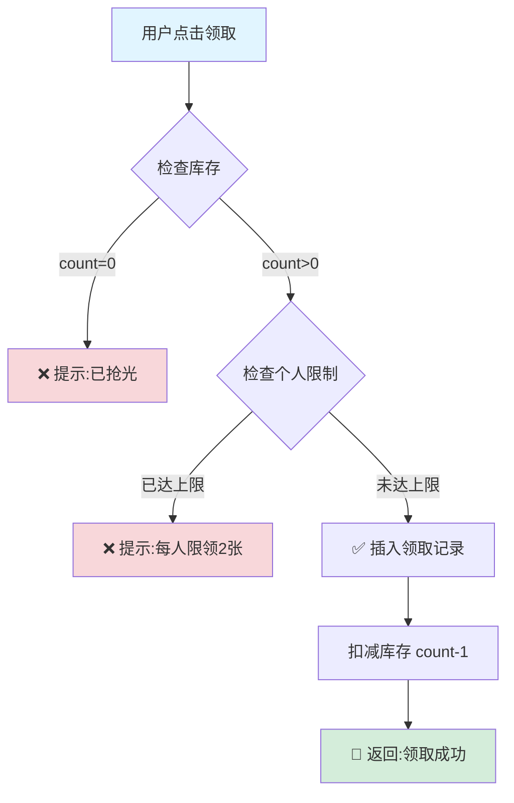
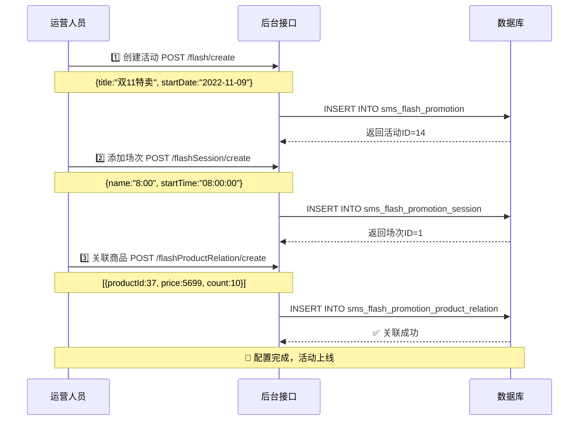
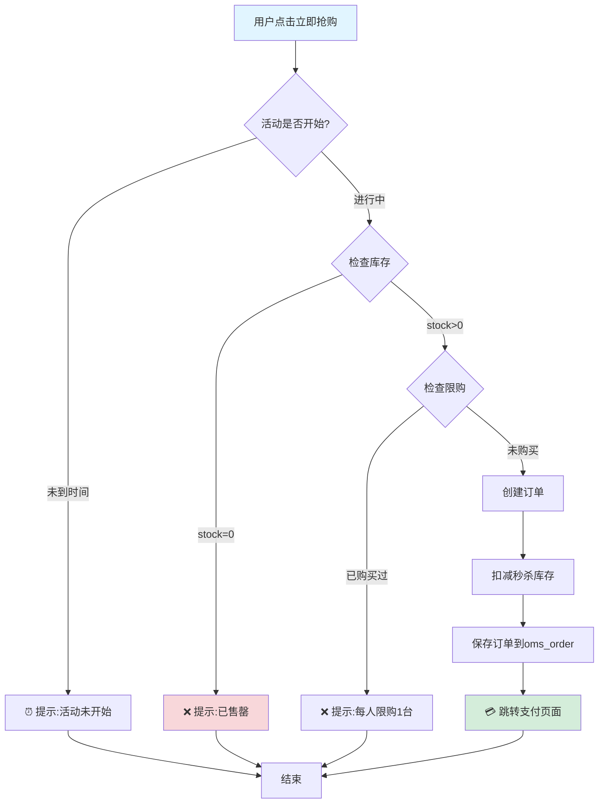
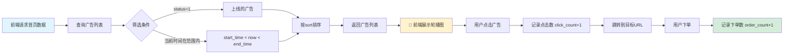
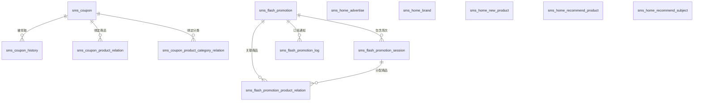
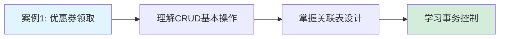
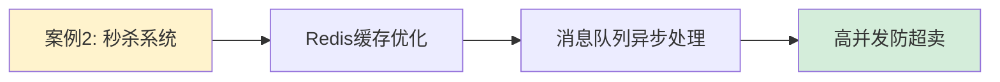
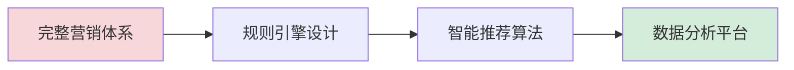

# 营销管理模块 - 核心案例速查手册

> 💡 **快速理解营销系统**：通过3个真实场景 + 数据流图，5分钟掌握核心逻辑

---

## 📋 目录

1. [案例1: 用户领取优惠券](#案例1-用户领取优惠券)
2. [案例2: 秒杀活动配置与抢购](#案例2-秒杀活动配置与抢购)
3. [案例3: 首页广告展示](#案例3-首页广告展示)
4. [13张表速查对照](#13张表速查对照)
5. [API接口清单](#api接口清单)

---

## 案例1: 用户领取优惠券

### 🎯 场景描述

用户在APP看到"满100减10元"优惠券，点击领取 → 下单时自动抵扣。

### 📊 数据流转图



### 💾 涉及的数据库操作

| 步骤 | 数据表 | SQL操作 | 说明 |
|------|--------|---------|------|
| 1️⃣ 检查库存 | `sms_coupon` | `SELECT count FROM sms_coupon WHERE id=27` | 查询剩余数量 |
| 2️⃣ 检查领取次数 | `sms_coupon_history` | `SELECT COUNT(*) FROM sms_coupon_history WHERE coupon_id=27 AND member_id=1` | 防止超领 |
| 3️⃣ 创建领取记录 | `sms_coupon_history` | `INSERT INTO sms_coupon_history (...)` | 记录谁领了什么券 |
| 4️⃣ 扣减库存 | `sms_coupon` | `UPDATE sms_coupon SET count=count-1 WHERE id=27 AND count>0` | **原子操作防超发** |

### 🔧 关键代码实现

**Service层核心逻辑** ([SmsCouponServiceImpl.java](file:///D:/course/Java/graduateProject/finish/mall/mall-admin/src/main/java/com/macro/mall/service/impl/SmsCouponServiceImpl.java)):

```java
@Transactional  // 保证事务一致性
public int create(SmsCouponParam couponParam) {
    // 1. 插入优惠券主表
    couponParam.setCount(couponParam.getPublishCount());
    insertCoupon(couponParam);
    
    // 2. 如果是指定商品券，插入关联关系
    if (couponParam.getUseType() == 2) {
        for (SmsCouponProductRelation relation : couponParam.getProductRelationList()) {
            insertProductRelation(relation);
        }
    }
    
    // 3. 如果是指定分类券，插入关联关系
    if (couponParam.getUseType() == 1) {
        for (SmsCouponProductCategoryRelation relation : couponParam.getProductCategoryRelationList()) {
            insertCategoryRelation(relation);
        }
    }
    
    return 1;
}
```

### 📝 实际数据示例

**优惠券配置**:
```json
{
  "id": 27,
  "name": "全品类通用券",
  "amount": 10.00,              // 优惠10元
  "min_point": 100.00,          // 满100可用
  "publish_count": 100,         // 发行100张
  "count": 94,                  // 剩余94张
  "per_limit": 10,              // 每人最多领10张
  "use_type": 0,                // 0=全场通用
  "start_time": "2022-11-08",
  "end_time": "2023-11-30"
}
```

**领取记录**:
```sql
-- 用户ID=1 领取了优惠券ID=27
INSERT INTO sms_coupon_history VALUES (
  37,                           -- id
  27,                           -- coupon_id
  1,                            -- member_id (用户ID)
  '7806895974110001',          -- coupon_code (券码)
  'windir',                     -- 用户昵称
  1,                            -- get_type (1=主动领取)
  '2022-11-09 15:14:29',       -- 领取时间
  1,                            -- use_status (1=已使用)
  '2022-11-09 15:14:58',       -- 使用时间
  NULL,                         -- order_id
  NULL                          -- order_sn
);
```

---

## 案例2: 秒杀活动配置与抢购

### 🎯 场景描述

运营配置"双11 iPhone 14 秒杀"：8:00场次，限量10台，每台5699元（原价6999元）。

### ⚙️ 配置流程图



### 💾 数据库配置结果

**1. 活动主表** (`sms_flash_promotion`):
```sql
INSERT INTO sms_flash_promotion VALUES (
  14,                    -- id
  '双11特卖活动',        -- title
  '2022-11-09',         -- start_date
  '2023-12-31',         -- end_date
  1,                     -- status (1=上线)
  '2022-11-09 14:56:48' -- create_time
);
```

**2. 场次表** (`sms_flash_promotion_session`):
```sql
INSERT INTO sms_flash_promotion_session VALUES (
  1,              -- id
  '8:00',         -- name
  '08:00:00',     -- start_time
  '10:00:00',     -- end_time
  1,              -- status (1=启用)
  '2018-11-16 13:22:17'
);
```

**3. 商品关联表** (`sms_flash_promotion_product_relation`):
```sql
INSERT INTO sms_flash_promotion_product_relation VALUES (
  33,             -- id
  14,             -- flash_promotion_id (活动ID)
  4,              -- flash_promotion_session_id (场次ID)
  37,             -- product_id (iPhone 14)
  5699.00,        -- flash_promotion_price (秒杀价)
  10,             -- flash_promotion_count (库存10台)
  1,              -- flash_promotion_limit (每人限购1台)
  NULL            -- sort
);
```

### 🛒 用户抢购流程



### ⚡ 高并发优化方案

**问题**: 1000人同时抢购10台手机，如何防止超卖？

**三种解决方案对比**:

| 方案 | 优点 | 缺点 | 适用场景 |
|------|------|------|----------|
| **数据库行锁** | 简单可靠 | 性能较低 | 低并发(<100 QPS) |
| **Redis预扣减** | 高性能 | 需要额外维护 | 中并发(100-1000 QPS) |
| **消息队列异步** | 削峰填谷 | 系统复杂度高 | 高并发(>1000 QPS) |

**Redis实现示例**:
```java
// 1. 活动开始前，将库存加载到Redis
redisTemplate.opsForValue().set("flash_stock_37", 10);

// 2. 抢购时，原子扣减库存
Long stock = redisTemplate.opsForValue().decrement("flash_stock_37");
if (stock < 0) {
    // 恢复库存
    redisTemplate.opsForValue().increment("flash_stock_37");
    throw new BusinessException("库存不足");
}

// 3. 异步创建订单（通过消息队列）
rabbitTemplate.convertAndSend("order.queue", orderData);
```

---

## 案例3: 首页广告展示

### 🎯 场景描述

用户在APP首页看到"小米推荐广告"轮播图，点击后跳转到小米品牌详情页。

### 📊 数据流图



### 💾 数据库查询示例

**查询APP首页广告**:
```sql
SELECT id, name, pic, url, click_count, order_count
FROM sms_home_advertise
WHERE type = 1                          -- APP端广告
  AND status = 1                        -- 上线状态
  AND start_time <= NOW()               -- 已开始
  AND end_time >= NOW()                 -- 未结束
ORDER BY sort DESC                      -- 按排序值降序
LIMIT 5;                                -- 最多5条
```

**返回结果**:
```json
[
  {
    "id": 12,
    "name": "小米推荐广告",
    "pic": "http://macro-oss.oss-cn-shenzhen.aliyuncs.com/mall/images/20221108/xiaomi_banner_01.png",
    "url": "/pages/brand/brandDetail?id=6",
    "click_count": 1523,
    "order_count": 89
  },
  {
    "id": 13,
    "name": "华为推荐广告",
    "pic": "http://macro-oss.oss-cn-shenzhen.aliyuncs.com/mall/images/20221108/huawei_banner_01.png",
    "url": "/pages/brand/brandDetail?id=3",
    "click_count": 1245,
    "order_count": 67
  }
]
```

### 📈 点击统计更新

```java
// 用户点击广告时
@PostMapping("/update/click/{id}")
public CommonResult updateClick(@PathVariable Long id) {
    // UPDATE sms_home_advertise SET click_count = click_count + 1 WHERE id = ?
    advertiseMapper.updateClickCount(id);
    return CommonResult.success();
}
```

---

## 13张表速查对照

### 📊 一图看懂表关系



### 📋 表功能对照表

| 表名 | 中文名 | 核心作用 | 关键字段 |
|------|--------|---------|----------|
| **优惠券模块** |
| `sms_coupon` | 优惠券表 | 存储优惠券规则和库存 | amount, min_point, count, use_type |
| `sms_coupon_history` | 领取记录表 | 追踪谁领了券、是否使用 | member_id, use_status, order_id |
| `sms_coupon_product_relation` | 券-商品关联 | 指定商品可用券 | coupon_id, product_id |
| `sms_coupon_product_category_relation` | 券-分类关联 | 指定分类可用券 | coupon_id, product_category_id |
| **限时购模块** |
| `sms_flash_promotion` | 限时购活动表 | 定义秒杀活动周期 | title, start_date, end_date |
| `sms_flash_promotion_session` | 场次表 | 划分时间段（8:00/10:00等） | start_time, end_time |
| `sms_flash_promotion_product_relation` | 秒杀商品关联 | 配置秒杀价格和库存 | flash_promotion_price, count |
| `sms_flash_promotion_log` | 订阅通知表 | 记录用户订阅提醒 | member_id, subscribe_time |
| **首页推荐模块** |
| `sms_home_advertise` | 首页广告表 | Banner轮播图 | pic, url, click_count |
| `sms_home_brand` | 品牌推荐表 | 首页品牌展示区 | brand_id, recommend_status |
| `sms_home_new_product` | 新品推荐表 | 最新上架商品 | product_id, sort |
| `sms_home_recommend_product` | 人气推荐表 | 热销商品展示 | product_id, recommend_status |
| `sms_home_recommend_subject` | 专题推荐表 | 内容营销专题 | subject_id, subject_name |

---

## API接口清单

### 🎫 优惠券管理

| 接口路径 | 方法 | 功能 | 示例 |
|---------|------|------|------|
| `/coupon/create` | POST | 创建优惠券 | 配置满减规则 |
| `/coupon/update/{id}` | POST | 修改优惠券 | 调整优惠金额 |
| `/coupon/delete/{id}` | POST | 删除优惠券 | 下架活动 |
| `/coupon/list` | GET | 查询优惠券列表 | 分页展示 |
| `/coupon/{id}` | GET | 获取优惠券详情 | 查看完整信息 |
| `/couponHistory/list` | GET | 查询领取记录 | 统计分析 |

### ⚡ 限时购管理

| 接口路径 | 方法 | 功能 | 示例 |
|---------|------|------|------|
| `/flash/create` | POST | 创建秒杀活动 | 双11活动 |
| `/flash/update/{id}` | POST | 修改活动 | 调整时间 |
| `/flash/delete/{id}` | POST | 删除活动 | 取消活动 |
| `/flash/update/status/{id}` | POST | 上下线切换 | 紧急下架 |
| `/flash/list` | GET | 查询活动列表 | 管理后台 |
| `/flashSession/create` | POST | 添加场次 | 8:00场次 |
| `/flashSession/list` | GET | 获取全部场次 | 场次列表 |
| `/flashProductRelation/create` | POST | 关联商品 | 配置秒杀商品 |
| `/flashProductRelation/list` | GET | 查询场次商品 | 查看参与商品 |

### 🏠 首页推荐管理

| 接口路径 | 方法 | 功能 | 示例 |
|---------|------|------|------|
| `/home/advertise/create` | POST | 添加广告 | 上传Banner |
| `/home/advertise/update/{id}` | POST | 修改广告 | 更换图片 |
| `/home/advertise/delete` | POST | 批量删除广告 | 清理过期广告 |
| `/home/advertise/update/status/{id}` | POST | 上下线切换 | 紧急下线 |
| `/home/advertise/list` | GET | 查询广告列表 | 管理后台 |
| `/home/brand/create` | POST | 添加推荐品牌 | 小米、华为 |
| `/home/brand/update/sort/{id}` | POST | 修改品牌排序 | 调整顺序 |
| `/home/newProduct/create` | POST | 添加新品推荐 | 最新上架 |
| `/home/recommendProduct/create` | POST | 添加人气推荐 | 热销商品 |
| `/home/recommendSubject/create` | POST | 添加专题推荐 | 内容营销 |

---

## 🎓 学习路线建议

### 初学者路径


### 进阶开发者路径


### 架构师路径


---

## 💡 常见问题FAQ

### Q1: 如何防止优惠券超发？
**A**: 使用数据库原子更新 + Redis预扣减
```sql
UPDATE sms_coupon SET count = count - 1 
WHERE id = ? AND count > 0;
-- 检查受影响行数，如果为0则说明库存不足
```

### Q2: 秒杀库存和普通库存有什么区别？
**A**: 
- **秒杀库存** (`flash_promotion_count`): 独立于普通库存，仅用于秒杀活动
- **普通库存** (`pms_sku_stock.stock`): 日常销售使用
- 秒杀结束后，未售出的秒杀库存**不会**自动回归普通库存

### Q3: 首页推荐数据多久更新一次？
**A**: 
- **后台配置**: 实时写入数据库
- **前端展示**: 建议缓存1-2小时（Redis）
- **统计数据**: 点击数、下单数可延迟更新（异步统计）

### Q4: 如何处理秒杀超时订单？
**A**: 定时任务自动关闭
```java
@Scheduled(cron = "0 */5 * * * ?")  // 每5分钟执行
public void closeOverdueOrders() {
    // 查询超时未支付订单
    List<OmsOrder> orders = orderMapper.selectOverdueFlashOrders(30); // 30分钟
    // 批量关闭并恢复库存
    orders.forEach(order -> orderService.closeOrder(order.getId()));
}
```

---

**文档版本**: v2.0 (案例精简版)  
**生成日期**: 2026-04-25  
**适用模块**: mall-admin (SMS模块)  
**核心表数**: 13张  
**核心案例**: 3个
