# 营销管理模块详解 (SMS - Sales Management System)

## 📋 目录

1. [模块概述](#模块概述)
2. [核心功能架构](#核心功能架构)
3. [数据库设计详解](#数据库设计详解)
4. [优惠券管理系统](#优惠券管理系统)
5. [限时购/秒杀系统](#限时购秒杀系统)
6. [首页推荐系统](#首页推荐系统)
7. [业务流程与实现](#业务流程与实现)
8. [API接口总览](#api接口总览)
9. [最佳实践与建议](#最佳实践与建议)

---

## 模块概述

### 什么是营销管理模块？

**营销管理模块 (Sales Management System, SMS)** 是电商系统的核心业务模块之一，主要负责管理和配置各种促销活动、优惠策略以及首页展示内容。该模块通过多样化的营销手段吸引用户、提升转化率和客单价。

### 核心价值

- **提升销售**: 通过优惠券、秒杀等促销手段刺激消费
- **用户留存**: 通过会员专属券、积分兑换等方式增强用户粘性
- **流量引导**: 通过首页广告、推荐位引导用户关注重点商品
- **库存清理**: 通过限时购快速消化库存积压

### 技术架构

| 技术栈 | 说明 |
|--------|------|
| **后端框架** | Spring Boot + MyBatis |
| **数据库** | MySQL 5.7+ |
| **缓存** | Redis（可选，用于高并发场景） |
| **消息队列** | RabbitMQ（可选，用于异步通知） |

---

## 核心功能架构

营销管理模块包含三大核心子系统：

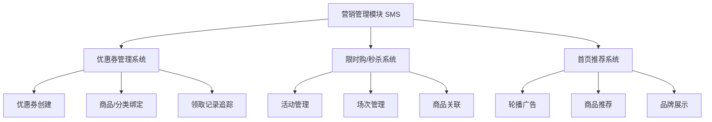

### 功能模块划分

| 子模块 | 功能描述 | 主要数据表 |
|--------|----------|-----------|
| **优惠券管理** | 创建、发放、追踪优惠券使用情况 | `sms_coupon`, `sms_coupon_history` |
| **限时购管理** | 配置秒杀活动、场次、参与商品 | `sms_flash_promotion`, `sms_flash_promotion_session` |
| **首页广告** | 管理首页轮播图、跳转链接 | `sms_home_advertise` |
| **首页推荐** | 配置品牌、新品、人气商品、专题推荐 | `sms_home_brand`, `sms_home_new_product` 等 |

---

## 数据库设计详解

### 数据库表统计

营销管理模块共包含 **13张核心数据表**，按功能分类如下：

| 分类 | 表数量 | 表名列表 |
|------|--------|----------|
| 优惠券相关 | 4张 | `sms_coupon`, `sms_coupon_history`, `sms_coupon_product_relation`, `sms_coupon_product_category_relation` |
| 限时购相关 | 4张 | `sms_flash_promotion`, `sms_flash_promotion_session`, `sms_flash_promotion_product_relation`, `sms_flash_promotion_log` |
| 首页推荐相关 | 5张 | `sms_home_advertise`, `sms_home_brand`, `sms_home_new_product`, `sms_home_recommend_product`, `sms_home_recommend_subject` |

### 核心实体关系图

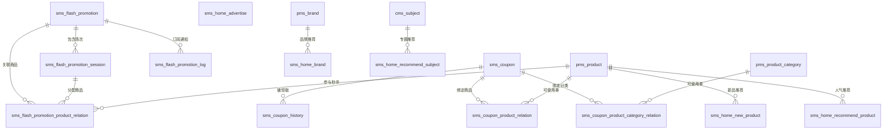

---

## 优惠券管理系统

### 1. 核心数据表

#### 1.1 优惠券主表 (`sms_coupon`)

**功能说明**: 存储优惠券的基本信息、使用规则、发行量等核心数据。

| 字段名 | 类型 | 说明 | 示例值 |
|--------|------|------|--------|
| `id` | bigint(20) | 主键ID | 27 |
| `type` | int(1) | 优惠券类型 | 0->全场赠券; 1->会员赠券; 2->购物赠券; 3->注册赠券 |
| `name` | varchar(100) | 优惠券名称 | "全品类通用券" |
| `platform` | int(1) | 使用平台 | 0->全部; 1->移动; 2->PC |
| `count` | int(11) | 剩余数量 | 94 |
| `amount` | decimal(10,2) | 优惠金额 | 10.00 |
| `per_limit` | int(11) | 每人限领张数 | 10 |
| `min_point` | decimal(10,2) | 使用门槛（满多少可用） | 100.00 |
| `start_time` | datetime | 有效期开始时间 | 2022-11-08 00:00:00 |
| `end_time` | datetime | 有效期结束时间 | 2023-11-30 00:00:00 |
| `use_type` | int(1) | 使用范围类型 | 0->全场通用; 1->指定分类; 2->指定商品 |
| `publish_count` | int(11) | 发行总量 | 100 |
| `use_count` | int(11) | 已使用数量 | 0 |
| `receive_count` | int(11) | 已领取数量 | 6 |
| `member_level` | int(1) | 可领取的会员等级 | 0->无限制 |

**关键设计要点**:
- **冗余字段优化**: `count`（剩余数量）、`use_count`（已使用）、`receive_count`（已领取）避免频繁聚合查询
- **灵活的使用范围**: 通过 `use_type` 区分全场/分类/商品三种模式
- **会员分级营销**: `member_level` 支持针对不同等级会员发放专属券

#### 1.2 优惠券领取历史表 (`sms_coupon_history`)

**功能说明**: 记录每张优惠券的领取人、领取时间、使用状态等信息。

| 字段名 | 类型 | 说明 |
|--------|------|------|
| `id` | bigint(20) | 主键ID |
| `coupon_id` | bigint(20) | 优惠券ID（外键） |
| `member_id` | bigint(20) | 会员ID（外键） |
| `coupon_code` | varchar(64) | 优惠券码（唯一标识） |
| `get_type` | int(1) | 获取方式：0->后台赠送; 1->主动领取 |
| `use_status` | int(1) | 使用状态：0->未使用; 1->已使用; 2->已过期 |
| `use_time` | datetime | 使用时间 |
| `order_id` | bigint(20) | 使用的订单ID |
| `order_sn` | varchar(100) | 订单编号 |

**索引设计**:
```sql
INDEX `idx_member_id`(`member_id`)  -- 快速查询用户的优惠券
INDEX `idx_coupon_id`(`coupon_id`)  -- 快速查询某券的领取情况
```

#### 1.3 优惠券商品关联表 (`sms_coupon_product_relation`)

**功能说明**: 当 `use_type=2`（指定商品）时，记录优惠券可用的具体商品列表。

| 字段名 | 类型 | 说明 |
|--------|------|------|
| `id` | bigint(20) | 主键ID |
| `coupon_id` | bigint(20) | 优惠券ID |
| `product_id` | bigint(20) | 商品ID |
| `product_name` | varchar(500) | 商品名称（冗余字段） |
| `product_sn` | varchar(200) | 商品编码（冗余字段） |

#### 1.4 优惠券分类关联表 (`sms_coupon_product_category_relation`)

**功能说明**: 当 `use_type=1`（指定分类）时，记录优惠券可用的商品分类。

| 字段名 | 类型 | 说明 |
|--------|------|------|
| `id` | bigint(20) | 主键ID |
| `coupon_id` | bigint(20) | 优惠券ID |
| `product_category_id` | bigint(20) | 商品分类ID |
| `product_category_name` | varchar(200) | 分类名称（冗余） |
| `parent_category_name` | varchar(200) | 父分类名称（冗余） |

### 2. 优惠券类型详解

#### 2.1 按获取方式分类 (`type` 字段)

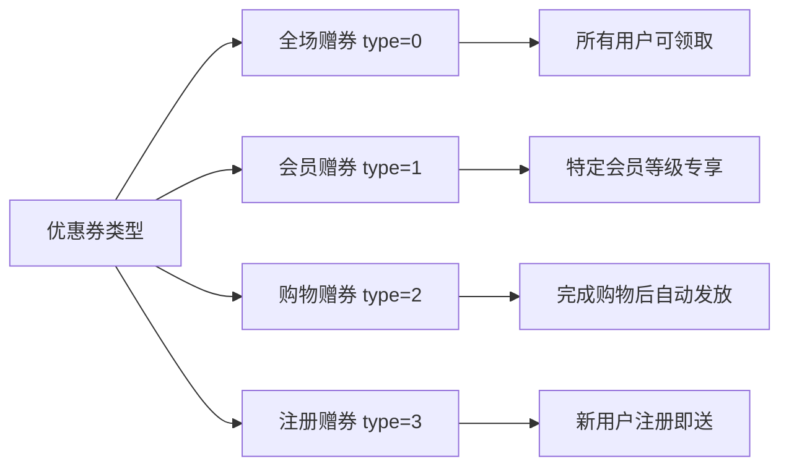

| 类型值 | 名称 | 适用场景 | 营销目的 |
|--------|------|----------|----------|
| 0 | 全场赠券 | 大促活动、节日促销 | 提升整体销量 |
| 1 | 会员赠券 | 会员日、VIP专属活动 | 增强会员粘性 |
| 2 | 购物赠券 | 满赠活动、复购激励 | 促进二次消费 |
| 3 | 注册赠券 | 新用户拉新 | 降低首次购买门槛 |

#### 2.2 按使用范围分类 (`use_type` 字段)

| 使用类型 | 说明 | 关联表 | 示例 |
|---------|------|--------|------|
| 0 | 全场通用 | 无需关联 | "满100减10，所有商品可用" |
| 1 | 指定分类 | `sms_coupon_product_category_relation` | "手机分类满1000减100" |
| 2 | 指定商品 | `sms_coupon_product_relation` | "iPhone 14专用券减600" |

### 3. 业务流程

#### 3.1 优惠券创建流程

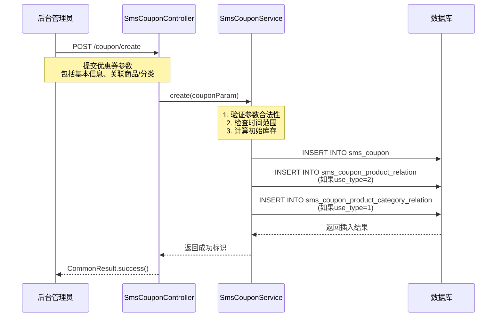

**代码示例** ([SmsCouponServiceImpl.java](file:///D:/course/Java/graduateProject/finish/mall/mall-admin/src/main/java/com/macro/mall/service/impl/SmsCouponServiceImpl.java)):

```java
@Transactional  // 保证数据一致性
public int create(SmsCouponParam couponParam) {
    // 1. 插入优惠券主表
    couponParam.setCount(couponParam.getPublishCount());
    couponParam.setUseCount(0);
    couponParam.setReceiveCount(0);
    insertCoupon(couponParam);
    
    // 2. 处理商品关联关系
    if (couponParam.getUseType() == 2) {
        for (SmsCouponProductRelation productRelation : couponParam.getProductRelationList()) {
            insertProductRelation(productRelation);
        }
    }
    
    // 3. 处理分类关联关系
    if (couponParam.getUseType() == 1) {
        for (SmsCouponProductCategoryRelation categoryRelation : couponParam.getProductCategoryRelationList()) {
            insertCategoryRelation(categoryRelation);
        }
    }
    
    return 1;
}
```

#### 3.2 用户领取优惠券流程

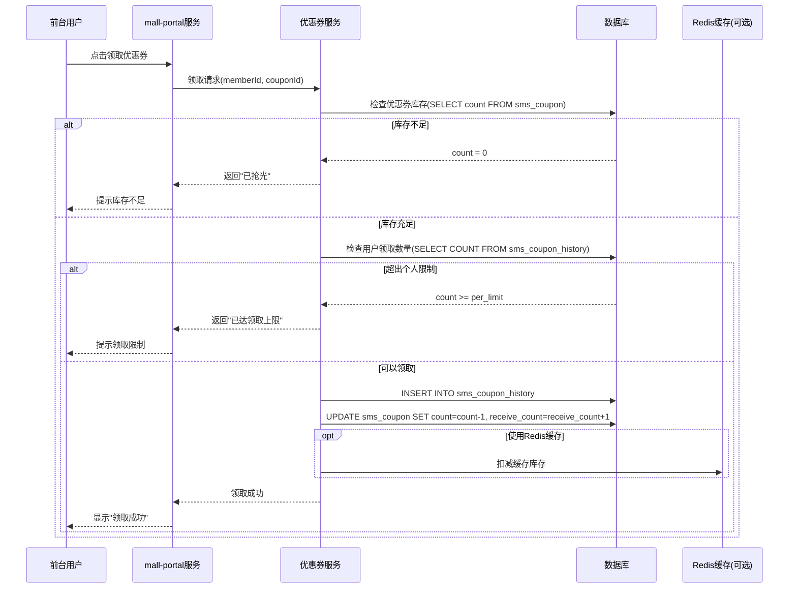

**关键SQL逻辑**:

```sql
-- 1. 检查库存
SELECT count FROM sms_coupon WHERE id = ? AND count > 0;

-- 2. 检查用户领取数量
SELECT COUNT(*) FROM sms_coupon_history 
WHERE coupon_id = ? AND member_id = ?;

-- 3. 创建领取记录
INSERT INTO sms_coupon_history (coupon_id, member_id, coupon_code, get_type, create_time) 
VALUES (?, ?, ?, 1, NOW());

-- 4. 扣减库存（原子操作，防止超发）
UPDATE sms_coupon 
SET count = count - 1, receive_count = receive_count + 1 
WHERE id = ? AND count > 0;
```

**并发控制要点**:
- 使用数据库行锁（`UPDATE ... WHERE count > 0`）防止超发
- 高并发场景建议引入 Redis 分布式锁或 Lua 脚本
- 优惠券码生成需保证唯一性（可使用雪花算法或UUID）

#### 3.3 订单使用优惠券流程

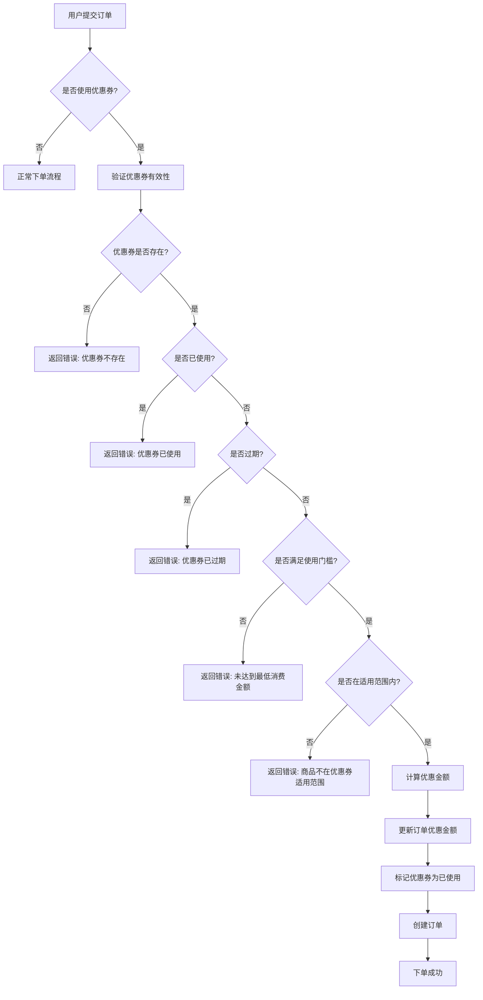

**验证逻辑伪代码**:

```java
public void validateCoupon(Long couponId, Long memberId, BigDecimal orderAmount, List<Long> productIds) {
    // 1. 查询优惠券历史记录
    SmsCouponHistory history = couponHistoryMapper.selectByCouponAndMember(couponId, memberId);
    
    if (history == null) {
        throw new BusinessException("优惠券不存在");
    }
    
    if (history.getUseStatus() == 1) {
        throw new BusinessException("优惠券已使用");
    }
    
    if (history.getUseStatus() == 2 || new Date().after(coupon.getEndTime())) {
        throw new BusinessException("优惠券已过期");
    }
    
    // 2. 检查使用门槛
    if (orderAmount.compareTo(coupon.getMinPoint()) < 0) {
        throw new BusinessException("未达到优惠券使用门槛");
    }
    
    // 3. 检查适用范围
    if (coupon.getUseType() == 1) {
        // 检查商品分类是否在允许范围内
        validateCategoryRestriction(couponId, productIds);
    } else if (coupon.getUseType() == 2) {
        // 检查商品是否在允许范围内
        validateProductRestriction(couponId, productIds);
    }
}
```

---

## 限时购/秒杀系统

### 1. 核心概念

**限时购 (Flash Promotion)** 又称**秒杀**，是一种在特定时间段内以超低价格销售商品的营销活动。其特点是：
- **时间短**: 通常持续几小时甚至几分钟
- **价格低**: 远低于正常售价
- **库存有限**: 限量供应，售完即止
- **并发高**: 大量用户同时抢购

### 2. 核心数据表

#### 2.1 限时购活动表 (`sms_flash_promotion`)

**功能说明**: 定义一个完整的秒杀活动周期（如"双11秒杀活动"）。

| 字段名 | 类型 | 说明 | 示例 |
|--------|------|------|------|
| `id` | bigint(20) | 主键ID | 14 |
| `title` | varchar(200) | 活动标题 | "双11特卖活动" |
| `start_date` | date | 活动开始日期 | 2022-11-09 |
| `end_date` | date | 活动结束日期 | 2023-12-31 |
| `status` | int(1) | 上下线状态 | 0->下线; 1->上线 |
| `create_time` | datetime | 创建时间 | 2022-11-09 14:56:48 |

**设计要点**:
- 活动是一个时间范围，内部包含多个**场次 (Session)**
- `status` 字段控制活动是否对外可见

#### 2.2 限时购场次表 (`sms_flash_promotion_session`)

**功能说明**: 将一天划分为多个时间段，每个时间段为一个场次（如"8:00-10:00场次"）。

| 字段名 | 类型 | 说明 | 示例 |
|--------|------|------|------|
| `id` | bigint(20) | 主键ID | 1 |
| `name` | varchar(200) | 场次名称 | "8:00" |
| `start_time` | time | 每日开始时间 | 08:00:00 |
| `end_time` | time | 每日结束时间 | 10:00:00 |
| `status` | int(1) | 启用状态 | 0->不启用; 1->启用 |

**典型场次配置**:

| 场次ID | 名称 | 开始时间 | 结束时间 | 说明 |
|--------|------|----------|----------|------|
| 1 | 8:00 | 08:00:00 | 10:00:00 | 早间场 |
| 2 | 10:00 | 10:00:00 | 12:00:00 | 上午场 |
| 3 | 12:00 | 12:00:00 | 14:00:00 | 午间场 |
| 4 | 14:00 | 14:00:00 | 16:00:00 | 下午场 |
| 5 | 16:00 | 16:00:00 | 18:00:00 | 傍晚场 |
| 6 | 18:00 | 18:00:00 | 20:00:00 | 晚间场 |
| 7 | 20:00 | 20:00:00 | 22:00:00 | 夜场 |

**设计优势**:
- 分流用户访问压力，避免所有用户在同一时间抢购
- 不同场次可配置不同商品，增加用户活跃度

#### 2.3 限时购商品关联表 (`sms_flash_promotion_product_relation`)

**功能说明**: 记录哪些商品参与哪个活动的哪个场次，以及秒杀价格、库存等信息。

| 字段名 | 类型 | 说明 | 示例 |
|--------|------|------|------|
| `id` | bigint(20) | 主键ID | 1 |
| `flash_promotion_id` | bigint(20) | 限时购活动ID | 14 |
| `flash_promotion_session_id` | bigint(20) | 场次ID | 1 |
| `product_id` | bigint(20) | 商品ID | 26 |
| `flash_promotion_price` | decimal(10,2) | 秒杀价格 | 3000.00 |
| `flash_promotion_count` | int(11) | 秒杀库存 | 10 |
| `flash_promotion_limit` | int(11) | 每人限购数量 | 1 |
| `sort` | int(11) | 排序 | 0 |

**关键设计**:
- **三维度关联**: 活动 + 场次 + 商品，灵活配置
- **独立库存**: `flash_promotion_count` 与普通商品库存分离，防止影响正常销售
- **限购机制**: `flash_promotion_limit` 防止黄牛刷单

#### 2.4 限时购通知记录表 (`sms_flash_promotion_log`)

**功能说明**: 记录用户订阅的秒杀提醒，活动开始前发送通知。

| 字段名 | 类型 | 说明 |
|--------|------|------|
| `id` | int(11) | 主键ID |
| `member_id` | int(11) | 会员ID |
| `product_id` | bigint(20) | 商品ID |
| `member_phone` | varchar(64) | 手机号 |
| `subscribe_time` | datetime | 订阅时间 |
| `send_time` | datetime | 通知发送时间 |

**应用场景**:
- 用户提前订阅感兴趣的秒杀商品
- 系统在活动开始前10分钟发送短信/Push通知
- 提高活动参与率和转化率

### 3. 业务流程

#### 3.1 秒杀活动配置流程

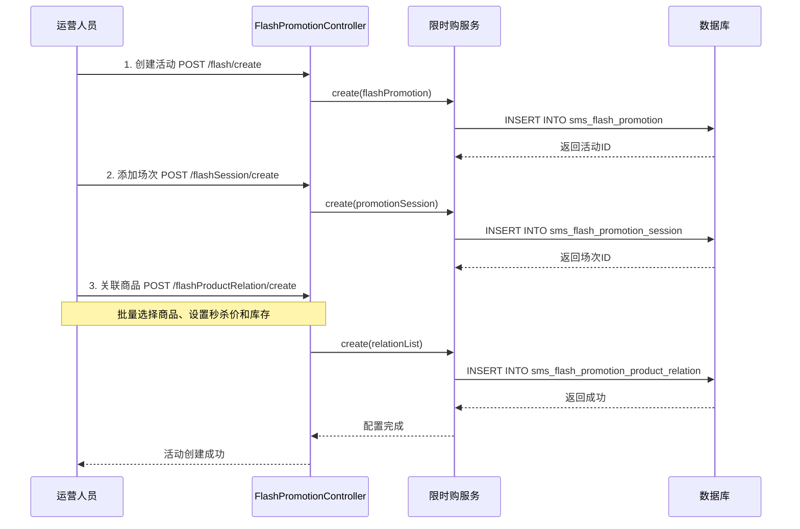

**配置示例**:

```json
// 1. 创建活动
{
  "title": "双11特卖活动",
  "startDate": "2022-11-09",
  "endDate": "2022-11-11",
  "status": 1
}

// 2. 关联商品（批量）
[
  {
    "flashPromotionId": 14,
    "flashPromotionSessionId": 1,
    "productId": 26,
    "flashPromotionPrice": 3000.00,
    "flashPromotionCount": 10,
    "flashPromotionLimit": 1,
    "sort": 0
  },
  {
    "flashPromotionId": 14,
    "flashPromotionSessionId": 1,
    "productId": 27,
    "flashPromotionPrice": 2000.00,
    "flashPromotionCount": 10,
    "flashPromotionLimit": 1,
    "sort": 20
  }
]
```

#### 3.2 用户秒杀下单流程

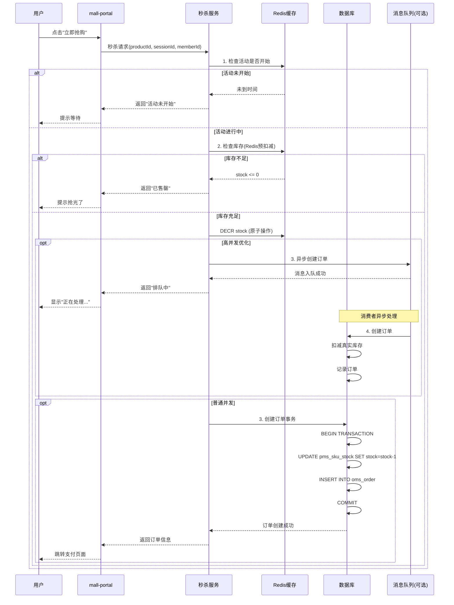

**高并发优化策略**:

1. **Redis预扣减库存**: 
   ```java
   // 使用Redis原子操作防止超卖
   Long stock = redisTemplate.opsForValue().decrement("flash_stock_" + productId);
   if (stock < 0) {
       // 恢复库存
       redisTemplate.opsForValue().increment("flash_stock_" + productId);
       throw new BusinessException("库存不足");
   }
   ```

2. **限流控制**:
   - 使用令牌桶算法限制每秒请求数
   - 同一用户短时间内只能请求一次

3. **异步订单创建**:
   - 秒杀成功后将订单信息发送到消息队列
   - 消费者异步处理订单创建，削峰填谷

4. **数据库乐观锁**:
   ```sql
   UPDATE pms_sku_stock 
   SET stock = stock - 1 
   WHERE id = ? AND stock > 0;
   ```

#### 3.3 超时订单自动关闭

**业务背景**: 秒杀订单需要在短时间内完成支付，否则释放库存给其他用户。

**配置表**: `oms_order_setting`

| 字段 | 说明 | 示例值 |
|------|------|--------|
| `flash_order_overtime` | 秒杀订单超时时间（分钟） | 30 |
| `normal_order_overtime` | 普通订单超时时间（分钟） | 120 |

**实现方案**:

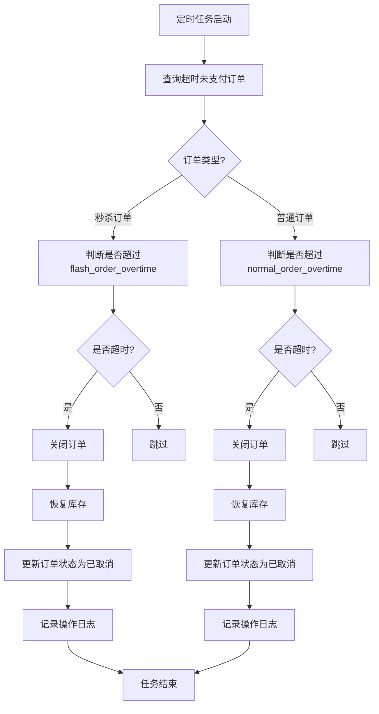

**定时任务代码示例**:

```java
@Scheduled(cron = "0 */5 * * * ?")  // 每5分钟执行一次
public void closeOverdueOrders() {
    // 1. 查询超时的秒杀订单
    List<OmsOrder> flashOrders = orderMapper.selectOverdueFlashOrders(
        setting.getFlashOrderOvertime()
    );
    
    // 2. 批量关闭订单
    for (OmsOrder order : flashOrders) {
        orderService.closeOrder(order.getId(), "秒杀订单超时自动关闭");
        // 内部会恢复库存、更新订单状态、记录操作日志
    }
}
```

---

## 首页推荐系统

### 1. 功能概述

首页推荐系统负责配置和管理APP/PC端首页展示的内容，包括：
- **轮播广告**: Banner图、活动入口
- **品牌推荐**: 热门品牌展示
- **新品推荐**: 最新上架商品
- **人气推荐**: 热销商品
- **专题推荐**: 内容营销专题

### 2. 核心数据表

#### 2.1 首页轮播广告表 (`sms_home_advertise`)

| 字段名 | 类型 | 说明 |
|--------|------|------|
| `id` | bigint(20) | 主键ID |
| `name` | varchar(100) | 广告名称 |
| `type` | int(1) | 轮播位置：0->PC首页; 1->APP首页 |
| `pic` | varchar(500) | 图片地址 |
| `start_time` | datetime | 开始时间 |
| `end_time` | datetime | 结束时间 |
| `status` | int(1) | 上下线状态：0->下线; 1->上线 |
| `click_count` | int(11) | 点击数（统计用） |
| `order_count` | int(11) | 下单数（统计用） |
| `url` | varchar(500) | 跳转链接 |
| `sort` | int(11) | 排序（值越大越靠前） |

**应用场景**:
- 大促活动Banner（如双11、618）
- 品牌推广广告
- 新品上市宣传

#### 2.2 首页推荐品牌表 (`sms_home_brand`)

| 字段名 | 类型 | 说明 |
|--------|------|------|
| `id` | bigint(20) | 主键ID |
| `brand_id` | bigint(20) | 品牌ID（关联 `pms_brand`） |
| `brand_name` | varchar(64) | 品牌名称（冗余） |
| `recommend_status` | int(1) | 推荐状态：0->不推荐; 1->推荐 |
| `sort` | int(11) | 排序 |

**前端展示效果**:
```
┌─────────────────────────────────┐
│     品牌精选                     │
├──────┬──────┬──────┬──────┤
│ 小米 │ 华为 │ 苹果 │ 三星 │
└──────┴──────┴──────┴──────┘
```

#### 2.3 首页新品推荐表 (`sms_home_new_product`)

| 字段名 | 类型 | 说明 |
|--------|------|------|
| `id` | bigint(20) | 主键ID |
| `product_id` | bigint(20) | 商品ID |
| `product_name` | varchar(500) | 商品名称（冗余） |
| `recommend_status` | int(1) | 推荐状态 |
| `sort` | int(11) | 排序 |

**业务价值**: 
- 突出新品，吸引用户关注
- 帮助商家快速推广新上架商品

#### 2.4 首页人气推荐表 (`sms_home_recommend_product`)

| 字段名 | 类型 | 说明 |
|--------|------|------|
| `id` | bigint(20) | 主键ID |
| `product_id` | bigint(20) | 商品ID |
| `product_name` | varchar(500) | 商品名称 |
| `recommend_status` | int(1) | 推荐状态 |
| `sort` | int(11) | 排序 |

**推荐逻辑**:
- 人工配置：运营根据销售数据手动选择
- 自动推荐：基于销量、浏览量等指标自动计算（可扩展）

#### 2.5 首页专题推荐表 (`sms_home_recommend_subject`)

| 字段名 | 类型 | 说明 |
|--------|------|------|
| `id` | bigint(20) | 主键ID |
| `subject_id` | bigint(20) | 专题ID（关联 `cms_subject`） |
| `subject_name` | varchar(64) | 专题名称 |
| `recommend_status` | int(1) | 推荐状态 |
| `sort` | int(11) | 排序 |

**专题示例**:
- "夏季穿搭指南"
- "数码产品评测"
- "品牌故事"

### 3. 配置管理流程

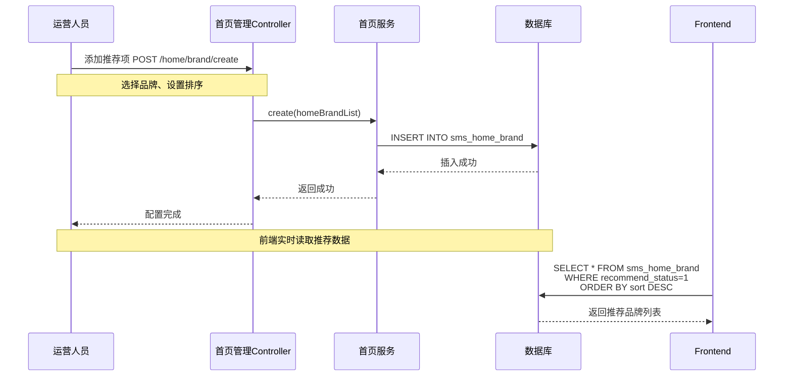

**统一的管理接口模式**:

所有首页推荐模块都遵循相同的设计模式：

| 操作 | 接口路径示例 | 说明 |
|------|-------------|------|
| 添加推荐 | `/home/brand/create` | 批量添加推荐项 |
| 删除推荐 | `/home/brand/delete` | 批量删除（传入IDs） |
| 修改状态 | `/home/brand/update/recommendStatus` | 批量启用/禁用 |
| 调整排序 | `/home/brand/update/sort/{id}` | 修改单个排序值 |
| 分页查询 | `/home/brand/list` | 后台管理列表 |

---

## 业务流程与实现

### 1. 完整营销活动生命周期


### 2. 优惠券与订单的集成

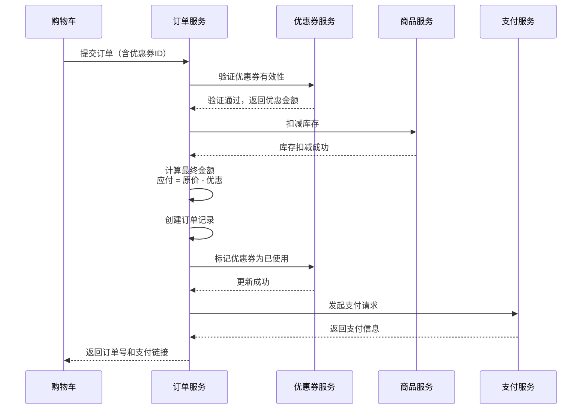

### 3. 数据统计与分析

**关键指标**:

| 指标类型 | 计算方式 | 业务意义 |
|---------|---------|---------|
| **优惠券领取率** | 领取数量 / 发行数量 | 评估活动吸引力 |
| **优惠券使用率** | 使用数量 / 领取数量 | 评估转化效果 |
| **ROI (投资回报率)** | (销售额 - 优惠成本) / 优惠成本 | 评估活动收益 |
| **秒杀参与度** | 参与人数 / 活跃用户数 | 评估活动热度 |
| **广告点击率** | 点击数 / 曝光数 | 评估广告效果 |

**数据表支持**:
- `sms_coupon_history`: 统计领取和使用情况
- `sms_home_advertise`: 记录 `click_count` 和 `order_count`
- `oms_order`: 关联优惠券ID，分析优惠对销售的贡献

---

## API接口总览

### 1. 优惠券管理接口

| 接口路径 | 请求方式 | 功能描述 | 权限要求 |
|---------|---------|---------|---------|
| `/coupon/create` | POST | 创建优惠券 | 管理员 |
| `/coupon/update/{id}` | POST | 修改优惠券 | 管理员 |
| `/coupon/delete/{id}` | POST | 删除优惠券 | 管理员 |
| `/coupon/list` | GET | 分页查询优惠券列表 | 管理员 |
| `/coupon/{id}` | GET | 获取优惠券详情 | 管理员 |
| `/couponHistory/list` | GET | 查询领取记录 | 管理员 |

**请求示例**:

```bash
# 创建优惠券
POST http://localhost:8080/coupon/create
Content-Type: application/json

{
  "type": 0,
  "name": "双11全场券",
  "platform": 0,
  "publishCount": 1000,
  "amount": 50.00,
  "perLimit": 2,
  "minPoint": 500.00,
  "startTime": "2022-11-01 00:00:00",
  "endTime": "2022-11-11 23:59:59",
  "useType": 0,
  "memberLevel": 0
}
```

### 2. 限时购管理接口

| 接口路径 | 请求方式 | 功能描述 |
|---------|---------|---------|
| `/flash/create` | POST | 创建限时购活动 |
| `/flash/update/{id}` | POST | 修改活动 |
| `/flash/delete/{id}` | POST | 删除活动 |
| `/flash/update/status/{id}` | POST | 修改上下线状态 |
| `/flash/list` | GET | 分页查询活动列表 |
| `/flashSession/create` | POST | 添加场次 |
| `/flashSession/list` | GET | 获取全部场次 |
| `/flashProductRelation/create` | POST | 批量关联商品 |
| `/flashProductRelation/list` | GET | 查询场次商品列表 |

### 3. 首页推荐接口

| 接口路径 | 请求方式 | 功能描述 |
|---------|---------|---------|
| `/home/advertise/create` | POST | 添加广告 |
| `/home/advertise/update/{id}` | POST | 修改广告 |
| `/home/advertise/delete` | POST | 批量删除广告 |
| `/home/advertise/update/status/{id}` | POST | 修改上下线状态 |
| `/home/advertise/list` | GET | 分页查询广告 |
| `/home/brand/create` | POST | 添加推荐品牌 |
| `/home/brand/update/sort/{id}` | POST | 修改品牌排序 |
| `/home/brand/update/recommendStatus` | POST | 批量修改推荐状态 |
| `/home/newProduct/create` | POST | 添加新品推荐 |
| `/home/recommendProduct/create` | POST | 添加人气推荐 |
| `/home/recommendSubject/create` | POST | 添加专题推荐 |

---

## 最佳实践与建议

### 1. 数据库优化

#### 1.1 索引优化

**必须添加的索引**:

```sql
-- 优惠券历史表
CREATE INDEX idx_member_id ON sms_coupon_history(member_id);
CREATE INDEX idx_coupon_id ON sms_coupon_history(coupon_id);
CREATE INDEX idx_use_status ON sms_coupon_history(use_status);

-- 限时购商品关联表
CREATE INDEX idx_flash_promotion_id ON sms_flash_promotion_product_relation(flash_promotion_id);
CREATE INDEX idx_session_id ON sms_flash_promotion_product_relation(flash_promotion_session_id);
CREATE INDEX idx_product_id ON sms_flash_promotion_product_relation(product_id);

-- 首页广告表
CREATE INDEX idx_status_time ON sms_home_advertise(status, start_time, end_time);
```

#### 1.2 读写分离

**高频读操作**:
- 首页推荐数据（广告、品牌、商品推荐）
- 优惠券列表查询
- 限时购商品列表

**优化方案**:
- 主库处理写操作（创建、修改、删除）
- 从库处理读操作（查询列表、详情）
- 引入Redis缓存热点数据

#### 1.3 分库分表策略

**需要分表的场景**:
- `sms_coupon_history`: 当数据量超过500万时，按 `member_id` 哈希分表
- `sms_flash_promotion_log`: 按月份归档历史数据

**分表示例**:
```sql
-- 按会员ID哈希分10张表
sms_coupon_history_0, sms_coupon_history_1, ..., sms_coupon_history_9

-- 路由规则
table_index = member_id % 10
```

### 2. 高并发优化

#### 2.1 Redis缓存策略

**缓存内容**:
```java
// 1. 首页推荐数据（变化频率低）
redis.setex("home_advertise_app", 3600, advertiseList);  // 缓存1小时
redis.setex("home_brands", 7200, brandList);             // 缓存2小时

// 2. 秒杀库存（高频访问）
redis.set("flash_stock_" + productId, initialStock);

// 3. 优惠券库存
redis.set("coupon_stock_" + couponId, count);
```

**缓存更新策略**:
- **写操作**: 先更新数据库，再删除缓存（Cache Aside Pattern）
- **读操作**: 先查缓存，未命中再查数据库并写入缓存

#### 2.2 限流与降级

**限流方案**:
```java
// 使用Guava RateLimiter限制每秒请求数
private static final RateLimiter rateLimiter = RateLimiter.create(1000);

public CommonResult seckill(Long productId) {
    if (!rateLimiter.tryAcquire()) {
        return CommonResult.failed("系统繁忙，请稍后再试");
    }
    // 处理秒杀逻辑
}
```

**降级策略**:
- 秒杀高峰期关闭非核心功能（如评论、推荐）
- 返回静态页面替代动态内容
- 使用本地缓存替代数据库查询

### 3. 数据安全

#### 3.1 防止超发

**数据库层面**:
```sql
-- 使用原子更新，确保库存不会为负
UPDATE sms_coupon 
SET count = count - 1 
WHERE id = ? AND count > 0;

-- 检查受影响行数
if (affectedRows == 0) {
    throw new BusinessException("库存不足");
}
```

**Redis层面**:
```lua
-- Lua脚本保证原子性
local stock = redis.call('GET', KEYS[1])
if tonumber(stock) > 0 then
    redis.call('DECR', KEYS[1])
    return 1
else
    return 0
end
```

#### 3.2 防刷机制

**措施**:
1. **用户维度限流**: 同一用户N秒内只能请求一次
2. **IP维度限流**: 同一IP每分钟最多M次请求
3. **验证码**: 高风险操作要求输入图形验证码
4. **设备指纹**: 识别异常设备，拦截恶意请求

### 4. 监控与告警

**关键监控指标**:

| 指标 | 阈值 | 告警方式 |
|------|------|---------|
| 优惠券领取速度 | >1000次/分钟 | 短信+邮件 |
| 秒杀QPS | >5000次/秒 | 短信+电话 |
| 数据库连接池使用率 | >80% | 邮件 |
| Redis内存使用率 | >70% | 邮件 |
| 订单创建失败率 | >5% | 短信+邮件 |

**监控工具推荐**:
- Prometheus + Grafana: 系统指标监控
- ELK Stack: 日志分析
- SkyWalking: 链路追踪

### 5. 扩展性设计

#### 5.1 新增营销类型

**设计原则**: 开闭原则（对扩展开放，对修改关闭）

**实现方案**:
```java
// 定义营销接口
public interface PromotionStrategy {
    boolean validate(PromotionContext context);
    BigDecimal calculateDiscount(PromotionContext context);
}

// 优惠券策略
@Component
public class CouponStrategy implements PromotionStrategy {
    @Override
    public boolean validate(PromotionContext context) {
        // 验证优惠券有效性
    }
    
    @Override
    public BigDecimal calculateDiscount(PromotionContext context) {
        // 计算优惠金额
    }
}

// 满减策略
@Component
public class FullReductionStrategy implements PromotionStrategy {
    // 实现满减逻辑
}

// 策略工厂
@Component
public class PromotionStrategyFactory {
    @Autowired
    private List<PromotionStrategy> strategies;
    
    public PromotionStrategy getStrategy(String type) {
        return strategies.stream()
            .filter(s -> s.supports(type))
            .findFirst()
            .orElseThrow(() -> new BusinessException("不支持的营销类型"));
    }
}
```

#### 5.2 插件化营销规则

**场景**: 未来可能需要支持更多复杂的营销规则（如拼团、砍价、预售等）

**设计方案**:
- 使用规则引擎（如Drools）管理营销规则
- 配置文件驱动，无需修改代码即可调整规则
- 提供可视化规则配置界面

---

## 总结

### 核心知识点回顾

1. **优惠券系统**:
   - 四种类型：全场赠券、会员赠券、购物赠券、注册赠券
   - 三种使用范围：全场通用、指定分类、指定商品
   - 关键表：`sms_coupon`, `sms_coupon_history`, 关联表

2. **限时购系统**:
   - 三层结构：活动 → 场次 → 商品
   - 高并发优化：Redis预扣减、异步订单、限流降级
   - 超时关闭：定时任务自动取消未支付订单

3. **首页推荐系统**:
   - 五种推荐类型：广告、品牌、新品、人气、专题
   - 统一管理接口：增删改查、排序、状态切换
   - 缓存优化：Redis缓存热点数据

### 学习建议

1. **初学者**: 先从优惠券系统入手，理解基本的CRUD和关联关系
2. **进阶者**: 深入研究秒杀系统的高并发优化方案
3. **高级开发者**: 探索营销规则引擎、智能推荐算法

### 下一步学习方向

- [ ] 阅读 `mall-portal` 模块，了解前台如何调用营销接口
- [ ] 研究Redis在营销系统中的实际应用
- [ ] 学习RabbitMQ异步处理订单的实现
- [ ] 探索数据分析与精准营销的结合

---

**文档版本**: v1.0  
**生成日期**: 2026-04-25  
**适用模块**: mall-admin (SMS模块)  
**数据库表总数**: 13张
