# Mall-Admin 订单管理系统详解

## 📋 目录

1. [模块概述](#模块概述)
2. [核心功能清单](#核心功能清单)
3. [数据库表设计](#数据库表设计)
4. [订单状态流转](#订单状态流转)
5. [业务流程图](#业务流程图)
6. [API接口说明](#api接口说明)
7. [关键业务逻辑](#关键业务逻辑)
8. [数据关系图](#数据关系图)

---

## 🗺️ 文档导航图

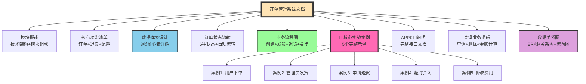

**💡 阅读建议**:
- 🆕 **新手入门**: 按顺序从模块概述 → 功能清单 → 数据库表 → 状态流转
- 🎯 **快速理解**: 直接查看「核心实战案例」部分，5个真实场景演示
- 🔍 **快速查找**: 直接跳转到对应的业务流程图或API接口
- 📊 **理解关系**: 重点查看数据关系图中的ER图和字段关系图
- 💻 **开发参考**: 关注API接口说明和关键业务逻辑部分

---

## 模块概述

订单管理系统（OMS - Order Management System）是电商后台的核心业务模块，负责处理从用户下单到订单完成的整个生命周期管理。系统涵盖了订单查询、发货管理、退货处理、订单配置等完整功能。

### 技术架构图

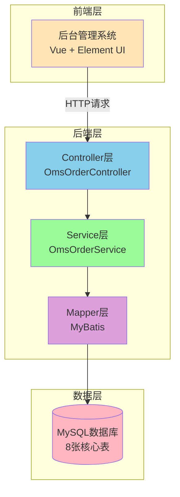

### 技术架构
- **后端框架**: Spring Boot + MyBatis
- **事务管理**: Spring @Transactional
- **分页插件**: PageHelper
- **数据库**: MySQL 5.7+

### 模块组成

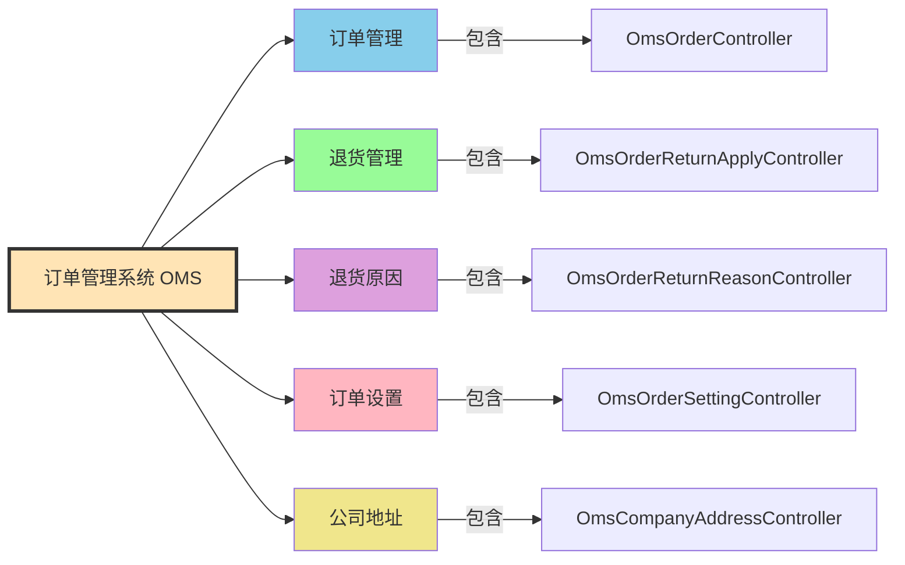

订单管理系统包含以下子模块：
1. **订单管理** (`OmsOrderController`): 订单的查询、发货、关闭、删除等操作
2. **退货管理** (`OmsOrderReturnApplyController`): 退货申请的处理和审核
3. **退货原因** (`OmsOrderReturnReasonController`): 退货原因的配置管理
4. **订单设置** (`OmsOrderSettingController`): 订单超时时间等系统配置
5. **公司地址** (`OmsCompanyAddressController`): 发货/退货地址管理

---

## 核心功能清单

### 1. 订单管理功能

| 功能 | 接口路径 | 说明 |
|------|---------|------|
| 订单列表查询 | `GET /order/list` | 支持多条件筛选和分页 |
| 订单详情查看 | `GET /order/{id}` | 包含订单信息、商品明细、操作记录 |
| 批量发货 | `POST /order/update/delivery` | 填写物流信息并发货 |
| 批量关闭订单 | `POST /order/update/close` | 关闭待付款或待发货订单 |
| 批量删除订单 | `POST /order/delete` | 软删除订单 |
| 修改收货人信息 | `POST /order/update/receiverInfo` | 修改地址、电话等 |
| 修改订单费用 | `POST /order/update/moneyInfo` | 调整运费、折扣金额 |
| 备注订单 | `POST /order/update/note` | 添加订单备注 |

### 2. 退货管理功能

| 功能 | 接口路径 | 说明 |
|------|---------|------|
| 退货申请列表 | `GET /returnApply/list` | 分页查询退货申请 |
| 退货申请详情 | `GET /returnApply/{id}` | 查看退货详细信息 |
| 修改退货状态 | `POST /returnApply/update/status/{id}` | 同意/拒绝退货申请 |
| 批量删除退货 | `POST /returnApply/delete` | 删除退货申请记录 |

### 3. 系统配置功能

| 功能 | 接口路径 | 说明 |
|------|---------|------|
| 获取订单设置 | `GET /orderSetting/{id}` | 查看超时时间配置 |
| 修改订单设置 | `POST /orderSetting/update/{id}` | 配置超时规则 |
| 获取公司地址 | `GET /companyAddress/list` | 查看所有发货地址 |

---

## 数据库表设计

订单管理系统共涉及 **8张核心表**，按照功能可分为以下几类：

### 3.0 数据库表总览图

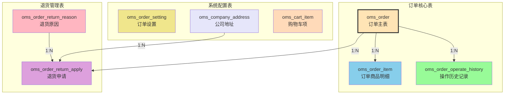

### 3.1 订单核心表

#### (1) oms_order - 订单主表

**功能说明**: 存储订单的基本信息、金额、状态、收货信息等核心数据。

**字段分类图**:

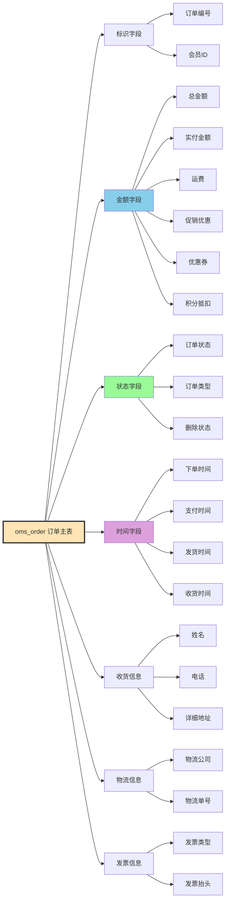

**表结构**:

```sql
CREATE TABLE `oms_order` (
  `id` bigint(20) NOT NULL AUTO_INCREMENT COMMENT '订单id',
  `member_id` bigint(20) NOT NULL COMMENT '会员id',
  `coupon_id` bigint(20) DEFAULT NULL COMMENT '使用的优惠券id',
  `order_sn` varchar(64) DEFAULT NULL COMMENT '订单编号',
  `create_time` datetime DEFAULT NULL COMMENT '提交时间',
  `member_username` varchar(64) DEFAULT NULL COMMENT '用户帐号',
  
  -- 金额相关字段
  `total_amount` decimal(10,2) DEFAULT NULL COMMENT '订单总金额',
  `pay_amount` decimal(10,2) DEFAULT NULL COMMENT '应付金额（实际支付金额）',
  `freight_amount` decimal(10,2) DEFAULT NULL COMMENT '运费金额',
  `promotion_amount` decimal(10,2) DEFAULT NULL COMMENT '促销优化金额',
  `integration_amount` decimal(10,2) DEFAULT NULL COMMENT '积分抵扣金额',
  `coupon_amount` decimal(10,2) DEFAULT NULL COMMENT '优惠券抵扣金额',
  `discount_amount` decimal(10,2) DEFAULT NULL COMMENT '管理员调整的折扣金额',
  
  -- 订单类型和来源
  `pay_type` int(1) DEFAULT NULL COMMENT '支付方式：0->未支付；1->支付宝；2->微信',
  `source_type` int(1) DEFAULT NULL COMMENT '订单来源：0->PC订单；1->app订单',
  `status` int(1) DEFAULT NULL COMMENT '订单状态：0->待付款；1->待发货；2->已发货；3->已完成；4->已关闭；5->无效订单',
  `order_type` int(1) DEFAULT NULL COMMENT '订单类型：0->正常订单；1->秒杀订单',
  
  -- 物流信息
  `delivery_company` varchar(64) DEFAULT NULL COMMENT '物流公司',
  `delivery_sn` varchar(64) DEFAULT NULL COMMENT '物流单号',
  
  -- 自动确认时间
  `auto_confirm_day` int(11) DEFAULT NULL COMMENT '自动确认时间（天）',
  `integration` int(11) DEFAULT NULL COMMENT '可以获得的积分',
  `growth` int(11) DEFAULT NULL COMMENT '可以获得的成长值',
  `promotion_info` varchar(100) DEFAULT NULL COMMENT '活动信息',
  
  -- 发票信息
  `bill_type` int(1) DEFAULT NULL COMMENT '发票类型：0->不开发票；1->电子发票；2->纸质发票',
  `bill_header` varchar(200) DEFAULT NULL COMMENT '发票抬头',
  `bill_content` varchar(200) DEFAULT NULL COMMENT '发票内容',
  `bill_receiver_phone` varchar(32) DEFAULT NULL COMMENT '收票人电话',
  `bill_receiver_email` varchar(64) DEFAULT NULL COMMENT '收票人邮箱',
  
  -- 收货人信息
  `receiver_name` varchar(100) NOT NULL COMMENT '收货人姓名',
  `receiver_phone` varchar(32) NOT NULL COMMENT '收货人电话',
  `receiver_post_code` varchar(32) DEFAULT NULL COMMENT '收货人邮编',
  `receiver_province` varchar(32) DEFAULT NULL COMMENT '省份/直辖市',
  `receiver_city` varchar(32) DEFAULT NULL COMMENT '城市',
  `receiver_region` varchar(32) DEFAULT NULL COMMENT '区',
  `receiver_detail_address` varchar(200) DEFAULT NULL COMMENT '详细地址',
  
  -- 其他信息
  `note` varchar(500) DEFAULT NULL COMMENT '订单备注',
  `confirm_status` int(1) DEFAULT NULL COMMENT '确认收货状态：0->未确认；1->已确认',
  `delete_status` int(1) NOT NULL DEFAULT '0' COMMENT '删除状态：0->未删除；1->已删除',
  `use_integration` int(11) DEFAULT NULL COMMENT '下单时使用的积分',
  
  -- 时间节点
  `payment_time` datetime DEFAULT NULL COMMENT '支付时间',
  `delivery_time` datetime DEFAULT NULL COMMENT '发货时间',
  `receive_time` datetime DEFAULT NULL COMMENT '确认收货时间',
  `comment_time` datetime DEFAULT NULL COMMENT '评价时间',
  `modify_time` datetime DEFAULT NULL COMMENT '修改时间',
  
  PRIMARY KEY (`id`)
) ENGINE=InnoDB DEFAULT CHARSET=utf8 COMMENT='订单表';
```

**关键字段说明**:

| 字段分类 | 字段名 | 说明 |
|---------|--------|------|
| **标识字段** | `order_sn` | 订单编号，唯一标识，格式如：202305110100000001 |
| **金额字段** | `total_amount` | 商品原价总和 |
| | `pay_amount` | 实际支付金额 = total - promotion - coupon - integration + freight |
| | `promotion_amount` | 促销优惠（满减、打折、阶梯价） |
| | `coupon_amount` | 优惠券抵扣 |
| | `integration_amount` | 积分抵扣 |
| | `freight_amount` | 运费 |
| | `discount_amount` | 管理员手动调整的折扣 |
| **状态字段** | `status` | 0待付款 1待发货 2已发货 3已完成 4已关闭 5无效 |
| | `order_type` | 0普通订单 1秒杀订单（影响超时时间） |
| | `delete_status` | 软删除标记，0未删除 1已删除 |
| **时间字段** | `create_time` | 下单时间 |
| | `payment_time` | 支付时间 |
| | `delivery_time` | 发货时间 |
| | `receive_time` | 确认收货时间 |
| | `comment_time` | 评价时间 |

**索引建议**:
```sql
-- 订单编号索引（高频查询）
CREATE INDEX idx_order_sn ON oms_order(order_sn);
-- 会员ID索引（查询用户订单）
CREATE INDEX idx_member_id ON oms_order(member_id);
-- 创建时间索引（时间范围查询）
CREATE INDEX idx_create_time ON oms_order(create_time);
-- 状态索引（状态筛选）
CREATE INDEX idx_status ON oms_order(status);
-- 复合索引（常用组合查询）
CREATE INDEX idx_member_status ON oms_order(member_id, status);
```

---

#### (2) oms_order_item - 订单商品明细表

**功能说明**: 存储订单中包含的商品信息，一个订单可以有多个商品项。

**表结构设计图**:

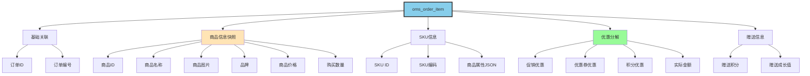

**冗余设计说明**:

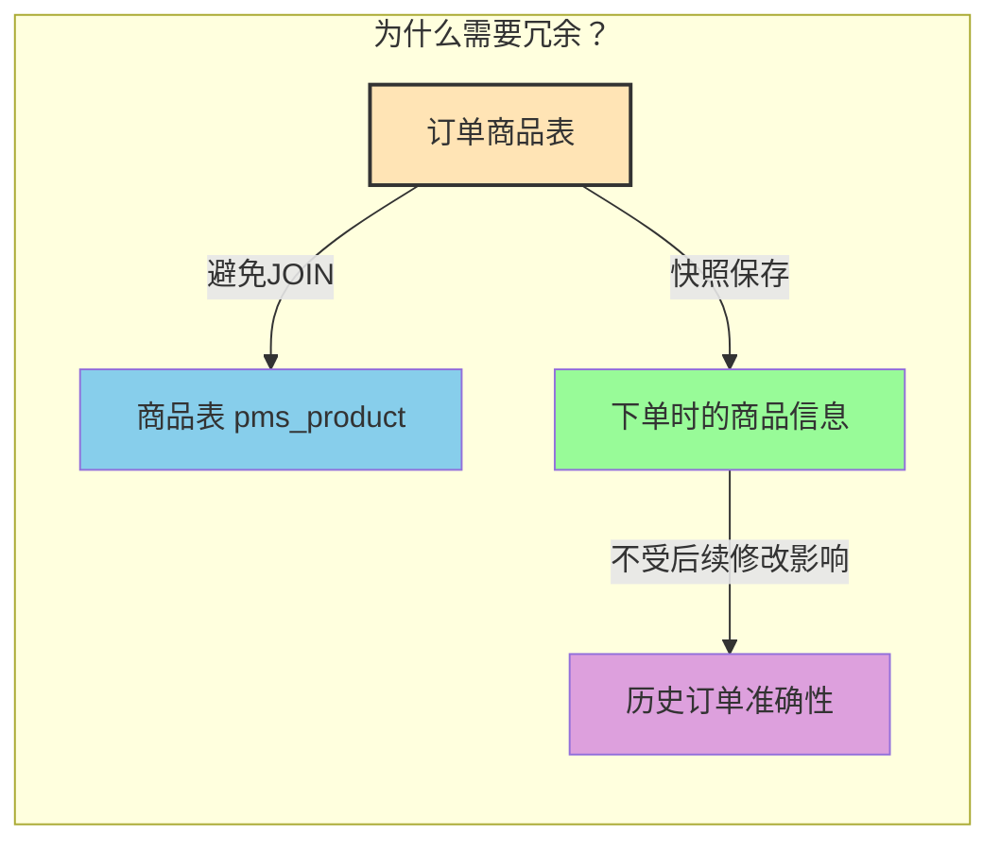

**表结构**:

```sql
CREATE TABLE `oms_order_item` (
  `id` bigint(20) NOT NULL AUTO_INCREMENT,
  `order_id` bigint(20) DEFAULT NULL COMMENT '订单id',
  `order_sn` varchar(64) DEFAULT NULL COMMENT '订单编号',
  
  -- 商品信息（冗余字段，避免JOIN查询）
  `product_id` bigint(20) DEFAULT NULL COMMENT '商品id',
  `product_pic` varchar(500) DEFAULT NULL COMMENT '商品图片',
  `product_name` varchar(200) DEFAULT NULL COMMENT '商品名称',
  `product_brand` varchar(200) DEFAULT NULL COMMENT '商品品牌',
  `product_sn` varchar(64) DEFAULT NULL COMMENT '商品货号',
  `product_price` decimal(10,2) DEFAULT NULL COMMENT '销售价格',
  `product_quantity` int(11) DEFAULT NULL COMMENT '购买数量',
  
  -- SKU信息
  `product_sku_id` bigint(20) DEFAULT NULL COMMENT '商品sku编号',
  `product_sku_code` varchar(50) DEFAULT NULL COMMENT '商品sku条码',
  `product_category_id` bigint(20) DEFAULT NULL COMMENT '商品分类id',
  
  -- 优惠分解（每个商品的优惠金额）
  `promotion_name` varchar(200) DEFAULT NULL COMMENT '商品促销名称',
  `promotion_amount` decimal(10,2) DEFAULT NULL COMMENT '商品促销分解金额',
  `coupon_amount` decimal(10,2) DEFAULT NULL COMMENT '优惠券优惠分解金额',
  `integration_amount` decimal(10,2) DEFAULT NULL COMMENT '积分优惠分解金额',
  `real_amount` decimal(10,2) DEFAULT NULL COMMENT '该商品经过优惠后的分解金额',
  
  -- 赠送积分和成长值
  `gift_integration` int(11) DEFAULT '0' COMMENT '赠送积分',
  `gift_growth` int(11) DEFAULT '0' COMMENT '赠送成长值',
  
  -- 商品属性
  `product_attr` varchar(500) DEFAULT NULL COMMENT '商品销售属性:[{"key":"颜色","value":"金色"}]',
  
  PRIMARY KEY (`id`)
) ENGINE=InnoDB DEFAULT CHARSET=utf8 COMMENT='订单中所包含的商品';
```

**设计亮点**:
- **冗余设计**: 商品名称、图片、品牌等信息冗余存储，避免查询时JOIN商品表
- **优惠分解**: 将订单级别的优惠分解到每个商品，便于退货时计算退款金额
- **属性快照**: `product_attr` 保存下单时的商品属性（颜色、尺寸等），即使商品后续修改也不影响历史订单

**数据示例**:
```json
{
  "order_id": 12,
  "product_id": 26,
  "product_name": "华为 HUAWEI P20",
  "product_price": 3788.00,
  "product_quantity": 1,
  "promotion_amount": 200.00,
  "coupon_amount": 2.02,
  "real_amount": 3585.98,
  "product_attr": "[{\"key\":\"颜色\",\"value\":\"金色\"},{\"key\":\"容量\",\"value\":\"16G\"}]"
}
```

---

#### (3) oms_order_operate_history - 订单操作历史记录表

**功能说明**: 记录订单的所有状态变更和操作日志，形成完整的审计轨迹。

**操作记录示例图**:

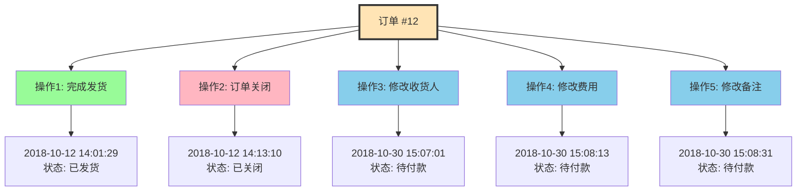

**使用场景**:
- 📋 订单详情页展示操作时间线
- 👨‍💼 客服查询订单处理过程
- ⚖️ 纠纷处理时提供证据
- 📊 数据分析订单处理效率

**表结构**:

```sql
CREATE TABLE `oms_order_operate_history` (
  `id` bigint(20) NOT NULL AUTO_INCREMENT,
  `order_id` bigint(20) DEFAULT NULL COMMENT '订单id',
  `operate_man` varchar(100) DEFAULT NULL COMMENT '操作人：用户；系统；后台管理员',
  `create_time` datetime DEFAULT NULL COMMENT '操作时间',
  `order_status` int(1) DEFAULT NULL COMMENT '订单状态：0->待付款；1->待发货；2->已发货；3->已完成；4->已关闭；5->无效订单',
  `note` varchar(500) DEFAULT NULL COMMENT '备注',
  PRIMARY KEY (`id`)
) ENGINE=InnoDB DEFAULT CHARSET=utf8 COMMENT='订单操作历史记录';
```

**操作记录示例**:

| order_id | operate_man | create_time | order_status | note |
|----------|-------------|-------------|--------------|------|
| 12 | 后台管理员 | 2018-10-12 14:01:29 | 2 | 完成发货 |
| 12 | 后台管理员 | 2018-10-12 14:13:10 | 4 | 订单关闭:买家退货 |
| 25 | 后台管理员 | 2018-10-30 15:07:01 | 0 | 修改收货人信息 |
| 25 | 后台管理员 | 2018-10-30 15:08:13 | 0 | 修改费用信息 |
| 25 | 后台管理员 | 2018-10-30 15:08:31 | 0 | 修改备注信息：xxx |

**使用场景**:
- 订单详情页展示操作时间线
- 客服查询订单处理过程
- 纠纷处理时提供证据
- 数据分析订单处理效率

---

### 3.2 退货管理表

#### (4) oms_order_return_apply - 退货申请表

**功能说明**: 存储用户提交的退货申请信息，包括退货商品、原因、凭证等。

**退货流程状态图**:

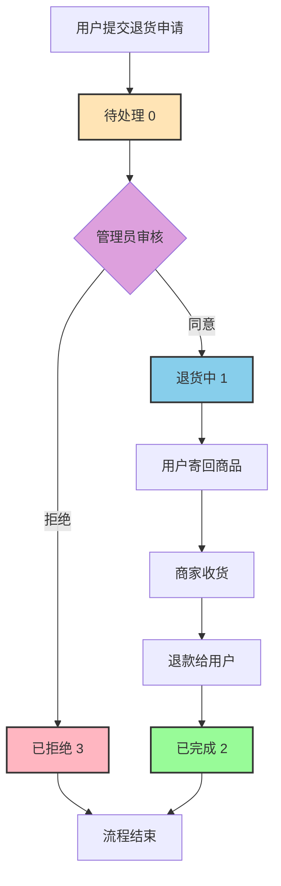

**表结构分组图**:


**表结构**:

```sql
CREATE TABLE `oms_order_return_apply` (
  `id` bigint(20) NOT NULL AUTO_INCREMENT,
  `order_id` bigint(20) DEFAULT NULL COMMENT '订单id',
  `company_address_id` bigint(20) DEFAULT NULL COMMENT '收货地址表id',
  `product_id` bigint(20) DEFAULT NULL COMMENT '退货商品id',
  `order_sn` varchar(64) DEFAULT NULL COMMENT '订单编号',
  `create_time` datetime DEFAULT NULL COMMENT '申请时间',
  `member_username` varchar(64) DEFAULT NULL COMMENT '会员用户名',
  
  -- 退款信息
  `return_amount` decimal(10,2) DEFAULT NULL COMMENT '退款金额',
  `return_name` varchar(100) DEFAULT NULL COMMENT '退货人姓名',
  `return_phone` varchar(100) DEFAULT NULL COMMENT '退货人电话',
  
  -- 状态和处理
  `status` int(1) DEFAULT NULL COMMENT '申请状态：0->待处理；1->退货中；2->已完成；3->已拒绝',
  `handle_time` datetime DEFAULT NULL COMMENT '处理时间',
  
  -- 商品信息快照
  `product_pic` varchar(500) DEFAULT NULL COMMENT '商品图片',
  `product_name` varchar(200) DEFAULT NULL COMMENT '商品名称',
  `product_brand` varchar(200) DEFAULT NULL COMMENT '商品品牌',
  `product_attr` varchar(500) DEFAULT NULL COMMENT '商品销售属性',
  `product_count` int(11) DEFAULT NULL COMMENT '退货数量',
  `product_price` decimal(10,2) DEFAULT NULL COMMENT '商品单价',
  `product_real_price` decimal(10,2) DEFAULT NULL COMMENT '商品实际支付单价',
  
  -- 退货原因和凭证
  `reason` varchar(200) DEFAULT NULL COMMENT '原因',
  `description` varchar(500) DEFAULT NULL COMMENT '描述',
  `proof_pics` varchar(1000) DEFAULT NULL COMMENT '凭证图片，以逗号隔开',
  
  -- 处理信息
  `handle_note` varchar(500) DEFAULT NULL COMMENT '处理备注',
  `handle_man` varchar(100) DEFAULT NULL COMMENT '处理人员',
  
  -- 收货信息
  `receive_man` varchar(100) DEFAULT NULL COMMENT '收货人',
  `receive_time` datetime DEFAULT NULL COMMENT '收货时间',
  `receive_note` varchar(500) DEFAULT NULL COMMENT '收货备注',
  
  PRIMARY KEY (`id`)
) ENGINE=InnoDB DEFAULT CHARSET=utf8 COMMENT='订单退货申请';
```

**退货状态流转**:
```
待处理(0) → 退货中(1) → 已完成(2)
    ↓
  已拒绝(3)
```

**关键字段说明**:
- `product_real_price`: 商品实际支付单价（扣除优惠后），用于计算退款金额
- `proof_pics`: 用户上传的凭证图片URL，多个用逗号分隔
- `company_address_id`: 退货寄回的公司地址ID

---

#### (5) oms_order_return_reason - 退货原因表

**功能说明**: 配置可选的退货原因，方便用户选择和统计分析。

**表结构**:

```sql
CREATE TABLE `oms_order_return_reason` (
  `id` bigint(20) NOT NULL AUTO_INCREMENT,
  `name` varchar(100) DEFAULT NULL COMMENT '退货类型',
  `sort` int(11) DEFAULT NULL COMMENT '排序',
  `status` int(1) DEFAULT NULL COMMENT '状态：0->不启用；1->启用',
  `create_time` datetime DEFAULT NULL COMMENT '添加时间',
  PRIMARY KEY (`id`)
) ENGINE=InnoDB DEFAULT CHARSET=utf8 COMMENT='退货原因表';
```

**默认数据**:

| id | name | sort | status |
|----|------|------|--------|
| 1 | 质量问题 | 1 | 1 |
| 2 | 尺码太大 | 1 | 1 |
| 3 | 颜色不喜欢 | 1 | 1 |
| 4 | 7天无理由退货 | 1 | 1 |
| 12 | 发票问题 | 0 | 1 |
| 13 | 其他问题 | 0 | 1 |
| 14 | 物流问题 | 0 | 1 |
| 15 | 售后问题 | 0 | 1 |

---

### 3.3 系统配置表

#### (6) oms_order_setting - 订单设置表

**功能说明**: 配置订单相关的超时时间规则，控制订单自动流转。

**超时配置示意图**:

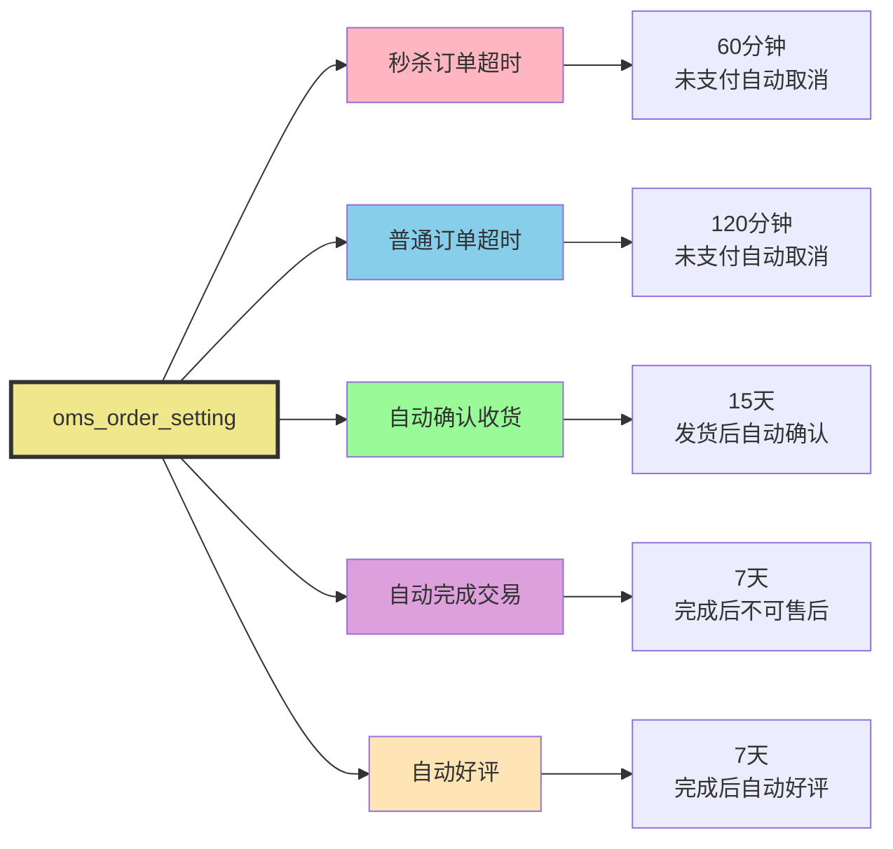

**自动流转时序图**:

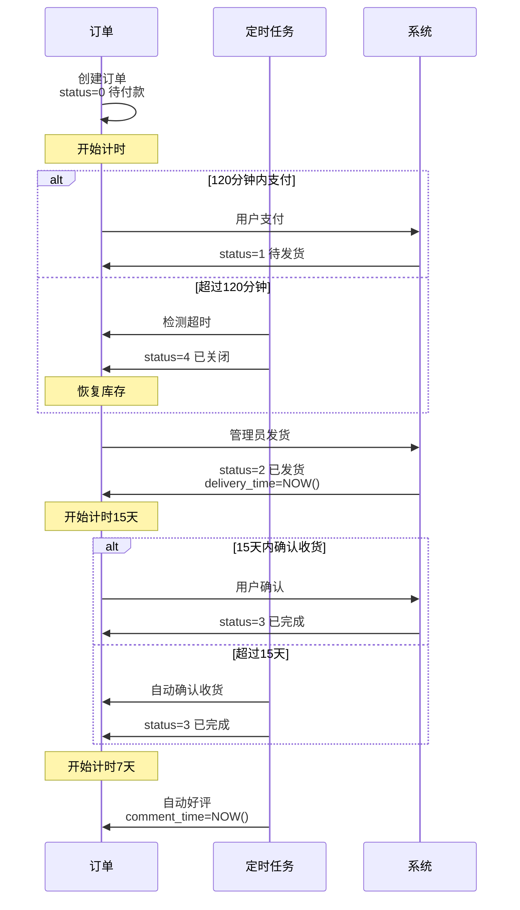

**表结构**:

```sql
CREATE TABLE `oms_order_setting` (
  `id` bigint(20) NOT NULL AUTO_INCREMENT,
  `flash_order_overtime` int(11) DEFAULT NULL COMMENT '秒杀订单超时关闭时间(分)',
  `normal_order_overtime` int(11) DEFAULT NULL COMMENT '正常订单超时时间(分)',
  `confirm_overtime` int(11) DEFAULT NULL COMMENT '发货后自动确认收货时间（天）',
  `finish_overtime` int(11) DEFAULT NULL COMMENT '自动完成交易时间，不能申请售后（天）',
  `comment_overtime` int(11) DEFAULT NULL COMMENT '订单完成后自动好评时间（天）',
  PRIMARY KEY (`id`)
) ENGINE=InnoDB DEFAULT CHARSET=utf8 COMMENT='订单设置表';
```

**默认配置**:

```sql
INSERT INTO `oms_order_setting` VALUES (1, 60, 120, 15, 7, 7);
```

**配置说明**:

| 配置项 | 默认值 | 说明 |
|--------|--------|------|
| `flash_order_overtime` | 60分钟 | 秒杀订单未支付，60分钟后自动取消 |
| `normal_order_overtime` | 120分钟 | 普通订单未支付，120分钟后自动取消 |
| `confirm_overtime` | 15天 | 发货后15天自动确认收货 |
| `finish_overtime` | 7天 | 确认收货7天后自动完成，不能再申请售后 |
| `comment_overtime` | 7天 | 订单完成后7天自动好评 |

**应用场景**:
这些配置通常配合定时任务（如Quartz、XXL-JOB）使用，定期扫描超时订单并自动处理。

---

#### (7) oms_company_address - 公司地址表

**功能说明**: 管理公司的发货地址和退货接收地址。

**表结构**:

```sql
CREATE TABLE `oms_company_address` (
  `id` bigint(20) NOT NULL AUTO_INCREMENT,
  `address_name` varchar(200) DEFAULT NULL COMMENT '地址名称',
  `send_status` int(1) DEFAULT NULL COMMENT '默认发货地址：0->否；1->是',
  `receive_status` int(1) DEFAULT NULL COMMENT '是否默认收货地址：0->否；1->是',
  `name` varchar(64) DEFAULT NULL COMMENT '收发货人姓名',
  `phone` varchar(64) DEFAULT NULL COMMENT '收货人电话',
  `province` varchar(64) DEFAULT NULL COMMENT '省份/直辖市',
  `city` varchar(64) DEFAULT NULL COMMENT '城市',
  `region` varchar(64) DEFAULT NULL COMMENT '区',
  `detail_address` varchar(200) DEFAULT NULL COMMENT '详细地址',
  PRIMARY KEY (`id`)
) ENGINE=InnoDB DEFAULT CHARSET=utf8 COMMENT='公司地址表';
```

**使用场景**:
- 发货时选择发货地址
- 退货时显示退货收件地址
- 打印快递单时使用

---

#### (8) oms_cart_item - 购物车项表

**功能说明**: 存储用户的购物车数据，虽然属于购物车模块，但与订单创建密切相关。

**表结构**:

```sql
CREATE TABLE `oms_cart_item` (
  `id` bigint(20) NOT NULL AUTO_INCREMENT,
  `member_id` bigint(20) DEFAULT NULL COMMENT '会员id',
  `product_id` bigint(20) DEFAULT NULL COMMENT '商品id',
  `product_sku_id` bigint(20) DEFAULT NULL COMMENT '商品库存id',
  `quantity` int(11) DEFAULT NULL COMMENT '购买数量',
  `price` decimal(10,2) DEFAULT NULL COMMENT '添加到购物车的价格',
  `create_time` datetime DEFAULT NULL COMMENT '创建时间',
  `modify_time` datetime DEFAULT NULL COMMENT '修改时间',
  PRIMARY KEY (`id`)
) ENGINE=InnoDB DEFAULT CHARSET=utf8 COMMENT='购物车表';
```

**订单创建流程**:
```
购物车(oms_cart_item) → 确认订单 → 生成订单(oms_order + oms_order_item) → 清空购物车
```

---

## 订单状态流转

### 4.1 订单状态定义

| 状态值 | 状态名称 | 说明 | 可执行操作 |
|--------|---------|------|-----------|
| 0 | 待付款 | 订单已创建，等待用户支付 | 取消订单、修改订单 |
| 1 | 待发货 | 用户已支付，等待商家发货 | 发货、关闭订单 |
| 2 | 已发货 | 商家已发货，等待用户确认收货 | 确认收货 |
| 3 | 已完成 | 用户已确认收货，订单完成 | 评价、申请售后 |
| 4 | 已关闭 | 订单已关闭（超时未支付或人工关闭） | 删除订单 |
| 5 | 无效订单 | 异常订单（如风控拦截） | 删除订单 |

### 4.2 状态流转图

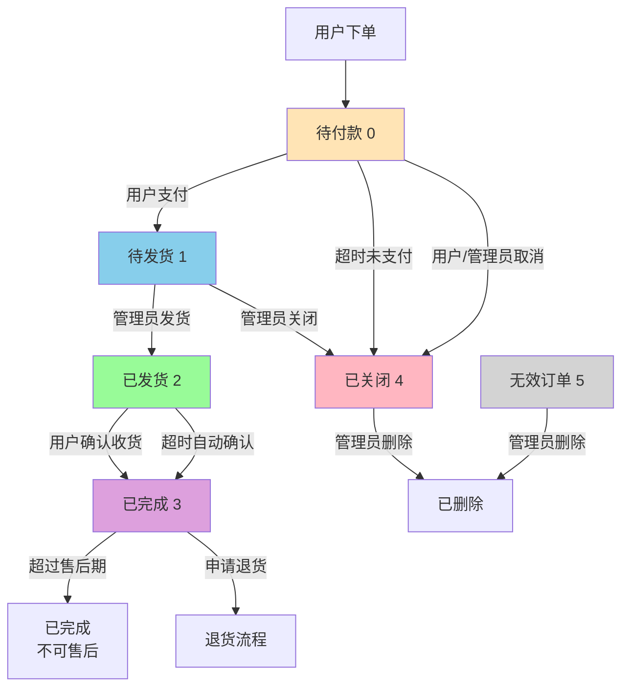

### 4.3 自动状态流转规则

| 触发条件 | 原状态 | 新状态 | 超时时间配置 |
|---------|--------|--------|-------------|
| 订单创建后未支付 | 0 待付款 | 4 已关闭 | `normal_order_overtime` (120分钟) |
| 秒杀订单未支付 | 0 待付款 | 4 已关闭 | `flash_order_overtime` (60分钟) |
| 发货后未确认收货 | 2 已发货 | 3 已完成 | `confirm_overtime` (15天) |
| 完成后未评价 | 3 已完成 | 3 已完成(自动好评) | `comment_overtime` (7天) |
| 完成后超过售后期 | 3 已完成 | 3 已完成(不可售后) | `finish_overtime` (7天) |

---

## 业务流程图

### 5.1 订单创建流程

**流程图**:

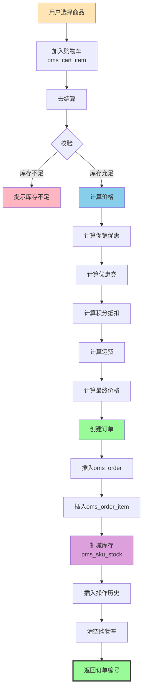

**时序图**:

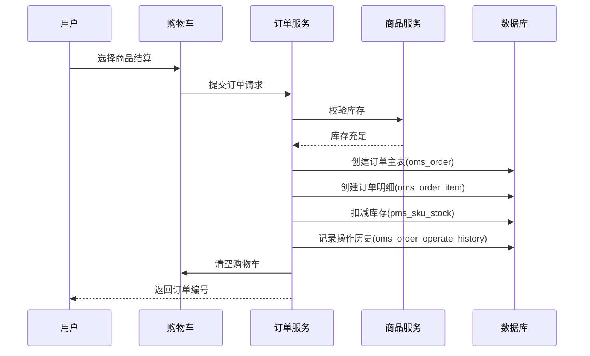

**关键步骤说明**:
1. **库存校验**: 检查商品SKU库存是否充足
2. **事务保证**: 订单创建、库存扣减在同一事务中
3. **优惠计算**: 计算促销、优惠券、积分抵扣
4. **购物车清理**: 订单创建成功后清空对应购物车项

---

### 5.2 订单发货流程

**流程图**:

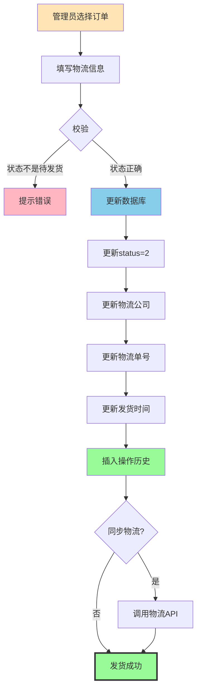

**代码实现** ([OmsOrderServiceImpl.java](file:///D:/course/Java/graduateProject/finish/mall/mall-admin/src/main/java/com/macro/mall/service/impl/OmsOrderServiceImpl.java#L42-L58)):

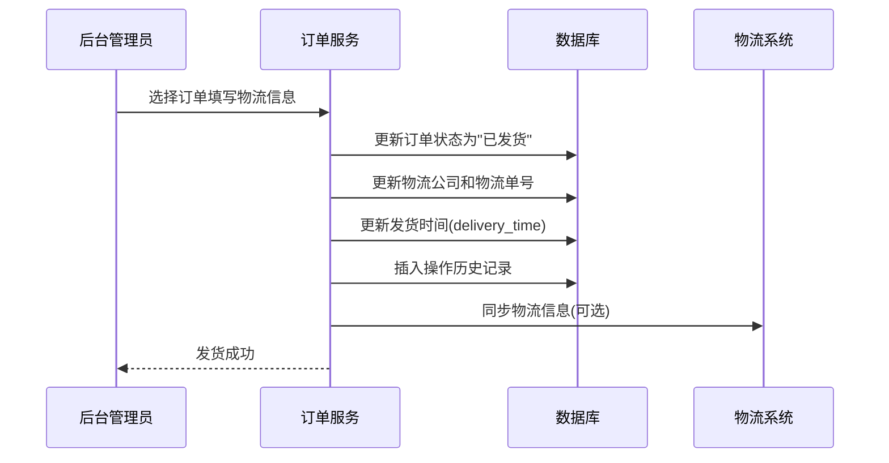

**代码实现** ([OmsOrderServiceImpl.java](file:///D:/course/Java/graduateProject/finish/mall/mall-admin/src/main/java/com/macro/mall/service/impl/OmsOrderServiceImpl.java#L42-L58)):

```java
@Override
public int delivery(List<OmsOrderDeliveryParam> deliveryParamList) {
    // 批量发货
    int count = orderDao.delivery(deliveryParamList);
    
    // 添加操作记录
    List<OmsOrderOperateHistory> operateHistoryList = deliveryParamList.stream()
            .map(param -> {
                OmsOrderOperateHistory history = new OmsOrderOperateHistory();
                history.setOrderId(param.getOrderId());
                history.setCreateTime(new Date());
                history.setOperateMan("后台管理员");
                history.setOrderStatus(2); // 已发货
                history.setNote("完成发货");
                return history;
            }).collect(Collectors.toList());
    
    orderOperateHistoryDao.insertList(operateHistoryList);
    return count;
}
```

---

### 5.3 退货申请处理流程

**详细流程图**:

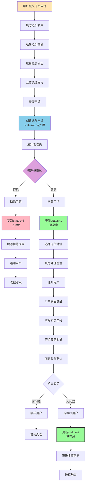

**状态变更说明**:

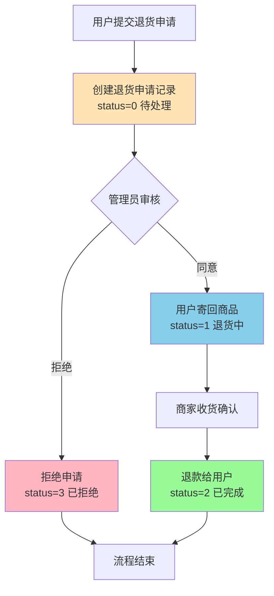

**退货状态说明**:
- **待处理(0)**: 用户刚提交申请，等待管理员审核
- **退货中(1)**: 管理员同意，用户正在寄回商品
- **已完成(2)**: 商家收到货并退款
- **已拒绝(3)**: 管理员拒绝退货申请

---

### 5.4 订单关闭流程

**流程图**:

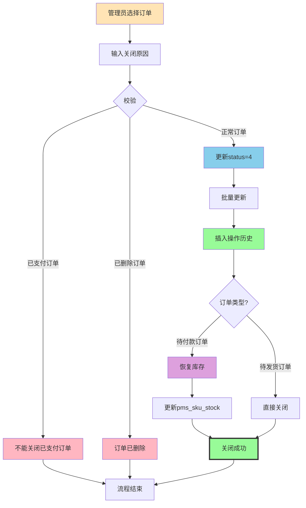

**代码实现** ([OmsOrderServiceImpl.java](file:///D:/course/Java/graduateProject/finish/mall/mall-admin/src/main/java/com/macro/mall/service/impl/OmsOrderServiceImpl.java#L61-L78)):

```mermaid
sequenceDiagram
    participant Admin as 后台管理员
    participant Order as 订单服务
    participant DB as 数据库
    
    Admin->>Order: 选择订单输入关闭原因
    Order->>DB: 更新订单状态为"已关闭"(status=4)
    Order->>DB: 插入操作历史记录
    
    Note over Order,DB: 如果是待付款订单关闭<br/>需要恢复库存
    
    Order-->>Admin: 关闭成功
```

**代码实现** ([OmsOrderServiceImpl.java](file:///D:/course/Java/graduateProject/finish/mall/mall-admin/src/main/java/com/macro/mall/service/impl/OmsOrderServiceImpl.java#L61-L78)):

```java
@Override
public int close(List<Long> ids, String note) {
    OmsOrder record = new OmsOrder();
    record.setStatus(4); // 已关闭
    
    OmsOrderExample example = new OmsOrderExample();
    example.createCriteria().andDeleteStatusEqualTo(0).andIdIn(ids);
    
    int count = orderMapper.updateByExampleSelective(record, example);
    
    // 记录操作历史
    List<OmsOrderOperateHistory> historyList = ids.stream().map(orderId -> {
        OmsOrderOperateHistory history = new OmsOrderOperateHistory();
        history.setOrderId(orderId);
        history.setCreateTime(new Date());
        history.setOperateMan("后台管理员");
        history.setOrderStatus(4);
        history.setNote("订单关闭:" + note);
        return history;
    }).collect(Collectors.toList());
    
    orderOperateHistoryDao.insertList(historyList);
    return count;
}
```

---

## API接口说明

### 6.1 订单管理接口

#### (1) 查询订单列表

**接口**: `GET /order/list`

**请求参数**:

| 参数名 | 类型 | 必填 | 说明 |
|--------|------|------|------|
| pageNum | Integer | 否 | 页码，默认1 |
| pageSize | Integer | 否 | 每页数量，默认5 |
| orderSn | String | 否 | 订单编号 |
| status | Integer | 否 | 订单状态 |
| sourceType | Integer | 否 | 订单来源 |
| orderType | Integer | 否 | 订单类型 |
| createTime | String | 否 | 下单时间（模糊查询） |
| receiverKeyword | String | 否 | 收货人姓名/电话（模糊查询） |

**响应示例**:
```json
{
  "code": 200,
  "message": "success",
  "data": {
    "pageNum": 1,
    "pageSize": 5,
    "totalPage": 10,
    "total": 50,
    "list": [
      {
        "id": 12,
        "orderSn": "201809150101000001",
        "memberUsername": "test",
        "totalAmount": 18732.00,
        "payAmount": 16377.75,
        "status": 4,
        "createTime": "2018-09-15 12:24:27"
      }
    ]
  }
}
```

---

#### (2) 获取订单详情

**接口**: `GET /order/{id}`

**路径参数**:
- `id`: 订单ID

**响应数据结构**:
```json
{
  "code": 200,
  "data": {
    "order": { /* 订单主表信息 */ },
    "orderItemList": [ /* 订单商品列表 */ ],
    "historyList": [ /* 操作历史记录 */ ]
  }
}
```

---

#### (3) 批量发货

**接口**: `POST /order/update/delivery`

**请求体**:
```json
[
  {
    "orderId": 12,
    "deliveryCompany": "顺丰快递",
    "deliverySn": "SF123456789"
  },
  {
    "orderId": 13,
    "deliveryCompany": "圆通快递",
    "deliverySn": "YT987654321"
  }
]
```

---

#### (4) 批量关闭订单

**接口**: `POST /order/update/close`

**请求参数**:
- `ids`: 订单ID列表
- `note`: 关闭原因

---

#### (5) 修改收货人信息

**接口**: `POST /order/update/receiverInfo`

**请求体**:
```json
{
  "orderId": 25,
  "receiverName": "张三",
  "receiverPhone": "13800138000",
  "receiverProvince": "广东省",
  "receiverCity": "深圳市",
  "receiverRegion": "福田区",
  "receiverDetailAddress": "科技园南区",
  "receiverPostCode": "518000",
  "status": 0
}
```

---

#### (6) 修改订单费用

**接口**: `POST /order/update/moneyInfo`

**请求体**:
```json
{
  "orderId": 25,
  "freightAmount": 15.00,
  "discountAmount": 10.00,
  "status": 0
}
```

**说明**: 
- `freightAmount`: 运费金额
- `discountAmount`: 管理员手动调整的折扣金额

---

### 6.2 退货管理接口

#### (1) 查询退货申请列表

**接口**: `GET /returnApply/list`

**请求参数**:

| 参数名 | 类型 | 必填 | 说明 |
|--------|------|------|------|
| pageNum | Integer | 否 | 页码 |
| pageSize | Integer | 否 | 每页数量 |
| status | Integer | 否 | 申请状态 |
| createTime | String | 否 | 申请时间 |
| orderSn | String | 否 | 订单编号 |

---

#### (2) 修改退货申请状态

**接口**: `POST /returnApply/update/status/{id}`

**路径参数**:
- `id`: 退货申请ID

**请求体**:
```json
{
  "status": 1,
  "companyAddressId": 1,
  "handleMan": "admin",
  "handleNote": "同意退货，请寄回商品"
}
```

**状态变更说明**:
- `status=1`: 同意退货，需要提供退货地址
- `status=2`: 确认收货并退款
- `status=3`: 拒绝退货

---

### 6.3 订单设置接口

#### (1) 获取订单设置

**接口**: `GET /orderSetting/{id}`

**响应示例**:
```json
{
  "code": 200,
  "data": {
    "id": 1,
    "flashOrderOvertime": 60,
    "normalOrderOvertime": 120,
    "confirmOvertime": 15,
    "finishOvertime": 7,
    "commentOvertime": 7
  }
}
```

---

#### (2) 修改订单设置

**接口**: `POST /orderSetting/update/{id}`

**请求体**:
```json
{
  "flashOrderOvertime": 30,
  "normalOrderOvertime": 60,
  "confirmOvertime": 10,
  "finishOvertime": 5,
  "commentOvertime": 5
}
```

---

## 关键业务逻辑

### 7.1 订单查询逻辑

**实现位置**: [OmsOrderDao.xml](file:///D:/course/Java/graduateProject/finish/mall/mall-admin/src/main/resources/dao/OmsOrderDao.xml)

**动态SQL查询**:
```xml
<select id="getList" resultMap="com.macro.mall.mapper.OmsOrderMapper.BaseResultMap">
    SELECT * FROM oms_order
    WHERE delete_status = 0
    <if test="queryParam.orderSn!=null and queryParam.orderSn!=''">
        AND order_sn = #{queryParam.orderSn}
    </if>
    <if test="queryParam.status!=null">
        AND `status` = #{queryParam.status}
    </if>
    <if test="queryParam.sourceType!=null">
        AND source_type = #{queryParam.sourceType}
    </if>
    <if test="queryParam.orderType!=null">
        AND order_type = #{queryParam.orderType}
    </if>
    <if test="queryParam.createTime!=null and queryParam.createTime!=''">
        AND create_time LIKE concat(#{queryParam.createTime},"%")
    </if>
    <if test="queryParam.receiverKeyword!=null and queryParam.receiverKeyword!=''">
        AND (
            receiver_name LIKE concat("%",#{queryParam.receiverKeyword},"%")
            OR receiver_phone LIKE concat("%",#{queryParam.receiverKeyword},"%")
        )
    </if>
</select>
```

**查询特点**:
- 默认过滤已删除订单（`delete_status = 0`）
- 支持多条件组合查询
- 收货人支持姓名和电话模糊搜索
- 使用PageHelper实现分页

---

### 7.2 订单删除逻辑（软删除）

**实现位置**: [OmsOrderServiceImpl.java](file:///D:/course/Java/graduateProject/finish/mall/mall-admin/src/main/java/com/macro/mall/service/impl/OmsOrderServiceImpl.java#L81-L87)

```java
@Override
public int delete(List<Long> ids) {
    OmsOrder record = new OmsOrder();
    record.setDeleteStatus(1); // 标记为已删除
    
    OmsOrderExample example = new OmsOrderExample();
    example.createCriteria().andDeleteStatusEqualTo(0).andIdIn(ids);
    
    return orderMapper.updateByExampleSelective(record, example);
}
```

**设计优势**:
- **数据保留**: 不物理删除数据，便于审计和数据恢复
- **查询过滤**: 所有查询默认过滤 `delete_status=1` 的记录
- **性能考虑**: 定期归档历史删除数据到历史表

---

### 7.3 操作记录自动插入

**设计模式**: 在所有订单状态变更操作中，自动插入操作历史记录

**统一处理逻辑**:
```java
// 1. 更新订单状态
orderMapper.updateByPrimaryKeySelective(order);

// 2. 插入操作历史
OmsOrderOperateHistory history = new OmsOrderOperateHistory();
history.setOrderId(orderId);
history.setCreateTime(new Date());
history.setOperateMan("后台管理员");
history.setOrderStatus(status);
history.setNote("操作说明");
orderOperateHistoryMapper.insert(history);
```

**应用场景**:
- 发货操作 → 记录"完成发货"
- 关闭订单 → 记录"订单关闭:原因"
- 修改收货人 → 记录"修改收货人信息"
- 修改费用 → 记录"修改费用信息"
- 修改备注 → 记录"修改备注信息:xxx"

---

### 7.4 金额计算逻辑

**订单金额公式**:

```
应付金额(pay_amount) = 订单总金额(total_amount) 
                     - 促销优惠(promotion_amount)
                     - 优惠券抵扣(coupon_amount)
                     - 积分抵扣(integration_amount)
                     + 运费(freight_amount)
                     - 管理员折扣(discount_amount)
```

**商品级别优惠分解**:

每个商品的 `real_amount` 计算公式：
```
real_amount = product_price × quantity 
            - promotion_amount
            - coupon_amount
            - integration_amount
```

**示例**:
```json
{
  "totalAmount": 18732.00,
  "promotionAmount": 2344.25,
  "couponAmount": 10.00,
  "integrationAmount": 0.00,
  "freightAmount": 20.00,
  "discountAmount": 10.00,
  "payAmount": 16377.75
}
```

计算验证：
```
16377.75 = 18732.00 - 2344.25 - 10.00 - 0.00 + 20.00 - 10.00
```

---

### 7.5 退货金额计算

**退款金额确定规则**:

1. **按实际支付价格退款**:
   ```
   return_amount = product_real_price × product_count
   ```
   
2. **考虑优惠分摊**:
   - `product_real_price` 已经扣除了促销、优惠券、积分等优惠
   - 确保退款金额不超过用户实际支付金额

3. **部分退货场景**:
   - 如果一个订单有多个商品，可以只退其中一部分
   - 每个商品的退款金额独立计算

**示例**:
```json
{
  "product_price": 3788.00,
  "promotion_amount": 200.00,
  "coupon_amount": 2.02,
  "product_real_price": 3585.98,
  "product_count": 1,
  "return_amount": 3585.98
}
```

---

## 数据关系图

### 8.0 完整ER关系图

```mermaid
erDiagram
    UMS_MEMBER ||--o{ OMS_ORDER : places
    SMS_COUPON ||--o| OMS_ORDER : uses
    
    OMS_ORDER ||--|{ OMS_ORDER_ITEM : contains
    OMS_ORDER ||--o{ OMS_ORDER_OPERATE_HISTORY : has
    OMS_ORDER ||--o{ OMS_ORDER_RETURN_APPLY : applies_for
    
    PMS_PRODUCT ||--o{ OMS_ORDER_ITEM : includes
    PMS_SKU_STOCK ||--o{ OMS_ORDER_ITEM : specifies
    
    OMS_ORDER_RETURN_REASON ||--o{ OMS_ORDER_RETURN_APPLY : based_on
    OMS_COMPANY_ADDRESS ||--o{ OMS_ORDER_RETURN_APPLY : returns_to
    
    UMS_MEMBER ||--o{ OMS_CART_ITEM : adds
    PMS_PRODUCT ||--o{ OMS_CART_ITEM : selects
    
    OMS_ORDER_SETTING ||..|| OMS_ORDER : configures
    
    UMS_MEMBER {
        bigint id PK
        varchar username
        varchar phone
        varchar nickname
    }
    
    OMS_ORDER {
        bigint id PK
        varchar order_sn UK
        bigint member_id FK
        bigint coupon_id FK
        decimal total_amount
        decimal pay_amount
        int status
        datetime create_time
        varchar receiver_name
        varchar receiver_phone
    }
    
    OMS_ORDER_ITEM {
        bigint id PK
        bigint order_id FK
        bigint product_id FK
        bigint product_sku_id FK
        varchar product_name
        decimal product_price
        int product_quantity
        decimal real_amount
    }
    
    OMS_ORDER_OPERATE_HISTORY {
        bigint id PK
        bigint order_id FK
        varchar operate_man
        int order_status
        datetime create_time
        varchar note
    }
    
    OMS_ORDER_RETURN_APPLY {
        bigint id PK
        bigint order_id FK
        bigint product_id FK
        bigint company_address_id FK
        int status
        decimal return_amount
        varchar reason
        varchar proof_pics
    }
    
    OMS_ORDER_RETURN_REASON {
        bigint id PK
        varchar name
        int sort
        int status
    }
    
    OMS_COMPANY_ADDRESS {
        bigint id PK
        varchar address_name
        varchar name
        varchar phone
        varchar detail_address
        int send_status
        int receive_status
    }
    
    OMS_ORDER_SETTING {
        bigint id PK
        int flash_order_overtime
        int normal_order_overtime
        int confirm_overtime
        int finish_overtime
        int comment_overtime
    }
    
    OMS_CART_ITEM {
        bigint id PK
        bigint member_id FK
        bigint product_id FK
        bigint product_sku_id FK
        int quantity
        decimal price
    }
    
    PMS_PRODUCT {
        bigint id PK
        varchar name
        decimal price
        int stock
        bigint brand_id FK
        bigint product_category_id FK
    }
    
    PMS_SKU_STOCK {
        bigint id PK
        bigint product_id FK
        varchar sku_code
        decimal price
        int stock
        varchar sp_data
    }
    
    SMS_COUPON {
        bigint id PK
        varchar name
        decimal amount
        int count
        datetime start_time
        datetime end_time
    }
```

### 8.1 订单模块实体关系图

```mermaid
graph TB
    Member[会员 ums_member] -->|1:N| Order[订单 oms_order]
    Order -->|1:N| OrderItem[订单商品 oms_order_item]
    Order -->|1:N| OperateHistory[操作历史 oms_order_operate_history]
    Order -->|1:N| ReturnApply[退货申请 oms_order_return_apply]
    
    Coupon[优惠券 sms_coupon] -->|1:1| Order
    ReturnReason[退货原因 oms_order_return_reason] -->|1:N| ReturnApply
    CompanyAddress[公司地址 oms_company_address] -->|1:N| ReturnApply
    
    Product[商品 pms_product] -->|1:N| OrderItem
    SKU[库存 pms_sku_stock] -->|1:N| OrderItem
    
    Member -->|1:N| CartItem[购物车 oms_cart_item]
    Product -->|1:N| CartItem
    
    OrderSetting[订单设置 oms_order_setting] -.配置.-> Order
    
    style Order fill:#FFE4B5
    style OrderItem fill:#87CEEB
    style ReturnApply fill:#98FB98
    style OperateHistory fill:#DDA0DD
```

### 8.2 订单表字段关系详解

```mermaid
graph TB
    subgraph "订单主表 oms_order"
        OrderID[id: 订单ID]
        OrderSN[order_sn: 订单编号]
        MemberID[member_id: 会员ID]
        TotalAmount[total_amount: 总金额]
        PayAmount[pay_amount: 实付金额]
        Status[status: 订单状态]
        CreateTime[create_time: 下单时间]
    end
    
    subgraph "订单商品表 oms_order_item"
        ItemID[id: 明细ID]
        ItemOrderID[order_id: 订单ID FK]
        ProductID[product_id: 商品ID FK]
        ProductName[product_name: 商品名称]
        Quantity[product_quantity: 数量]
        RealAmount[real_amount: 实际金额]
    end
    
    subgraph "操作历史表 oms_order_operate_history"
        HistoryID[id: 历史ID]
        HistoryOrderID[order_id: 订单ID FK]
        OperateMan[operate_man: 操作人]
        HistoryStatus[order_status: 状态]
        HistoryTime[create_time: 操作时间]
        Note[note: 备注]
    end
    
    subgraph "退货申请表 oms_order_return_apply"
        ReturnID[id: 申请ID]
        ReturnOrderID[order_id: 订单ID FK]
        ReturnProductID[product_id: 商品ID FK]
        ReturnStatus[status: 申请状态]
        ReturnAmount[return_amount: 退款金额]
        Reason[reason: 退货原因]
    end
    
    OrderID -->|1:N| ItemOrderID
    OrderID -->|1:N| HistoryOrderID
    OrderID -->|1:N| ReturnOrderID
    
    style OrderID fill:#FFE4B5,stroke:#333,stroke-width:2px
    style ItemOrderID fill:#87CEEB,stroke:#333,stroke-width:2px
    style HistoryOrderID fill:#98FB98,stroke:#333,stroke-width:2px
    style ReturnOrderID fill:#DDA0DD,stroke:#333,stroke-width:2px
```

### 8.3 金额计算关系图

```mermaid
graph TB
    subgraph "订单级别金额"
        Total[total_amount<br/>订单总金额]
        Promotion[promotion_amount<br/>促销优惠]
        Coupon[coupon_amount<br/>优惠券抵扣]
        Integration[integration_amount<br/>积分抵扣]
        Freight[freight_amount<br/>运费]
        Discount[discount_amount<br/>管理员折扣]
        Pay[pay_amount<br/>实付金额]
    end
    
    subgraph "商品级别金额分解"
        ItemTotal[product_price × quantity<br/>商品小计]
        ItemPromotion[promotion_amount<br/>促销分解]
        ItemCoupon[coupon_amount<br/>优惠券分解]
        ItemIntegration[integration_amount<br/>积分分解]
        ItemReal[real_amount<br/>商品实付]
    end
    
    Total -->|SUM| ItemTotal
    Promotion -->|SUM| ItemPromotion
    Coupon -->|SUM| ItemCoupon
    Integration -->|SUM| ItemIntegration
    
    Total -.->|减去| Promotion
    Total -.->|减去| Coupon
    Total -.->|减去| Integration
    Total -.->|加上| Freight
    Total -.->|减去| Discount
    
    Promotion --> Pay
    Coupon --> Pay
    Integration --> Pay
    Freight --> Pay
    Discount --> Pay
    
    ItemTotal -.->|减去| ItemPromotion
    ItemTotal -.->|减去| ItemCoupon
    ItemTotal -.->|减去| ItemIntegration
    ItemPromotion --> ItemReal
    ItemCoupon --> ItemReal
    ItemIntegration --> ItemReal
    
    style Total fill:#FFE4B5,stroke:#333,stroke-width:3px
    style Pay fill:#98FB98,stroke:#333,stroke-width:3px
    style ItemReal fill:#87CEEB,stroke:#333,stroke-width:2px
```

**计算公式**:
```
订单实付 = 总金额 - 促销优惠 - 优惠券 - 积分抵扣 + 运费 - 管理员折扣
商品实付 = 商品小计 - 促销分解 - 优惠券分解 - 积分分解
```

```mermaid
erDiagram
    OMS_ORDER ||--o{ OMS_ORDER_ITEM : contains
    OMS_ORDER ||--o{ OMS_ORDER_OPERATE_HISTORY : has
    OMS_ORDER ||--o{ OMS_ORDER_RETURN_APPLY : applies_for
    OMS_ORDER }o--|| UMS_MEMBER : belongs_to
    OMS_ORDER }o--|| SMS_COUPON : uses
    OMS_ORDER_ITEM }o--|| PMS_PRODUCT : references
    OMS_ORDER_RETURN_APPLY }o--|| OMS_ORDER_RETURN_REASON : based_on
    OMS_ORDER_RETURN_APPLY }o--|| OMS_COMPANY_ADDRESS : returns_to
    
    OMS_ORDER {
        bigint id PK
        varchar order_sn
        bigint member_id FK
        decimal total_amount
        decimal pay_amount
        int status
        datetime create_time
    }
    
    OMS_ORDER_ITEM {
        bigint id PK
        bigint order_id FK
        bigint product_id FK
        varchar product_name
        decimal product_price
        int product_quantity
        decimal real_amount
    }
    
    OMS_ORDER_OPERATE_HISTORY {
        bigint id PK
        bigint order_id FK
        varchar operate_man
        int order_status
        datetime create_time
        varchar note
    }
    
    OMS_ORDER_RETURN_APPLY {
        bigint id PK
        bigint order_id FK
        bigint product_id FK
        int status
        decimal return_amount
        varchar reason
    }
```

### 8.4 订单与外部模块关系图

```mermaid
graph TB
    subgraph "订单模块 OMS"
        Order[oms_order]
        OrderItem[oms_order_item]
    end
    
    subgraph "用户模块 UMS"
        Member[ums_member<br/>会员表]
        Address[ums_member_receive_address<br/>收货地址]
    end
    
    subgraph "商品模块 PMS"
        Product[pms_product<br/>商品表]
        SKU[pms_sku_stock<br/>库存表]
    end
    
    subgraph "营销模块 SMS"
        Coupon[sms_coupon<br/>优惠券]
        CouponHistory[sms_coupon_history<br/>领取记录]
    end
    
    Member -->|1:N| Order
    Address -->|用于| Order
    Product -->|1:N| OrderItem
    SKU -->|扣减库存| Order
    Coupon -->|1:1| Order
    CouponHistory -->|关联| Coupon
    
    Order -.->|生成| OrderItem
    
    style Order fill:#FFE4B5,stroke:#333,stroke-width:3px
    style Member fill:#87CEEB
    style Product fill:#98FB98
    style Coupon fill:#DDA0DD
```

### 8.5 数据流向图

```mermaid
graph LR
    subgraph "数据来源"
        User[用户操作]
        Admin[管理员操作]
        System[系统自动]
    end
    
    subgraph "数据写入"
        CreateOrder[创建订单]
        UpdateOrder[更新订单]
        InsertHistory[插入历史]
        ApplyReturn[申请退货]
    end
    
    subgraph "数据存储"
        OrderDB[(oms_order)]
        ItemDB[(oms_order_item)]
        HistoryDB[(oms_order_operate_history)]
        ReturnDB[(oms_order_return_apply)]
    end
    
    subgraph "数据读取"
        QueryList[查询列表]
        QueryDetail[查询详情]
        QueryStats[统计分析]
    end
    
    User -->|下单| CreateOrder
    Admin -->|发货/关闭| UpdateOrder
    System -->|超时处理| UpdateOrder
    
    CreateOrder --> OrderDB
    CreateOrder --> ItemDB
    CreateOrder --> InsertHistory
    
    UpdateOrder --> OrderDB
    UpdateOrder --> InsertHistory
    
    User -->|提交| ApplyReturn
    ApplyReturn --> ReturnDB
    
    InsertHistory --> HistoryDB
    
    OrderDB --> QueryList
    OrderDB --> QueryDetail
    ItemDB --> QueryDetail
    HistoryDB --> QueryDetail
    ReturnDB --> QueryList
    
    OrderDB --> QueryStats
    ItemDB --> QueryStats
    ReturnDB --> QueryStats
    
    style OrderDB fill:#FFE4B5,stroke:#333,stroke-width:2px
    style ItemDB fill:#87CEEB,stroke:#333,stroke-width:2px
    style HistoryDB fill:#98FB98,stroke:#333,stroke-width:2px
    style ReturnDB fill:#DDA0DD,stroke:#333,stroke-width:2px
```

---

## 数据库设计规范

### 9.1 命名规范

| 对象类型 | 命名规则 | 示例 |
|---------|---------|------|
| 表名 | `oms_` + 业务含义 | `oms_order`, `oms_order_item` |
| 主键 | `id` | `id bigint(20)` |
| 外键 | `{关联表名单数}_id` | `order_id`, `product_id`, `member_id` |
| 时间字段 | `{动作}_time` | `create_time`, `payment_time`, `delivery_time` |
| 状态字段 | `status` 或 `{业务}_status` | `status`, `delete_status`, `confirm_status` |
| 金额字段 | `{含义}_amount` | `total_amount`, `pay_amount`, `freight_amount` |

### 9.2 数据类型选择

| 数据类型 | 使用场景 | 示例 |
|---------|---------|------|
| `bigint(20)` | 主键、外键、ID | `id`, `member_id`, `product_id` |
| `varchar(n)` | 字符串 | `order_sn`, `receiver_name` |
| `decimal(10,2)` | 金额、价格 | `total_amount`, `product_price` |
| `int(1)` | 状态、布尔值 | `status`, `delete_status` |
| `datetime` | 日期时间 | `create_time`, `payment_time` |
| `text` | 长文本 | `note`, `description` |

### 9.3 索引策略

**必须添加索引的字段**:
1. 外键字段：`member_id`, `order_id`, `product_id`
2. 频繁查询字段：`order_sn`, `status`, `create_time`
3. 组合查询字段：`(member_id, status)`, `(status, create_time)`

**索引示例**:
```sql
-- 订单表索引
CREATE INDEX idx_order_sn ON oms_order(order_sn);
CREATE INDEX idx_member_id ON oms_order(member_id);
CREATE INDEX idx_status ON oms_order(status);
CREATE INDEX idx_create_time ON oms_order(create_time);
CREATE INDEX idx_member_status ON oms_order(member_id, status);

-- 订单商品表索引
CREATE INDEX idx_order_id ON oms_order_item(order_id);
CREATE INDEX idx_product_id ON oms_order_item(product_id);

-- 退货申请表索引
CREATE INDEX idx_order_id ON oms_order_return_apply(order_id);
CREATE INDEX idx_status ON oms_order_return_apply(status);
```

---

## 常见问题与最佳实践

### 10.1 订单超时处理

**问题**: 如何自动取消超时未支付的订单？

**解决方案**:
1. **定时任务扫描**:
   ```java
   @Scheduled(cron = "0 */5 * * * ?") // 每5分钟执行
   public void cancelTimeoutOrders() {
       // 查询超时未支付订单
       List<OmsOrder> timeoutOrders = orderMapper.selectTimeoutOrders();
       
       // 批量关闭订单
       for (OmsOrder order : timeoutOrders) {
           orderService.close(Arrays.asList(order.getId()), "超时未支付");
       }
   }
   ```

2. **延迟队列** (推荐):
   - 使用 RabbitMQ 延迟插件或 RocketMQ 延迟消息
   - 订单创建时发送延迟消息（120分钟后）
   - 消费者检查订单状态，未支付则取消

---

### 10.2 库存扣减时机

**方案对比**:

| 方案 | 时机 | 优点 | 缺点 |
|------|------|------|------|
| 下单扣减 | 创建订单时 | 防止超卖 | 用户不支付会占用库存 |
| 支付扣减 | 支付成功时 | 库存利用率高 | 可能超卖 |
| 预扣库存 | 下单锁定，支付确认 | 平衡两者 | 实现复杂 |

**Mall项目采用**: 下单时扣减库存（`pms_sku_stock.stock`），取消订单时恢复库存。

---

### 10.3 订单并发控制

**问题**: 同一订单被多个管理员同时操作怎么办？

**解决方案**:
1. **乐观锁**:
   ```sql
   UPDATE oms_order 
   SET status = 2, delivery_time = NOW(), version = version + 1
   WHERE id = ? AND status = 1 AND version = ?
   ```

2. **分布式锁**:
   - 使用 Redis SETNX 实现
   - 操作前获取锁，操作完释放

---

### 10.4 数据一致性保证

**事务边界**:
```java
@Transactional
public int delivery(List<OmsOrderDeliveryParam> deliveryParamList) {
    // 1. 更新订单状态
    orderDao.delivery(deliveryParamList);
    
    // 2. 插入操作历史
    orderOperateHistoryDao.insertList(operateHistoryList);
    
    // 两个操作在同一事务中，要么都成功，要么都失败
}
```

**注意事项**:
- 跨服务调用需要考虑分布式事务（Seata）
- 消息队列异步处理需要保证最终一致性

---

## 🎯 核心实战案例

### 案例1: 用户下单完整流程

**场景**: 用户test购买华为P20手机和小米8手机

#### 📊 数据流转图

```mermaid
graph LR
    subgraph "步骤1: 购物车"
        Cart1[华为P20 × 1<br/>¥3788]
        Cart2[小米8 × 2<br/>¥2699×2]
    end
    
    subgraph "步骤2: 计算优惠"
        Promo[促销优惠: -¥200]
        Coupon[优惠券: -¥10]
        Freight[运费: +¥20]
    end
    
    subgraph "步骤3: 生成订单"
        Order[(oms_order<br/>订单#12)]
        Item1[(oms_order_item<br/>商品明细1)]
        Item2[(oms_order_item<br/>商品明细2)]
    end
    
    subgraph "步骤4: 扣减库存"
        Stock1[pms_sku_stock<br/>华为P20库存-1]
        Stock2[pms_sku_stock<br/>小米8库存-2]
    end
    
    Cart1 --> Order
    Cart2 --> Order
    Order --> Promo
    Order --> Coupon
    Order --> Freight
    
    Promo --> FinalPrice[实付: ¥9297.75]
    Coupon --> FinalPrice
    Freight --> FinalPrice
    
    FinalPrice --> Order
    Order --> Item1
    Order --> Item2
    Item1 --> Stock1
    Item2 --> Stock2
    
    style Order fill:#FFE4B5,stroke:#333,stroke-width:3px
    style FinalPrice fill:#98FB98,stroke:#333,stroke-width:3px
```

#### 💾 数据库操作示例

**1. 插入订单主表 (oms_order)**:

```sql
INSERT INTO oms_order (
    member_id, order_sn, total_amount, pay_amount, 
    freight_amount, promotion_amount, coupon_amount,
    status, create_time, receiver_name, receiver_phone
) VALUES (
    1, '201809150101000001', 11186.00, 9297.75,
    20.00, 1888.25, 10.00,
    0, '2018-09-15 12:24:27', '大梨', '18033441849'
);
-- 返回 order_id = 12
```

**2. 插入订单商品明细 (oms_order_item)**:

```sql
-- 商品1: 华为P20
INSERT INTO oms_order_item (
    order_id, order_sn, product_id, product_name,
    product_price, product_quantity, real_amount,
    promotion_amount, coupon_amount
) VALUES (
    12, '201809150101000001', 26, '华为 HUAWEI P20',
    3788.00, 1, 3585.98,
    200.00, 2.02
);

-- 商品2: 小米8 (第1件)
INSERT INTO oms_order_item (
    order_id, order_sn, product_id, product_name,
    product_price, product_quantity, real_amount,
    promotion_amount, coupon_amount
) VALUES (
    12, '201809150101000001', 27, '小米8',
    2699.00, 1, 2022.81,
    674.75, 1.44
);

-- 商品2: 小米8 (第2件)
INSERT INTO oms_order_item VALUES (...);
```

**3. 扣减库存 (pms_sku_stock)**:

```sql
-- 华为P20 SKU库存扣减
UPDATE pms_sku_stock 
SET stock = stock - 1, lock_stock = lock_stock + 1
WHERE id = 90;

-- 小米8 SKU库存扣减
UPDATE pms_sku_stock 
SET stock = stock - 2, lock_stock = lock_stock + 2
WHERE id = 98;
```

**4. 记录操作历史 (oms_order_operate_history)**:

```sql
INSERT INTO oms_order_operate_history (
    order_id, operate_man, order_status, note, create_time
) VALUES (
    12, '用户test', 0, '创建订单', '2018-09-15 12:24:27'
);
```

#### 🔍 金额计算详解

```
订单总金额 = 3788 + 2699×2 = 9186元
促销优惠 = 200 + 674.75×2 = 1549.50元
优惠券分摊 = 2.02 + 1.44×2 = 4.90元
运费 = 20元

实付金额 = 9186 - 1549.50 - 4.90 + 20 = 7651.60元
```

**实际数据库中的值**（包含更多优惠）:
```
total_amount: 18732.00
promotion_amount: 2344.25
coupon_amount: 10.00
freight_amount: 20.00
pay_amount: 16377.75
```

---

### 案例2: 管理员发货流程

**场景**: 后台管理员为订单#12和#13批量发货

#### 📊 数据流转图

```mermaid
graph TB
    Admin[管理员操作] --> Select[选择订单 #12, #13]
    Select --> Input[填写物流信息]
    
    Input --> Logistics1[订单#12: 顺丰 SF123456]
    Input --> Logistics2[订单#13: 圆通 YT789012]
    
    Logistics1 --> UpdateDB[更新数据库]
    Logistics2 --> UpdateDB
    
    UpdateDB --> Step1[更新status=2 已发货]
    Step1 --> Step2[更新delivery_company]
    Step2 --> Step3[更新delivery_sn]
    Step3 --> Step4[更新delivery_time=NOW()]
    Step4 --> Step5[插入操作历史]
    
    Step5 --> History1[记录#12: 完成发货]
    Step5 --> History2[记录#13: 完成发货]
    
    History1 --> Success[✅ 发货成功]
    History2 --> Success
    
    style Admin fill:#FFE4B5
    style UpdateDB fill:#87CEEB
    style Success fill:#98FB98,stroke:#333,stroke-width:3px
```

#### 💻 代码实现流程

**Controller层接收请求**:
```java
// POST /order/update/delivery
// 请求体:
[
  {
    "orderId": 12,
    "deliveryCompany": "顺丰快递",
    "deliverySn": "SF123456789"
  },
  {
    "orderId": 13,
    "deliveryCompany": "圆通快递",
    "deliverySn": "YT987654321"
  }
]
```

**Service层处理逻辑** ([OmsOrderServiceImpl.java](file:///D:/course/Java/graduateProject/finish/mall/mall-admin/src/main/java/com/macro/mall/service/impl/OmsOrderServiceImpl.java#L42-L58)):

```java
@Transactional
public int delivery(List<OmsOrderDeliveryParam> deliveryParamList) {
    // 1. 批量更新订单状态和物流信息
    int count = orderDao.delivery(deliveryParamList);
    
    // 2. 为每个订单创建操作历史记录
    List<OmsOrderOperateHistory> historyList = deliveryParamList.stream()
        .map(param -> {
            OmsOrderOperateHistory history = new OmsOrderOperateHistory();
            history.setOrderId(param.getOrderId());
            history.setCreateTime(new Date());
            history.setOperateMan("后台管理员");
            history.setOrderStatus(2); // 已发货
            history.setNote("完成发货");
            return history;
        })
        .collect(Collectors.toList());
    
    // 3. 批量插入操作历史
    orderOperateHistoryDao.insertList(historyList);
    
    return count;
}
```

**Mapper层SQL执行**:

```xml
<!-- OmsOrderDao.xml -->
<update id="delivery">
    UPDATE oms_order
    SET status = 2,
        delivery_company = #{param.deliveryCompany},
        delivery_sn = #{param.deliverySn},
        delivery_time = NOW()
    WHERE id = #{param.orderId}
    AND status = 1  -- 只能发待发货的订单
</update>
```

#### 💾 数据库变化

**更新前**:
```sql
SELECT status, delivery_company, delivery_sn, delivery_time
FROM oms_order WHERE id = 12;

-- 结果:
-- status: 1 (待发货)
-- delivery_company: NULL
-- delivery_sn: NULL
-- delivery_time: NULL
```

**更新后**:
```sql
-- 结果:
-- status: 2 (已发货)
-- delivery_company: '顺丰快递'
-- delivery_sn: 'SF123456789'
-- delivery_time: '2018-10-12 14:01:29'
```

**新增操作历史**:
```sql
INSERT INTO oms_order_operate_history VALUES (
    5, 12, '后台管理员', '2018-10-12 14:01:29', 2, '完成发货'
);
```

---

### 案例3: 用户申请退货流程

**场景**: 用户对订单#12中的华为P20申请退货（质量问题）

#### 📊 数据流转图

```mermaid
graph TB
    User[用户操作] --> FillForm[填写退货表单]
    
    FillForm --> Data1[选择订单: #12]
    FillForm --> Data2[选择商品: 华为P20]
    FillForm --> Data3[选择原因: 质量问题]
    FillForm --> Data4[上传凭证: 图片URL]
    FillForm --> Data5[退款金额: ¥3585.98]
    
    Data1 --> Submit[提交申请]
    Data2 --> Submit
    Data3 --> Submit
    Data4 --> Submit
    Data5 --> Submit
    
    Submit --> InsertDB[插入退货申请表]
    InsertDB --> ReturnRecord[(oms_order_return_apply<br/>id=3, status=0)]
    
    ReturnRecord --> Notify[通知管理员审核]
    Notify --> AdminWait{等待审核}
    
    AdminWait -->|管理员同意| Status1[status=1 退货中]
    AdminWait -->|管理员拒绝| Status3[status=3 已拒绝]
    
    style User fill:#FFE4B5
    style InsertDB fill:#87CEEB
    style ReturnRecord fill:#DDA0DD,stroke:#333,stroke-width:3px
    style Status1 fill:#98FB98
    style Status3 fill:#FFB6C1
```

#### 💾 数据库操作

**插入退货申请**:

```sql
INSERT INTO oms_order_return_apply (
    order_id, product_id, order_sn,
    member_username, return_amount,
    return_name, return_phone,
    status, create_time,
    product_pic, product_name, product_brand,
    product_attr, product_count,
    product_price, product_real_price,
    reason, description, proof_pics
) VALUES (
    12, 26, '201809150101000001',
    'test', 3585.98,
    '大梨', '18000000000',
    0, '2018-10-17 14:34:57',
    'http://macro-oss.../5ac1bf58Ndefaac16.jpg',
    '华为 HUAWEI P20', '华为',
    '颜色:金色;内存:16G', 1,
    3788.00, 3585.98,
    '质量问题', '老是卡',
    'http://macro-oss.../pic1.jpg,http://macro-oss.../pic2.jpg'
);
-- 返回 id = 3
```

**查询退货申请列表**:

```sql
SELECT * FROM oms_order_return_apply
WHERE status = 0  -- 待处理
ORDER BY create_time DESC;
```

#### 🔄 管理员审核流程

**同意退货**:

```sql
-- 1. 更新退货申请状态
UPDATE oms_order_return_apply
SET status = 1,  -- 退货中
    handle_time = NOW(),
    handle_man = 'admin',
    handle_note = '同意退货，请寄回商品',
    company_address_id = 1  -- 退货地址
WHERE id = 3;

-- 2. 通知用户（应用层发送短信/站内信）
```

**用户寄回商品后，商家确认收货**:

```sql
-- 1. 更新状态为已完成
UPDATE oms_order_return_apply
SET status = 2,  -- 已完成
    receive_man = 'admin',
    receive_time = NOW(),
    receive_note = '已收到退货'
WHERE id = 3;

-- 2. 退款给用户（调用支付接口）
-- 3. 恢复库存
UPDATE pms_sku_stock
SET stock = stock + 1,
    lock_stock = lock_stock - 1
WHERE id = 90;
```

---

### 案例4: 订单超时自动关闭

**场景**: 订单#27创建后120分钟未支付，系统自动关闭

#### 📊 定时任务流程图

```mermaid
graph TB
    Timer[定时任务<br/>每5分钟执行] --> Query[查询超时订单]
    
    Query --> SQL[SELECT * FROM oms_order<br/>WHERE status=0<br/>AND create_time < NOW()-120min]
    
    SQL --> Result[找到订单: #27, #28, #29]
    
    Result --> Loop{遍历订单}
    
    Loop -->|订单#27| Close1[关闭订单]
    Loop -->|订单#28| Close2[关闭订单]
    Loop -->|订单#29| Close3[关闭订单]
    
    Close1 --> Update1[UPDATE status=4]
    Close2 --> Update2[UPDATE status=4]
    Close3 --> Update3[UPDATE status=4]
    
    Update1 --> Restore1[恢复库存]
    Update2 --> Restore2[恢复库存]
    Update3 --> Restore3[恢复库存]
    
    Restore1 --> History1[记录操作历史]
    Restore2 --> History2[记录操作历史]
    Restore3 --> History3[记录操作历史]
    
    History1 --> End[完成]
    History2 --> End
    History3 --> End
    
    style Timer fill:#FFE4B5
    style Query fill:#87CEEB
    style Update1 fill:#FFB6C1
    style Restore1 fill:#98FB98
```

#### 💻 代码实现

**定时任务配置**:

```java
@Component
public class OrderTimeoutTask {
    
    @Autowired
    private OmsOrderService orderService;
    
    @Autowired
    private OmsOrderSettingService settingService;
    
    // 每5分钟执行一次
    @Scheduled(cron = "0 */5 * * * ?")
    public void cancelTimeoutOrders() {
        // 1. 获取订单超时配置
        OmsOrderSetting setting = settingService.getItem(1L);
        int normalTimeout = setting.getNormalOrderOvertime(); // 120分钟
        
        // 2. 查询超时的待付款订单
        List<OmsOrder> timeoutOrders = orderMapper.selectTimeoutOrders(
            normalTimeout
        );
        
        // 3. 批量关闭订单
        for (OmsOrder order : timeoutOrders) {
            try {
                // 关闭订单并恢复库存
                orderService.close(
                    Arrays.asList(order.getId()), 
                    "超时未支付自动关闭"
                );
                
                log.info("订单{}超时关闭", order.getOrderSn());
            } catch (Exception e) {
                log.error("订单{}关闭失败", order.getOrderSn(), e);
            }
        }
    }
}
```

**查询超时订单SQL**:

```xml
<select id="selectTimeoutOrders" resultType="OmsOrder">
    SELECT * FROM oms_order
    WHERE status = 0  -- 待付款
      AND delete_status = 0
      AND order_type = 0  -- 普通订单
      AND create_time &lt; DATE_SUB(NOW(), INTERVAL #{timeoutMinutes} MINUTE)
</select>
```

**实际执行效果**:

```sql
-- 执行前
SELECT id, order_sn, status, create_time
FROM oms_order
WHERE order_sn = '202002250100000001';

-- 结果:
-- id: 27
-- status: 0 (待付款)
-- create_time: 2020-02-25 15:59:20

-- 定时任务执行后
-- status: 4 (已关闭)

-- 操作历史记录
SELECT * FROM oms_order_operate_history
WHERE order_id = 27;

-- 结果:
-- note: '订单关闭:超时未支付自动关闭'
-- order_status: 4
-- create_time: 2020-02-25 17:59:20  (正好120分钟后)
```

---

### 案例5: 修改订单费用

**场景**: 管理员调整订单#25的运费和折扣

#### 📊 操作流程

```mermaid
graph LR
    Admin[管理员] --> ViewOrder[查看订单#25]
    ViewOrder --> EditFee[点击修改费用]
    
    EditFee --> InputFreight[修改运费: 0 → 15]
    EditFee --> InputDiscount[修改折扣: 0 → 10]
    
    InputFreight --> Calculate[重新计算实付金额]
    InputDiscount --> Calculate
    
    Calculate --> NewPayAmount[新实付: 原实付+15-10]
    NewPayAmount --> Confirm[确认修改]
    
    Confirm --> UpdateDB[更新数据库]
    UpdateDB --> UpdateOrder[更新oms_order]
    UpdateDB --> InsertHistory[插入操作历史]
    
    UpdateOrder --> Success[✅ 修改成功]
    InsertHistory --> Success
    
    style Admin fill:#FFE4B5
    style Calculate fill:#87CEEB
    style UpdateDB fill:#98FB98
    style Success fill:#98FB98,stroke:#333,stroke-width:3px
```

#### 💾 数据库操作

**更新订单费用**:

```sql
-- 修改前
SELECT freight_amount, discount_amount, pay_amount
FROM oms_order WHERE id = 25;

-- 结果:
-- freight_amount: 0.00
-- discount_amount: 0.00
-- pay_amount: 16377.75

-- 执行更新
UPDATE oms_order
SET freight_amount = 15.00,
    discount_amount = 10.00,
    pay_amount = pay_amount + 15.00 - 10.00,  -- 16382.75
    modify_time = NOW()
WHERE id = 25;

-- 修改后
-- freight_amount: 15.00
-- discount_amount: 10.00
-- pay_amount: 16382.75
```

**记录操作历史**:

```sql
INSERT INTO oms_order_operate_history (
    order_id, operate_man, order_status, note, create_time
) VALUES (
    25, '后台管理员', 0, '修改费用信息', '2018-10-30 15:08:13'
);
-- 返回 id = 20
```

**代码实现** ([OmsOrderServiceImpl.java](file:///D:/course/Java/graduateProject/finish/mall/mall-admin/src/main/java/com/macro/mall/service/impl/OmsOrderServiceImpl.java#L119-L135)):

```java
@Transactional
public int updateMoneyInfo(OmsMoneyInfoParam moneyInfoParam) {
    // 1. 更新订单费用
    OmsOrder order = new OmsOrder();
    order.setId(moneyInfoParam.getOrderId());
    order.setFreightAmount(moneyInfoParam.getFreightAmount());
    order.setDiscountAmount(moneyInfoParam.getDiscountAmount());
    order.setModifyTime(new Date());
    
    int count = orderMapper.updateByPrimaryKeySelective(order);
    
    // 2. 插入操作记录
    OmsOrderOperateHistory history = new OmsOrderOperateHistory();
    history.setOrderId(moneyInfoParam.getOrderId());
    history.setCreateTime(new Date());
    history.setOperateMan("后台管理员");
    history.setOrderStatus(moneyInfoParam.getStatus());
    history.setNote("修改费用信息");
    orderOperateHistoryMapper.insert(history);
    
    return count;
}
```

---

## 🎓 关键知识点总结

### 数据一致性保证

```mermaid
graph TB
    Transaction[@Transactional] --> Step1[1. 更新订单表]
    Step1 --> Step2[2. 更新库存表]
    Step2 --> Step3[3. 插入操作历史]
    
    Step3 --> Check{所有步骤成功?}
    Check -->|是| Commit[提交事务]
    Check -->|否| Rollback[回滚事务]
    
    Commit --> Success[✅ 数据一致]
    Rollback --> Restore[❌ 恢复原状]
    
    style Transaction fill:#FFE4B5,stroke:#333,stroke-width:3px
    style Commit fill:#98FB98
    style Rollback fill:#FFB6C1
```

**要点**:
- ✅ 使用 `@Transactional` 保证原子性
- ✅ 任何一步失败都会回滚
- ✅ 操作历史与业务操作在同一事务中

### 软删除机制

```mermaid
graph LR
    Delete[删除订单] --> SoftDelete[软删除<br/>delete_status=1]
    SoftDelete --> Query[查询时过滤<br/>WHERE delete_status=0]
    
    Query --> Result[只返回未删除数据]
    
    style SoftDelete fill:#87CEEB,stroke:#333,stroke-width:2px
    style Query fill:#98FB98
```

**优势**:
- 📋 保留历史数据可追溯
- ↩️ 支持数据恢复
- 🛡️ 避免误删风险

### 冗余设计原则

| 冗余字段 | 原始来源 | 为什么冗余 |
|---------|---------|----------|
| `product_name` | `pms_product.name` | 避免JOIN，提升查询性能 |
| `product_pic` | `pms_product.pic` | 商品改名不影响历史订单 |
| `product_real_price` | 计算得出 | 退货时直接使用该值 |
| `member_username` | `ums_member.username` | 减少关联查询 |

**设计哲学**: **以空间换时间**，适当冗余提升查询效率。

---

## 总结

### 核心要点回顾

**系统架构总览图**:

```mermaid
graph TB
    subgraph "用户层"
        User[前台用户]
        Admin[后台管理员]
    end
    
    subgraph "应用层"
        OrderCtrl[订单管理 Controller]
        ReturnCtrl[退货管理 Controller]
        SettingCtrl[订单设置 Controller]
    end
    
    subgraph "业务层"
        OrderService[OmsOrderService]
        ReturnService[OmsOrderReturnApplyService]
        SettingService[OmsOrderSettingService]
    end
    
    subgraph "数据访问层"
        OrderMapper[OmsOrderMapper]
        OrderDao[OmsOrderDao]
        HistoryMapper[OperateHistoryMapper]
    end
    
    subgraph "数据库层"
        OrderTable[(oms_order)]
        ItemTable[(oms_order_item)]
        HistoryTable[(oms_order_operate_history)]
        ReturnTable[(oms_order_return_apply)]
        SettingTable[(oms_order_setting)]
    end
    
    User -->|下单/查询| OrderCtrl
    Admin -->|发货/关闭| OrderCtrl
    Admin -->|审核退货| ReturnCtrl
    Admin -->|配置超时| SettingCtrl
    
    OrderCtrl --> OrderService
    ReturnCtrl --> ReturnService
    SettingCtrl --> SettingService
    
    OrderService --> OrderMapper
    OrderService --> OrderDao
    ReturnService --> OrderMapper
    SettingService --> OrderMapper
    
    OrderMapper --> OrderTable
    OrderDao --> OrderTable
    OrderDao --> ItemTable
    OrderDao --> HistoryTable
    HistoryMapper --> HistoryTable
    
    style User fill:#FFE4B5
    style Admin fill:#87CEEB
    style OrderCtrl fill:#98FB98
    style OrderService fill:#DDA0DD
    style OrderMapper fill:#FFB6C1
    style OrderTable fill:#F0E68C
```

### 核心要点回顾

1. ✅ **8张核心表**: 订单主表、订单商品、操作历史、退货申请、退货原因、订单设置、公司地址、购物车

2. ✅ **6种订单状态**: 待付款(0)、待发货(1)、已发货(2)、已完成(3)、已关闭(4)、无效订单(5)

3. ✅ **完整操作流程**: 查询→发货→关闭→删除→修改信息→备注

4. ✅ **自动状态流转**: 基于超时配置自动取消、确认收货、完成订单

5. ✅ **审计日志**: 所有操作自动记录到 `oms_order_operate_history`

6. ✅ **软删除机制**: `delete_status` 标记删除，保留历史数据

7. ✅ **优惠分解**: 订单级优惠分解到商品级，便于退货计算

### 扩展建议

1. 🔧 **引入缓存**: Redis缓存热点订单数据
2. 🔧 **读写分离**: 订单查询走从库，写入走主库
3. 🔧 **分库分表**: 订单量超过500万时按 `member_id` 分表
4. 🔧 **消息队列**: 订单创建、支付、发货等事件异步通知
5. 🔧 **搜索引擎**: Elasticsearch支持复杂订单检索
6. 🔧 **监控告警**: 监控订单处理时长、超时率等指标

---

**文档版本**: v1.0  
**生成日期**: 2026-04-25  
**适用模块**: mall-admin 订单管理系统  
**数据库版本**: MySQL 5.7+
