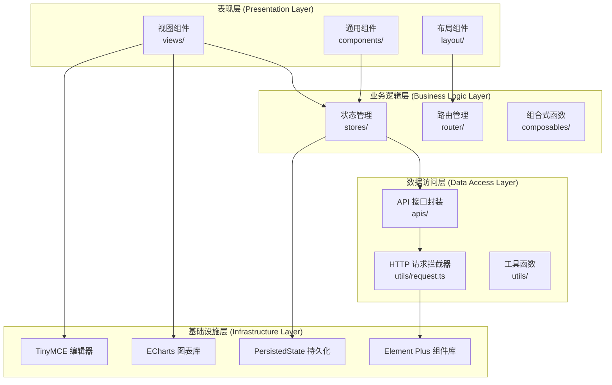
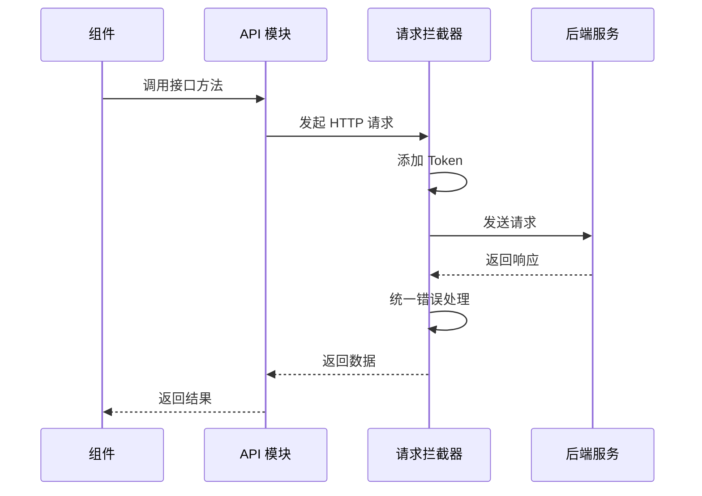
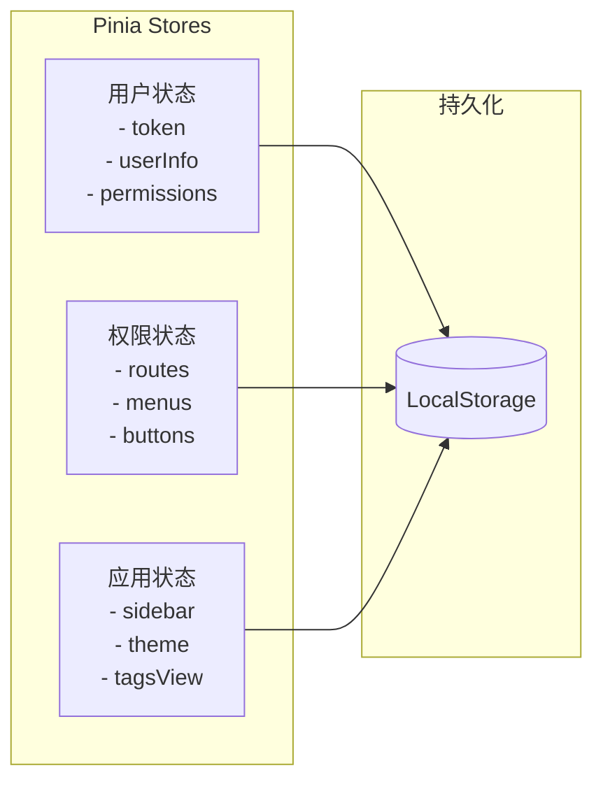
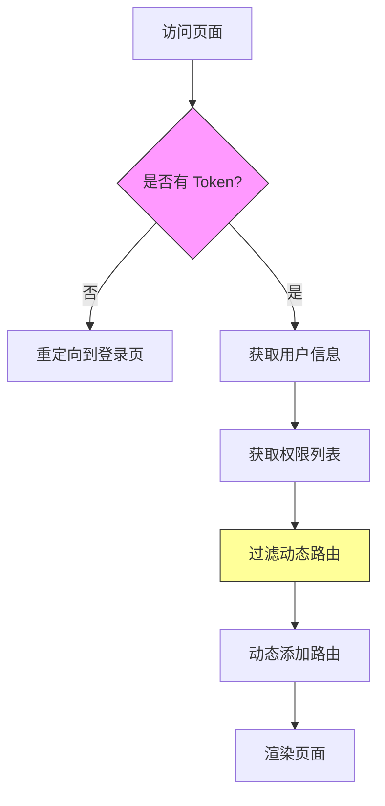
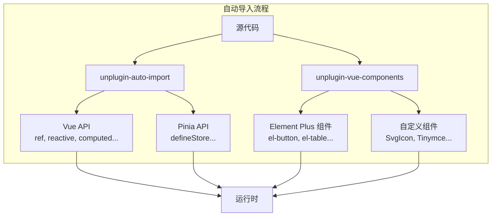
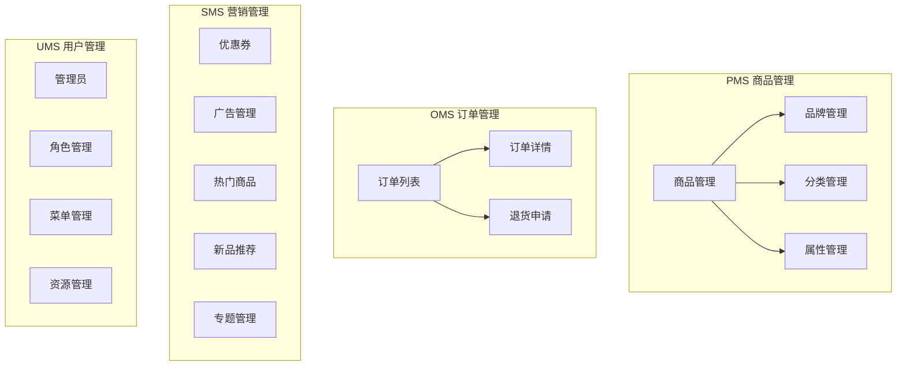
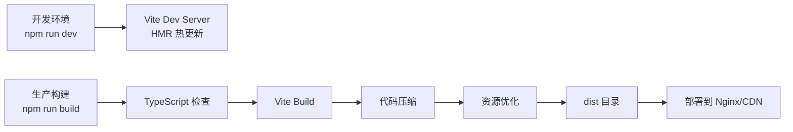
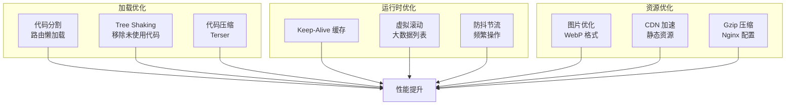

# mall-admin-web

电商后台管理系统前端项目，基于 Vue3 + TypeScript + Element Plus 构建。

## 技术架构

### 技术栈

| 类别 | 技术 | 版本 | 说明 |
|------|------|------|------|
| 核心框架 | Vue 3 | ^3.5.25 | 组合式 API |
| 类型系统 | TypeScript | ~5.9.0 | 静态类型检查 |
| UI 框架 | Element Plus | ^2.12.0 | 组件库 |
| 构建工具 | Vite | ^7.2.4 | 快速开发服务器 |
| 状态管理 | Pinia | ^3.0.4 | 全局状态管理 |
| 路由管理 | Vue Router | ^4.6.3 | 客户端路由 |
| HTTP 客户端 | Axios | ^1.13.2 | API 请求封装 |
| 数据可视化 | ECharts | ^6.0.0 | 图表库 |
| 富文本编辑器 | TinyMCE | ^6.8.6 | 内容编辑 |
| CSS 预处理 | Sass | ^1.96.0 | 样式编译 |
| 代码规范 | ESLint + Prettier | - | 代码质量保障 |

### 架构设计



### 目录结构

```
mall-admin-web/
├── src/
│   ├── apis/              # API 接口定义（按模块划分）
│   │   ├── product.ts     # 商品相关接口
│   │   ├── order.ts       # 订单相关接口
│   │   ├── member.ts      # 会员相关接口
│   │   └── ...
│   ├── assets/            # 静态资源
│   ├── components/        # 通用组件
│   │   ├── SvgIcon/       # SVG 图标组件
│   │   ├── Tinymce/       # 富文本编辑器封装
│   │   └── ...
│   ├── icons/             # SVG 图标文件
│   ├── router/            # 路由配置
│   │   ├── index.ts       # 路由主配置
│   │   └── modules/       # 路由模块
│   ├── stores/            # Pinia 状态管理
│   │   ├── user.ts        # 用户状态
│   │   ├── permission.ts  # 权限状态
│   │   └── app.ts         # 应用状态
│   ├── styles/            # 全局样式
│   │   ├── element/       # Element Plus 主题定制
│   │   └── var.scss       # SCSS 变量
│   ├── types/             # TypeScript 类型定义
│   ├── utils/             # 工具函数
│   │   ├── request.ts     # Axios 封装
│   │   ├── auth.ts        # 认证工具
│   │   └── validate.ts    # 表单验证
│   ├── views/             # 页面组件
│   │   ├── home/          # 首页
│   │   ├── pms/           # 商品管理 (Product)
│   │   ├── oms/           # 订单管理 (Order)
│   │   ├── sms/           # 营销管理 (Sale)
│   │   ├── ums/           # 用户管理 (User)
│   │   └── layout/        # 布局框架
│   ├── App.vue            # 根组件
│   └── main.ts            # 入口文件
├── .env.development       # 开发环境变量
├── .env.production        # 生产环境变量
├── vite.config.ts         # Vite 配置
├── tsconfig.json          # TypeScript 配置
└── package.json           # 项目依赖
```

### 核心模块说明

#### 1. 请求封装层 (Request Layer)



**特性：**
- 统一的请求/响应拦截器
- 自动携带 JWT Token
- 统一的错误处理和提示
- 请求超时控制
- 响应数据格式化

#### 2. 状态管理 (State Management)



**使用示例：**
```typescript
import { defineStore } from 'pinia'

export const useUserStore = defineStore('user', {
  state: () => ({
    token: '',
    userInfo: null as UserInfo | null,
    permissions: [] as string[]
  }),
  
  actions: {
    async login(username: string, password: string) {
      const res = await loginApi({ username, password })
      this.token = res.data.token
      await this.getUserInfo()
    },
    
    async getUserInfo() {
      const res = await getInfoApi()
      this.userInfo = res.data
      this.permissions = res.data.permissions
    }
  },
  
  persist: true // 启用持久化
})
```

#### 3. 路由与权限控制



**权限控制策略：**
- **路由级权限**：根据用户角色动态生成可访问路由
- **按钮级权限**：通过自定义指令 `v-permission` 控制按钮显示
- **菜单级权限**：后端返回菜单树，前端动态渲染

#### 4. 组件自动导入机制



**优势：**
- 无需手动导入 Vue API 和常用工具函数
- Element Plus 组件按需自动导入
- 减少样板代码，提升开发效率

### 功能模块架构



### 构建与部署



**构建命令：**
```bash
# 开发环境
npm run dev              # 启动开发服务器（端口 5173）

# 生产构建
npm run build            # 类型检查 + 构建
npm run build-only       # 仅构建（无类型检查）
npm run type-check       # 仅类型检查

# 其他
npm run preview          # 预览生产构建
npm run lint             # ESLint 代码检查并修复
```

**环境变量：**
```bash
# .env.development
VITE_BASE_SERVER_URL=http://localhost:8080

# .env.production
VITE_BASE_SERVER_URL=https://your-api-domain.com
```

### 性能优化策略



### 开发规范

#### TypeScript 规范
```typescript
// ✅ 推荐：明确定义类型
interface Product {
  id: number
  name: string
  price: number
}

// ❌ 避免：使用 any
const data: any = {}
```

#### 组件命名规范
```
✅ PascalCase: ProductList.vue, OrderDetail.vue
✅ 多单词组成，避免单个单词
✅ 基础组件以 Base 前缀：BaseButton.vue
```

#### API 组织规范
```typescript
// apis/product.ts
import request from '@/utils/request'

export interface ProductQuery {
  pageNum: number
  pageSize: number
  productName?: string
}

export function getProductList(params: ProductQuery) {
  return request<ProductListResponse>({
    url: '/product/list',
    method: 'get',
    params
  })
}
```

## 快速开始

### 环境要求
- Node.js >= 20.19.0
- npm >= 10.0.0

### 安装与启动
```bash
# 安装依赖
npm install

# 启动开发服务器
npm run dev

# 访问 http://localhost:5173
```

### 后端对接
- 本地开发：修改 `.env.development` 中的 `VITE_BASE_SERVER_URL` 为后端服务地址
- 生产环境：修改 `.env.production` 中的 `VITE_BASE_SERVER_URL` 为生产 API 地址

## 许可证

Apache License 2.0
