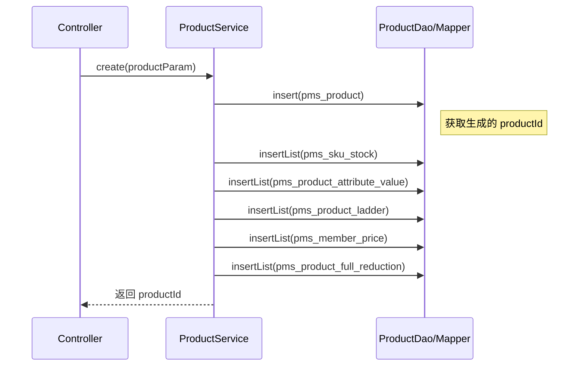
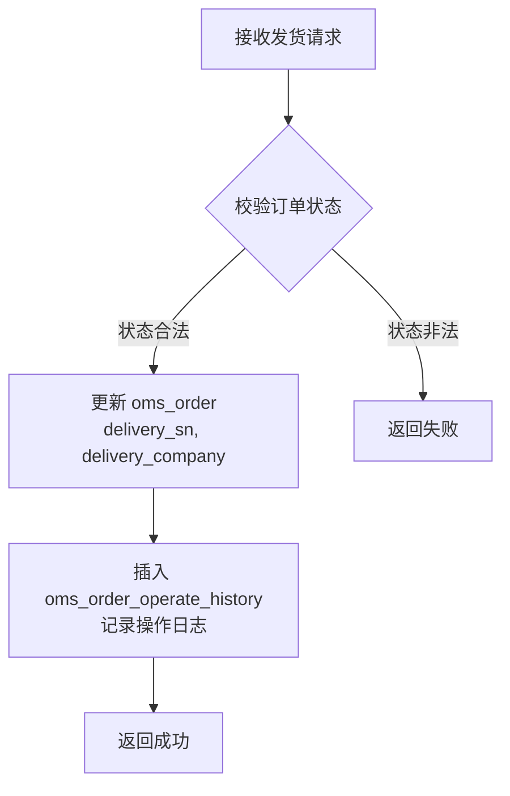
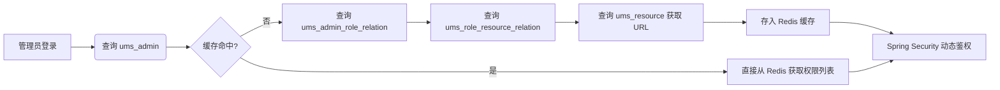
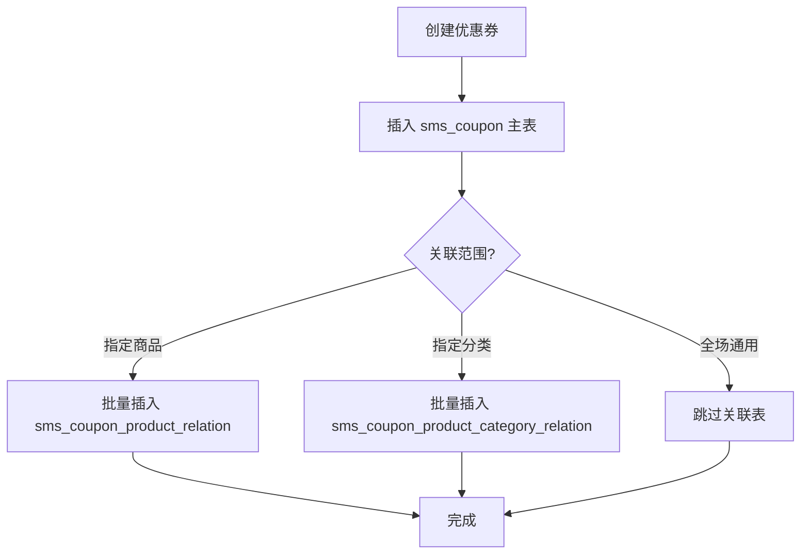
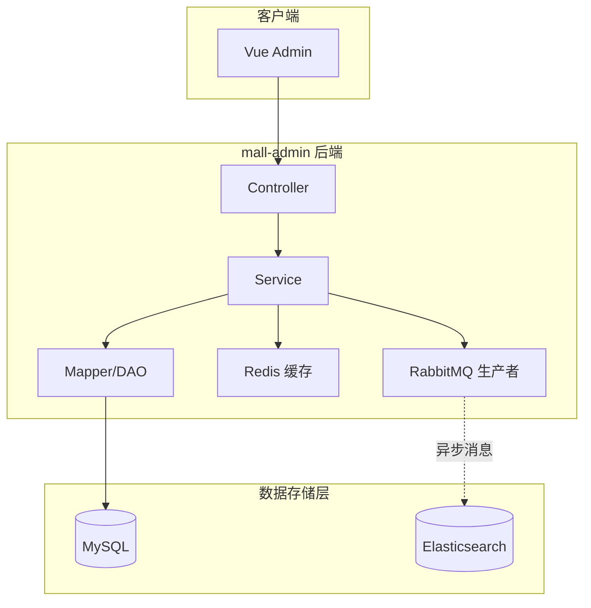

# Mall Admin API 与 SQL 映射关系文档

本文档详细说明了 `mall-admin` 模块中各业务功能的 API 接口与底层 SQL 操作的对应关系，并通过 Mermaid 流程图展示数据流转逻辑。

---

## 1. 商品管理模块 (PMS - Product Management System)

### 1.1 核心功能映射表

| API 路径 | 方法 | 功能描述 | 涉及主要数据表 | 关键 SQL 操作 |
| :--- | :--- | :--- | :--- | :--- |
| `/product/create` | POST | 创建商品 | `pms_product`, `pms_sku_stock`, `pms_product_attribute_value`, `pms_member_price`, `pms_product_ladder`, `pms_product_full_reduction` | `INSERT` |
| `/product/update/{id}` | POST | 修改商品 | `pms_product`, `pms_sku_stock` (含增删改逻辑) | `UPDATE`, `DELETE`, `INSERT` |
| `/product/list` | GET | 分页查询商品 | `pms_product` | `SELECT` (带动态条件) |
| `/product/update/verifyStatus` | POST | 批量审核 | `pms_product`, `pms_product_verify_record` | `UPDATE`, `INSERT` |
| `/product/update/publishStatus` | POST | 批量上下架 | `pms_product` | `UPDATE` |

### 1.2 商品创建流程 (Mermaid)

### 1.3 关键 SQL 逻辑说明

*   **复杂关联插入 (`/product/create`)**：通过反射机制在 `relateAndInsertList` 方法中统一处理会员价 (`pms_member_price`)、阶梯价 (`pms_product_ladder`)、满减 (`pms_product_full_reduction`)、SKU 库存及属性值的批量插入。
*   **动态查询 (`/product/list`)**：使用 MyBatis `<if>` 标签根据 `PmsProductQueryParam` 中的字段（如 `publishStatus`, `verifyStatus`, `keyword`）动态拼接 `WHERE` 子句，并强制过滤 `delete_status = 0`。
*   **审核记录 (`/update/verifyStatus`)**：在更新 `pms_product.verify_status` 的同时，向 `pms_product_verify_record` 表插入一条记录，包含审核人、时间及详细原因。

---

## 2. 订单管理模块 (OMS - Order Management System)

### 2.1 核心功能映射表

| API 路径 | 方法 | 功能描述 | 涉及主要数据表 | 关键 SQL 操作 |
| :--- | :--- | :--- | :--- | :--- |
| `/order/list` | GET | 订单列表查询 | `oms_order` | `SELECT` (多条件筛选) |
| `/order/{id}` | GET | 订单详情 | `oms_order`, `oms_order_item` | `SELECT` (关联查询) |
| `/order/update/delivery` | POST | 批量发货 | `oms_order`, `oms_order_operate_history` | `UPDATE`, `INSERT` |
| `/order/update/close` | POST | 批量关闭订单 | `oms_order`, `oms_order_operate_history` | `UPDATE`, `INSERT` |

### 2.2 订单发货流程 (Mermaid)

### 2.3 关键 SQL 逻辑说明

*   **批量发货 (`/update/delivery`)**：在 `OmsOrderDao.xml` 中使用高效的 `CASE WHEN ... END` 语法实现单条 SQL 批量更新多个订单的物流信息及状态（流转为 2-已发货），并校验原状态必须为 1-待发货。
*   **订单详情 (`/order/{id}`)**：通过 `OmsOrderDao.xml` 中的自定义查询，一次性关联查出 `oms_order_item`（商品快照）和 `oms_order_operate_history`（操作流水）。

---

## 3. 用户权限模块 (UMS - User Management System)

### 3.1 核心功能映射表

| API 路径 | 方法 | 功能描述 | 涉及主要数据表 | 关键 SQL 操作 |
| :--- | :--- | :--- | :--- | :--- |
| `/admin/login` | POST | 管理员登录 | `ums_admin`, `ums_role`, `ums_resource` | `SELECT` (关联查询权限) |
| `/admin/register` | POST | 管理员注册 | `ums_admin` | `INSERT` |
| `/admin/role/update` | POST | 分配角色 | `ums_admin_role_relation` | `DELETE` (旧关系), `INSERT` (新关系) |
| `/menu/list` | GET | 菜单列表 | `ums_menu` | `SELECT` |

### 3.2 动态权限加载逻辑 (Mermaid)

### 3.3 关键 SQL 逻辑说明

*   **角色分配 (`/role/update`)**：采用“先删后增”策略。先执行 `DELETE FROM ums_admin_role_relation WHERE admin_id = ?`，再批量 `INSERT` 新的角色关联。
*   **菜单树构建**：查询 `ums_menu` 表后，在 Service 层通过递归算法将扁平的列表转换为树形结构（Tree Structure），供前端渲染侧边栏。

---

## 4. 营销管理模块 (SMS - Sales Management System)

### 4.1 核心功能映射表

| API 路径 | 方法 | 功能描述 | 涉及主要数据表 | 关键 SQL 操作 |
| :--- | :--- | :--- | :--- | :--- |
| `/flash/create` | POST | 创建限时购活动 | `sms_flash_promotion` | `INSERT` |
| `/flashSession/create` | POST | 添加活动场次 | `sms_flash_promotion_session` | `INSERT` |
| `/coupon/create` | POST | 创建优惠券 | `sms_coupon`, `sms_coupon_product_relation`, `sms_coupon_product_category_relation` | `INSERT` |
| `/home/advertise/list` | GET | 首页广告列表 | `sms_home_advertise` | `SELECT` |

### 4.2 优惠券发放逻辑 (Mermaid)

### 4.3 关键 SQL 逻辑说明

*   **场次关联**：限时购商品关系表 `sms_flash_promotion_product_relation` 通过 `flash_promotion_id` 和 `flash_promotion_session_id` 联合确定商品在特定时间段的促销价格。

---

## 5. 内容管理模块 (CMS - Content Management System)

### 5.1 核心功能映射表

| API 路径 | 方法 | 功能描述 | 涉及主要数据表 | 关键 SQL 操作 |
| :--- | :--- | :--- | :--- | :--- |
| `/subject/list` | GET | 专题列表查询 | `cms_subject` | `SELECT` (分页/模糊搜索) |
| `/prefrenceArea/listAll` | GET | 优选专区列表 | `cms_prefrence_area` | `SELECT` |

**说明**：目前 `mall-admin` 后端主要针对 CMS 模块提供查询接口，创建与修改功能通常由前端直接维护或通过其他渠道导入。

---

## 6. 全局总结与开发建议

### 6.1 数据流转全景图

### 6.2 开发注意事项

1.  **事务一致性**：在涉及多表操作（如商品创建、订单关闭）时，务必在 Service 层方法上标注 `@Transactional`。
2.  **缓存同步**：修改权限或管理员信息后，必须调用 `UmsAdminCacheService` 删除对应的 Redis 缓存，防止脏数据。
3.  **搜索引擎同步**：所有影响商品搜索属性的变更（上下架、改名、删库），都必须通过 `EsProductSender` 发送 MQ 消息。
4.  **SQL 性能**：对于 `list` 类接口，严禁使用 `SELECT *`，应只查询前端需要的字段，并利用 PageHelper 进行物理分页。
