# Mall Admin API 与 SQL 映射关系文档

本文档详细说明了 `mall-admin` 模块中各业务功能的 API 接口与底层 SQL 操作的对应关系，并通过 Mermaid 流程图展示数据流转逻辑。

---

## 0. 全局概览

### 0.1 系统架构与模块关系图

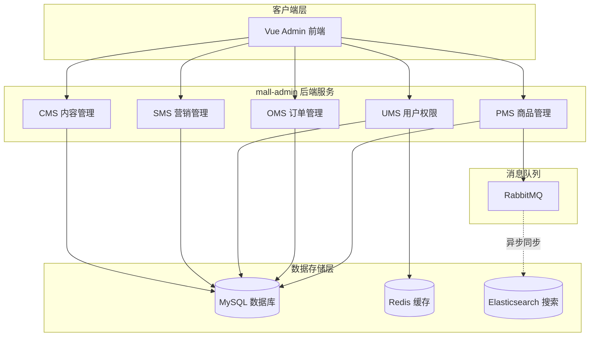

### 0.2 全局 E-R 图 (Entity-Relationship Diagram)

**说明**：E-R 图展示实体（Entity）之间的联系（Relationship），不涉及具体字段和表结构。

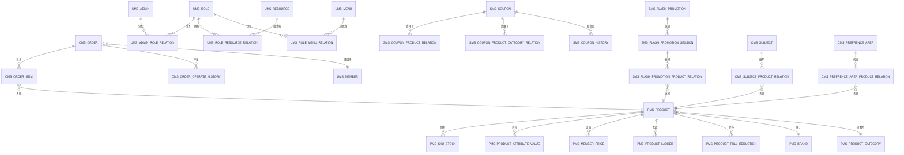

### 0.3 核心业务流程图

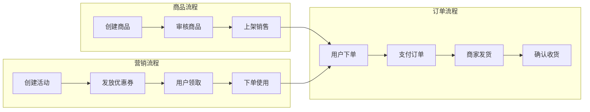

---

## 1. 商品管理模块 (PMS - Product Management System)

### 1.1 核心功能映射表

| API 路径 | 方法 | 功能描述 | 涉及主要数据表 | 关键 SQL 操作 |
| :--- | :--- | :--- | :--- | :--- |
| `/product/create` | POST | 创建商品 | `pms_product`, `pms_sku_stock`, `pms_product_attribute_value`, `pms_member_price`, `pms_product_ladder`, `pms_product_full_reduction` | `INSERT` |
| `/product/update/{id}` | POST | 修改商品 | `pms_product`, `pms_sku_stock` (含增删改逻辑) | `UPDATE`, `DELETE`, `INSERT` |
| `/product/list` | GET | 分页查询商品 | `pms_product` | `SELECT` (带动态条件) |
| `/product/update/verifyStatus` | POST | 批量审核 | `pms_product`, `pms_product_verify_record` | `UPDATE`, `INSERT` |
| `/product/update/publishStatus` | POST | 批量上下架 | `pms_product` | `UPDATE` |

### 1.2 商品创建流程 (Mermaid)

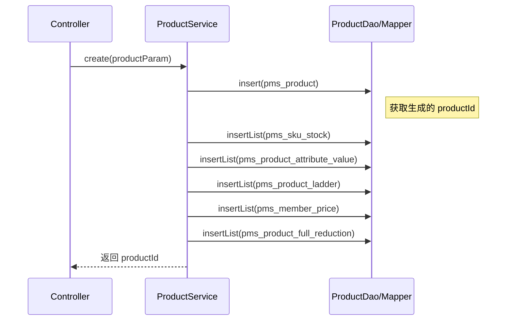

### 1.3 关键 SQL 逻辑说明

*   **复杂关联插入 (`/product/create`)**：通过反射机制在 `relateAndInsertList` 方法中统一处理会员价 (`pms_member_price`)、阶梯价 (`pms_product_ladder`)、满减 (`pms_product_full_reduction`)、SKU 库存及属性值的批量插入。
*   **动态查询 (`/product/list`)**：使用 MyBatis `<if>` 标签根据 `PmsProductQueryParam` 中的字段（如 `publishStatus`, `verifyStatus`, `keyword`）动态拼接 `WHERE` 子句，并强制过滤 `delete_status = 0`。
*   **审核记录 (`/update/verifyStatus`)**：在更新 `pms_product.verify_status` 的同时，向 `pms_product_verify_record` 表插入一条记录，包含审核人、时间及详细原因。

### 1.4 核心数据表结构

#### 1.4.1 商品主表 (pms_product)

| 字段名 | 类型 | 说明 | 备注 |
| :--- | :--- | :--- | :--- |
| `id` | BIGINT | 商品 ID | 主键，自增 |
| `brand_id` | BIGINT | 品牌 ID | 外键关联 `pms_brand` |
| `product_category_id` | BIGINT | 分类 ID | 外键关联 `pms_product_category` |
| `name` | VARCHAR(200) | 商品名称 | 支持模糊搜索 |
| `product_sn` | VARCHAR(64) | 货号 | 唯一标识 |
| `price` | DECIMAL(10,2) | 商品价格 | 原价 |
| `stock` | INT | 库存 | 总库存 |
| `publish_status` | INT | 上架状态 | 0-下架，1-上架 |
| `verify_status` | INT | 审核状态 | 0-未审核，1-通过，2-拒绝 |
| `delete_status` | INT | 删除状态 | 0-未删除，1-删除（逻辑删除） |
| `recommand_status` | INT | 推荐状态 | 0-不推荐，1-推荐 |
| `new_status` | INT | 新品状态 | 0-非新品，1-新品 |

#### 1.4.2 SKU 库存表 (pms_sku_stock)

| 字段名 | 类型 | 说明 | 备注 |
| :--- | :--- | :--- | :--- |
| `id` | BIGINT | SKU ID | 主键，自增 |
| `product_id` | BIGINT | 商品 ID | 外键关联 `pms_product` |
| `sku_code` | VARCHAR(64) | SKU 编码 | 自动生成或手动输入 |
| `price` | DECIMAL(10,2) | 销售价格 | 可不同于商品原价 |
| `stock` | INT | 库存 | 该 SKU 的库存 |
| `sp_data` | VARCHAR(500) | 销售属性 | JSON 格式，如 `{"颜色":"红色","尺寸":"XL"}` |

#### 1.4.3 表关系图 (Mermaid)

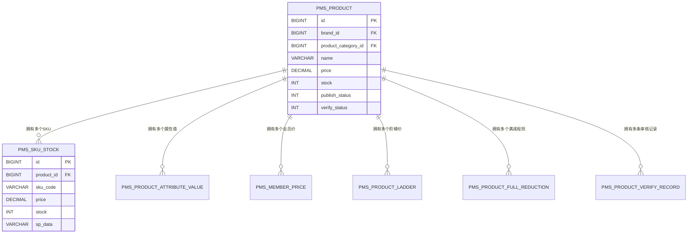

---

## 2. 订单管理模块 (OMS - Order Management System)

### 2.1 核心功能映射表

| API 路径 | 方法 | 功能描述 | 涉及主要数据表 | 关键 SQL 操作 |
| :--- | :--- | :--- | :--- | :--- |
| `/order/list` | GET | 订单列表查询 | `oms_order` | `SELECT` (多条件筛选) |
| `/order/{id}` | GET | 订单详情 | `oms_order`, `oms_order_item` | `SELECT` (关联查询) |
| `/order/update/delivery` | POST | 批量发货 | `oms_order`, `oms_order_operate_history` | `UPDATE`, `INSERT` |
| `/order/update/close` | POST | 批量关闭订单 | `oms_order`, `oms_order_operate_history` | `UPDATE`, `INSERT` |

### 2.2 订单发货流程 (Mermaid)

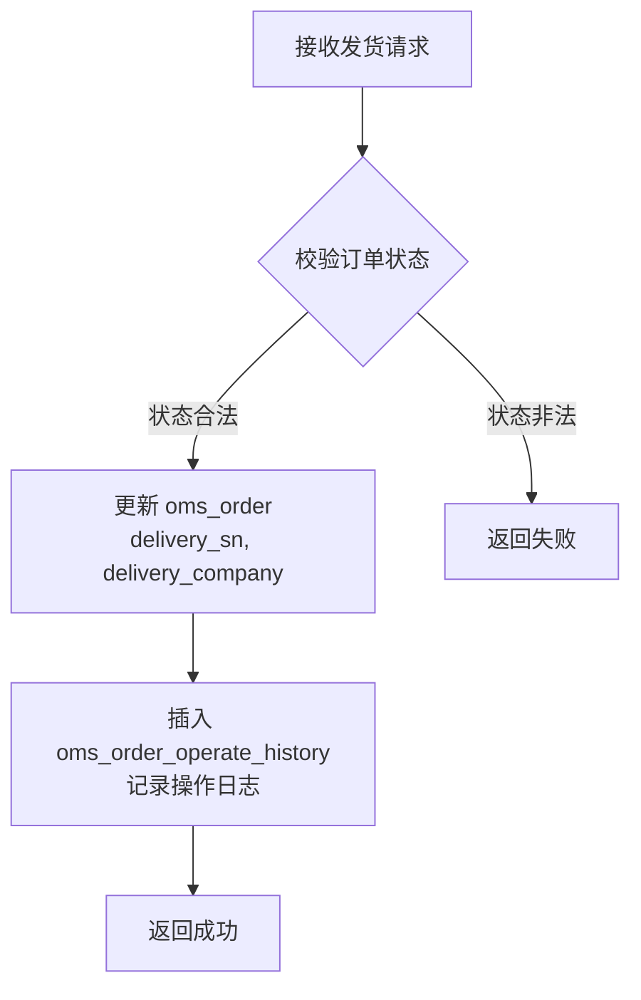

### 2.3 关键 SQL 逻辑说明

*   **批量发货 (`/update/delivery`)**：在 `OmsOrderDao.xml` 中使用高效的 `CASE WHEN ... END` 语法实现单条 SQL 批量更新多个订单的物流信息及状态（流转为 2-已发货），并校验原状态必须为 1-待发货。
*   **订单详情 (`/order/{id}`)**：通过 `OmsOrderDao.xml` 中的自定义查询，一次性关联查出 `oms_order_item`（商品快照）和 `oms_order_operate_history`（操作流水）。

### 2.4 核心数据表结构

#### 2.4.1 订单主表 (oms_order)

| 字段名 | 类型 | 说明 | 备注 |
| :--- | :--- | :--- | :--- |
| `id` | BIGINT | 订单 ID | 主键，自增 |
| `order_sn` | VARCHAR(64) | 订单编号 | 业务唯一标识 |
| `member_id` | BIGINT | 会员 ID | 外键关联 `ums_member` |
| `total_amount` | DECIMAL(10,2) | 订单总金额 | 商品总价 |
| `pay_amount` | DECIMAL(10,2) | 应付金额 | 实际支付金额 |
| `status` | INT | 订单状态 | 0-待付款，1-待发货，2-已发货，3-已完成，4-已关闭 |
| `delivery_sn` | VARCHAR(64) | 物流公司单号 | 发货时填写 |
| `delivery_company` | VARCHAR(64) | 物流公司名称 | 发货时填写 |
| `delivery_time` | DATETIME | 发货时间 | 发货时记录 |
| `receiver_name` | VARCHAR(64) | 收货人姓名 |  |
| `receiver_phone` | VARCHAR(64) | 收货人电话 |  |
| `receiver_address` | VARCHAR(500) | 收货人地址 |  |
| `note` | VARCHAR(500) | 订单备注 | 管理员备注 |
| `delete_status` | INT | 删除状态 | 0-未删除，1-删除（逻辑删除） |

#### 2.4.2 订单商品明细表 (oms_order_item)

| 字段名 | 类型 | 说明 | 备注 |
| :--- | :--- | :--- | :--- |
| `id` | BIGINT | 明细 ID | 主键，自增 |
| `order_id` | BIGINT | 订单 ID | 外键关联 `oms_order` |
| `product_id` | BIGINT | 商品 ID | 商品快照 |
| `product_name` | VARCHAR(200) | 商品名称 | 下单时的名称快照 |
| `product_price` | DECIMAL(10,2) | 商品单价 | 下单时的价格快照 |
| `product_quantity` | INT | 购买数量 |  |
| `product_attr` | VARCHAR(500) | 商品属性 | JSON 格式，如 `{"颜色":"红色"}` |

#### 2.4.3 订单操作历史表 (oms_order_operate_history)

| 字段名 | 类型 | 说明 | 备注 |
| :--- | :--- | :--- | :--- |
| `id` | BIGINT | 历史 ID | 主键，自增 |
| `order_id` | BIGINT | 订单 ID | 外键关联 `oms_order` |
| `operate_man` | VARCHAR(100) | 操作人 | 管理员或系统 |
| `order_status` | INT | 操作后订单状态 | 记录状态变更 |
| `note` | VARCHAR(500) | 备注信息 | 操作说明 |
| `create_time` | DATETIME | 操作时间 | 自动记录 |

#### 2.4.4 表关系图 (Mermaid)

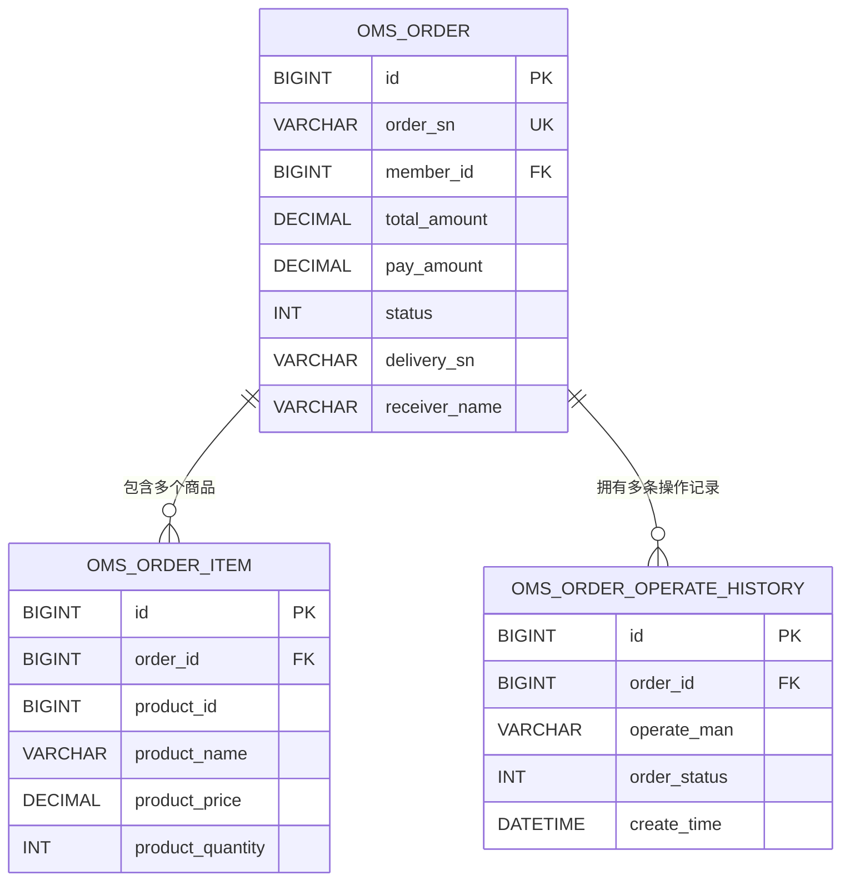

---

## 3. 用户权限模块 (UMS - User Management System)

### 3.1 核心功能映射表

| API 路径 | 方法 | 功能描述 | 涉及主要数据表 | 关键 SQL 操作 |
| :--- | :--- | :--- | :--- | :--- |
| `/admin/login` | POST | 管理员登录 | `ums_admin`, `ums_role`, `ums_resource` | `SELECT` (关联查询权限) |
| `/admin/register` | POST | 管理员注册 | `ums_admin` | `INSERT` |
| `/admin/role/update` | POST | 分配角色 | `ums_admin_role_relation` | `DELETE` (旧关系), `INSERT` (新关系) |
| `/menu/list` | GET | 菜单列表 | `ums_menu` | `SELECT` |

### 3.2 动态权限加载逻辑 (Mermaid)

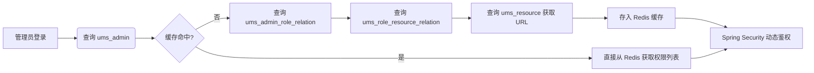

### 3.3 关键 SQL 逻辑说明

*   **角色分配 (`/role/update`)**：采用“先删后增”策略。先执行 `DELETE FROM ums_admin_role_relation WHERE admin_id = ?`，再批量 `INSERT` 新的角色关联。
*   **菜单树构建**：查询 `ums_menu` 表后，在 Service 层通过递归算法将扁平的列表转换为树形结构（Tree Structure），供前端渲染侧边栏。

### 3.4 核心数据表结构

#### 3.4.1 管理员表 (ums_admin)

| 字段名 | 类型 | 说明 | 备注 |
| :--- | :--- | :--- | :--- |
| `id` | BIGINT | 管理员 ID | 主键，自增 |
| `username` | VARCHAR(64) | 用户名 | 唯一，用于登录 |
| `password` | VARCHAR(500) | 密码 | BCrypt 加密存储 |
| `icon` | VARCHAR(500) | 头像 | 图片 URL |
| `email` | VARCHAR(100) | 邮箱 |  |
| `nick_name` | VARCHAR(200) | 昵称 |  |
| `status` | INT | 账号状态 | 0-禁用，1-启用 |
| `create_time` | DATETIME | 创建时间 | 自动记录 |

#### 3.4.2 角色表 (ums_role)

| 字段名 | 类型 | 说明 | 备注 |
| :--- | :--- | :--- | :--- |
| `id` | BIGINT | 角色 ID | 主键，自增 |
| `name` | VARCHAR(100) | 角色名称 | 如：商品管理员、订单管理员 |
| `description` | VARCHAR(500) | 描述 | 角色说明 |
| `admin_count` | INT | 后台用户数量 | 统计字段 |
| `create_time` | DATETIME | 创建时间 | 自动记录 |
| `status` | INT | 启用状态 | 0-禁用，1-启用 |

#### 3.4.3 资源权限表 (ums_resource)

| 字段名 | 类型 | 说明 | 备注 |
| :--- | :--- | :--- | :--- |
| `id` | BIGINT | 资源 ID | 主键，自增 |
| `name` | VARCHAR(200) | 资源名称 | 如：商品管理 |
| `url` | VARCHAR(200) | 资源路径 | Ant 风格路径，如 `/product/**` |
| `category_id` | BIGINT | 分类 ID | 外键关联 `ums_resource_category` |
| `parent_id` | BIGINT | 父级 ID | 支持树形结构 |

#### 3.4.4 管理员-角色关系表 (ums_admin_role_relation)

| 字段名 | 类型 | 说明 | 备注 |
| :--- | :--- | :--- | :--- |
| `id` | BIGINT | 关系 ID | 主键，自增 |
| `admin_id` | BIGINT | 管理员 ID | 外键关联 `ums_admin` |
| `role_id` | BIGINT | 角色 ID | 外键关联 `ums_role` |

#### 3.4.5 表关系图 (Mermaid)

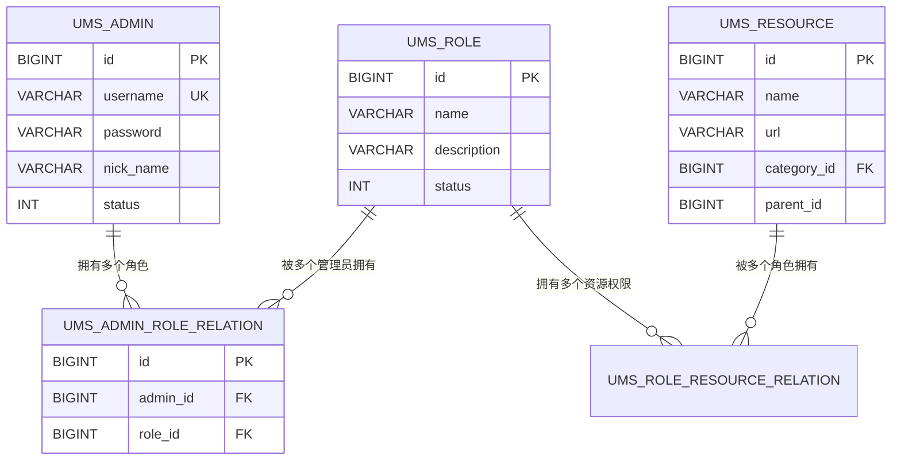

---

## 4. 营销管理模块 (SMS - Sales Management System)

### 4.1 核心功能映射表

| API 路径 | 方法 | 功能描述 | 涉及主要数据表 | 关键 SQL 操作 |
| :--- | :--- | :--- | :--- | :--- |
| `/flash/create` | POST | 创建限时购活动 | `sms_flash_promotion` | `INSERT` |
| `/flashSession/create` | POST | 添加活动场次 | `sms_flash_promotion_session` | `INSERT` |
| `/coupon/create` | POST | 创建优惠券 | `sms_coupon`, `sms_coupon_product_relation`, `sms_coupon_product_category_relation` | `INSERT` |
| `/home/advertise/list` | GET | 首页广告列表 | `sms_home_advertise` | `SELECT` |

### 4.2 优惠券发放逻辑 (Mermaid)

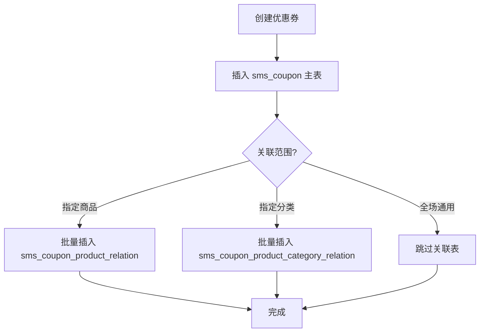

### 4.3 关键 SQL 逻辑说明

*   **场次关联**：限时购商品关系表 `sms_flash_promotion_product_relation` 通过 `flash_promotion_id` 和 `flash_promotion_session_id` 联合确定商品在特定时间段的促销价格。

### 4.4 核心数据表结构

#### 4.4.1 优惠券表 (sms_coupon)

| 字段名 | 类型 | 说明 | 备注 |
| :--- | :--- | :--- | :--- |
| `id` | BIGINT | 优惠券 ID | 主键，自增 |
| `name` | VARCHAR(100) | 优惠券名称 |  |
| `type` | INT | 使用类型 | 0-全场通用，1-指定分类，2-指定商品 |
| `amount` | DECIMAL(10,2) | 面额 | 优惠金额 |
| `count` | INT | 发行数量 | 总数量 |
| `use_count` | INT | 已使用数量 | 统计字段 |
| `min_point` | DECIMAL(10,2) | 使用门槛 | 满多少元可用 |
| `start_time` | DATETIME | 有效期开始 |  |
| `end_time` | DATETIME | 有效期结束 |  |

#### 4.4.2 优惠券-商品关系表 (sms_coupon_product_relation)

| 字段名 | 类型 | 说明 | 备注 |
| :--- | :--- | :--- | :--- |
| `id` | BIGINT | 关系 ID | 主键，自增 |
| `coupon_id` | BIGINT | 优惠券 ID | 外键关联 `sms_coupon` |
| `product_id` | BIGINT | 商品 ID | 外键关联 `pms_product` |
| `product_name` | VARCHAR(200) | 商品名称 | 快照 |
| `product_sn` | VARCHAR(64) | 商品货号 | 快照 |

#### 4.4.3 限时购活动表 (sms_flash_promotion)

| 字段名 | 类型 | 说明 | 备注 |
| :--- | :--- | :--- | :--- |
| `id` | BIGINT | 活动 ID | 主键，自增 |
| `title` | VARCHAR(200) | 活动标题 |  |
| `start_date` | DATE | 开始日期 |  |
| `end_date` | DATE | 结束日期 |  |
| `status` | INT | 上下线状态 | 0-下线，1-上线 |

#### 4.4.4 表关系图 (Mermaid)

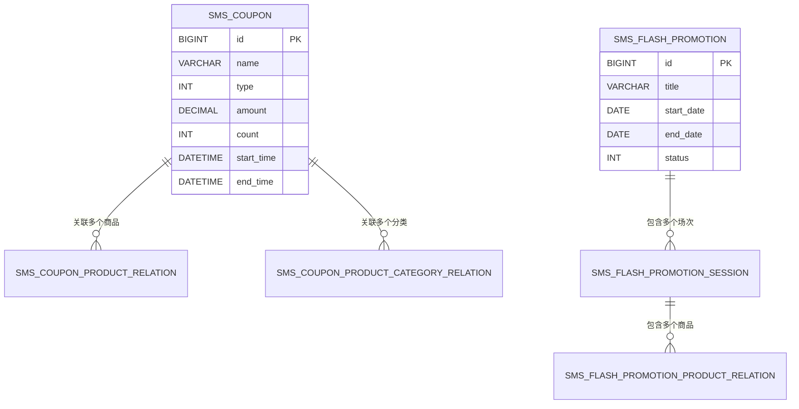

---

## 5. 内容管理模块 (CMS - Content Management System)

### 5.1 核心功能映射表

| API 路径 | 方法 | 功能描述 | 涉及主要数据表 | 关键 SQL 操作 |
| :--- | :--- | :--- | :--- | :--- |
| `/subject/list` | GET | 专题列表查询 | `cms_subject` | `SELECT` (分页/模糊搜索) |
| `/prefrenceArea/listAll` | GET | 优选专区列表 | `cms_prefrence_area` | `SELECT` |

**说明**：目前 `mall-admin` 后端主要针对 CMS 模块提供查询接口，创建与修改功能通常由前端直接维护或通过其他渠道导入。

---

## 6. 全局总结与开发建议

### 6.1 数据流转全景图

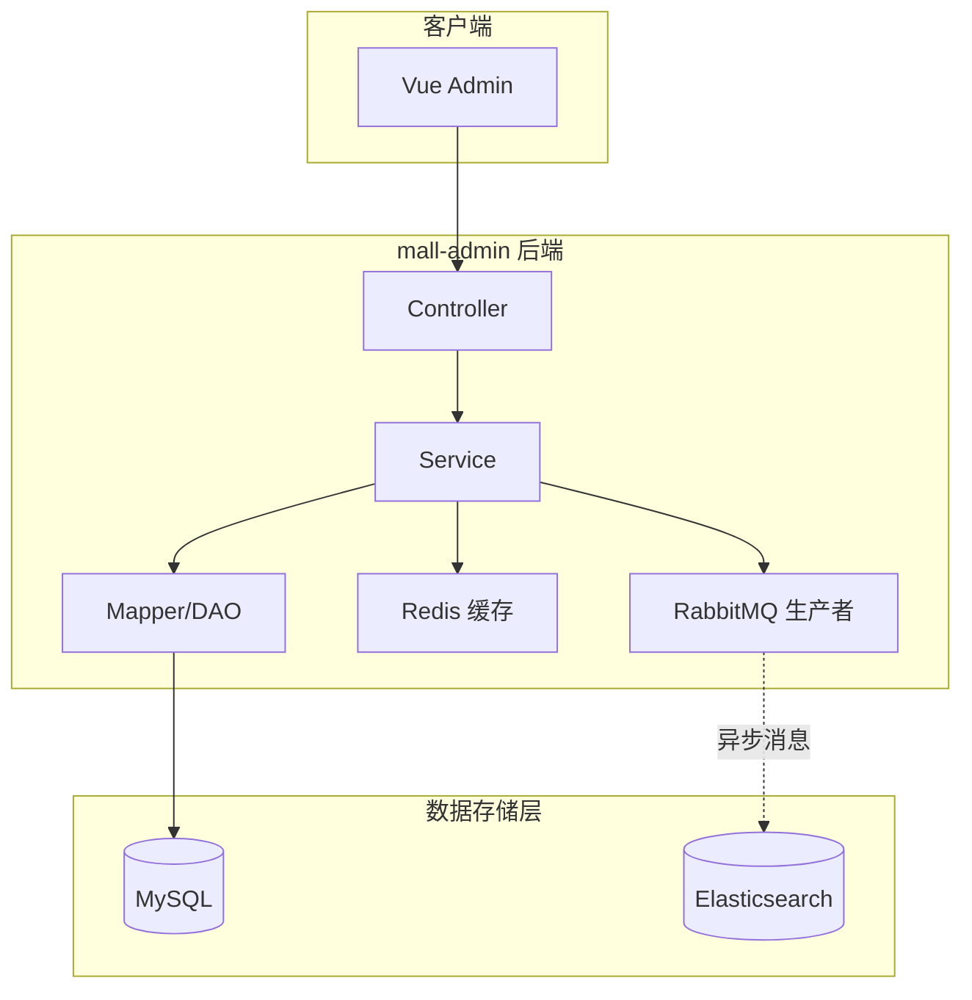

### 6.2 开发注意事项

1.  **事务一致性**：在涉及多表操作（如商品创建、订单关闭）时，务必在 Service 层方法上标注 `@Transactional`。
2.  **缓存同步**：修改权限或管理员信息后，必须调用 `UmsAdminCacheService` 删除对应的 Redis 缓存，防止脏数据。
3.  **搜索引擎同步**：所有影响商品搜索属性的变更（上下架、改名、删库），都必须通过 `EsProductSender` 发送 MQ 消息。
4.  **SQL 性能**：对于 `list` 类接口，严禁使用 `SELECT *`，应只查询前端需要的字段，并利用 PageHelper 进行物理分页。
