# Mall Admin - 电商后台管理系统

## 📋 项目简介

**Mall Admin** 是一个基于 Spring Boot 的电商后台管理系统，提供商品管理、订单处理、用户权限控制等核心功能。该项目采用前后端分离架构，集成 Elasticsearch 搜索引擎、RabbitMQ 消息队列、Redis 缓存等中间件，实现了高性能、可扩展的电商解决方案。

### 核心特性

- 🔐 **安全认证**：基于 Spring Security + JWT 的身份认证与动态权限控制
- 📦 **商品管理**：完整的商品 CRUD、SKU 管理、属性配置及审核流程
- 📋 **订单管理**：订单查询、发货、关闭、退款、操作历史记录及订单设置管理
- ⏱️ **订单设置**：支持配置超时取消、自动确认收货、自动完成、自动好评等时间规则
- 👥 **权限控制**：基于 RBAC（角色访问控制）的菜单与资源权限管理
- 🔍 **搜索集成**：通过 RabbitMQ 异步同步商品数据到 Elasticsearch
- 💾 **缓存优化**：使用 Redis 缓存管理员信息与权限数据，提升系统性能
- ☁️ **对象存储**：支持阿里云 OSS 和 MinIO 文件存储服务
- 📊 **API 文档**：集成 Swagger (OpenAPI 3) 自动生成接口文档

---

## 🏗️ 系统架构

### 整体架构图

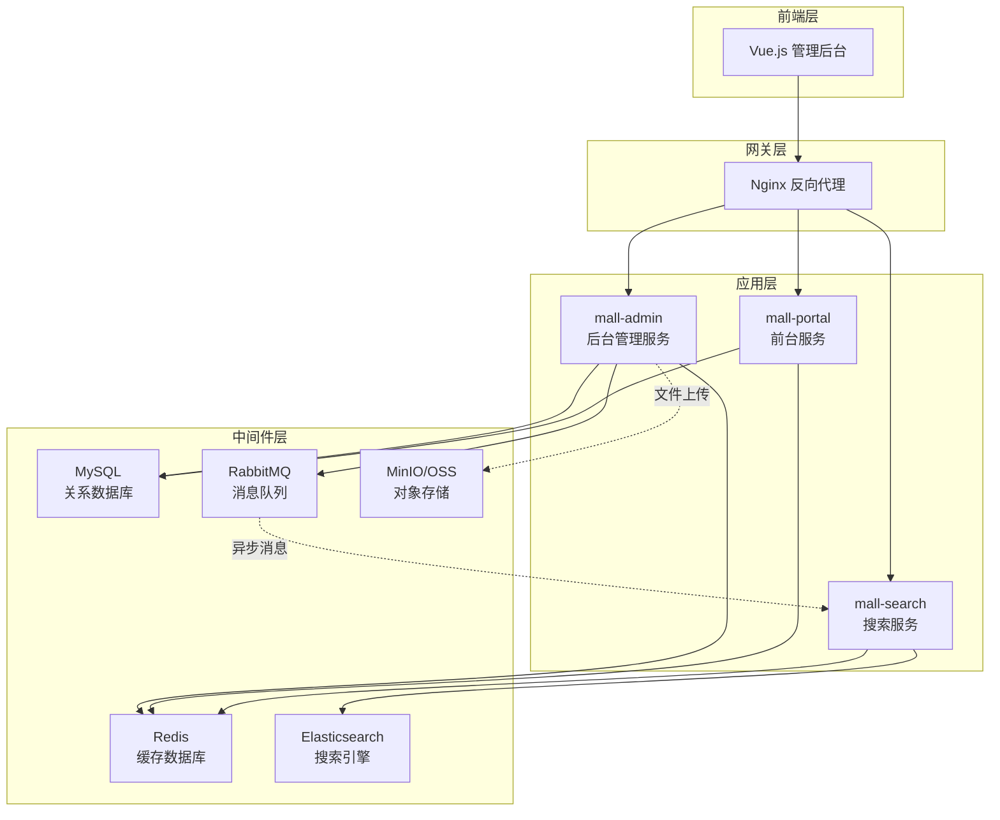

### 模块依赖关系

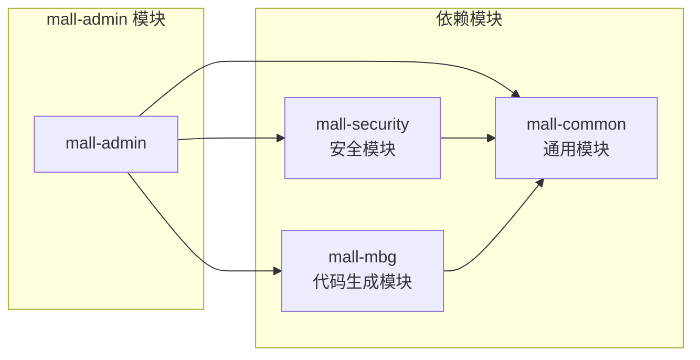

---

## 🛠️ 技术栈

### 后端技术

| 技术 | 版本 | 说明 |
|------|------|------|
| Spring Boot | 2.7.5 | 核心框架 |
| Spring Security | 2.7.5 | 安全框架 |
| MyBatis | 3.5.10 | ORM 框架 |
| PageHelper | 1.4.5 | 分页插件 |
| Druid | 1.2.14 | 数据库连接池 |
| JWT (jjwt) | 0.9.1 | Token 认证 |
| RabbitMQ | - | 消息队列 |
| Redis | - | 缓存数据库 |
| Elasticsearch | - | 搜索引擎 |
| Swagger | 3.0.0 | API 文档 |
| Hutool | 5.8.9 | Java 工具包 |
| Lombok | - | 代码简化 |

### 前端技术

| 技术 | 版本 | 说明 |
|------|------|------|
| Vue.js | 3.3.x | 前端框架 |
| TypeScript | 5.x | 类型系统 |
| Element Plus | 2.4.x | UI 组件库 |
| Vite | 5.x | 构建工具 |
| Pinia | 2.x | 状态管理 |

### 开发工具

- **JDK**: 1.8+
- **Maven**: 3.6+
- **Node.js**: 16+
- **MySQL**: 5.7+ / 8.0+
- **Redis**: 5.0+
- **RabbitMQ**: 3.8+
- **Elasticsearch**: 7.x

### 代码规范与注释

本项目遵循 **“中文为主，英文为辅”** 的双语注释策略：

1. **专业名词**：首次出现时采用 `中文名称 (English Term)` 格式。
2. **代码实体**：保留原始英文命名，注释中辅以中文解释。
3. **异常日志**：关键错误信息包含英文术语，便于全球化工具分析。

```java
/**
 * 批量修改商品审核状态
 * 同时记录审核操作日志到 pms_product_verify_record 表。
 *
 * @param ids 商品 ID 集合
 * @param verifyStatus 目标审核状态 (0:未审核, 1:通过, 2:拒绝)
 * @param detail 审核意见或原因
 * @return 成功修改的记录数
 */
int updateVerifyStatus(List<Long> ids, Integer verifyStatus, String detail);
```

---

## 📂 项目结构

```
mall-admin/
├── src/main/java/com/macro/mall/
│   ├── MallAdminApplication.java          # 启动类
│   ├── bo/                                 # 业务对象
│   │   └── AdminUserDetails.java          # Spring Security 用户详情
│   ├── component/                          # 组件
│   │   └── EsProductSender.java           # ES 消息发送器
│   ├── config/                             # 配置类
│   │   ├── GlobalCorsConfig.java          # 跨域配置
│   │   ├── MallSecurityConfig.java        # 安全配置
│   │   ├── MyBatisConfig.java             # MyBatis 配置
│   │   ├── OssConfig.java                 # OSS 配置
│   │   ├── RabbitMqConfig.java            # RabbitMQ 配置
│   │   └── SwaggerConfig.java             # Swagger 配置
│   ├── controller/                         # 控制器层
│   │   ├── UmsAdminController.java        # 用户管理
│   │   ├── PmsProductController.java      # 商品管理
│   │   ├── OmsOrderController.java        # 订单管理
│   │   └── ...                            # 其他控制器
│   ├── service/                            # 服务层
│   │   ├── UmsAdminService.java           # 用户服务接口
│   │   ├── PmsProductService.java         # 商品服务接口
│   │   ├── OmsOrderService.java           # 订单服务接口
│   │   └── impl/                          # 服务实现
│   │       ├── UmsAdminServiceImpl.java
│   │       ├── PmsProductServiceImpl.java
│   │       ├── OmsOrderServiceImpl.java
│   │       └── UmsAdminCacheServiceImpl.java  # 缓存服务
│   ├── dao/                                # 自定义 DAO
│   │   ├── PmsProductDao.java             # 商品 DAO
│   │   ├── OmsOrderDao.java               # 订单 DAO
│   │   └── ...
│   ├── dto/                                # 数据传输对象
│   │   ├── PmsProductParam.java           # 商品参数
│   │   ├── UmsAdminLoginParam.java        # 登录参数
│   │   └── ...
│   └── validator/                          # 验证器
├── src/main/resources/
│   ├── application.yml                     # 主配置文件
│   ├── application-dev.yml                 # 开发环境配置
│   ├── application-prod.yml                # 生产环境配置
│   └── dao/                                # MyBatis XML
│       ├── PmsProductDao.xml
│       ├── OmsOrderDao.xml
│       └── ...
└── pom.xml                                 # Maven 配置
```

---

## 🚀 快速开始

### 前置要求

确保已安装以下软件：

- JDK 1.8+
- Maven 3.6+
- MySQL 5.7+
- Redis 5.0+
- RabbitMQ 3.8+
- Elasticsearch 7.x（可选，用于搜索功能）

### 1. 数据库初始化

执行 SQL 脚本创建数据库和表结构：

```bash
# 导入数据库脚本
mysql -u root -p < document/sql/mall.sql
```

### 2. 配置修改

编辑 `src/main/resources/application-dev.yml` 文件，修改以下配置：

```yaml
spring:
  datasource:
    url: jdbc:mysql://localhost:3306/mall?useUnicode=true&characterEncoding=utf-8&serverTimezone=Asia/Shanghai
    username: your_username
    password: your_password
  
  redis:
    host: localhost
    port: 6379
    password: your_redis_password  # 如果没有密码则注释掉
  
  rabbitmq:
    host: localhost
    port: 5672
    username: guest
    password: guest

# MinIO 对象存储配置（本地部署）
minio:
  endpoint: http://localhost:9000  # MinIO API 端口（注意：不是 Console 端口 9001）
  bucketName: mall  # 存储桶名称
  accessKey: minioadmin  # 访问密钥
  secretKey: minioadmin  # 访问秘钥

# 阿里云 OSS 配置（如不使用可忽略）
aliyun:
  oss:
    endpoint: oss-cn-hangzhou.aliyuncs.com
    accessKeyId: your_access_key_id
    accessKeySecret: your_access_key_secret
```

### 3. 编译运行

```bash
# 进入项目根目录
cd mall

# 编译整个项目
mvn clean install

# 运行 mall-admin 模块
cd mall-admin
mvn spring-boot:run
```

或者使用 IDE（IntelliJ IDEA / Eclipse）直接运行 `MallAdminApplication.java`。

### 4. 访问系统

- **API 文档**: http://localhost:8080/swagger-ui/
- **后端服务**: http://localhost:8080

---

## 🔑 核心功能详解

### 1. 用户认证与授权

#### 认证流程

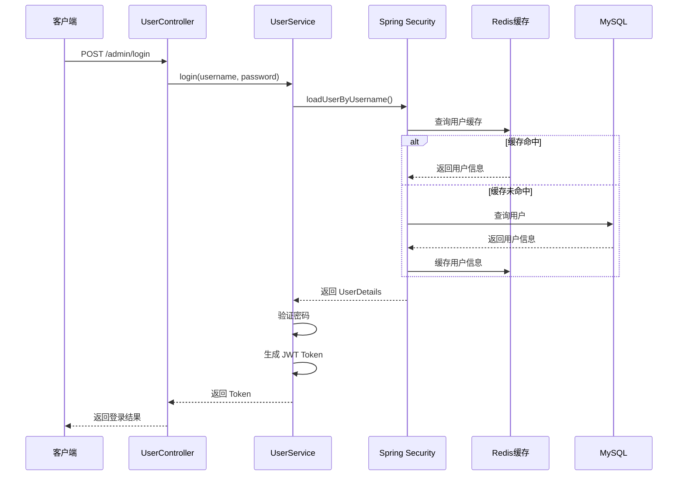

#### 权限控制

系统采用 **RBAC（Role-Based Access Control）** 模型：

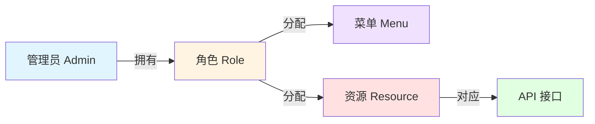

**动态权限加载**：

```java
// MallSecurityConfig.java
@Bean
public DynamicSecurityService dynamicSecurityService() {
    return new DynamicSecurityService() {
        @Override
        public Map<String, ConfigAttribute> loadDataSource() {
            // 从数据库加载所有资源（URL -> 权限标识）
            List<UmsResource> resourceList = resourceService.listAll();
            for (UmsResource resource : resourceList) {
                map.put(resource.getUrl(), 
                    new SecurityConfig(resource.getId() + ":" + resource.getName()));
            }
            return map;
        }
    };
}
```

### 2. 商品管理

#### 商品创建流程

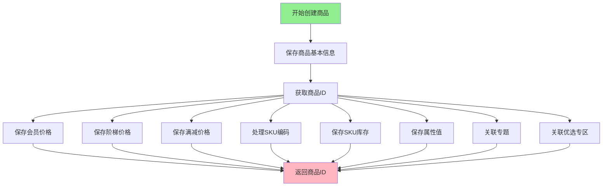

#### SKU 编码生成规则

```java
// 格式：日期(8位) + 商品ID(4位) + 索引(3位)
// 示例：202604300001001
SimpleDateFormat sdf = new SimpleDateFormat("yyyyMMdd");
StringBuilder sb = new StringBuilder();
sb.append(sdf.format(new Date()));        // 20260430
sb.append(String.format("%04d", productId)); // 0001
sb.append(String.format("%03d", i + 1));     // 001
skuStock.setSkuCode(sb.toString());
```

#### 商品同步到 Elasticsearch

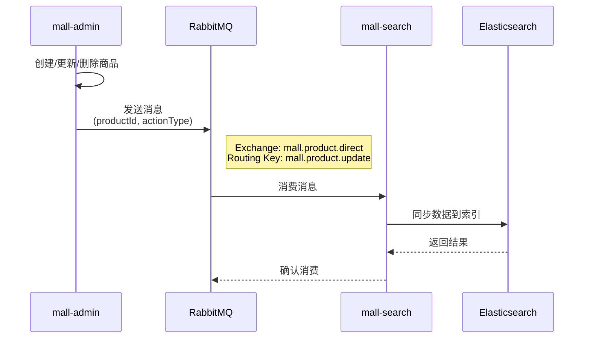

**消息发送代码**：

```java
// EsProductSender.java
public void send(Long productId, String actionType) {
    EsProductMessage message = new EsProductMessage();
    message.setProductId(productId);
    message.setActionType(actionType); // ADD / UPDATE / DELETE
    message.setTimestamp(System.currentTimeMillis());
    
    amqpTemplate.convertAndSend(
        "mall.product.direct", 
        "mall.product.update", 
        message
    );
}
```

### 3. 订单管理

#### 订单状态流转

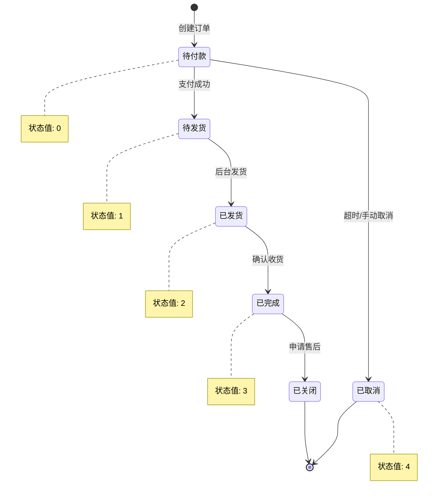

#### 订单操作流程

所有订单操作都会记录到 **订单操作历史表**：

```java
// OmsOrderServiceImpl.java - 发货示例
@Override
public int delivery(List<OmsOrderDeliveryParam> deliveryParamList) {
    // 1. 批量发货
    int count = orderDao.delivery(deliveryParamList);
    
    // 2. 记录操作历史
    List<OmsOrderOperateHistory> historyList = deliveryParamList.stream()
        .map(param -> {
            OmsOrderOperateHistory history = new OmsOrderOperateHistory();
            history.setOrderId(param.getOrderId());
            history.setCreateTime(new Date());
            history.setOperateMan("后台管理员");
            history.setOrderStatus(2);  // 已发货
            history.setNote("完成发货");
            return history;
        })
        .collect(Collectors.toList());
    
    orderOperateHistoryDao.insertList(historyList);
    return count;
}
```

### 4. 订单设置管理

订单设置功能用于配置订单的自动处理规则，包括超时取消、自动确认收货、自动完成和自动好评等时间设置。

#### 配置项说明

| 配置项 | 字段名 | 单位 | 默认值 | 说明 |
|--------|--------|------|--------|------|
| 秒杀订单超时关闭时间 | `flash_order_overtime` | 分钟 | 60 | 秒杀订单未支付，超过此时间自动取消 |
| 正常订单超时时间 | `normal_order_overtime` | 分钟 | 120 | 普通订单未支付，超过此时间自动取消 |
| 发货后自动确认收货时间 | `confirm_overtime` | 天 | 15 | 发货后超过此时间自动确认收货 |
| 自动完成交易时间 | `finish_overtime` | 天 | 7 | 确认收货后超过此时间自动完成，不能申请售后 |
| 订单完成后自动好评时间 | `comment_overtime` | 天 | 7 | 订单完成后超过此时间自动好评 |

#### 数据库表结构

```sql
CREATE TABLE `oms_order_setting` (
  `id` bigint(20) NOT NULL AUTO_INCREMENT,
  `flash_order_overtime` int(11) DEFAULT NULL COMMENT '秒杀订单超时关闭时间(分)',
  `normal_order_overtime` int(11) DEFAULT NULL COMMENT '正常订单超时时间(分)',
  `confirm_overtime` int(11) DEFAULT NULL COMMENT '发货后自动确认收货时间（天）',
  `finish_overtime` int(11) DEFAULT NULL COMMENT '自动完成交易时间，不能申请售后（天）',
  `comment_overtime` int(11) DEFAULT NULL COMMENT '订单完成后自动好评时间（天）',
  PRIMARY KEY (`id`)
) ENGINE=InnoDB DEFAULT CHARSET=utf8 COMMENT='订单设置表';

-- 默认配置
INSERT INTO `oms_order_setting` VALUES (1, 60, 120, 15, 7, 7);
```

#### API 接口

| 接口路径 | 方法 | 说明 | 权限 |
|---------|------|------|------|
| `/orderSetting/{id}` | GET | 获取指定订单设置 | 需要权限 |
| `/orderSetting/update/{id}` | POST | 修改指定订单设置 | 需要权限 |

#### 实现代码

**Controller 层** ([OmsOrderSettingController.java](src/main/java/com/macro/mall/controller/OmsOrderSettingController.java))

```java
@Controller  // 使用 @Controller + @ResponseBody 或 @RestController 均可
@RequestMapping("/orderSetting")
public class OmsOrderSettingController {
    @Autowired
    private OmsOrderSettingService orderSettingService;

    @ApiOperation("获取指定订单设置")
    @RequestMapping(value = "/{id}", method = RequestMethod.GET)
    @ResponseBody  // 配合 @Controller 使用，将返回值写入响应体
    public CommonResult<OmsOrderSetting> getItem(@PathVariable Long id) {
        OmsOrderSetting orderSetting = orderSettingService.getItem(id);
        return CommonResult.success(orderSetting);
    }

    @ApiOperation("修改指定订单设置")
    @RequestMapping(value = "/update/{id}", method = RequestMethod.POST)
    @ResponseBody
    public CommonResult update(@PathVariable Long id, @RequestBody OmsOrderSetting orderSetting) {
        int count = orderSettingService.update(id, orderSetting);
        if(count > 0){
            return CommonResult.success(count);
        }
        return CommonResult.failed();
    }
}
```

**Service 层** ([OmsOrderSettingServiceImpl.java](src/main/java/com/macro/mall/service/impl/OmsOrderSettingServiceImpl.java))

```java
@Service
public class OmsOrderSettingServiceImpl implements OmsOrderSettingService {
    @Autowired
    private OmsOrderSettingMapper orderSettingMapper;

    @Override
    public OmsOrderSetting getItem(Long id) {
        return orderSettingMapper.selectByPrimaryKey(id);
    }

    @Override
    public int update(Long id, OmsOrderSetting orderSetting) {
        orderSetting.setId(id);
        return orderSettingMapper.updateByPrimaryKey(orderSetting);
    }
}
```

#### 使用场景

这些配置通常配合定时任务（如 Quartz、XXL-JOB）使用，定期扫描超时订单并自动处理：

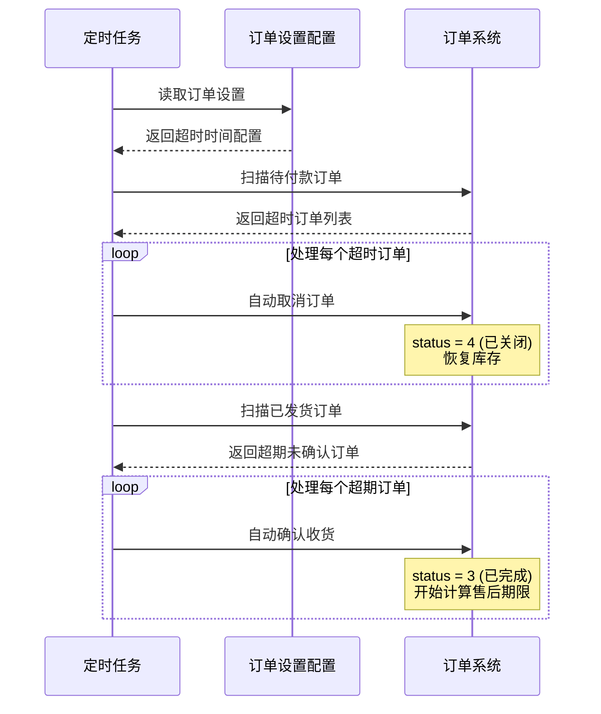

#### 业务流程

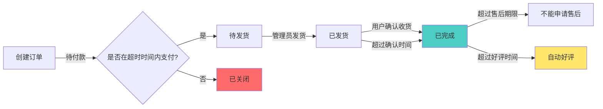

#### 订单设置与RabbitMQ的联动机制

订单设置是整个订单超时取消机制的**控制中枢**，与 RabbitMQ 延迟队列紧密配合工作：

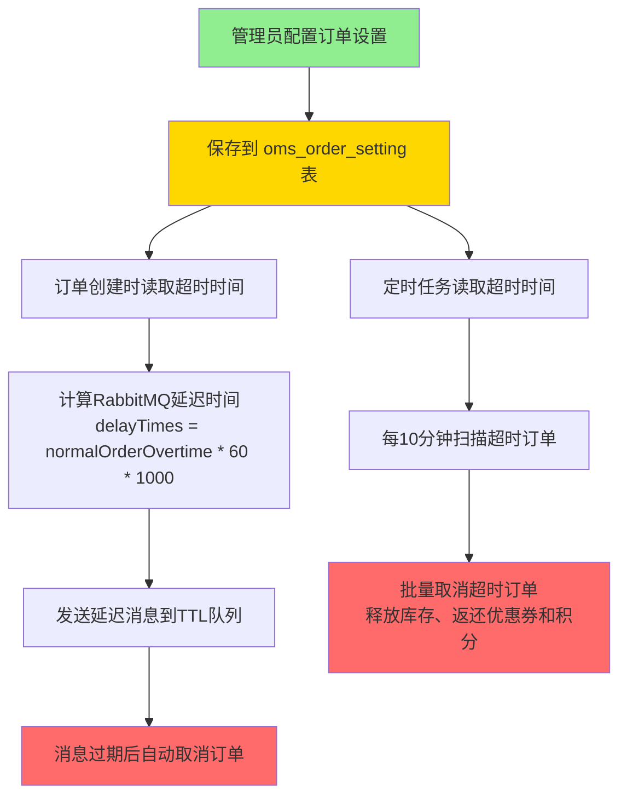

**联动流程说明**：

1. **配置驱动**：管理员在后台修改订单设置（如正常订单超时120分钟）
2. **订单创建时**：
   ```java
   // OmsPortalOrderServiceImpl.java
   OmsOrderSetting orderSetting = orderSettingMapper.selectByPrimaryKey(1L);
   long delayTimes = orderSetting.getNormalOrderOvertime() * 60 * 1000; // 转换为毫秒
   cancelOrderSender.sendMessage(orderId, delayTimes); // 发送延迟消息
   ```
3. **RabbitMQ处理**：
   - 消息进入延迟队列，设置过期时间为 `delayTimes`
   - 消息过期后自动转发到实际消费队列
   - 消费者 `CancelOrderReceiver` 接收消息并执行取消逻辑
4. **定时任务兜底**：
   - 每10分钟执行一次 `OrderTimeOutCancelTask`
   - 同样读取订单设置中的超时时间进行扫描
   - 处理可能遗漏的超时订单

**双重保障机制**：

| 机制 | 触发方式 | 优势 | 适用场景 |
|------|---------|------|---------|
| **RabbitMQ延迟队列** | 订单创建时立即发送 | 精确定时，实时取消，性能高 | 主要的超时取消机制 |
| **定时任务扫描** | 每10分钟执行一次 | 兜底保障，处理异常情况 | 备用机制，确保订单不遗漏 |

**配置项联动关系**：

| 订单设置字段 | 影响范围 | RabbitMQ中的应用 |
|------------|---------|----------------|
| `normalOrderOvertime` | 正常订单超时时间 | 设置正常订单的延迟消息TTL |
| `flashOrderOvertime` | 秒杀订单超时时间 | 设置秒杀订单的延迟消息TTL |
| `confirmOvertime` | 自动确认收货时间 | 设置订单的 `auto_confirm_day` 字段 |
| `finishOvertime` | 自动完成交易时间 | 定时任务扫描已完成订单的期限 |
| `commentOvertime` | 自动好评时间 | 定时任务扫描自动好评的期限 |

通过这种设计，订单设置实现了**一处配置，全局生效**的效果，确保订单超时处理机制的灵活性和一致性。

### 5. 缓存策略

#### Redis 缓存设计

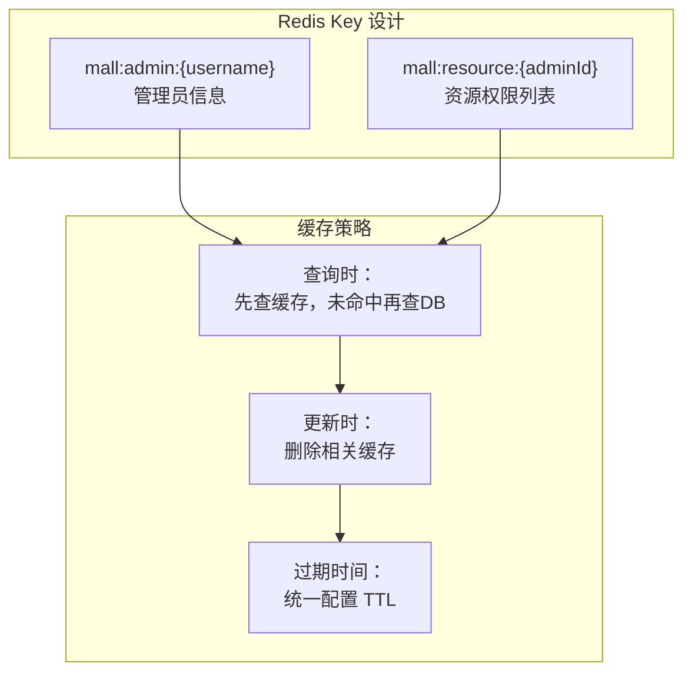

**缓存失效策略**：

```java
// 删除管理员缓存
public void delAdmin(Long adminId) {
    UmsAdmin admin = adminService.getItem(adminId);
    if (admin != null) {
        String key = REDIS_DATABASE + ":" + REDIS_KEY_ADMIN + ":" + admin.getUsername();
        redisService.del(key);
    }
}

// 根据角色删除相关管理员的资源缓存
public void delResourceListByRole(Long roleId) {
    // 查询该角色下的所有管理员
    List<UmsAdminRoleRelation> relationList = ...;
    
    // 批量删除缓存
    List<String> keys = relationList.stream()
        .map(relation -> keyPrefix + relation.getAdminId())
        .collect(Collectors.toList());
    redisService.del(keys);
}
```

---

## 📝 API 接口文档

### 用户管理接口

| 接口路径 | 方法 | 说明 | 权限 |
|---------|------|------|------|
| `/admin/register` | POST | 用户注册 | 匿名 |
| `/admin/login` | POST | 用户登录 | 匿名 |
| `/admin/info` | GET | 获取当前用户信息 | 登录后 |
| `/admin/logout` | POST | 登出 | 登录后 |
| `/admin/list` | GET | 分页查询用户列表 | 需要权限 |
| `/admin/update/{id}` | POST | 修改用户信息 | 需要权限 |
| `/admin/delete/{id}` | POST | 删除用户 | 需要权限 |
| `/admin/role/update` | POST | 分配角色 | 需要权限 |

### 商品管理接口

| 接口路径 | 方法 | 说明 | 权限 |
|---------|------|------|------|
| `/product/create` | POST | 创建商品 | 需要权限 |
| `/product/update/{id}` | POST | 修改商品 | 需要权限 |
| `/product/list` | GET | 分页查询商品 | 需要权限 |
| `/product/update/publishStatus` | POST | 批量上下架 | 需要权限 |
| `/product/update/verifyStatus` | POST | 批量审核 | 需要权限 |
| `/product/update/deleteStatus` | POST | 批量删除 | 需要权限 |

### 订单管理接口

| 接口路径 | 方法 | 说明 | 权限 |
|---------|------|------|------|
| `/order/list` | GET | 分页查询订单 | 需要权限 |
| `/order/{id}` | GET | 订单详情 | 需要权限 |
| `/order/update/delivery` | POST | 批量发货 | 需要权限 |
| `/order/update/close` | POST | 批量关闭 | 需要权限 |
| `/order/update/cancel` | POST | 取消订单 | 需要权限 |
| `/orderSetting/{id}` | GET | 获取订单设置 | 需要权限 |
| `/orderSetting/update/{id}` | POST | 修改订单设置 | 需要权限 |

> 💡 **提示**：完整的 API 文档请访问 Swagger UI：http://localhost:8080/swagger-ui/

---

## 🔧 配置说明

### 主要配置文件

#### application.yml（主配置）

```yaml
server:
  port: 8080

spring:
  profiles:
    active: dev  # 激活的开发环境
  application:
    name: mall-admin

jwt:
  tokenHeader: Authorization  # JWT 存储的请求头
  secret: mall-admin-secret   # JWT 加解密使用的密钥
  expiration: 604800          # JWT 的超期限时间（60*60*24*7）
  tokenHead: Bearer           # JWT 负载中拿到开头

redis:
  database: mall
  key:
    admin: ums:admin
    resourceList: ums:resourceList
  expire:
    common: 86400  # 24小时

swagger:
  enable: true  # 是否启用 Swagger
```

#### 多环境配置

- `application-dev.yml` - 开发环境
- `application-prod.yml` - 生产环境

切换环境：

```bash
# 方式1：修改 application.yml 中的 spring.profiles.active
spring:
  profiles:
    active: prod

# 方式2：启动时指定
java -jar mall-admin.jar --spring.profiles.active=prod
```

### MinIO 对象存储配置详解

MinIO 是一个高性能的对象存储服务，兼容 Amazon S3 API。本项目支持 MinIO 和阿里云 OSS 两种文件存储方案。

#### 本地部署 MinIO

**使用 Docker 快速启动**：

```bash
# 拉取 MinIO 镜像
docker pull minio/minio

# 启动 MinIO 容器
docker run -p 9000:9000 -p 9001:9001 \
  --name minio \
  -v /mnt/data:/data \
  -e "MINIO_ROOT_USER=minioadmin" \
  -e "MINIO_ROOT_PASSWORD=minioadmin" \
  minio/minio server /data --console-address ":9001"
```

**访问地址**：
- **API 端口**: http://localhost:9000（用于程序调用）
- **Console 端口**: http://localhost:9001（用于浏览器管理界面）

**配置说明**：

```yaml
minio:
  endpoint: http://localhost:9000  # ⚠️ 注意：这里是 API 端口，不是 9001
  bucketName: mall  # 存储桶名称，程序会自动创建
  accessKey: minioadmin  # 登录用户名
  secretKey: minioadmin  # 登录密码
```

**常见错误**：
- ❌ 错误配置：`endpoint: http://localhost:9001`（这是 Console 端口）
- ✅ 正确配置：`endpoint: http://localhost:9000`（这是 API 端口）

#### MinIO 功能接口

| 接口路径 | 方法 | 说明 | 参数 |
|---------|------|------|------|
| `/minio/upload` | POST | 上传文件 | `file` (MultipartFile) |
| `/minio/delete` | POST | 删除文件 | `objectName` (文件路径) |

**上传示例**：

```bash
curl -X POST http://localhost:8080/minio/upload \
  -F "file=@/path/to/your/image.jpg"
```

**返回结果**：

```json
{
  "code": 200,
  "message": "操作成功",
  "data": {
    "name": "image.jpg",
    "url": "http://localhost:9000/mall/20260503/image.jpg"
  }
}
```

#### 与阿里云 OSS 对比

| 特性 | MinIO | 阿里云 OSS |
|------|-------|----------|
| 部署方式 | 自建（Docker/本地） | 云服务 |
| 成本 | 免费 | 按量付费 |
| 适用场景 | 内网、测试环境 | 生产环境、公网访问 |
| 性能 | 高（本地部署） | 依赖网络 |

---

## 🧪 测试

### 单元测试

```bash
# 运行所有测试
mvn test

# 运行指定测试类
mvn test -Dtest=PmsDaoTests
```

### 接口测试

项目提供了 Postman 集合文件：

- `document/postman/mall-admin.postman_collection.json`

导入到 Postman 即可进行接口测试。

---

## 🐳 Docker 部署

### 构建镜像

```bash
# 在项目根目录执行
mvn clean package docker:build
```

### 使用 Docker Compose 部署

```yaml
# docker-compose.yml
version: '3'
services:
  mall-admin:
    image: mall/mall-admin:1.0-SNAPSHOT
    ports:
      - "8080:8080"
    environment:
      - SPRING_PROFILES_ACTIVE=prod
    depends_on:
      - mysql
      - redis
      - rabbitmq
  
  mysql:
    image: mysql:8.0
    environment:
      MYSQL_ROOT_PASSWORD: root
      MYSQL_DATABASE: mall
  
  redis:
    image: redis:6
  
  rabbitmq:
    image: rabbitmq:3.8-management
```

```bash
docker-compose up -d
```

---

## 📊 监控与管理

### 日志管理

日志配置文件位于 `src/main/resources/logback-spring.xml`，支持：

- 控制台输出
- 文件滚动存储
- Logstash 集成（可选）

