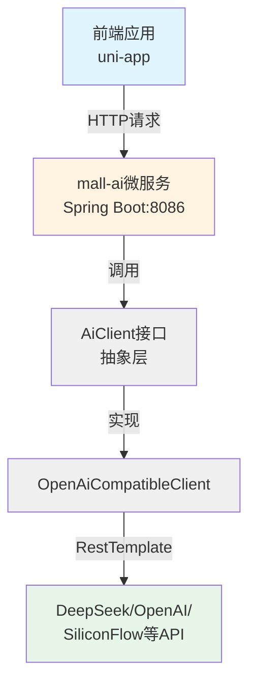
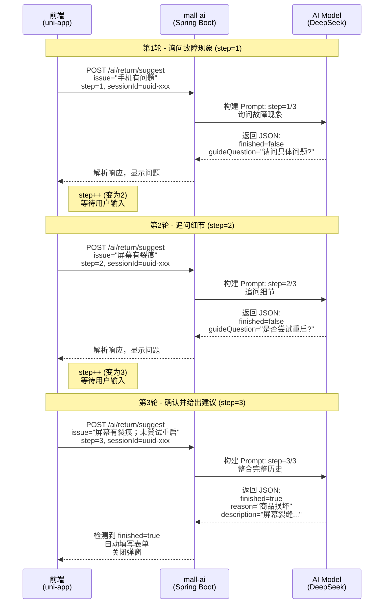
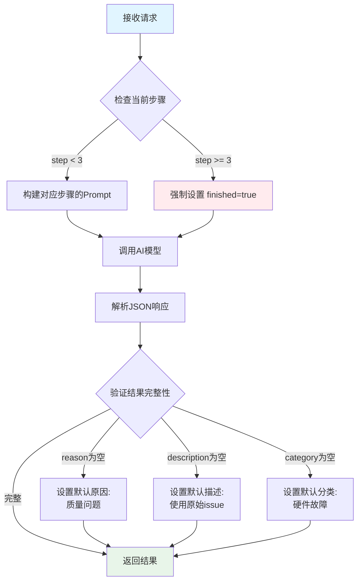
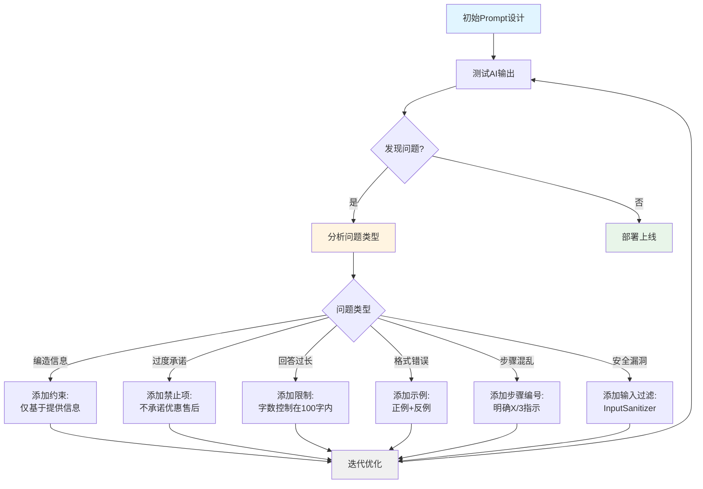

# mall-ai — AI 购物助手微服务

## 简介

mall-ai 是 mall 电商项目的 AI 微服务模块，提供基于大语言模型的智能购物助手功能。作为独立的微服务运行，可同时为多个前端（mall-app-web、mall-mobile-app 等）提供 AI 能力。

当前版本提供两个核心功能：

| 功能 | 说明 | 接口 |
|------|------|------|
| AI 商品导购 | 用户对商品提问，AI 根据商品信息回答 | `POST /ai/product/qa` |
| AI 售后建议 | 用户描述问题，AI 推荐退货原因并生成描述 | `POST /ai/return/suggest` |

## 架构



**设计特点：**
- **AI 客户端抽象**：通过 `AiClient` 接口 + `OpenAiCompatibleClient` 实现，切换大模型厂商只需改配置，无需改代码
- **无数据库依赖**：商品信息由前端传入，无需连接 MySQL/MyBatis，模块轻量
- **独立部署**：作为独立微服务运行，不影响现有 mall-portal 等模块

## 现代化重构进度

mall-ai 正在按 [mall-ai-fix-task](../mall-ai-fix-task/) 中的 8 阶段计划重构为 Spring Boot 3.5 时代最佳实践。

| Stage | 状态 | 摘要 |
|---|---|---|
| 1 | ✅ | DTO 全面 Java 17 Record 化 + 构造器注入（净减 468 行） |
| 2 | ✅ | 配置 Record 化 + 100+ 行 Prompt 外置到 application.yml |
| 3 | ✅ | 引入 Spring AI 替代 97 行手写 OpenAI 兼容客户端（-301 行） |
| 4 | ✅ | BeanOutputConverter 替换 90 行手写 JSON 解析（-250 行） |
| 5 | ✅ | InputSanitizer 收编为 Spring AI Advisor（删除 146 行工具类） |
| 6 | ⏳ | 移除 MyBatis 依赖，ReturnReason 走 OpenFeign |
| 7 | ⏳ | 流式输出 (SSE) |
| 8 | ⏳ | 对话记忆 + Function Calling |

Stage 1 成果：代码量从 ~1500 行 → ~1100 行（-27%），5 个 DTO 全部 record 化，0 个 `@Autowired` 字段注入。

Stage 2 成果：100+ 行硬编码 Prompt 全部外置到 `application.yml` 的 `ai.prompts.*`，运营/产品可独立修改 Prompt 无需重新编译；`AiClientConfig` 简化为 `@EnableConfigurationProperties` 注册入口，配置校验由 Bean Validation 自动接管。

Stage 3 成果：删除 97 行手写 `OpenAiCompatibleClient` + 整个 `client/` 目录，改用 Spring AI `ChatClient`。`application.yml` 改用 `spring.ai.openai.*` 标准化配置；白送 SSE 流式、BeanOutputConverter 结构化输出、Tool Calling 等"0 能力 → 现成"特性（Stage 4/8 落地）。`spring-ai.version=1.0.0` GA。

Stage 4 成果：删除 90 行手写 JSON 解析（含 markdown code block 剥离、字段提取、强制校验、Fallback），改用 `BeanOutputConverter<T>` 自动注入 JSON schema 到 prompt 并反序列化 AI 响应为 record。`enforceStep3Defaults()` / `fallbackResult()` 各自 15 行，业务代码精简 22%。

Stage 5 成果：删除 146 行 `InputSanitizer` 工具类，改用 Spring AI `CallAdvisor` 拦截所有 ChatClient 调用。`InputSanitizationAdvisor` 自动剥离控制字符、检测 Prompt Injection、截断超长输入，业务层完全无感。`ai.security.sanitization.*` 配置化。

Stage 6 成果：删除 4 个重依赖（mall-mbg / mybatis / druid / mysql-connector），`ReturnReasonService` 改用 OpenFeign 远程调 mall-portal。mall-ai 现在**真正轻量**：只依赖 mall-common + mall-common-cors + spring-web + spring-ai + spring-cloud-openfeign。0 个 DB 连接。

## 快速开始

### 1. 获取 API Key

选择任一平台注册获取 API Key：

| 平台 | 官网 | 备注 |
|------|------|------|
| DeepSeek | https://platform.deepseek.com | 注册送 500 万 token，性价比高 |
| SiliconFlow | https://cloud.siliconflow.cn | 注册送 2000 万 token，支持多种开源模型 |
| OpenAI | https://platform.openai.com | 需海外支付方式 |

### 2. 配置 API Key

编辑 `src/main/resources/application-dev.yml`：

```yaml
ai:
  client:
    api-key: sk-your-api-key-here
```

### 3. 启动服务

```bash
# 编译并启动
mvn spring-boot:run -pl mall-ai -am

# 或打包后启动
mvn package -pl mall-ai -am -DskipTests
java -jar mall-ai/target/mall-ai-1.0-SNAPSHOT.jar
```

启动后访问 http://localhost:8086/ai/product/qa 测试。

### 4. 验证

```bash
# 测试商品问答
curl -X POST http://localhost:8086/ai/product/qa \
  -H "Content-Type: application/json" \
  -d '{
    "productId": 1,
    "question": "这款适合送人吗？",
    "productName": "Redmi Note 13",
    "productPrice": "1999",
    "productBrand": "小米",
    "productSubTitle": "性能小钢炮 5G 手机"
  }'

# 测试售后建议
curl -X POST http://localhost:8086/ai/return/suggest \
  -H "Content-Type: application/json" \
  -d '{
    "issue": "收到手机屏幕就有一条裂缝",
    "productName": "Redmi Note 13",
    "productAttr": "颜色:黑色;版本:8+256G",
    "orderSn": "20240501123456"
  }'
```

## API 文档

### AI 商品问答

```
POST /ai/product/qa
```

**请求参数：**

| 参数 | 类型 | 必填 | 说明 |
|------|------|------|------|
| productId | Long | 是 | 商品 ID |
| question | String | 是 | 用户问题 |
| productName | String | 是 | 商品名称 |
| productBrand | String | 否 | 品牌名 |
| productPrice | String | 否 | 价格 |
| productSubTitle | String | 否 | 副标题/描述 |

**响应：**
```json
{
  "code": 200,
  "message": "操作成功",
  "data": {
    "reply": "这款 Redmi Note 13 是小米推出的5G性能手机，价格1999元，配置均衡，作为礼物送人是不错的选择..."
  }
}
```

### AI 退货建议

```
POST /ai/return/suggest
```

**请求参数：**

| 参数 | 类型 | 必填 | 说明 |
|------|------|------|------|
| issue | String | 是 | 用户描述的问题 |
| productName | String | 否 | 商品名称 |
| productAttr | String | 否 | 商品属性（如"颜色:黑色;版本:8+256G"）|
| orderSn | String | 否 | 订单编号 |

**响应：**
```json
{
  "code": 200,
  "message": "操作成功",
  "data": {
    "suggestedReason": "商品损坏",
    "suggestedDescription": "收到的手机屏幕有一条裂缝，属于物流中造成的损坏..."
  }
}
```

## 切换 AI 模型厂商

**无需改代码**，只需修改 `application.yml` 即可切换：

```yaml
ai:
  client:
    # DeepSeek
    base-url: https://api.deepseek.com/v1
    model: deepseek-chat

    # 或 OpenAI
    # base-url: https://api.openai.com/v1
    # model: gpt-4o-mini

    # 或 SiliconFlow
    # base-url: https://api.siliconflow.cn/v1
    # model: Qwen/Qwen2.5-7B-Instruct

    # 或任意 OpenAI 兼容 API
    # base-url: https://your-custom-endpoint/v1
    # model: your-model-name

    temperature: 0.7        # 生成随机性 (0-2)
    max-tokens: 1024        # 最大回复长度
```

所有兼容 OpenAI Chat Completions API 格式的服务均可接入。

## 模块结构

```
mall-ai/
├── pom.xml
├── README.md
└── src/main/
    ├── java/com/macro/mall/ai/
    │   ├── MallAiApplication.java         # 启动类
    │   ├── client/                        # AI 客户端抽象层
    │   │   ├── AiClient.java              #   接口
    │   │   ├── ChatMessage.java           #   消息 DTO
    │   │   └── OpenAiCompatibleClient.java #   OpenAI 兼容实现
    │   ├── config/
    │   │   ├── AiClientConfig.java        #   AI 客户端配置
    │   │   ├── RestTemplateConfig.java    #   HTTP 客户端配置
    │   │   └── MallCorsConfig.java        #   跨域配置
    │   ├── controller/
    │   │   └── AiAssistantController.java #   REST 控制器
    │   ├── domain/                        # DTO
    │   │   ├── AiResponse.java
    │   │   ├── ProductQaRequest.java
    │   │   ├── ReturnSuggestionRequest.java
    │   │   └── ReturnSuggestionResult.java
    │   └── service/
    │       ├── AiAssistantService.java    #   业务接口
    │       └── impl/
    │           └── AiAssistantServiceImpl.java  # 业务实现
    └── resources/
        ├── application.yml                # 公共配置
        └── application-dev.yml            # 开发环境配置（含 API Key）
```

## Prompt 设计与优化

### Prompt 设计原则

mall-ai 模块采用了结构化的 **提示词工程 (Prompt Engineering)** 策略，确保 AI 回答的专业性和安全性。

#### 1. 商品问答 Prompt 优化 ([AiAssistantServiceImpl.java](file:///D:/course/Java/graduateProject/finish/mall/mall-ai/src/main/java/com/macro/mall/ai/service/impl/AiAssistantServiceImpl.java#L26-L45))

**核心设计要素：**

```
【回答原则】
- 仅基于提供的商品信息回答，不编造未提供的信息
- 回答简洁明了，分点说明
- 使用专业但易懂的语言
- 对不确定信息诚实说明"该信息暂未提供"

【禁止承诺】
- 不承诺价格优惠、赠品、售后服务等未明确内容
- 不使用"绝对"、"保证"、"100%"等绝对化词语
- 不提供竞品对比或贬低其他品牌
- 仅提供客观介绍，不做购买建议

【回答结构】
- 先直接回答顾客问题的核心
- 然后补充相关的商品特点
- 最后询问是否还有其他问题

【重要约束】
- 只使用中文回答
- 回答控制在100字以内
```

**优化效果：**
- ✅ 防止 AI 过度承诺（如"保证质量"、"绝对正品"）
- ✅ 避免法律风险（禁用绝对化用语）
- ✅ 提升用户体验（结构化回答，便于阅读）
- ✅ 控制成本（限制回复长度，减少 Token 消耗）

#### 2. 售后建议 Prompt 优化 ([AiAssistantServiceImpl.java](file:///D:/course/Java/graduateProject/finish/mall/mall-ai/src/main/java/com/macro/mall/ai/service/impl/AiAssistantServiceImpl.java#L115-L157))

**动态 Prompt 生成：**

系统从数据库动态获取启用的退货原因，构建 Prompt，确保通用性：

```java
private String buildReturnSystemPrompt() {
    // 从数据库动态获取启用的退货原因
    List<String> reasons = returnReasonService.getEnabledReturnReasons();
    String reasonsStr = String.join("、", reasons);
    
    return "你是专业电商售后客服助手...\n" +
           "【退货原因选项】（必须从以下选项中选择）：\n" +
           reasonsStr + "\n\n" +
           "【3轮引导流程 - 严格按步骤执行】\n" +
           ...
}
```

**3轮引导流程设计：**

这是一个**状态驱动的多轮对话系统**，通过前端维护 `step` 和 `sessionId` 两个关键状态来实现。

#### 核心状态管理

| 状态字段 | 类型 | 说明 | 维护方 |
|---------|------|------|--------|
| `step` | Integer (1-3) | 当前引导步骤，每次调用后前端自增 | 前端 |
| `sessionId` | String | 会话唯一标识，用于关联同一用户的多次请求 | 前端生成 UUID |
| `finished` | Boolean | AI 返回的标记，表示是否完成引导 | 后端 AI |

#### 完整交互流程



**状态管理说明：**

| 状态字段 | 类型 | 说明 | 维护方 |
|---------|------|------|--------|
| `step` | Integer (1-3) | 当前引导步骤，每次调用后前端自增 | 前端 |
| `sessionId` | String | 会话唯一标识，用于关联同一用户的多次请求 | 前端生成 UUID |
| `finished` | Boolean | AI 返回的标记，表示是否完成引导 | 后端 AI |

#### 各步骤详细说明

**第1轮 (step=1) - 询问故障现象：**

- **前端发送：**
  ```javascript
  {
    issue: "手机有问题",  // 用户初步描述
    step: 1,
    sessionId: "uuid-xxx"  // 首次调用时生成
  }
  ```

- **AI Prompt 重点：**
  ```
  当前引导步骤：1/3
  📌 第1轮 - 询问故障现象：
    - 目标：了解商品出现了什么具体问题
    - 示例问题：'请问商品具体出现了什么问题？是无法开机、屏幕显示异常还是有其他表现？'
    - 此轮不输出 reason 和 description
  ```

- **AI 返回：**
  ```json
  {
    "finished": false,
    "guideQuestion": "请问商品具体出现了什么问题？是无法开机、屏幕显示异常还是有其他表现？",
    "reason": "",
    "description": ""
  }
  ```

- **前端行为：**
  - 显示 AI 的问题给用户
  - `currentStep++`（变为 2）
  - 等待用户输入答案

---

**第2轮 (step=2) - 追问细节：**

- **前端发送：**
  ```javascript
  {
    issue: "屏幕有裂痕",  // 用户对第1轮问题的回答
    step: 2,
    sessionId: "uuid-xxx"  // 保持同一个 sessionId
  }
  ```

- **AI Prompt 重点：**
  ```
  当前引导步骤：2/3
  📌 第2轮 - 追问细节：
    - 目标：了解故障的细节或用户已尝试的解决方式
    - 示例问题：'请问这个问题是突然出现的还是一直存在？您是否尝试过重启或其他解决方式？'
    - 此轮不输出 reason 和 description
  ```

- **AI 返回：**
  ```json
  {
    "finished": false,
    "guideQuestion": "请问这个问题是突然出现的还是一直存在？您是否尝试过重启或其他解决方式？",
    "reason": "",
    "description": ""
  }
  ```

- **前端行为：**
  - 显示 AI 的问题给用户
  - `currentStep++`（变为 3）
  - 等待用户输入答案

---

**第3轮 (step=3) - 确认并给出建议：**

- **前端发送（关键：整合对话历史）：**
  ```javascript
  {
    // 将多轮对话用分号拼接，形成完整上下文
    issue: "屏幕有裂痕；未尝试重启",  
    step: 3,
    sessionId: "uuid-xxx"
  }
  ```

- **AI Prompt 重点：**
  ```
  当前引导步骤：3/3
  📌 第3轮 - 确认并给出建议：
    - 目标：确认问题影响，给出最终退货建议
    - 此时必须设置 finished=true，并输出 reason、description、category
    - 你会收到'用户描述的问题'中包含完整的对话历史（用；分隔）
    - ⚠️ description 必须基于所有对话内容生成，包含具体问题和细节！
    - 正确示例：'商品镜头内部进灰，从购买时一直存在，影响拍照效果'
    - 错误示例：'该商品一直存在故障'（太笼统，缺少具体问题）
  ```

- **AI 返回：**
  ```json
  {
    "finished": true,  // ← 关键标记
    "guideQuestion": "明白了，这确实影响了您的正常使用。我将为您推荐最合适的退货原因。",
    "reason": "商品损坏",
    "description": "收到的手机屏幕有一条裂缝，属于物流中造成的损坏，影响正常使用",
    "category": "硬件故障",
    "confidence": "high"
  }
  ```

- **前端行为：**
  ```javascript
  if (data.finished) {
    // 自动填写表单
    this.reason = data.suggestedReason;           // "商品损坏"
    this.description = data.suggestedDescription; // "收到的手机屏幕有一条裂缝..."
    this.closeAiSuggest();  // 关闭 AI 弹窗
    uni.showToast({ title: "已自动填写建议内容", icon: "success" });
  }
  ```

#### 强制逻辑保障

为防止 AI 不按步骤执行，后端实现了双重保障机制：



**代码实现：**

```java
// 1. Prompt 层面：明确指示
"⚠️ 重要：你会收到'当前引导步骤：X/3'的信息，你必须严格按照这个数字执行对应步骤！"

// 2. 代码层面：强制校验
if (currentStep >= 3) {
    result.setFinished(true);  // 强制标记为完成
    
    // 如果AI没有提供原因和描述，使用默认值
    if (result.getSuggestedReason() == null || result.getSuggestedReason().isEmpty()) {
        result.setSuggestedReason("质量问题");
    }
    if (result.getSuggestedDescription() == null || result.getSuggestedDescription().isEmpty()) {
        result.setSuggestedDescription(fallbackIssue);
    }
    if (result.getCategory() == null || result.getCategory().isEmpty()) {
        result.setCategory("硬件故障");
    }
}
```

#### 前端状态管理示例 ([returnApply.vue](file:///D:/course/Java/graduateProject/finish/mall/mall-app-web/pages/order/returnApply.vue#L150-L154))

```javascript
data() {
  return {
    chatMessages: [],      // 聊天记录数组
    currentStep: 1,        // 当前步骤
    sessionId: '',         // 会话ID
    scrollToId: ''         // 滚动定位
  }
}

async sendAiMessage() {
  // 根据步骤构建 issue
  let issueToSend = this.aiIssue;
  if (this.currentStep === 3 && this.chatMessages.length > 0) {
    // 第3步时，整合所有对话历史
    const history = this.chatMessages
      .filter(msg => msg.role === 'user')
      .map(msg => msg.content)
      .join('；');
    issueToSend = history + '；' + this.aiIssue;
  }

  const res = await aiReturnSuggest({
    issue: issueToSend,
    productName: this.productName,
    productAttr: this.productAttr,
    orderSn: this.orderSn,
    sessionId: this.sessionId,  // 传递 sessionId
    step: this.currentStep       // 传递当前步骤
  });

  const data = res.data;
  
  // 添加AI回复到聊天记录
  this.chatMessages.push({ role: 'ai', content: data.guideQuestion });

  if (data.finished) {
    // 引导完成，自动填写表单
    setTimeout(() => {
      this.applyAiResult(data);
    }, 1000);
  } else {
    // 进入下一步
    this.currentStep++;
  }
}
```

**优化效果：**
- ✅ 避免一次性输出导致的遗漏（通过多轮对话收集完整信息）
- ✅ 提高退货原因匹配准确度（基于完整上下文分析）
- ✅ 改善用户体验（渐进式引导，不会让用户感到突兀）
- ✅ 容错机制（即使 AI 解析失败，也有默认兜底逻辑）

### Prompt Injection 防护

为防止恶意用户通过特殊输入篡改 AI 行为，系统实现了多层防护机制 ([InputSanitizer.java](file:///D:/course/Java/graduateProject/finish/mall/mall-ai/src/main/java/com/macro/mall/ai/util/InputSanitizer.java))：

#### 1. 危险模式检测

检测以下攻击模式（不区分大小写）：

```java
// 忽略指令类
"忽略.*指令", "ignore.*instruction",
"忘记.*之前", "forget.*previous",
"覆盖.*规则", "override.*rule",

// 角色伪装类
"你是一个.*助手", "you are a.*assistant",
"现在你是", "now you are",
"扮演", "act as",

// 系统提示类
"系统提示", "system prompt",
"系统消息", "system message",

// 命令执行类
"执行命令", "execute command",
"运行代码", "run code",
"eval", "javascript:", "data:",

// SQL 注入类
"DROP TABLE", "INSERT INTO", "DELETE FROM", "UNION SELECT",

// XSS 攻击类
"<script", "javascript:", "onerror=", "onclick="
```

#### 2. 输入清理策略

```java
public static String sanitize(String input) {
    // 1. 移除控制字符（保留换行和制表符）
    sanitized = sanitized.replaceAll("[\\x00-\\x08\\x0B\\x0C\\x0E-\\x1F\\x7F]", "");
    
    // 2. 检测并警告潜在的 Prompt Injection 攻击
    if (DANGEROUS_PATTERN_REGEX.matcher(sanitized).find()) {
        log.warn("检测到潜在的 Prompt Injection 攻击，输入内容: {}", ...);
    }
    
    // 3. 限制输入长度（防止超长输入）
    if (sanitized.length() > 5000) {
        sanitized = sanitized.substring(0, 5000);
    }
    
    // 4. 去除首尾空白
    sanitized = sanitized.trim();
    
    return sanitized;
}
```

#### 3. 分层防护架构

#### 分层防护架构

```mermaid
flowchart LR
    Input[用户输入] --> Sanitizer[InputSanitizer.sanitize]
    Sanitizer -->|过滤控制字符<br/>检测攻击模式<br/>限制长度| SystemPrompt[System Prompt<br/>回答边界约束]
    SystemPrompt --> AIModel[AI Model<br/>大语言模型]
    AIModel --> Parser[Response Parser<br/>JSON格式解析]
    Parser -->|验证字段完整性| Fallback[Fallback Logic<br/>默认值兜底]
    Fallback --> Output[返回给用户]
    
    style Input fill:#e1f5ff
    style Sanitizer fill:#fff4e1
    style SystemPrompt fill:#f0f0f0
    style AIModel fill:#e8f5e9
    style Parser fill:#f0f0f0
    style Fallback fill:#ffebee
    style Output fill:#e1f5ff
```



**各层防护说明：**

1. **输入层防护** (`InputSanitizer`): 移除控制字符、检测攻击模式、限制长度
2. **提示词层防护** (`System Prompt`): 明确的回答边界和禁止事项
3. **模型层防护** (`AI Model`): 大语言模型自身的安全对齐
4. **输出层防护** (`Response Parser`): 解析 JSON 格式，验证字段完整性
5. **兜底层防护** (`Fallback Logic`): 解析失败时使用默认值兜底

### Prompt 调优经验总结

#### 常见陷阱与解决方案

| 问题 | 原因 | 解决方案 |
|------|------|----------|
| AI 编造商品信息 | Prompt 未明确禁止推测 | 添加"仅基于提供的商品信息回答，不要编造" |
| AI 过度承诺 | 缺少禁止承诺约束 | 明确列出"不要承诺价格优惠、赠品、售后服务" |
| 回答过长 | 未限制字数 | 添加"回答控制在100字以内" |
| 多轮对话混乱 | 未明确步骤编号 | 在 Prompt 中强调"你会收到'当前引导步骤：X/3'的信息，你必须严格按照这个数字执行" |
| JSON 解析失败 | AI 输出格式不规范 | 添加 fallback 逻辑，解析失败时使用默认值 |
| Prompt Injection | 用户输入包含恶意指令 | 实现 InputSanitizer 进行输入过滤 |

#### Prompt 优化流程图



#### 最佳实践

1. **结构化 Prompt**：使用清晰的标题分隔不同部分（如【回答原则】、【禁止承诺】）
2. **示例驱动**：提供正例和反例，帮助 AI 理解期望的输出格式
3. **强制约束**：对于关键逻辑（如 step=3 时必须 finished=true），在代码层面再次校验
4. **动态生成**：对于可能变化的内容（如退货原因列表），从数据库动态获取并注入 Prompt
5. **防御性编程**：假设 AI 可能出错，始终准备 fallback 方案
6. **日志记录**：记录每次 AI 调用的输入输出，便于后续分析和优化

## 技术栈

- **框架**: Spring Boot 3.5.14
- **语言**: Java 17
- **HTTP 客户端**: RestTemplate（spring-boot-starter-web，Stage 3 替换为 Spring AI）
- **AI 接口**: OpenAI Chat Completions API 格式（兼容 DeepSeek / OpenAI / SiliconFlow 等）
- **API 风格**: RESTful JSON，统一响应格式 `CommonResult<T>`

## 依赖关系

mall-ai 只依赖 mall-common 模块（使用 `CommonResult` 统一响应），不依赖 mall-mbg、mall-security 等模块，不连接数据库。

```
mall-ai → mall-common → Spring Boot
```
