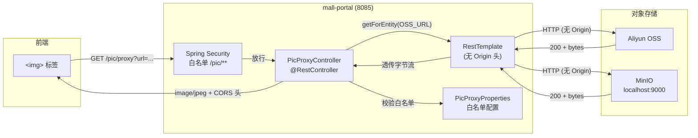
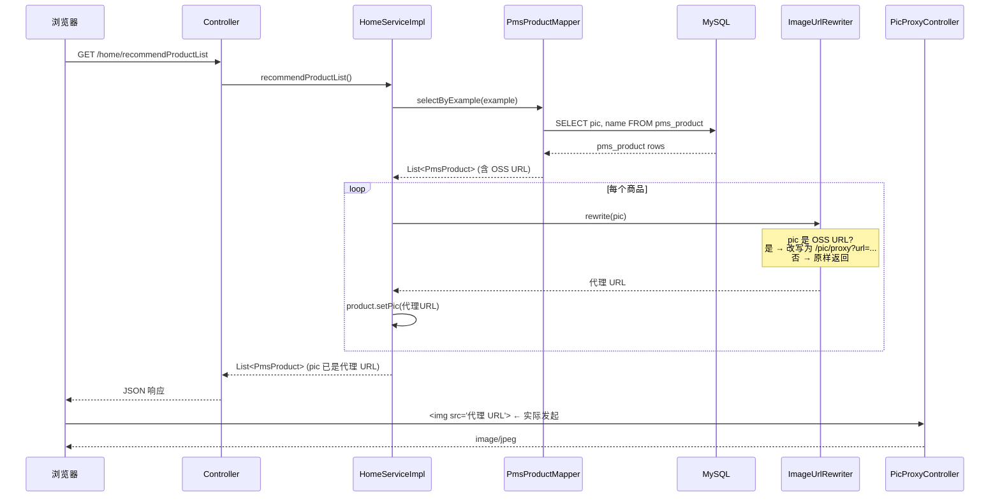
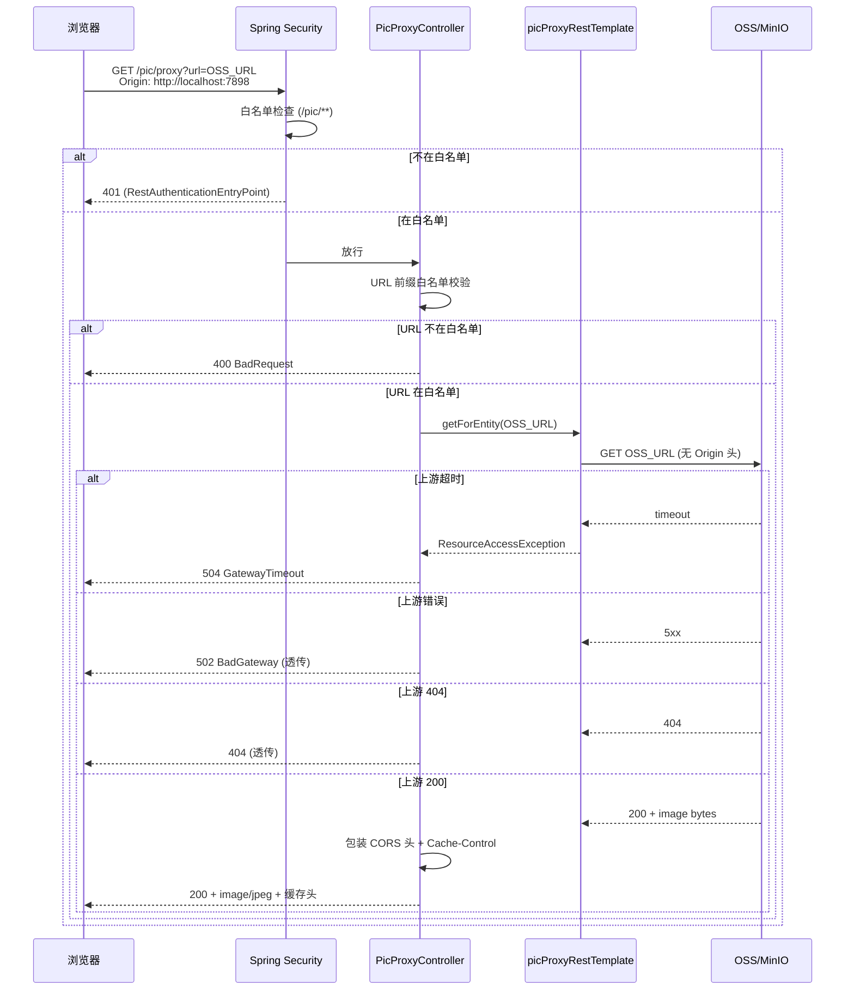
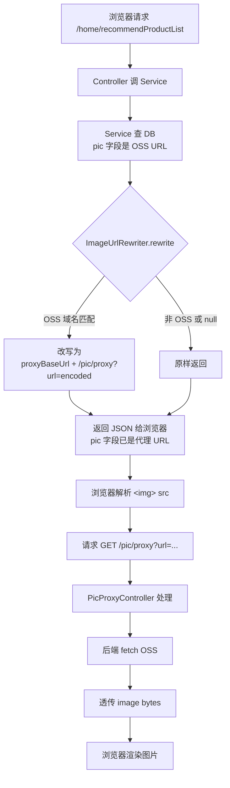

# Mall Common Pic 模块 - 图片代理服务

## 📋 目录

- [模块概述](#模块概述)
- [问题背景](#问题背景)
- [架构设计](#架构设计)
- [核心组件](#核心组件)
- [工作流程](#工作流程)
- [配置说明](#配置说明)
- [使用指南](#使用指南)
- [安全考虑](#安全考虑)
- [测试](#测试)
- [常见问题](#常见问题)
- [最佳实践](#最佳实践)

---

## 模块概述

**Mall Common Pic** 是图片代理（Image Proxy）模块，专门用于解决**阿里云 OSS / MinIO 等对象存储的 CORS 限制导致前端 `` 加载失败**的问题。

### 主要职责

1. **跨域图片代理**：后端 fetch + 透传字节流，绕开对象存储的 CORS 拒绝
2. **SSRF 防护**：URL 白名单机制，只允许代理受信的上游域名
3. **缓存优化**：通过 `Cache-Control` 减少重复请求
4. **统一入口**：4 个服务（admin/portal/search/ai）通过同一 Bean 共享图片代理能力

### 模块定位

```
mall-common (通用工具)         ← ImageUrlRewriter 工具类所在地
     ↑
mall-common-pic (图片代理)     ← 当前模块
     ↑
mall-portal (提供 /pic/proxy 端点)
     ↑
admin-web / app-web (前端)
```

**重要区别**：
- `mall-common-pic` 是**库模块**，提供 `PicProxyController` 等 Bean
- 当前只有 **mall-portal** 在运行时提供 `/pic/proxy` HTTP 端点
- 其它服务如需图片代理，可在自己的 application.yml 配置 `mall.pic.proxy-base-url` 指向 portal

---

## 问题背景

### 🐛 现象

前端 `` 加载 OSS 图片静默失败，DevTools Network 显示：

```
GET http://macro-oss.oss-cn-shenzhen.aliyuncs.com/.../img.jpg
Status: 403 Forbidden
```

但 **curl 直连同 URL 返回 200**。

### 🔍 根因

| 工具 | 发的请求头 | 原因 |
|------|----------|------|
| `curl` | 不带 `Origin` | OSS 不做 CORS 检查 → 200 |
| 浏览器 `` | 自动带 `Origin: http://localhost:7898` | OSS 检查 Origin 不在白名单 → 403 |

**OSS / MinIO 的 CORS 策略是桶级配置**，开发期本地域名（`localhost:7898`、`127.0.0.1:3000`）不可能加到生产 OSS 的白名单。直接在 OSS 控制台改 CORS 又会引入**安全风险**（等于把 OSS 桶暴露给所有 origin）。

### 💡 解决方案

**后端代理**：浏览器请求 → 自己的后端 → 后端 fetch OSS（不带 Origin）→ 透传字节流给浏览器。

```
Browser 
   │ 带 Origin: http://localhost:7898
   ▼
mall-portal (我们自己的后端)            ← 自己的 CORS 策略，肯定放行 dev 域名
   │ RestTemplate.getForEntity(OSS_URL) ← 关键：不带 Origin 头
   ▼
Aliyun OSS                              ← 没看到 Origin，跳过 CORS 检查
   │ 200 + image bytes
   ▼
mall-portal 透传字节流 + CORS 头
   ▼
Browser 拿到 image/jpeg → 正常显示 ✅
```

---

## 架构设计

### 整体架构图



### URL 改写链路（前端零改动）

数据库里的 `pic` 字段存的是 OSS 原始 URL，**前端不能改**。改写动作必须在后端 Service 层完成：



---

## 核心组件

### 1. PicProxyProperties（配置类）

**位置**：`com.macro.mall.pic.PicProxyProperties`

**职责**：绑定 `application.yml` 的 `mall.pic.*` 配置项。

```java
@Data
@ConfigurationProperties(prefix = "mall.pic")
public class PicProxyProperties {
    /**
     * 允许代理的上游 URL 前缀（白名单，防 SSRF）
     * 默认放行 macro-oss 与 localhost MinIO
     */
    private List<String> allowedPrefixes = List.of(
            "http://macro-oss.oss-cn-shenzhen.aliyuncs.com/",
            "http://localhost:9000/"
    );

    /** 上游连接超时（毫秒），默认 3s */
    private Integer connectTimeout = 3000;

    /** 上游读取超时（毫秒），默认 10s */
    private Integer readTimeout = 10000;

    /** 浏览器缓存时间（秒），默认 86400（1 天） */
    private Long cacheMaxAge = 86400L;
}
```

### 2. PicProxyConfig（配置类）

**位置**：`com.macro.mall.pic.PicProxyConfig`

**职责**：注册一个**专用 RestTemplate** Bean（`picProxyRestTemplate`），不发 Origin 头。

```java
@Configuration
@EnableConfigurationProperties(PicProxyProperties.class)
public class PicProxyConfig {
    @Bean
    public RestTemplate picProxyRestTemplate(PicProxyProperties props) {
        SimpleClientHttpRequestFactory factory = new SimpleClientHttpRequestFactory();
        factory.setConnectTimeout(props.getConnectTimeout());
        factory.setReadTimeout(props.getReadTimeout());
        return new RestTemplate(factory);
    }
}
```

**为什么不复用业务 RestTemplate**：
- 业务 RestTemplate 可能带拦截器（如打日志、添加 traceId）
- 业务 RestTemplate 可能带统一 header（如 `User-Agent`）
- 业务 RestTemplate 的 timeout 可能不符合图片代理需求
- **专用 Bean 解耦业务，避免副作用**

### 3. PicProxyController（核心）

**位置**：`com.macro.mall.pic.PicProxyController`

**端点**：`GET /pic/proxy?url=<encoded-oss-url>`

**核心逻辑**：

```java
@RestController
@RequestMapping("/pic")
@RequiredArgsConstructor
public class PicProxyController {

    private final RestTemplate picProxyRestTemplate;
    private final PicProxyProperties props;

    @GetMapping("/proxy")
    public ResponseEntity<byte[]> proxy(@RequestParam String url) {
        // 1. 校验 URL 在白名单（防 SSRF）
        List<String> prefixes = props.getAllowedPrefixes();
        boolean allowed = prefixes != null && prefixes.stream().anyMatch(url::startsWith);
        if (!allowed) {
            return ResponseEntity.badRequest()
                    .body(("URL not in whitelist: " + url).getBytes());
        }

        try {
            // 2. 后端 fetch（无 Origin 头 → OSS 不做 CORS 拒绝）
            ResponseEntity<byte[]> upstream = picProxyRestTemplate.getForEntity(url, byte[].class);
            HttpStatus status = (HttpStatus) upstream.getStatusCode();

            // 3. 透传字节流，加 CORS + 缓存头
            HttpHeaders headers = new HttpHeaders();
            if (upstream.getHeaders().getContentType() != null) {
                headers.setContentType(upstream.getHeaders().getContentType());
            }
            headers.setCacheControl(CacheControl.maxAge(
                Duration.ofSeconds(props.getCacheMaxAge())).cachePublic());
            // 预检阶段 CORS 头由 CorsFilterRegistration 处理，
            // 这里补 actual 请求阶段的 CORS 头，避免  被浏览器 CORS 拒绝
            headers.set("Access-Control-Allow-Origin", "*");

            return new ResponseEntity<>(upstream.getBody(), headers, status);
        } catch (ResourceAccessException e) {
            // 上游超时 / 连接失败
            return ResponseEntity.status(HttpStatus.GATEWAY_TIMEOUT).build();
        } catch (Exception e) {
            return ResponseEntity.status(HttpStatus.BAD_GATEWAY).build();
        }
    }
}
```

### 4. 相关：ImageUrlRewriter（位于 mall-common）

**位置**：`com.macro.mall.common.util.ImageUrlRewriter`

**职责**：把 Service 层返回的 OSS URL **改写为代理 URL**，前端零改动。

```java
@Component
public class ImageUrlRewriter {
    private static final Pattern OSS_URL_PATTERN = Pattern.compile(
        "^https?://[a-z0-9-]+\\.[a-z0-9-]+\\.aliyuncs\\.com/.*",
        Pattern.CASE_INSENSITIVE
    );

    @Value("${mall.pic.proxy-base-url:http://localhost:8085}")
    private String proxyBaseUrl;

    public String rewrite(String originalUrl) {
        if (originalUrl == null || originalUrl.isEmpty()) {
            return originalUrl;
        }
        if (!OSS_URL_PATTERN.matcher(originalUrl).matches()) {
            return originalUrl;  // 非 OSS URL：原样返回
        }
        String encoded = URLEncoder.encode(originalUrl, StandardCharsets.UTF_8);
        return proxyBaseUrl + "/pic/proxy?url=" + encoded;
    }
}
```

**使用示例**（Service 层）：

```java
@Autowired
private ImageUrlRewriter imageUrlRewriter;

public List<PmsProduct> recommendProductList(Integer pageSize, Integer pageNum) {
    PageHelper.startPage(pageNum, pageSize);
    PmsProductExample example = new PmsProductExample();
    example.createCriteria().andDeleteStatusEqualTo(0).andPublishStatusEqualTo(1);
    List<PmsProduct> products = productMapper.selectByExample(example);
    // 改写 OSS URL → 代理 URL
    products.forEach(p -> p.setPic(imageUrlRewriter.rewrite(p.getPic())));
    return products;
}
```

---

## 工作流程

### 完整请求流程



### URL 改写与渲染时机



---

## 配置说明

### 启用模块

在 `pom.xml` 中添加依赖：

```xml
<dependency>
    <groupId>com.macro.mall</groupId>
    <artifactId>mall-common-pic</artifactId>
    <version>${project.version}</version>
</dependency>
```

### application.yml 配置项

**图片代理所在服务**（如 mall-portal）：

```yaml
mall:
  pic:
    # 允许代理的上游 URL 前缀（白名单，防 SSRF）
    # 生产环境务必明确具体域名，避免通配符
    allowed-prefixes:
      - http://macro-oss.oss-cn-shenzhen.aliyuncs.com/
      - http://localhost:9000/  # MinIO 本地开发
    # 可选：超时与缓存
    connect-timeout: 3000        # 毫秒
    read-timeout: 10000         # 毫秒
    cache-max-age: 86400        # 秒
```

**消费方服务**（如 mall-admin，调用 portal 的代理）：

```yaml
mall:
  pic:
    # 指向真正提供 /pic/proxy 的服务
    proxy-base-url: http://localhost:8085
```

### 必需配套：Spring Security 白名单

`/pic/proxy` **必须**加到 `secure.ignored.urls`，否则 Spring Security 会拦截返回 401：

```yaml
secure:
  ignored:
    urls:
      - /pic/**            # ← 关键，否则 401
      - /sso/**
      - /home/**
      # ... 其他白名单
```

> ⚠️ **历史教训**：本模块首次上线时漏配此项，导致浏览器看到 HTTP 200 + JSON 401（`RestAuthenticationEntryPoint` 未设置 HTTP 状态码的"暗坑"），`` 拿到 application/json 无法渲染。详见 [issue: 图片代理 401](#q1-为什么-cuhttp://localhost8085picproxy-能正常响应但-img-不显示)。

---

## 使用指南

### 1. 启动服务时启用图片代理

只需 mall-portal 引入 `mall-common-pic` 依赖即可自动暴露 `/pic/proxy` 端点（通过 `@RestController` 组件扫描自动注册）。

### 2. 改写返回前 URL

在所有返回 `pic` 字段的 Service 实现里，调用 `ImageUrlRewriter`：

```java
@Service
public class HomeServiceImpl {
    @Autowired
    private ImageUrlRewriter imageUrlRewriter;
    
    public List<PmsProduct> recommendProductList(Integer pageSize, Integer pageNum) {
        List<PmsProduct> products = productMapper.selectByExample(example);
        products.forEach(p -> p.setPic(imageUrlRewriter.rewrite(p.getPic())));
        return products;
    }
}
```

### 3. 验证代理工作

启动 portal 后：

```bash
# 测试 1：合法 OSS URL（应返回 image/jpeg + 200）
curl -i "http://localhost:8085/pic/proxy?url=http://macro-oss.oss-cn-shenzhen.aliyuncs.com/mall/images/xxx.jpg" -o /tmp/x.bin
file /tmp/x.bin
# 预期：JPEG image data

# 测试 2：非白名单 URL（应返回 400）
curl -i "http://localhost:8085/pic/proxy?url=http://evil.com/malware.png"
# 预期：HTTP/1.1 400

# 测试 3：白名单内 MinIO URL（应返回 200 + image）
curl -i "http://localhost:8085/pic/proxy?url=http://localhost:9000/bucket/img.jpg" -o /tmp/y.bin
file /tmp/y.bin
```

---

## 安全考虑

### 🔒 SSRF（Server-Side Request Forgery）防护

**威胁场景**：恶意用户构造 `?url=http://localhost:6379/` 让后端探测内网 Redis 端口。

**防护措施**：

1. **URL 前缀白名单**（已实现）：
   ```java
   if (!prefixes.stream().anyMatch(url::startsWith)) {
       return ResponseEntity.badRequest().body(...);
   }
   ```
   默认只放行 OSS 公网域名和本地 MinIO。

2. **⚠️ 建议增强**（未来可加）：
   - 禁止 IP 直连（`http://10.0.0.1/`、`http://192.168.x.x/`）
   - 禁止非常用端口（Redis 6379、MySQL 3306 等）
   - DNS 解析后再次校验 IP 是否内网

3. **生产配置**：
   ```yaml
   mall:
     pic:
       allowed-prefixes:
         - https://your-bucket.oss-cn-shenzhen.aliyuncs.com/  # 不用 http
         # 不要写 localhost、内网 IP
   ```

### 🔒 上游响应大小限制

**当前实现**：`byte[]` 接收，无大小限制。**理论风险**：恶意 URL 触发 1GB 响应导致 OOM。

**建议**：未来加配置 `max-response-size: 5242880` (5MB)，超过则拒绝。

### 🔒 Content-Type 透传

**当前实现**：直接透传 OSS 返回的 Content-Type。**风险低**：OSS 不会返回 `text/html`，只会是 `image/*`。

### 🔒 CORS 头

**当前实现**：`Access-Control-Allow-Origin: *`（通配）。

**生产建议**：改为具体域名（与 `mall.security.cors.allowed-origins` 同步）。

---

## 测试

### 单元测试

**位置**：`mall-common-pic/src/test/java/com/macro/mall/pic/PicProxyControllerTest.java`

**策略**：`MockMvc.standaloneSetup()` + Mockito 模拟 `RestTemplate`，**不依赖真实网络**。

```java
class PicProxyControllerTest {
    private MockMvc mockMvc;
    private RestTemplate restTemplate;

    @BeforeEach
    void setUp() {
        restTemplate = mock(RestTemplate.class);
        PicProxyProperties props = new PicProxyProperties();
        PicProxyController controller = new PicProxyController(restTemplate, props);
        mockMvc = MockMvcBuilders.standaloneSetup(controller).build();
    }

    @Test
    void proxy_validOssUrl_shouldSucceed() throws Exception {
        byte[] fakePng = new byte[]{(byte) 0x89, 'P', 'N', 'G'};
        ResponseEntity<byte[]> upstream = ResponseEntity.ok()
                .contentType(MediaType.IMAGE_PNG).body(fakePng);
        when(restTemplate.getForEntity(eq("http://macro-oss..."), eq(byte[].class)))
                .thenReturn(upstream);

        mockMvc.perform(get("/pic/proxy").param("url", "http://macro-oss..."))
                .andExpect(status().isOk())
                .andExpect(content().contentTypeCompatibleWith(MediaType.IMAGE_PNG))
                .andExpect(header().string("Access-Control-Allow-Origin", "*"));
    }
    
    // ... 8 个测试覆盖：合法/非法 URL、404 透传、504 超时、502 异常
}
```

**运行**：

```bash
mvn test -pl mall-common-pic -Dtest=PicProxyControllerTest -DskipTests=false -Ddocker.skip=true
```

### 集成测试（手动）

dev 环境中手动验证：

```bash
# 启动 mall-portal
cd mall-portal && mvn spring-boot:run

# 浏览器访问 http://localhost:3000 (admin-web)
# 打开商品列表页 → DevTools Network → 查看 /pic/proxy 请求
```

---

## 常见问题

### Q1: 为什么 curl `http://localhost:8085/pic/proxy` 能正常响应但 `` 不显示？

**A**：这是 plan 部署时的两个暗坑叠加：

1. **`/pic/**` 漏配 Security 白名单** → Spring Security 拦截 → 调 `RestAuthenticationEntryPoint`
2. **`RestAuthenticationEntryPoint` 未设置 HTTP 状态码** → 返回 HTTP 200 + application/json + `{"code":401,...}` 包装体

curl 看到 200 + JSON 会当成错误，但浏览器 `` 不会"智能"判断 401，看到 application/json 就不渲染（`` 元素行为完全由 Content-Type 驱动）。

**修复**：

```yaml
secure:
  ignored:
    urls:
      - /pic/**    # ← 必须加
```

### Q2: 为什么不用 `webClient` 替代 `RestTemplate`？

**A**：
- `RestTemplate` 同步阻塞，简单场景够用
- `webClient` 响应式需要 reactor 依赖，本场景吞吐不高
- 团队熟悉度：RestTemplate 更通用
- 后续如有异步 / 大并发需求，可平滑迁移

### Q3: 加 CDN 会不会让代理失效？

**A**：会，但**方向相反**：

- 现状：浏览器 → portal:8085 → OSS（OSS 是源）
- 加 CDN 后：浏览器 → CDN 边缘节点 → OSS（CDN 才是源）
- 浏览器直接拉 CDN URL，不再走 portal 代理

CDN 配置 CORS 比 OSS 简单（CDN 提供商支持任意 Origin），通常**不需要**走代理。但代理仍然作为兜底（比如 CDN 节点宕机）。

### Q4: 直接给前端返回 OSS 签名 URL 短期可行吗？

**A**：OSS 支持**签名 URL**（带过期时间戳和签名），前端直接用 `` 也能加载，**但**：
- 签名 URL 暴露在前端，每次都要后端重新生成
- 签名 URL 有时效（默认 1 小时），刷新页面需重新拿
- 调试时浏览器控制台会暴露完整签名 URL

代理方案虽然多一跳，但解耦前后端，长期看更可维护。

### Q5: `ImageUrlRewriter` 放在 `mall-common` 而不是 `mall-common-pic` 合理吗？

**A**：合理，理由：

- `ImageUrlRewriter` 是**纯字符串处理工具**，无 Spring Web 依赖，可被任何模块复用
- `mall-common-pic` 是**Web 模块**（有 `@RestController`），依赖 spring-web
- 把工具类放底层 `mall-common`，符合"上层依赖下层"原则
- 类似 `RequestUtil` 等工具类都在 `mall-common/util/`

### Q6: 能否在 mall-admin 也启用图片代理？

**A**：可以，给 mall-admin 加 `mall-common-pic` 依赖即可（已是 plan 的备选方案）。

admin 启用后有两个选择：
- **A. 自托管**：admin 自己也提供 `/pic/proxy`，admin-web 直接请求 `localhost:8080`
- **B. 共享 portal**：admin 不提供端点，`mall.pic.proxy-base-url: http://localhost:8085`，admin-web 请求 portal

A 优点是 admin 可独立运行（不依赖 portal）；B 优点是单点维护。当前 plan 选了 B。

### Q7: 代理层能否加上图片压缩 / 缩略图 / WebP 转换？

**A**：技术上可以，但**当前不做**：
- 加深了模块职责（图片处理 vs 代理）
- 增加了 OOM 风险（图像处理库常驻内存）
- 增加响应延迟（压缩是 CPU 密集型）

如确有需求，建议另起模块 `mall-common-image-processor`，与本模块解耦。

---

## 最佳实践

### ✅ 推荐

1. **白名单用前缀匹配 + 末尾 `/`**：
   ```yaml
   allowed-prefixes:
     - http://macro-oss.oss-cn-shenzhen.aliyuncs.com/   # 注意末尾 /
   ```
   避免 `http://macro-oss.oss-cn-shenzhen.aliyuncs.com.evil.com/` 这种同名前缀攻击。

2. **超时设置要分层**：
   - `connect-timeout: 3000`（3s 足够建立连接）
   - `read-timeout: 10000`（10s 足够大图）

3. **缓存时间与 OSS 同步**：
   - 商品图变更少 → `cache-max-age: 86400`（1 天）
   - 用户头像 → `cache-max-age: 3600`（1 小时）

4. **生产用 HTTPS**：
   ```yaml
   allowed-prefixes:
     - https://your-bucket.oss-cn-shenzhen.aliyuncs.com/   # 生产禁用 http
   ```

### ❌ 避免

1. **不要把 `/pic/**` 加到 admin 的 `secure.ignored.urls`**（除非 admin 也启用 mall-common-pic）
2. **不要在 `allowedPrefixes` 用 `*` 通配符**（失去 SSRF 防护意义）
3. **不要复用业务 RestTemplate**（避免被业务拦截器影响，如日志、traceId 注入）
4. **不要在 controller 里 hardcode 超时值**（应走配置项）
5. **不要对图片做压缩/缩略图处理**（保持单一职责，复杂需求另起模块）

---

## 性能与可扩展性

### 性能指标（参考）

- 代理单次响应延迟：~50ms（局域网 OSS）+ 透传耗时
- 内存占用：`body.length`（几 KB~几 MB）+ 框架开销
- 并发能力：受 Tomcat 线程池限制（默认 200 线程）

### 优化方向

1. **CDN 兜底**（推荐）：OSS 配置 CDN 域名后，CDN 节点宕机时浏览器回源到代理
2. **浏览器缓存**：已通过 `Cache-Control: max-age=86400` 实现
3. **本地缓存层**：未来可加 Caffeine，在代理层缓存热点图（但要注意内存）
4. **响应压缩**：JPEG/PNG 已压缩，无需 gzip

### 监控埋点（建议）

```java
// 在 PicProxyController 增加 Micrometer 指标
Counter.builder("pic.proxy.request")
    .tag("status", "200").register(meterRegistry).increment();
Counter.builder("pic.proxy.request")
    .tag("status", "4xx").register(meterRegistry).increment();
Timer.builder("pic.proxy.latency")
    .register(meterRegistry).record(duration);
```

---

## 相关模块

| 模块 | 关系 | 文档 |
|------|------|------|
| `mall-common` | 提供 `ImageUrlRewriter` 工具类 | [README](../mall-common/README.md) |
| `mall-common-cors` | 提供 CORS 配置（/pic/proxy 的 CORS 头由此模块配） | [README](../mall-common-cors/README.md) |
| `mall-portal` | 当前唯一托管 `/pic/proxy` 端点的服务 | [README](../mall-portal/README.md) |
| `mall-admin` | 消费 `ImageUrlRewriter` 改写 pic 字段 | [README](../mall-admin/README.md) |

---

## 更新日志

| 日期 | 版本 | 变更 |
|------|------|------|
| 2026-06 | 1.0.0 | 初版：PicProxyController + PicProxyConfig + PicProxyProperties |
| 2026-06 | 1.0.1 | 修复：`/pic/**` 加入 portal Security 白名单（避免 401 暗坑） |
