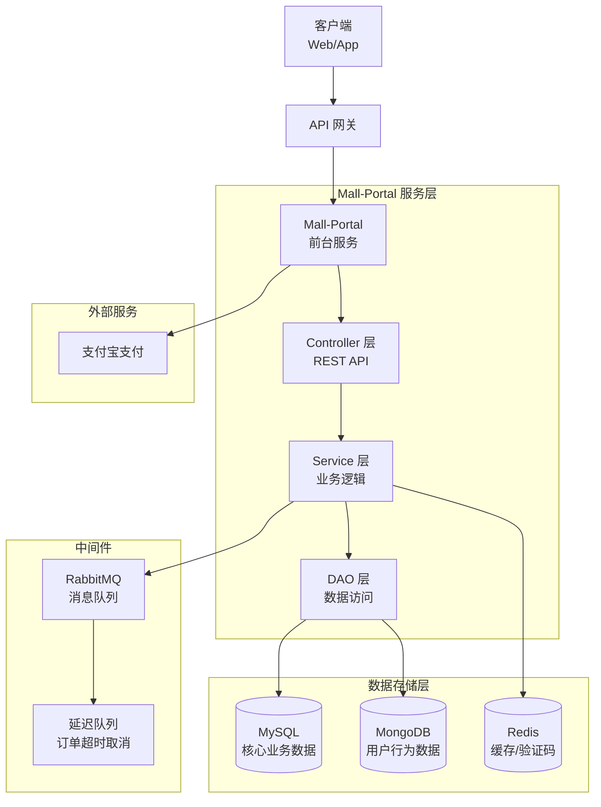
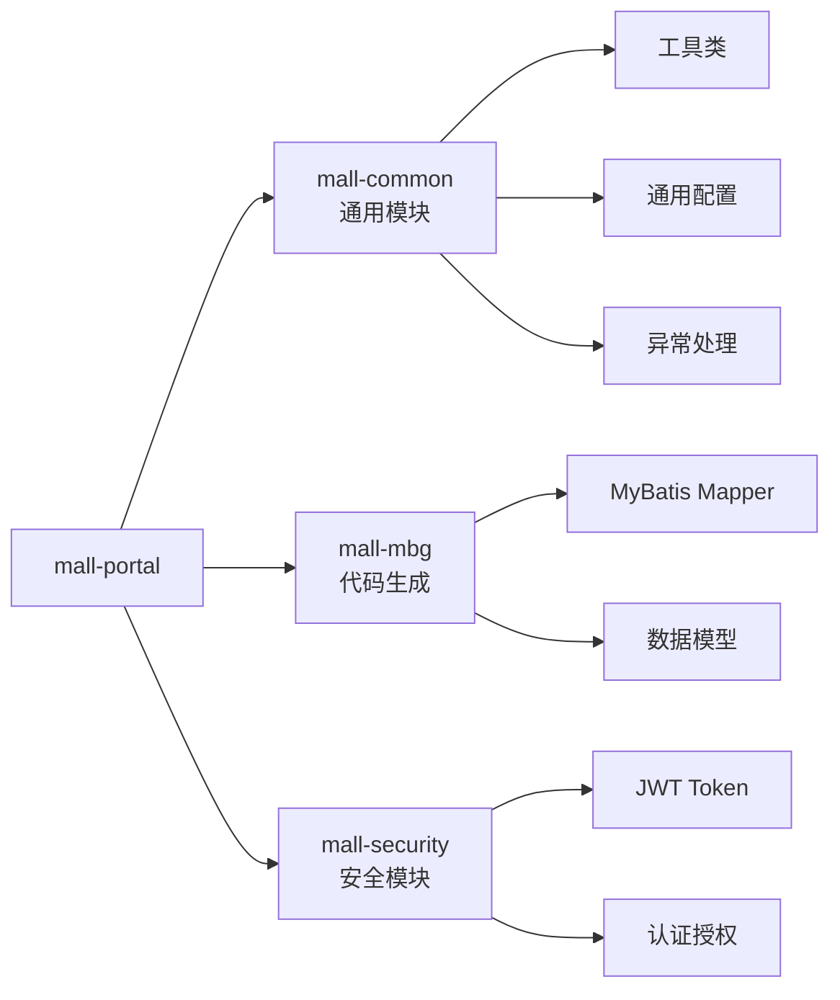
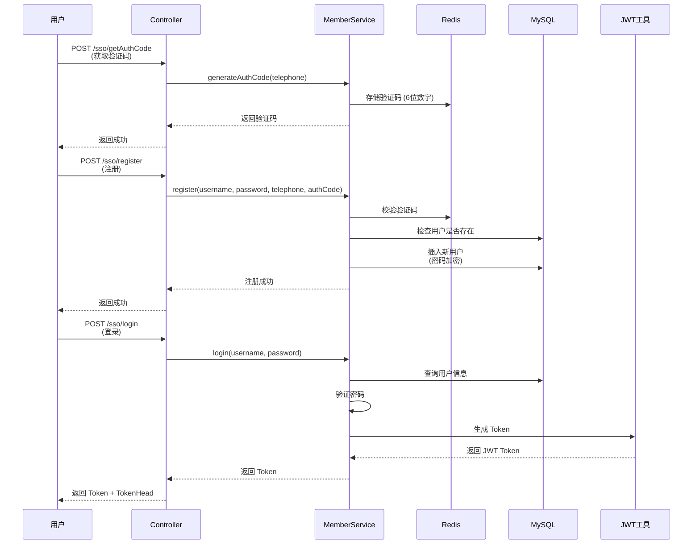
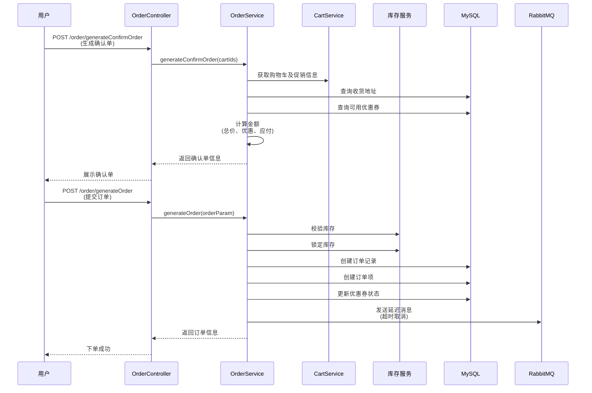
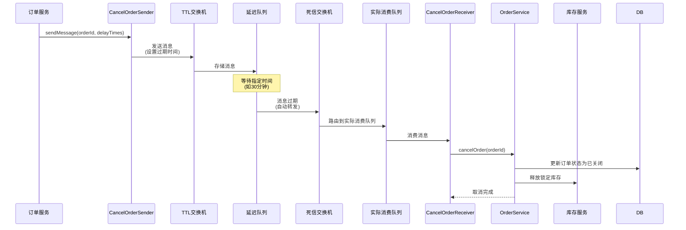
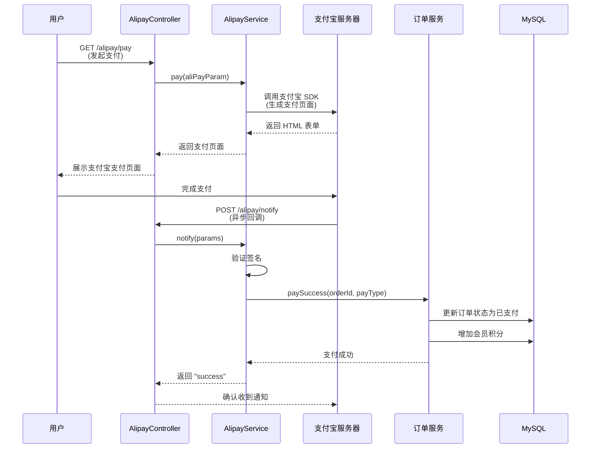
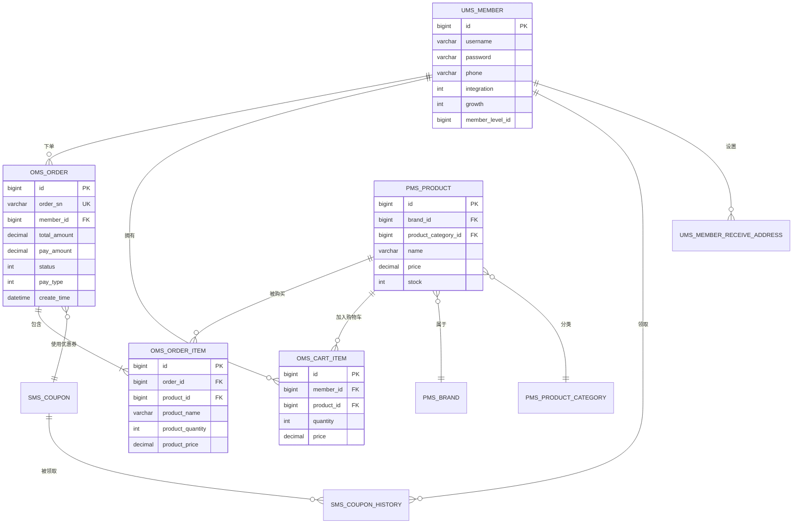
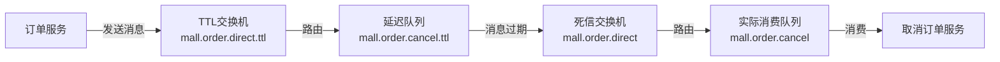
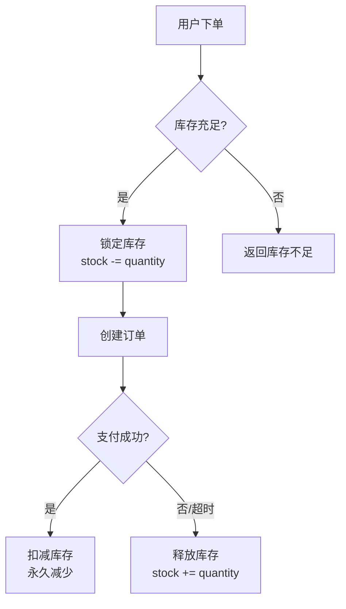
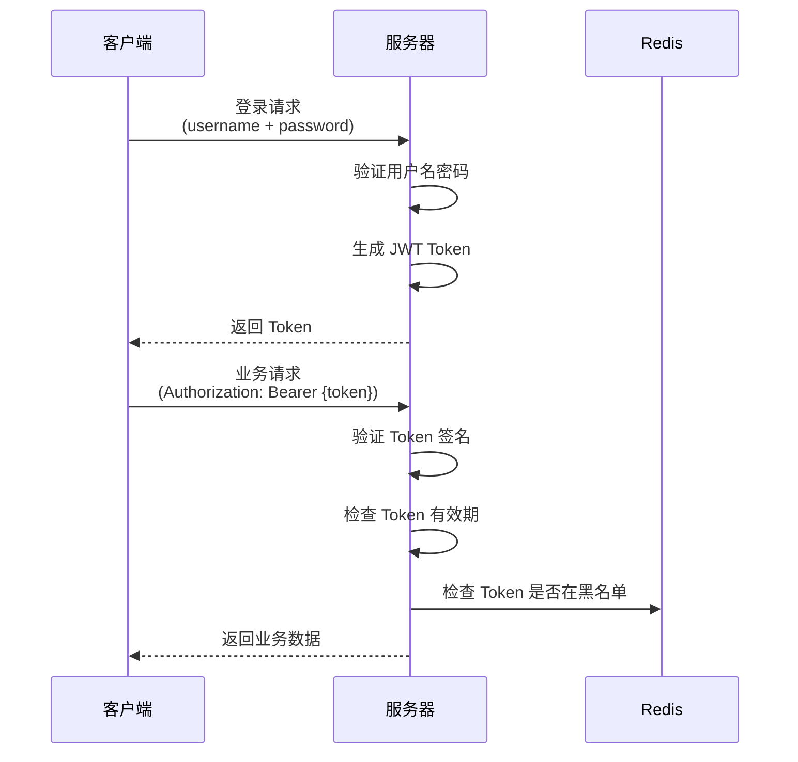

# Mall-Portal 商城前台系统

## 📋 项目概述

Mall-Portal 是电商商城系统的前台用户端服务，基于 Spring Boot 构建，提供商品浏览、购物车管理、订单处理、支付集成等完整的电商业务功能。

### 核心特性

- **会员管理**：注册、登录、认证、个人信息管理
- **商品展示**：首页内容、商品搜索、分类浏览、品牌推荐
- **购物车**：商品添加、数量调整、规格选择、促销计算
- **订单管理**：订单生成、支付处理、超时取消、状态跟踪
- **支付集成**：支付宝 PC 支付、手机支付、异步回调
- **营销功能**：优惠券领取、积分使用、促销活动
- **用户行为**：品牌关注、商品收藏、浏览历史（MongoDB 存储）
- **售后服务**：退货申请管理（支持重复提交控制）
- **AI 集成**：与 mall-ai 微服务集成，提供智能购物助手和售后建议

### 技术栈

| 技术 | 说明 |
|------|------|
| Spring Boot | 应用框架 |
| Spring Security | 安全认证 |
| JWT | Token 认证机制 |
| MyBatis | ORM 框架 |
| MySQL | 关系型数据库 |
| MongoDB | NoSQL 数据库（存储用户行为数据） |
| Redis | 缓存、验证码存储 |
| RabbitMQ | 消息队列（订单超时取消） |
| Elasticsearch | 商品搜索（可选） |
| Swagger/OpenAPI | API 文档 |

---

## 🏗️ 系统架构

### 整体架构图



### 模块依赖关系



---

## 📁 项目结构

```
mall-portal/
├── src/main/java/com/macro/mall/portal/
│   ├── component/              # 组件类
│   │   ├── CancelOrderSender.java      # 取消订单消息发送者
│   │   ├── CancelOrderReceiver.java    # 取消订单消息接收者
│   │   └── OrderTimeOutCancelTask.java # 订单超时取消定时任务
│   ├── config/                 # 配置类
│   │   ├── AlipayConfig.java           # 支付宝配置
│   │   ├── RabbitMqConfig.java         # RabbitMQ 配置
│   │   ├── MallSecurityConfig.java     # 安全配置
│   │   └── ...
│   ├── controller/             # 控制器层
│   │   ├── UmsMemberController.java           # 会员管理
│   │   ├── OmsPortalOrderController.java      # 订单管理
│   │   ├── OmsCartItemController.java         # 购物车管理
│   │   ├── HomeController.java                # 首页内容
│   │   ├── PmsPortalProductController.java    # 商品管理
│   │   ├── AlipayController.java              # 支付宝支付
│   │   └── ...
│   ├── service/                # 服务层
│   │   ├── impl/                       # 服务实现
│   │   │   ├── UmsMemberServiceImpl.java
│   │   │   ├── OmsPortalOrderServiceImpl.java
│   │   │   └── ...
│   │   └── *.java                      # 服务接口
│   ├── dao/                    # 数据访问层
│   │   ├── PortalOrderDao.java
│   │   ├── PortalProductDao.java
│   │   └── ...
│   ├── domain/                 # 领域模型
│   │   ├── OrderParam.java             # 订单参数
│   │   ├── ConfirmOrderResult.java     # 确认单结果
│   │   ├── QueueEnum.java              # 消息队列枚举
│   │   └── ...
│   ├── repository/             # MongoDB 仓库
│   │   ├── MemberBrandAttentionRepository.java
│   │   ├── MemberProductCollectionRepository.java
│   │   └── MemberReadHistoryRepository.java
│   └── MallPortalApplication.java      # 启动类
├── src/main/resources/
│   ├── dao/                    # MyBatis XML 映射文件
│   ├── application.yml         # 主配置文件
│   ├── application-dev.yml     # 开发环境配置
│   └── application-prod.yml    # 生产环境配置
└── pom.xml                     # Maven 配置
```

---

## 🚀 快速开始

### 🆕 最新更新（2026-05）

#### 1. 注释规范全面升级

项目已全面采用 **“中文为主，英文为辅”** 的双语注释规范：

**规范要求：**
- 类级别注释格式：`中文描述 (English Description)`
- 专业术语首次出现时标注英文，如：依赖注入 (Dependency Injection)
- 代码实体保持英文原名，辅以中文解释
- 异常消息和日志使用英文，便于全球化工具处理

**示例：**
```java
/**
 * 首页内容管理控制器 (Home Content Controller)
 * 提供首页展示所需的各种数据，包括轮播广告、推荐商品等
 */
@RestController
@RequestMapping("/home")
public class HomeController {
    // 重试机制：防止网络波动导致的临时失败
    for (int i = 0; i < MAX_RETRIES; i++) { ... }
}
```

**覆盖范围：**
- ✅ 所有 Controller 层（13个文件）
- ✅ 所有 Service 接口层（15个文件）
- ✅ 主要 Service 实现类
- ✅ 所有 Configuration 配置类（9个文件）
- ✅ 所有 Component 组件类（3个文件）
- ✅ 所有 DAO 数据访问层（5个文件）
- ✅ 所有 Repository MongoDB仓库（3个文件）
- ✅ 主要 Domain 领域对象
- ✅ 工具类

#### 2. 售后申请重复提交控制

**问题**：用户可能多次提交同一订单的退货申请，造成数据冗余。

**解决方案**：
- 后端验证：检查订单是否已有进行中的售后申请（status=0,1,2）
- 允许重新申请：当申请被拒绝（status=3）后，用户可以再次提交
- 前端提示：明确告知用户当前申请状态

**实现位置**：
- [OmsPortalOrderReturnApplyServiceImpl.java](file:///D:/course/Java/graduateProject/finish/mall/mall-portal/src/main/java/com/macro/mall/portal/service/impl/OmsPortalOrderReturnApplyServiceImpl.java#L42-L53)

#### 3. AI 微服务集成

mall-portal 现已与 **mall-ai** 微服务集成，提供智能化功能：

**AI 功能：**
- 🤖 **智能购物助手**：用户对商品提问，AI 基于商品信息智能回答
- 🔧 **售后建议**：用户描述问题，AI 推荐最合适的退货原因并生成详细描述

**技术架构：**
- 独立的 Spring Boot 微服务（端口 8086）
- 支持多种 AI 模型提供商（DeepSeek、OpenAI、SiliconFlow 等）
- 通过 OpenAI 兼容 API 接口抽象，切换模型无需改代码

**详细信息**：查看 [mall-ai README](../mall-ai/README.md)

---

### 前置要求

- JDK 1.8+
- Maven 3.6+
- MySQL 5.7+
- Redis 5.0+
- MongoDB 4.0+
- RabbitMQ 3.8+

### 安装步骤

#### 1. 克隆项目

```bash
git clone https://github.com/macrozheng/mall.git
cd mall/mall-portal
```

#### 2. 配置数据库

创建 MySQL 数据库并导入 SQL 脚本：

```bash
mysql -u root -p < document/sql/mall.sql
```

#### 3. 修改配置文件

编辑 `src/main/resources/application-dev.yml`：

```yaml
spring:
  datasource:
    url: jdbc:mysql://localhost:3306/mall?useUnicode=true&characterEncoding=utf-8
    username: root
    password: your_password
  
  data:
    mongodb:
      host: localhost
      port: 27017
      database: mall
  
  redis:
    host: localhost
    port: 6379
    database: 0
  
  rabbitmq:
    host: localhost
    port: 5672
    username: guest
    password: guest

# JWT 配置
jwt:
  tokenHeader: Authorization
  secret: your-secret-key
  expiration: 604800
  tokenHead: Bearer 

# 支付宝配置
alipay:
  app-id: your-app-id
  private-key: your-private-key
  alipay-public-key: your-alipay-public-key
  gateway-url: https://openapi.alipaydev.com/gateway.do
```

#### 4. 编译项目

```bash
mvn clean install
```

#### 5. 运行应用

```bash
mvn spring-boot:run
```

或者打包后运行：

```bash
mvn package
java -jar target/mall-portal-1.0-SNAPSHOT.jar
```

#### 6. 访问 API 文档

启动成功后，访问 Swagger UI：

```
http://localhost:8085/swagger-ui.html
```

---

## 🔑 核心业务流程

### 1. 用户注册与登录流程



### 2. 订单生成流程



### 3. 订单超时取消流程（基于 RabbitMQ 延迟队列）



### 4. 支付宝支付流程



---

## 📊 数据库设计

### 核心数据表



### MongoDB 集合

| 集合名称 | 说明 | 主要字段 |
|---------|------|---------|
| member_brand_attention | 会员品牌关注 | memberId, brandId, brandName, createTime |
| member_product_collection | 会员商品收藏 | memberId, productId, productName, createTime |
| member_read_history | 会员浏览历史 | memberId, productId, productName, createTime |

---

## 🔧 核心配置说明

### RabbitMQ 消息队列配置

系统使用 RabbitMQ 实现订单超时自动取消功能，采用**死信队列 (Dead Letter Queue)** 机制：



**配置要点：**

1. **TTL 队列**：设置消息过期时间（如 30 分钟）
2. **死信交换机**：消息过期后自动转发
3. **实际消费队列**：接收超时订单并执行取消逻辑

### Redis 缓存策略

| 用途 | Key 格式 | 过期时间 | 说明 |
|------|---------|---------|------|
| 验证码 | `authCode:{telephone}` | 5 分钟 | 存储6位数字验证码 |
| 会员信息 | `member:{username}` | 24 小时 | 缓存用户基本信息 |
| 订单ID | `orderId:{date}` | 永久 | 生成订单号的序列号 |

### JWT Token 配置

```yaml
jwt:
  tokenHeader: Authorization        # HTTP 请求头名称
  secret: your-secret-key           # 签名密钥
  expiration: 604800                # 过期时间（秒），默认7天
  tokenHead: Bearer                 # Token 前缀
```

---

## 📡 API 接口概览

### 会员管理 (`/sso`)

| 接口 | 方法 | 说明 |
|------|------|------|
| `/sso/register` | POST | 会员注册 |
| `/sso/login` | POST | 会员登录 |
| `/sso/info` | GET | 获取会员信息 |
| `/sso/getAuthCode` | GET | 获取验证码 |
| `/sso/updatePassword` | POST | 修改密码 |
| `/sso/refreshToken` | GET | 刷新 Token |

### 订单管理 (`/order`)

| 接口 | 方法 | 说明 |
|------|------|------|
| `/order/generateConfirmOrder` | POST | 生成确认单 |
| `/order/generateOrder` | POST | 生成订单 |
| `/order/paySuccess` | POST | 支付成功回调 |
| `/order/list` | GET | 查询订单列表 |
| `/order/detail/{orderId}` | GET | 查询订单详情 |
| `/order/cancelUserOrder` | POST | 取消订单 |
| `/order/confirmReceiveOrder` | POST | 确认收货 |
| `/order/deleteOrder` | POST | 删除订单 |

### 购物车管理 (`/cart`)

| 接口 | 方法 | 说明 |
|------|------|------|
| `/cart/add` | POST | 添加到购物车 |
| `/cart/list` | GET | 查询购物车列表 |
| `/cart/list/promotion` | GET | 查询购物车（含促销） |
| `/cart/update/quantity` | GET | 修改数量 |
| `/cart/update/attr` | POST | 修改规格 |
| `/cart/delete` | POST | 删除购物车项 |
| `/cart/clear` | POST | 清空购物车 |

### 商品管理 (`/product`)

| 接口 | 方法 | 说明 |
|------|------|------|
| `/product/search` | GET | 搜索商品 |
| `/product/categoryTreeList` | GET | 获取分类树 |
| `/product/detail/{id}` | GET | 商品详情 |

### 首页内容 (`/home`)

| 接口 | 方法 | 说明 |
|------|------|------|
| `/home/content` | GET | 首页内容 |
| `/home/recommendProductList` | GET | 推荐商品 |
| `/home/hotProductList` | GET | 热销商品 |
| `/home/newProductList` | GET | 新品推荐 |
| `/home/productCateList/{parentId}` | GET | 商品分类 |
| `/home/subject/{id}` | GET | 专题详情 |

### 支付宝支付 (`/alipay`)

| 接口 | 方法 | 说明 |
|------|------|------|
| `/alipay/pay` | GET | PC 网站支付 |
| `/alipay/webPay` | GET | 手机网站支付 |
| `/alipay/notify` | POST | 异步回调 |
| `/alipay/query` | GET | 交易查询 |

---

## 🎯 关键技术实现

### 1. 订单超时取消机制

**问题**：用户下单后未支付，需要自动取消订单并释放库存。

**解决方案**：使用 RabbitMQ 延迟队列实现。

**实现步骤**：

1. 订单创建时，发送消息到 TTL 队列，设置过期时间（如 30 分钟）
2. 消息在 TTL 队列中等待，过期后自动转发到死信交换机
3. 死信交换机将消息路由到实际消费队列
4. 消费者接收消息，执行订单取消逻辑

**优势**：
- ✅ 无需定时轮询数据库，降低系统负载
- ✅ 消息可靠性高，支持重试机制
- ✅ 解耦订单服务和取消逻辑

### 2. 库存锁定与释放

**流程**：



**关键点**：
- 下单时锁定库存（防止超卖）
- 支付成功后扣减库存
- 订单取消或超时后释放库存

### 3. 优惠券使用逻辑

**优惠券类型**：
- 满减券：满 X 元减 Y 元
- 折扣券：打 Z 折
- 运费券：减免运费

**使用规则**：
1. 检查优惠券有效期
2. 检查使用门槛（最低消费金额）
3. 检查适用范围（全场/指定商品/指定分类）
4. 检查是否与其他优惠互斥

**分摊算法**：
当订单包含多个商品时，优惠券金额按商品金额比例分摊：

```java
// 伪代码
for (OrderItem item : orderItems) {
    BigDecimal ratio = item.getPrice().divide(totalAmount, 4, RoundingMode.HALF_EVEN);
    item.setCouponAmount(couponAmount.multiply(ratio));
}
```

### 4. 积分使用规则

**积分获取**：
- 购物赠送：根据订单金额计算
- 签到奖励：每日签到获得
- 活动赠送：参与活动获得

**积分使用**：
- 抵扣现金：100 积分 = 1 元（可配置）
- 兑换商品：积分商城兑换
- 兑换优惠券：积分兑换优惠券

**限制条件**：
- 每次最多使用订单金额的 X%
- 需要达到一定会员等级
- 部分商品不支持积分抵扣

---

## 🔐 安全机制

### 1. 身份认证

使用 **JWT (JSON Web Token)** 实现无状态认证：



### 2. 密码加密

使用 **BCrypt** 算法加密存储密码：

```java
// 密码加密
String encodedPassword = passwordEncoder.encode(rawPassword);

// 密码验证
boolean matches = passwordEncoder.matches(rawPassword, encodedPassword);
```

### 3. 验证码机制

- 生成 6 位随机数字
- 存储到 Redis，设置 5 分钟过期
- 使用后不立即删除，防止重放攻击
- 限制同一手机号每分钟最多获取 1 次

### 4. API 权限控制

使用 Spring Security 注解控制接口权限：

```java
@PreAuthorize("hasRole('MEMBER')")  // 需要会员角色
@GetMapping("/order/list")
public CommonResult list() { ... }

@PermitAll  // 允许所有用户访问
@PostMapping("/sso/login")
public CommonResult login() { ... }
```

---

## 🧪 测试

### 单元测试

运行单元测试：

```bash
mvn test
```

### API 测试

使用 Postman 或 Swagger UI 进行接口测试：

1. **获取 Token**：
   ```
   POST http://localhost:8085/sso/login
   Body: username=test&password=123456
   ```

2. **设置请求头**：
   ```
   Authorization: Bearer {token}
   ```

3. **调用业务接口**：
   ```
   GET http://localhost:8085/order/list?status=-1&pageNum=1&pageSize=5
   ```

---

## 📈 性能优化

### 1. 缓存策略

- **会员信息缓存**：减少数据库查询
- **商品信息缓存**：热点商品预加载
- **验证码缓存**：Redis 存储，快速验证

### 2. 数据库优化

- **索引优化**：为常用查询字段建立索引
- **分页查询**：避免一次性加载大量数据
- **读写分离**：主库写，从库读（可扩展）

### 3. 异步处理

- **订单取消**：使用消息队列异步处理
- **日志记录**：异步写入日志文件
- **邮件发送**：异步发送通知邮件

### 4. 连接池配置

```yaml
spring:
  datasource:
    hikari:
      maximum-pool-size: 20       # 最大连接数
      minimum-idle: 5             # 最小空闲连接
      connection-timeout: 30000   # 连接超时时间
```

---

## 🐛 常见问题

### 1. 订单超时取消不生效

**原因**：RabbitMQ 未启动或配置错误

**解决**：
```bash
# 检查 RabbitMQ 状态
rabbitmqctl status

# 检查队列是否创建
rabbitmqctl list_queues
```

### 2. Redis 连接失败

**原因**：Redis 服务未启动或配置错误

**解决**：
```bash
# 检查 Redis 状态
redis-cli ping

# 检查配置文件中的 host 和 port
```

### 3. MongoDB 连接失败

**原因**：MongoDB 服务未启动

**解决**：
```bash
# 启动 MongoDB
mongod --dbpath /data/db

# 检查连接
mongo --eval "db.runCommand({ping: 1})"
```

### 4. JWT Token 验证失败

**原因**：Token 过期或签名密钥不一致

**解决**：
- 检查 `jwt.expiration` 配置
- 确保所有服务使用相同的 `jwt.secret`
- 检查请求头是否正确携带 Token

---

## 📝 开发规范

### 1. 代码风格

- 遵循阿里巴巴 Java 开发手册
- 使用 Lombok 简化代码
- 统一异常处理

### 2. 注释规范

- 类和方法必须添加 Javadoc 注释
- 复杂逻辑添加行内注释
- 使用中文注释，专业术语附带英文

### 3. Git 提交规范

```
feat: 新功能
fix: 修复 Bug
docs: 文档更新
style: 代码格式调整
refactor: 重构代码
test: 测试相关
chore: 构建过程或辅助工具变动
```

---

## 🔄 部署

### Docker 部署

#### 1. 构建镜像

```dockerfile
FROM openjdk:8-jre-slim
VOLUME /tmp
COPY target/mall-portal-1.0-SNAPSHOT.jar app.jar
ENTRYPOINT ["java","-Djava.security.egd=file:/dev/./urandom","-jar","/app.jar"]
```

```bash
docker build -t mall-portal:latest .
```

#### 2. 使用 Docker Compose

```yaml
version: '3'
services:
  mall-portal:
    image: mall-portal:latest
    ports:
      - "8085:8085"
    environment:
      - SPRING_PROFILES_ACTIVE=prod
    depends_on:
      - mysql
      - redis
      - mongodb
      - rabbitmq
```

```bash
docker-compose up -d
```

### 生产环境建议

1. **使用 HTTPS**：配置 SSL 证书
2. **负载均衡**：使用 Nginx 反向代理
3. **监控告警**：集成 Prometheus + Grafana
4. **日志收集**：使用 ELK (Elasticsearch + Logstash + Kibana)
5. **数据库备份**：定期备份 MySQL 和 MongoDB

---

## 📚 参考资料

- [Spring Boot 官方文档](https://spring.io/projects/spring-boot)
- [Spring Security 官方文档](https://spring.io/projects/spring-security)
- [RabbitMQ 官方文档](https://www.rabbitmq.com/documentation.html)
- [MongoDB 官方文档](https://docs.mongodb.com/)
- [Redis 官方文档](https://redis.io/documentation)
- [支付宝开放平台](https://opendocs.alipay.com/)

---

## 👥 贡献指南

欢迎提交 Issue 和 Pull Request！

1. Fork 本仓库
2. 创建特性分支 (`git checkout -b feature/AmazingFeature`)
3. 提交更改 (`git commit -m 'Add some AmazingFeature'`)
4. 推送到分支 (`git push origin feature/AmazingFeature`)
5. 开启 Pull Request

---

## 📄 许可证

本项目采用 MIT 许可证 - 查看 [LICENSE](LICENSE) 文件了解详情

---

## 📞 联系方式

- 项目地址：https://github.com/macrozheng/mall
- 作者：macrozheng
- 邮箱：macrozheng@example.com

---

**最后更新时间**：2026-05-03
