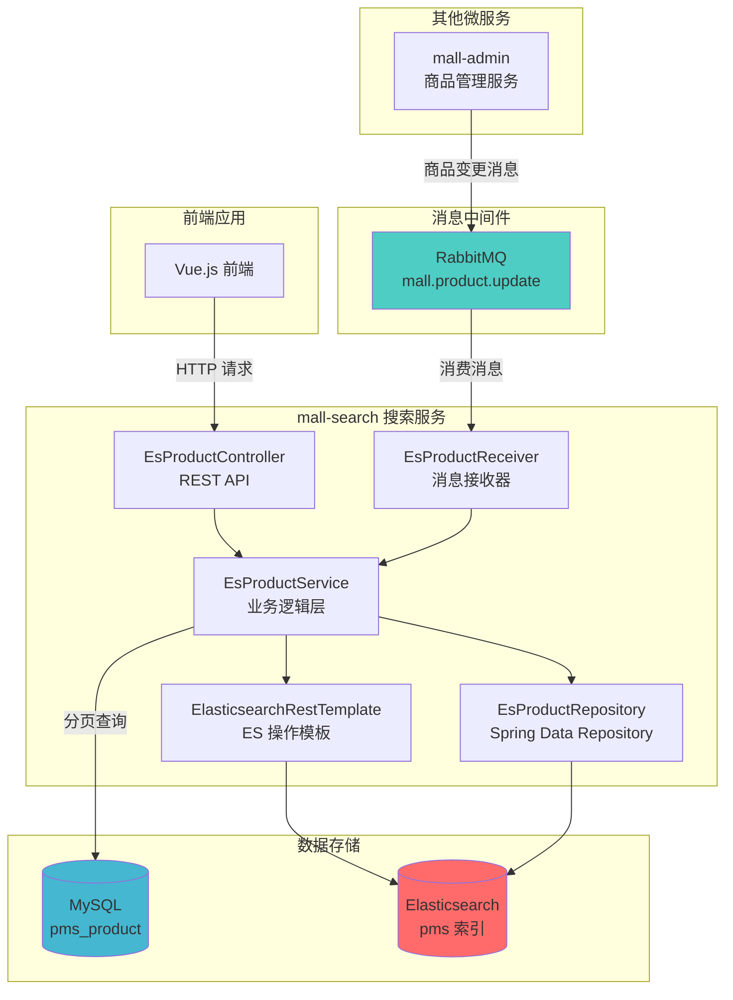
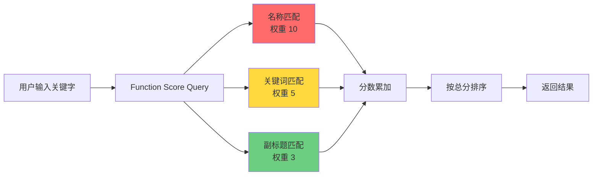
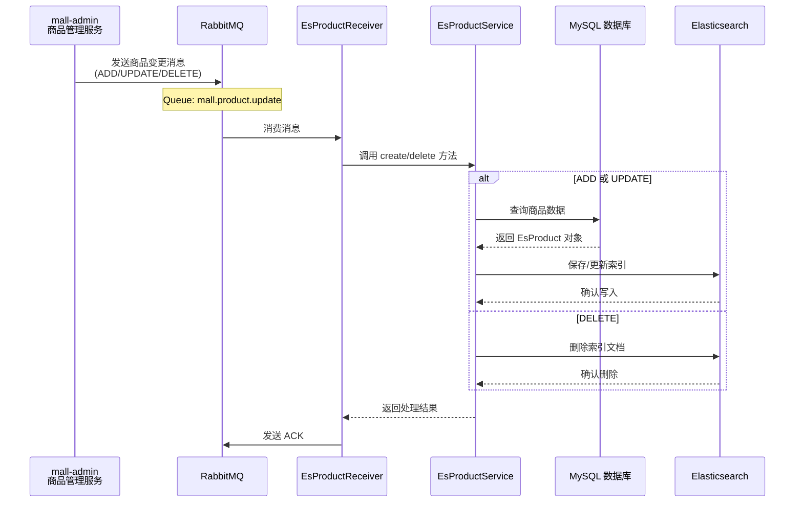
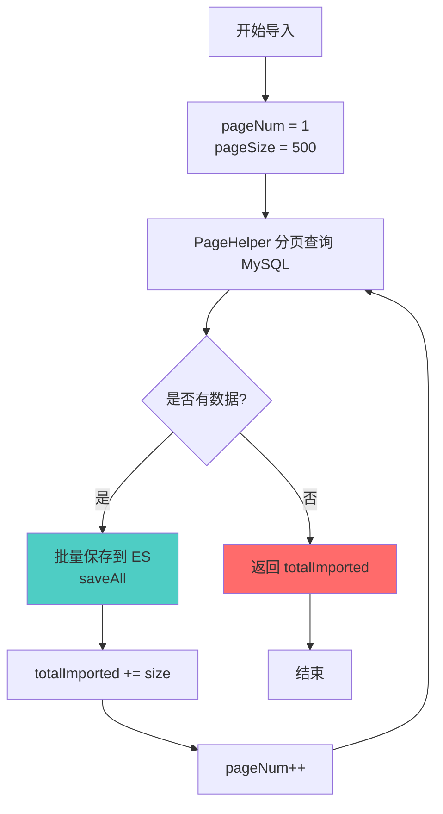
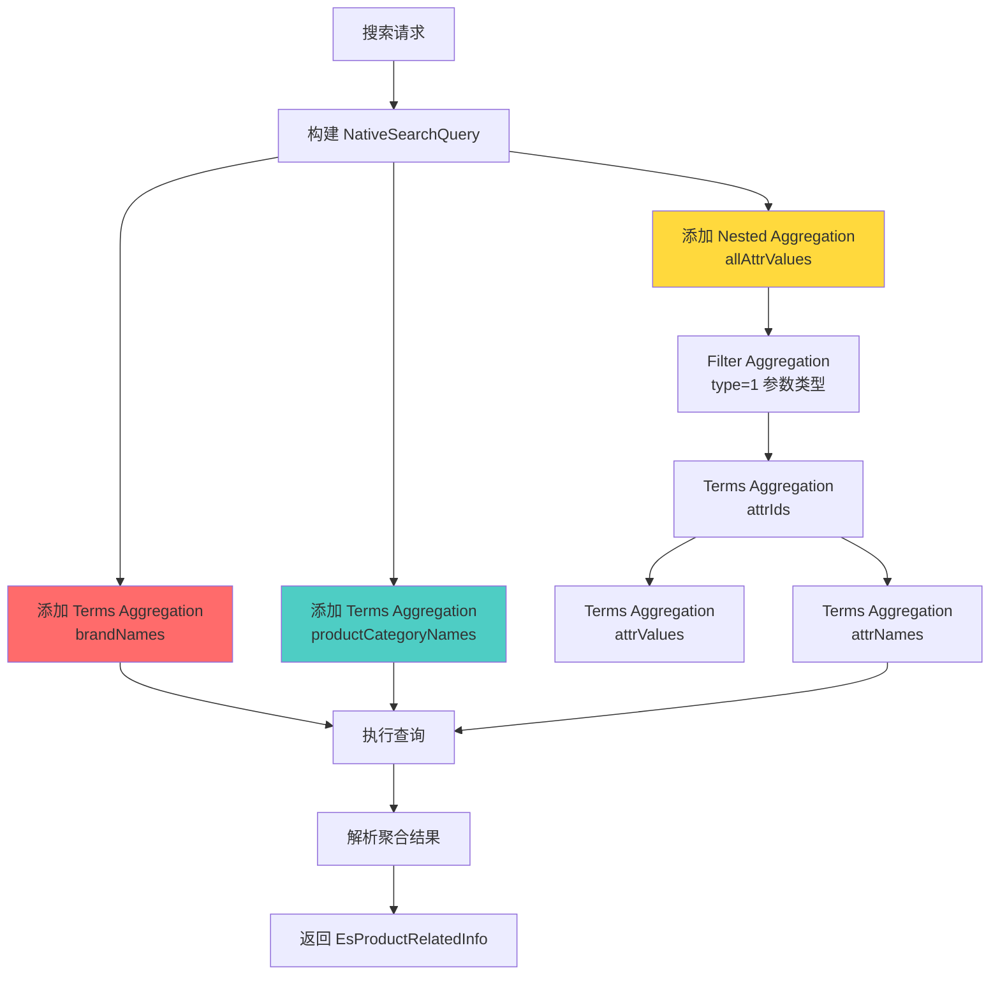

# Mall Search - 基于 Elasticsearch 的商品搜索微服务

## 📋 项目概述

**Mall Search** 是 mall 电商系统的搜索微服务模块，基于 **Elasticsearch** 实现高性能的商品全文搜索、聚合分析和智能推荐功能。通过 **RabbitMQ** 消息队列实现与商品管理服务的异步数据同步，确保搜索索引的实时性和最终一致性。

### 核心特性

- 🔍 **全文搜索**：支持中文分词（IK Analyzer），提供商品名称、副标题、关键词的多字段加权搜索
- 🎯 **综合筛选**：支持品牌、分类、属性、价格区间等多维度筛选条件
- 📊 **聚合分析**：动态获取搜索结果的品牌、分类、属性统计信息，支持前端筛选器生成
- 💡 **智能推荐**：基于 Function Score Query 的相似度算法，推荐相关商品
- ⚡ **异步同步**：通过 RabbitMQ 实现商品数据的实时增量同步
- 🔄 **定时校对**：每天凌晨 3:00 执行全量数据校对，确保数据一致性
- 📦 **批量导入**：支持从 MySQL 数据库分页批量导入商品到 Elasticsearch

---

## 🏗️ 系统架构

### 整体架构图



### 技术栈

| 技术 | 版本/说明 | 用途 |
|------|----------|------|
| **Spring Boot** | 2.x | 微服务框架，提供依赖注入、自动配置等功能 |
| **Elasticsearch** | 7.x | 分布式搜索引擎，存储商品索引，支持全文检索和聚合分析 |
| **Spring Data Elasticsearch** | - | ES 数据访问抽象层，简化 CRUD 操作 |
| **RabbitMQ** | 3.x | 消息队列，实现商品数据变更的异步同步 |
| **MyBatis** | - | ORM 框架，从 MySQL 查询商品数据并映射为 ES 文档 |
| **IK Analyzer** | - | 中文分词插件，支持 ik_max_word（细粒度）和 ik_smart（粗粒度） |
| **Swagger** | 2.x | API 文档自动生成工具，支持在线调试 |
| **Lombok** | - | Java 代码简化工具，自动生成 getter/setter/toString 等方法 |
| **PageHelper** | - | MyBatis 分页插件，支持物理分页 |
| **Hutool** | - | Java 工具类库，提供字符串处理、集合操作等便捷方法 |

---

## 📂 项目结构

```
mall-search/
├── src/main/java/com/macro/mall/search/
│   ├── component/                  # 消息组件
│   │   └── EsProductReceiver.java  # RabbitMQ 消息接收器
│   ├── config/                     # 配置类
│   │   ├── EsProductMqConfig.java  # RabbitMQ 配置
│   │   ├── MallCorsConfig.java     # 跨域配置
│   │   ├── MyBatisConfig.java      # MyBatis 配置
│   │   └── SwaggerConfig.java      # Swagger 文档配置
│   ├── controller/                 # 控制器层
│   │   └── EsProductController.java # REST API 接口
│   ├── dao/                        # 数据访问层
│   │   └── EsProductDao.java       # MyBatis DAO 接口
│   ├── domain/                     # 领域模型
│   │   ├── EsProduct.java          # ES 商品文档实体
│   │   ├── EsProductAttributeValue.java # 商品属性值（嵌套类型）
│   │   └── EsProductRelatedInfo.java    # 搜索关联信息（聚合结果）
│   ├── repository/                 # 仓储层
│   │   └── EsProductRepository.java # Spring Data Repository
│   ├── service/                    # 服务层
│   │   ├── EsProductService.java   # 服务接口
│   │   └── impl/
│   │       └── EsProductServiceImpl.java # 服务实现类
│   └── MallSearchApplication.java  # 启动类
├── src/main/resources/
│   ├── dao/
│   │   └── EsProductDao.xml        # MyBatis SQL 映射文件
│   ├── application.yml             # 主配置文件
│   ├── application-dev.yml         # 开发环境配置
│   └── application-prod.yml        # 生产环境配置
├── pom.xml                         # Maven 依赖配置
└── README.md                       # 项目文档
```

---

## 🚀 快速开始

### 前置要求

- JDK 1.8+
- Maven 3.6+
- Elasticsearch 7.x（需安装 IK 分词插件）
- RabbitMQ 3.x
- MySQL 5.7+

### 环境准备

#### 1. 安装 Elasticsearch 和 IK 分词插件

```bash
# 下载 Elasticsearch 7.x
wget https://artifacts.elastic.co/downloads/elasticsearch/elasticsearch-7.17.0-linux-x86_64.tar.gz

# 安装 IK 分词插件
./bin/elasticsearch-plugin install https://github.com/medcl/elasticsearch-analysis-ik/releases/download/v7.17.0/elasticsearch-analysis-ik-7.17.0.zip

# 启动 Elasticsearch
./bin/elasticsearch
```

#### 2. 安装 RabbitMQ

```bash
# 使用 Docker 启动 RabbitMQ
docker run -d --name rabbitmq \
  -p 5672:5672 -p 15672:15672 \
  -e RABBITMQ_DEFAULT_USER=mall \
  -e RABBITMQ_DEFAULT_PASS=mall \
  rabbitmq:3-management

# 创建虚拟主机和队列（可通过管理界面 http://localhost:15672 操作）
```

#### 3. 初始化数据库

执行 `document/sql/mall.sql` 脚本，确保 `pms_product`、`pms_product_attribute`、`pms_product_attribute_value` 表存在且有数据。

### 配置修改

编辑 `src/main/resources/application.yml`：

```yaml
spring:
  rabbitmq:
    host: localhost      # RabbitMQ 地址
    port: 5672
    username: mall
    password: mall
    virtual-host: /mall

server:
  port: 8081            # 搜索服务端口
```

如需连接远程 Elasticsearch，在 `application-dev.yml` 中配置：

```yaml
spring:
  elasticsearch:
    rest:
      uris: http://localhost:9200
```

### 启动服务

```bash
# 编译项目
mvn clean package -DskipTests

# 启动服务
java -jar target/mall-search-1.0-SNAPSHOT.jar

# 或使用 Maven 插件启动
mvn spring-boot:run
```

启动成功后，访问 Swagger 文档：http://localhost:8081/swagger-ui.html

---

## 📖 API 接口说明

### 1. 商品索引管理

#### 1.1 批量导入商品到 ES

```http
POST /esProduct/importAll
```

**功能说明**：
从 MySQL 数据库批量导入所有已上架商品到 Elasticsearch。采用分页查询策略（每批 500 条），避免内存溢出。

**使用场景**：
- 系统初始化时首次导入数据
- 数据修复或重建索引
- 定时全量校对任务（每天凌晨 3:00 自动执行）

**返回**：成功导入的商品数量

**示例**：
```bash
curl -X POST http://localhost:8081/esProduct/importAll
```

**响应**：
```json
{
  "code": 200,
  "message": "操作成功",
  "data": 1250
}
```

#### 1.2 创建/更新单个商品索引

```http
POST /esProduct/create/{id}
```

**参数**：
- `id`: 商品 ID（路径参数）

**功能说明**：
根据商品 ID 从 MySQL 查询商品数据，并创建或更新 Elasticsearch 索引。Spring Data Elasticsearch 的 `save` 方法会根据 ID 自动判断是新增还是更新：
- 若 ID 不存在：创建新索引文档
- 若 ID 已存在：更新现有索引文档

**使用场景**：
- 商品管理服务发送消息后，实时同步单个商品
- 手动触发某个商品的索引更新

**示例**：
```bash
curl -X POST http://localhost:8081/esProduct/create/26
```

#### 1.3 删除商品索引

```http
GET /esProduct/delete/{id}
```

**参数**：
- `id`: 商品 ID

**示例**：
```bash
curl -X GET http://localhost:8081/esProduct/delete/26
```

#### 1.4 批量删除商品索引

```http
POST /esProduct/delete/batch?ids=26,27,28
```

**参数**：
- `ids`: 商品 ID 列表（逗号分隔）

---

### 2. 商品搜索

#### 2.1 简单搜索

```http
GET /esProduct/search/simple?keyword=手机&pageNum=0&pageSize=10
```

**参数说明**：
| 参数 | 类型 | 必填 | 默认值 | 说明 |
|------|------|------|--------|------|
| keyword | String | 否 | - | 搜索关键字，支持中文分词 |
| pageNum | Integer | 否 | 0 | 页码（从 0 开始） |
| pageSize | Integer | 否 | 5 | 每页大小 |

**功能说明**：
根据关键字匹配商品名称、副标题或关键词，使用 Function Score Query 进行加权评分，按相关度排序。

**权重设置**：
- 商品名称 (name)：权重 10（最高）
- 关键词 (keywords)：权重 5（中等）
- 副标题 (subTitle)：权重 3（较低）

**最低分数阈值**：0.5 分，过滤低相关度结果

**示例**：
```bash
curl -X GET "http://localhost:8081/esProduct/search/simple?keyword=华为&pageNum=0&pageSize=5"
```

**响应**：
```json
{
  "code": 200,
  "data": {
    "pageNum": 1,
    "pageSize": 5,
    "totalPage": 10,
    "total": 48,
    "list": [
      {
        "id": 26,
        "name": "华为 HUAWEI P40 Pro",
        "subTitle": "超感知徕卡四摄",
        "price": 5988.00,
        "pic": "http://example.com/p40.jpg",
        "brandName": "华为",
        "productCategoryName": "手机"
      }
    ]
  }
}
```

#### 2.2 综合搜索（支持筛选和排序）

```http
GET /esProduct/search?keyword=手机&brandId=6&productCategoryId=18&pageNum=0&pageSize=10&sort=0
```

**参数说明**：
| 参数 | 类型 | 必填 | 默认值 | 说明 |
|------|------|------|--------|------|
| keyword | String | 否 | - | 搜索关键字，支持全文检索 |
| brandId | Long | 否 | - | 品牌 ID，精确匹配 |
| productCategoryId | Long | 否 | - | 分类 ID，精确匹配 |
| pageNum | Integer | 否 | 0 | 页码（从 0 开始） |
| pageSize | Integer | 否 | 5 | 每页大小 |
| sort | Integer | 否 | 0 | 排序方式：<br/>0 -> 相关度（默认）<br/>1 -> 新品（ID 降序）<br/>2 -> 销量（降序）<br/>3 -> 价格升序<br/>4 -> 价格降序 |
| startPrice | BigDecimal | 否 | - | 价格区间下限 |
| endPrice | BigDecimal | 否 | - | 价格区间上限 |

**功能说明**：
支持多维度筛选和多种排序策略的综合搜索。使用 Bool Query 组合多个查询条件：
- **Filter 上下文**：品牌、分类、价格区间（不影响评分，性能更优，可缓存）
- **Query 上下文**：关键字全文搜索（影响评分）

**示例**：
```bash
# 搜索华为品牌手机，按价格从低到高排序
curl -X GET "http://localhost:8081/esProduct/search?keyword=手机&brandId=6&sort=3"

# 搜索 1000-5000 元区间的手机
curl -X GET "http://localhost:8081/esProduct/search?keyword=手机&startPrice=1000&endPrice=5000&sort=2"
```

---

### 3. 商品推荐

#### 3.1 基于商品 ID 推荐相似商品

```http
GET /esProduct/recommend/{id}?pageNum=0&pageSize=5
```

**参数**：
- `id`: 参考商品 ID（路径参数）
- `pageNum`: 页码（可选，默认 0）
- `pageSize`: 每页大小（可选，默认 5）

**功能说明**：
根据参考商品的名称、品牌、分类进行加权匹配，推荐相似商品（排除自身）。使用 Function Score Query 实现多维度相似度计算。

**推荐算法权重**：
- 名称匹配：权重 8（最高，名称最相关）
- 关键词匹配：权重 5
- 同品牌：权重 5
- 副标题匹配：权重 3
- 同分类：权重 3

**最低分数阈值**：2 分，过滤不相关结果

**示例**：
```bash
curl -X GET "http://localhost:8081/esProduct/recommend/26?pageNum=0&pageSize=5"
```

---

### 4. 聚合分析

#### 4.1 获取搜索相关的聚合信息

```http
GET /esProduct/search/relate?keyword=手机
```

**参数**：
- `keyword`: 搜索关键字（可选，为空时返回所有商品的聚合信息）

**功能说明**：
使用 Elasticsearch Aggregation 功能统计搜索结果中的品牌、分类、属性分布，用于前端动态生成筛选器，帮助用户快速缩小搜索范围。

**聚合类型**：
- **品牌名称聚合** (Terms Aggregation)：统计各品牌的商品数量
- **分类名称聚合** (Terms Aggregation)：统计各分类的商品数量
- **嵌套属性聚合** (Nested Aggregation)：
  - 先过滤出参数类型 (type=1) 的属性
  - 再按属性 ID、值、名称分组统计

**示例**：
```bash
curl -X GET "http://localhost:8081/esProduct/search/relate?keyword=手机"
```

**响应示例**：
```json
{
  "code": 200,
  "data": {
    "brandNames": ["华为", "小米", "苹果", "OPPO"],
    "productCategoryNames": ["手机", "手机配件"],
    "productAttrs": [
      {
        "attrId": 51,
        "attrName": "颜色",
        "attrValues": ["红色", "蓝色", "黑色", "白色"]
      },
      {
        "attrId": 52,
        "attrName": "容量",
        "attrValues": ["64GB", "128GB", "256GB"]
      }
    ]
  }
}
```

**应用场景**：
- 电商网站左侧筛选栏的动态生成
- 搜索结果页面的属性过滤选项
- 用户行为分析（哪些属性更受欢迎）

---

## 🔧 核心功能详解

### 1. Function Score Query 加权搜索

搜索时使用 **Function Score Query** 对不同字段设置不同权重，提升搜索相关性：



**代码实现**（[EsProductServiceImpl.java](file:///D:/course/Java/graduateProject/finish/mall/mall-search/src/main/java/com/macro/mall/search/service/impl/EsProductServiceImpl.java#L320-L345)）：

```java
private FunctionScoreQueryBuilder buildFunctionScoreQuery(String keyword) {
    List<FunctionScoreQueryBuilder.FilterFunctionBuilder> filterFunctionBuilders = new ArrayList<>();
    // 商品名称匹配，权重最高（10）
    filterFunctionBuilders.add(new FunctionScoreQueryBuilder.FilterFunctionBuilder(
            QueryBuilders.matchQuery(FIELD_NAME, keyword),
            ScoreFunctionBuilders.weightFactorFunction(10)));
    // 关键词匹配，权重中等（5）
    filterFunctionBuilders.add(new FunctionScoreQueryBuilder.FilterFunctionBuilder(
            QueryBuilders.matchQuery(FIELD_KEYWORDS, keyword),
            ScoreFunctionBuilders.weightFactorFunction(5)));
    // 副标题匹配，权重较低（3）
    filterFunctionBuilders.add(new FunctionScoreQueryBuilder.FilterFunctionBuilder(
            QueryBuilders.matchQuery(FIELD_SUB_TITLE, keyword),
            ScoreFunctionBuilders.weightFactorFunction(3)));
    
    return QueryBuilders.functionScoreQuery(builders)
            .scoreMode(FunctionScoreQuery.ScoreMode.SUM)  // 分数累加模式
            .setMinScore(0.5f);  // 最低分数阈值
}
```

---

### 2. 商品数据同步流程

Mall Search 支持两种数据同步方式：**实时增量同步**和**定时全量同步**。

#### 2.1 实时增量同步（基于 RabbitMQ）



**消息格式**：
```json
{
  "productId": 26,
  "actionType": "UPDATE"  // ADD / UPDATE / DELETE
}
```

**配置位置**：[EsProductMqConfig.java](file:///D:/course/Java/graduateProject/finish/mall/mall-search/src/main/java/com/macro/mall/search/config/EsProductMqConfig.java)

#### 2.2 定时全量同步（基于 Scheduled Task）

**执行时间**：每天凌晨 3:00 自动执行

**Cron 表达式**：`0 0 3 * * ?`

**功能说明**：
从 MySQL 导入所有上架商品到 Elasticsearch，确保数据的最终一致性 (Eventual Consistency)，修复因消息丢失或处理失败导致的数据差异。

**代码位置**：[EsProductReceiver.java#syncAllProducts](file:///D:/course/Java/graduateProject/finish/mall/mall-search/src/main/java/com/macro/mall/search/component/EsProductReceiver.java#L50-L59)

```java
@Scheduled(cron = "0 0 3 * * ?")
public void syncAllProducts() {
    LOGGER.info("开始执行 Elasticsearch 全量校对任务...");
    try {
        int count = esProductService.importAll();
        LOGGER.info("Elasticsearch 全量校对任务完成，共同步 {} 个商品", count);
    } catch (Exception e) {
        LOGGER.error("Elasticsearch 全量校对任务执行失败: {}", e.getMessage(), e);
    }
}
```

**优势**：
- 自动修复数据不一致问题
- 无需人工干预
- 日志记录便于问题追踪

---

### 3. 批量导入策略

为避免内存溢出，采用**分页批量导入**策略：



**关键代码**（[EsProductServiceImpl.java](file:///D:/course/Java/graduateProject/finish/mall/mall-search/src/main/java/com/macro/mall/search/service/impl/EsProductServiceImpl.java#L80-L97)）：

```java
@Override
public int importAll() {
    int pageNum = 1;
    int pageSize = 500;  // 每批处理 500 条
    int totalImported = 0;
    while (true) {
        PageHelper.startPage(pageNum, pageSize);
        List<EsProduct> esProductList = productDao.getAllEsProductList(null);
        if (CollectionUtils.isEmpty(esProductList)) {
            break;  // 无更多数据，退出循环
        }
        productRepository.saveAll(esProductList);  // 批量保存
        totalImported += esProductList.size();
        pageNum++;
        LOGGER.info("已导入 {} 条商品数据", totalImported);
    }
    return totalImported;
}
```

---

### 4. Elasticsearch 索引结构

**索引名称**：`pms`  
**分片设置**：1 个主分片，0 个副本（开发环境）

#### 字段映射

| 字段 | 类型 | 说明 | 分词器 |
|------|------|------|--------|
| id | Long | 商品 ID | - |
| productSn | Keyword | 商品编码 | 不分词 |
| name | Text | 商品名称 | ik_max_word |
| subTitle | Text | 副标题 | ik_max_word |
| keywords | Text | 关键词 | ik_max_word |
| brandId | Long | 品牌 ID | - |
| brandName | Keyword | 品牌名称 | 不分词 |
| productCategoryId | Long | 分类 ID | - |
| productCategoryName | Keyword | 分类名称 | 不分词 |
| price | BigDecimal | 价格 | - |
| sale | Integer | 销量 | - |
| attrValueList | Nested | 属性值列表 | - |
| └─ id | Long | 属性值 ID | - |
| └─ productAttributeId | Long | 属性 ID | - |
| └─ name | Keyword | 属性名称 | 不分词 |
| └─ value | Keyword | 属性值 | 不分词 |
| └─ type | Integer | 属性类型<br/>0->规格 1->参数 | - |

**Nested 类型说明**：`attrValueList` 使用 Nested 类型而非 Object 类型，确保属性值的独立查询和聚合，避免交叉匹配问题。

---

### 5. 聚合分析实现

获取搜索相关的品牌、分类、属性统计信息：



**代码位置**：[EsProductServiceImpl.java#searchRelatedInfo](file:///D:/course/Java/graduateProject/finish/mall/mall-search/src/main/java/com/macro/mall/search/service/impl/EsProductServiceImpl.java#L287-L318)

---

## 🧪 测试

### 单元测试

```bash
# 运行所有测试
mvn test

# 运行特定测试类
mvn test -Dtest=MallSearchApplicationTests
```

### 集成测试流程

1. **启动依赖服务**：
   ```bash
   # 确保 Elasticsearch 和 RabbitMQ 正在运行
   curl http://localhost:9200  # 检查 ES
   curl http://localhost:15672 # 检查 RabbitMQ 管理界面
   ```

2. **导入测试数据**：
   ```bash
   curl -X POST http://localhost:8081/esProduct/importAll
   ```

3. **执行搜索测试**：
   ```bash
   # 简单搜索
   curl "http://localhost:8081/esProduct/search/simple?keyword=手机"
   
   # 综合搜索
   curl "http://localhost:8081/esProduct/search?keyword=手机&brandId=6&sort=3"
   
   # 获取聚合信息
   curl "http://localhost:8081/esProduct/search/relate?keyword=手机"
   ```

---

## 📊 性能优化建议

### 1. Elasticsearch 调优

- **索引刷新间隔**：批量导入时临时增大 `refresh_interval`
- **批量大小**：当前设置为 500 条/批，可根据服务器内存调整
- **分片策略**：生产环境建议设置 replicas > 0

### 2. 查询优化

- **使用 Filter 上下文**：品牌和分类筛选使用 `filter` 而非 `query`，利用缓存提升性能
- **限制返回字段**：前端只需展示字段时，使用 `_source` 过滤
- **分页深度限制**：避免深度分页（pageNum * pageSize > 10000），建议使用 `search_after`

### 3. 消息队列优化

- **消费者并发**：增加 `concurrency` 提升消息处理速度
- **重试机制**：当前配置最大重试 3 次，指数退避（1s → 2s → 4s）
- **死信队列**：重试失败的消息进入死信队列，便于后续人工处理

---

## 🔍 常见问题

### Q1: 搜索结果为空？

**排查步骤**：
1. 检查 Elasticsearch 是否正常运行：`curl http://localhost:9200`
2. 确认索引是否存在：`curl http://localhost:9200/_cat/indices?v`
3. 验证是否有数据：`curl http://localhost:9200/pms/_count`
4. 如无数据，执行批量导入：`POST /esProduct/importAll`
5. 检查 MySQL 中是否有上架商品：`SELECT COUNT(*) FROM pms_product WHERE publish_status = 1`

### Q2: 中文分词不生效？

**解决方案**：
1. 确认已安装 IK 分词插件：`./bin/elasticsearch-plugin list`
2. 检查字段映射是否指定了 `analyzer: ik_max_word`
3. 重启 Elasticsearch 使插件生效
4. 测试分词效果：
   ```bash
   curl -X POST "http://localhost:9200/_analyze" -H 'Content-Type: application/json' -d'
   {
     "analyzer": "ik_max_word",
     "text": "华为手机"
   }'
   ```

### Q3: 消息队列消费失败？

**排查步骤**：
1. 查看 RabbitMQ 管理界面，确认队列是否有积压消息
2. 检查应用日志，定位具体错误信息
3. 验证 MySQL 和 Elasticsearch 连接是否正常
4. 确认消息格式是否正确（JSON 序列化）
5. 检查 EsProductMqConfig 中的队列配置是否与发送方一致

### Q4: 聚合结果不准确？

**可能原因**：
1. Nested 类型字段未正确使用 `nested` 路径
2. 聚合查询未添加正确的过滤条件
3. 数据同步延迟，ES 索引未及时更新
4. 属性类型 (type) 设置错误（应为 1 表示参数）

### Q5: 定时任务未执行？

**排查步骤**：
1. 确认启动类上有 `@EnableScheduling` 注解
2. 检查 Cron 表达式是否正确：`0 0 3 * * ?`
3. 查看日志中是否有定时任务的执行记录
4. 确认服务器时区设置是否正确

---

## 📝 开发指南

### 添加新的搜索字段

1. **修改 EsProduct.java**：
   ```java
   @Field(analyzer = "ik_max_word", type = FieldType.Text)
   private String newField;  // 新字段，使用 IK 分词器
   ```

2. **修改 EsProductDao.xml**：在 SQL 查询中添加新字段映射
   ```xml
   <result column="new_field" property="newField" jdbcType="VARCHAR"/>
   ```

3. **重新导入数据**：调用 `/esProduct/importAll` 重建索引

4. **验证索引映射**：
   ```bash
   curl http://localhost:9200/pms/_mapping
   ```

### 调整搜索权重

修改 [EsProductServiceImpl.java](file:///D:/course/Java/graduateProject/finish/mall/mall-search/src/main/java/com/macro/mall/search/service/impl/EsProductServiceImpl.java#L375-L395) 中的 `buildFunctionScoreQuery` 方法：

```java
// 调整权重值（数值越大，该字段的匹配结果越靠前）
ScoreFunctionBuilders.weightFactorFunction(10)  // 修改此数值
```

**建议权重范围**：
- 核心字段（如名称）：8-10
- 重要字段（如关键词）：5-7
- 辅助字段（如副标题）：2-4

### 自定义排序规则

在 [EsProductServiceImpl.java#search](file:///D:/course/Java/graduateProject/finish/mall/mall-search/src/main/java/com/macro/mall/search/service/impl/EsProductServiceImpl.java#L216-L244) 方法中添加新的 `sort` 分支：

```java
else if (sort == 5) {
    // 按新品推荐度排序（示例）
    nativeSearchQueryBuilder.withSorts(
        SortBuilders.fieldSort("recommandStatus").order(SortOrder.DESC),
        SortBuilders.fieldSort("id").order(SortOrder.DESC)
    );
}
```

### 调试 Elasticsearch DSL 查询

所有搜索操作都会打印 DSL 查询语句到日志：

```java
LOGGER.info("DSL:{}", searchQuery.getQuery().toString());
```

查看日志可以了解实际执行的 Elasticsearch 查询，便于优化和调试。

---

## 🌐 部署

### Docker 部署

```bash
# 构建镜像
mvn clean package docker:build

# 启动容器
docker run -d --name mall-search \
  -p 8081:8081 \
  -e SPRING_PROFILES_ACTIVE=prod \
  mall/mall-search:1.0-SNAPSHOT
```

### Kubernetes 部署

参考 `document/docker/docker-compose-app.yml` 中的配置，编写 K8s Deployment 和 Service YAML 文件。

